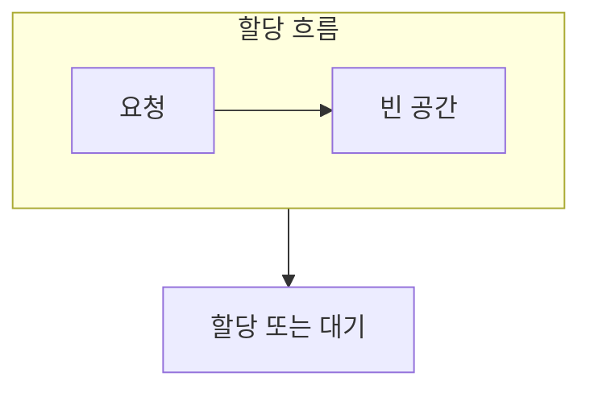

> [!abstract] 메모리 관리는 필요한 공간을 배치하고 회수하는 일이며, 빈 공간의 모양이 성능과 실패 가능성에 영향을 준다.
> 총 여유 공간과 연속된 여유 공간을 구별하면 단편화가 보인다.

## 이 노트의 지도



## 1. 두 종류의 낭비

할당 블록 내부에 남는 공간과, 빈 공간이 여러 조각으로 흩어지는 문제는 서로 다르다. ==외부 단편화== 는 총 여유 공간이 있어도 연속된 큰 공간을 찾기 어려운 현상이다.

## 2. 배치 전략의 관점

빈 공간 목록을 어떻게 탐색하고, 해제된 공간을 어떻게 합칠지에 따라 이후 요청의 성공 가능성이 달라진다.

<details>
<summary>압축이 해결하는 것</summary>

압축은 사용 중인 영역을 모아 큰 연속 빈 공간을 만드는 방법이다. 이동 비용과 주소 갱신 가능성을 함께 고려해야 한다.

</details>

> [!caution] 여유 공간 총량만 보지 않기
> 큰 요청은 필요한 크기의 연속 블록을 요구할 수 있어, 조각난 빈 공간의 합만으로 성공을 판단할 수 없다.

## 한눈에 비교

```html preview
<div style="font-family:system-ui,sans-serif;padding:20px">
  <div id="cards" style="display:flex;gap:14px;flex-wrap:wrap"></div>
  <script>
    var stats = [
      ['내부', '블록 안 여유', '낭비', 'var(--chart-1)'],
      ['외부', '흩어진 빈 공간', '연속성', 'var(--chart-2)'],
      ['압축', '빈 공간 모음', '이동 비용', 'var(--chart-3)']
    ];
    document.getElementById('cards').innerHTML = stats.map(function (s) {
      return '<div style="flex:1;min-width:150px;padding:16px;background:var(--card);' +
        'color:var(--card-foreground);border:1px solid var(--border);' +
        'border-radius:var(--radius)">' +
        '<div style="font-size:13px;color:var(--muted-foreground)">' + s[0] + '</div>' +
        '<div style="font-size:26px;font-weight:700;margin-top:4px">' + s[1] + '</div>' +
        '<div style="font-size:12px;font-weight:600;margin-top:4px;color:' + s[3] + '">' +
        s[2] + '</div>' +
        '</div>';
    }).join('');
  </script>
</div>
```

## 선택 기준

<Tabs>
  <Tab label="할당">

요청에 맞는 빈 블록을 찾아 점유 영역으로 바꾼다.

  </Tab>
  <Tab label="회수">

사용이 끝난 영역을 빈 목록으로 돌리고 인접 영역의 병합을 검토한다.

  </Tab>
</Tabs>

## 핵심 정리

| 구분 | 핵심 | 학습에서 확인할 점 |
| :-- | :-- | :-- |
| 내부 단편화 | 할당 블록 내부 | 블록 크기와 요청 크기 |
| 외부 단편화 | 블록 사이 | 연속 빈 공간의 크기 |
| 압축 | 영역 재배치 | 이동 비용과 가능 여부 |

> [!question]- 스스로 점검
> **Q.** 외부 단편화가 큰 연속 요청을 막는 과정을 설명해 보라.
>
> **A.** 여유 공간이 여러 조각으로 나뉘면 합계는 충분해도 요청 크기 하나를 담을 연속 구간이 없을 수 있다.

## 출처 처리

> [!info] 공개 노트 정책
> 원본 연결, 이미지, 페이지 단서는 공개 노트에 남기지 않았다.