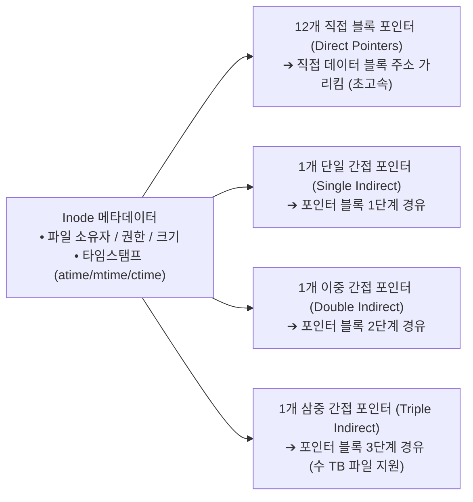
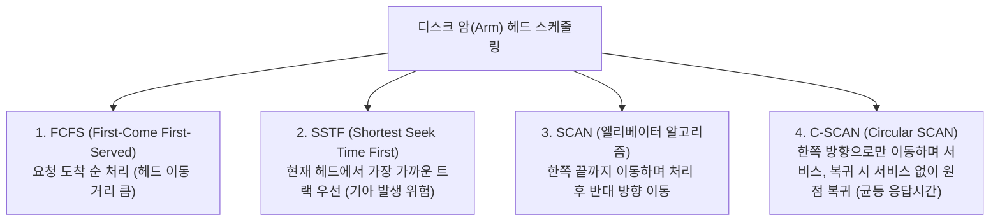

> [!abstract] 핵심 요약
> **파일 시스템(File System)**과 **저장 장치 관리(Storage Management)**는 비휘발성 보조기억장치에 데이터를 영구적이고 안전하게 구조화하여 저장하는 커널의 핵심 서브시스템이다.
> 메타데이터와 데이터 블록 포인터를 관리하는 **유닉스 Inode 다단계 색인 구조**와, 기계적 디스크의 가장 큰 지연 요인인 **탐색 시간(Seek Time)**을 줄이기 위한 **SSTF, SCAN(엘리베이터), C-SCAN** 스케줄링 기법의 헤드 이동 거리를 정량적으로 분석할 수 있어야 한다.

---

## 1. 리눅스/유닉스 Inode 다중 간접 포인터 구조



---

## 2. 4대 디스크 스케줄링 알고리즘 비교



---

## 3. 실시간 디스크 헤드 스케줄링 총 이동 거리(Total Head Movement) 계산기

```html preview
<div style="font-family:system-ui,-apple-system,sans-serif;padding:20px;background:var(--card);color:var(--card-foreground);border:1px solid var(--border);border-radius:var(--radius)">
  <div style="font-size:16px;font-weight:700;margin-bottom:14px;color:var(--primary);display:flex;align-items:center;gap:8px">
    <span>💽 디스크 헤드 스케줄링 (FCFS vs SSTF vs SCAN) 실시간 비교기</span>
  </div>

  <div style="margin-bottom:12px">
    <label style="font-size:11px;color:var(--muted-foreground)">트랙 요청 큐 (Track Requests 0~199):</label>
    <input id="trackQueueInput" type="text" value="98, 183, 37, 122, 14, 124, 65, 67" style="width:100%;padding:4px 8px;background:var(--background);color:var(--foreground);border:1px solid var(--border);border-radius:var(--radius);font-family:monospace;font-size:12px" />
  </div>

  <div style="display:flex;gap:10px;align-items:center;margin-bottom:14px">
    <label style="font-size:11px;font-weight:700">시작 헤드 위치 (Current Head):</label>
    <input id="inStartHead" type="number" value="53" min="0" max="199" style="width:60px;padding:3px;text-align:center;background:var(--background);color:var(--foreground);border:1px solid var(--border);border-radius:var(--radius);font-weight:700" />
    <button id="calcDiskBtn" style="padding:6px 14px;background:var(--primary);color:#fff;border:none;border-radius:var(--radius);font-size:11px;font-weight:700;cursor:pointer">스케줄링 계산</button>
  </div>

  <div style="display:grid;grid-template-columns:repeat(3, 1fr);gap:10px">
    <div style="padding:8px;background:var(--background);border:1px solid var(--border);border-radius:var(--radius);text-align:center">
      <div style="font-size:10px;color:var(--muted-foreground)">FCFS 총 이동 거리</div>
      <div id="fcfsMoveOut" style="font-size:14px;font-weight:800;color:var(--chart-1)">640 실린더</div>
    </div>
    <div style="padding:8px;background:var(--background);border:1px solid var(--border);border-radius:var(--radius);text-align:center">
      <div style="font-size:10px;color:var(--muted-foreground)">SSTF 총 이동 거리</div>
      <div id="sstfMoveOut" style="font-size:14px;font-weight:800;color:var(--chart-2)">236 실린더</div>
    </div>
    <div style="padding:8px;background:var(--background);border:1px solid var(--border);border-radius:var(--radius);text-align:center">
      <div style="font-size:10px;color:var(--muted-foreground)">SCAN (0방향) 이동 거리</div>
      <div id="scanMoveOut" style="font-size:14px;font-weight:800;color:var(--primary)">208 실린더</div>
    </div>
  </div>

  <script>
    function calcDisk() {
      var str = document.getElementById('trackQueueInput').value;
      var queue = str.split(',').map(function(s) { return parseInt(s.trim()); }).filter(function(v) { return !isNaN(v); });
      var curHead = parseInt(document.getElementById('inStartHead').value) || 53;

      // 1. FCFS
      var h = curHead;
      var fcfsMove = 0;
      for (var i = 0; i < queue.length; i++) {
        fcfsMove += Math.abs(queue[i] - h);
        h = queue[i];
      }

      // 2. SSTF
      var sstfList = queue.slice();
      h = curHead;
      var sstfMove = 0;
      while (sstfList.length > 0) {
        var minDiff = 999999;
        var minIdx = -1;
        for (var i = 0; i < sstfList.length; i++) {
          var diff = Math.abs(sstfList[i] - h);
          if (diff < minDiff) {
            minDiff = diff;
            minIdx = i;
          }
        }
        sstfMove += minDiff;
        h = sstfList[minIdx];
        sstfList.splice(minIdx, 1);
      }

      // 3. SCAN (0방향 먼저)
      var scanMove = curHead + Math.max.apply(null, queue); // 53 -> 0 -> max

      document.getElementById('fcfsMoveOut').textContent = fcfsMove + " 트랙";
      document.getElementById('sstfMoveOut').textContent = sstfMove + " 트랙";
      document.getElementById('scanMoveOut').textContent = scanMove + " 트랙";
    }

    document.getElementById('calcDiskBtn').addEventListener('click', calcDisk);
    calcDisk();
  </script>
</div>
```
