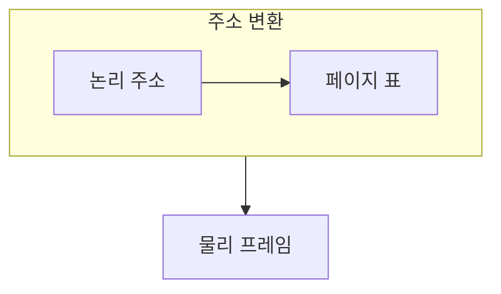

> [!abstract] 페이징은 논리 주소를 페이지와 오프셋으로 나누어 물리 프레임에 연결한다.
> 연속 할당의 제약을 줄이는 대신, 변환 정보를 빠르게 찾는 일이 중요해진다.

## 이 노트의 지도



## 1. 주소를 두 조각으로 보기

논리 주소는 어느 페이지인지를 나타내는 부분과 그 안의 위치를 나타내는 부분으로 나눌 수 있다. ==페이지 표== 는 페이지 번호를 물리 프레임 번호에 연결하는 자료 구조다.

## 2. 빠른 변환의 필요

매 접근마다 표를 찾아야 하면 비용이 생기므로, 최근 변환을 빠르게 찾는 장치가 도움이 된다.

<details>
<summary>슬라이더로 페이지 번호 보기</summary>

아래 제어는 예시 프로세스의 여섯 논리 페이지 중 하나를 고르는 상태 제어다. 실제 프레임 번호는 페이지 표의 현재 내용에 따라 정해진다.

</details>

> [!important] 페이지와 프레임을 뒤섞지 않기
> 페이지는 논리 메모리의 구획이고, 프레임은 물리 메모리의 같은 크기 구획이다.

## 한눈에 비교

```html preview
<div style="font-family:system-ui,sans-serif;padding:20px;color:var(--foreground)">
  <label for="amt" style="font-size:14px;font-weight:600">논리 페이지 번호</label>
  <div id="out" style="font-size:30px;font-weight:700;color:var(--chart-1);margin:6px 0">0</div>
  <input id="amt" type="range" min="0" max="5" step="1" value="0"
    style="width:100%;accent-color:var(--primary)" />
  <p style="font-size:13px;color:var(--muted-foreground)">범위를 움직여 한 프로세스의 여섯 논리 페이지를 살펴본다.</p>
  <script>
    var amt = document.getElementById('amt');
    var out = document.getElementById('out');
    amt.addEventListener('input', function () {
      out.textContent = Number(amt.value);
    });
  </script>
</div>
```

## 선택 기준

<Tabs>
  <Tab label="변환">

페이지 번호로 표를 찾아 프레임 번호를 얻고, 오프셋은 위치를 유지한다.

  </Tab>
  <Tab label="가속">

최근 변환 정보를 빠르게 찾으면 표 접근 횟수를 줄일 수 있다.

  </Tab>
</Tabs>

## 식으로 확인

$$
\text{logical address} = (p, d)
$$

## 핵심 정리

| 구분 | 핵심 | 학습에서 확인할 점 |
| :-- | :-- | :-- |
| 페이지 | 논리 구획 | 주소의 어느 부분인가 |
| 프레임 | 물리 구획 | 실제 메모리의 어느 칸인가 |
| TLB | 변환 캐시 | 최근 대응을 빠르게 찾는가 |

> [!question]- 스스로 점검
> **Q.** 페이지 번호와 오프셋을 나누어 생각하면 무엇이 쉬워지는가?
>
> **A.** 어떤 물리 프레임을 선택할지와 그 안의 위치를 보존할지를 분리해 이해할 수 있다.

## 출처 처리

> [!info] 공개 노트 정책
> 원본 연결, 이미지, 페이지 단서는 공개 노트에 남기지 않았다.
