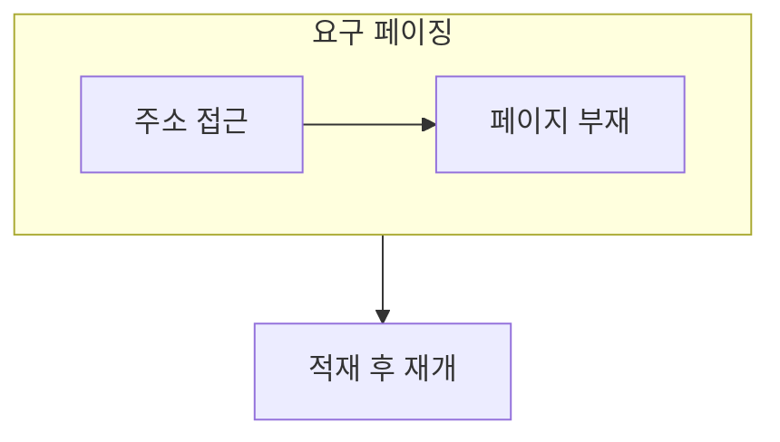

> [!abstract] 가상 메모리는 필요한 페이지를 필요할 때 가져와 제한된 물리 메모리를 더 유연하게 쓰게 한다.
> 부재 처리와 교체 정책은 프로그램의 지역성과 메모리 압박을 함께 반영한다.

## 이 노트의 지도



## 1. 필요할 때 적재하기

요구 페이징은 모든 페이지를 처음부터 메모리에 올리지 않고, 실제 접근이 발생할 때 필요한 페이지를 가져온다. ==페이지 부재== 는 접근한 페이지가 물리 메모리에 없을 때 처리해야 하는 사건이다.

## 2. 교체와 과부하

빈 프레임이 없으면 어떤 페이지를 내보낼지 골라야 하며, 부재 처리에 너무 많은 시간이 쓰이면 실행이 불안정해진다.

<details>
<summary>부재 처리 흐름</summary>

접근을 멈추고 필요한 페이지의 위치를 확인한 뒤, 빈 프레임 또는 교체 대상을 준비한다. 적재가 끝나면 중단된 접근을 다시 시도한다.

</details>

> [!caution] 교체 정책을 단독으로 평가하지 않기
> 작업 수와 각 작업의 필요한 페이지 집합이 물리 메모리보다 크면, 좋은 정책도 부재를 충분히 줄이지 못할 수 있다.

## 한눈에 비교

```html preview
<div style="font-family:system-ui,sans-serif;padding:20px">
  <div id="cards" style="display:flex;gap:14px;flex-wrap:wrap"></div>
  <script>
    var stats = [
      ['요구', '접근 시 적재', '지연', 'var(--chart-1)'],
      ['부재', '메모리 없음', '처리', 'var(--chart-2)'],
      ['교체', '희생 선택', '압박', 'var(--chart-3)']
    ];
    document.getElementById('cards').innerHTML = stats.map(function (s) {
      return '<div style="flex:1;min-width:150px;padding:16px;background:var(--card);' +
        'color:var(--card-foreground);border:1px solid var(--border);' +
        'border-radius:var(--radius)">' +
        '<div style="font-size:13px;color:var(--muted-foreground)">' + s[0] + '</div>' +
        '<div style="font-size:26px;font-weight:700;margin-top:4px">' + s[1] + '</div>' +
        '<div style="font-size:12px;font-weight:600;margin-top:4px;color:' + s[3] + '">' +
        s[2] + '</div>' +
        '</div>';
    }).join('');
  </script>
</div>
```

## 선택 기준

<Tabs>
  <Tab label="지역성">

가까운 시간에 비슷한 코드나 데이터를 다시 접근하는 경향은 적재의 효과를 높인다.

  </Tab>
  <Tab label="스래싱">

실행보다 페이지를 들고나는 처리에 시간을 쓰는 과부하 상태를 가리킨다.

  </Tab>
</Tabs>

## 핵심 정리

| 구분 | 핵심 | 학습에서 확인할 점 |
| :-- | :-- | :-- |
| 요구 페이징 | 필요할 때 적재 | 처음 적재하지 않는 이유 |
| 페이지 부재 | 접근 중단 | 재개 전 필요한 단계 |
| 스래싱 | 부재 반복 | 메모리 압박의 신호 |

> [!question]- 스스로 점검
> **Q.** 요구 페이징이 메모리를 절약하면서도 지연을 만들 수 있는 이유는 무엇인가?
>
> **A.** 처음 접근한 페이지는 적재가 필요하므로, 사용하지 않는 페이지는 피하지만 필요한 순간에는 처리 시간을 낸다.

## 출처 처리

> [!info] 공개 노트 정책
> 원본 연결, 이미지, 페이지 단서는 공개 노트에 남기지 않았다.