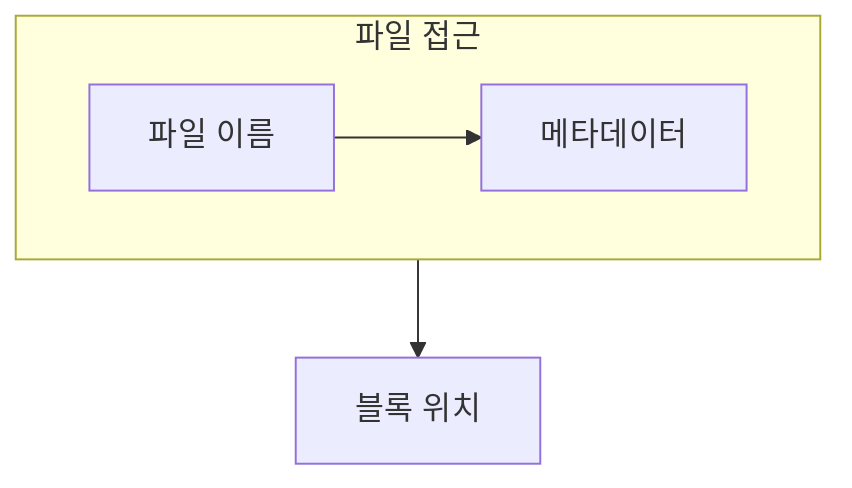

> [!abstract] 파일 시스템은 이름과 바이트 흐름을 저장 장치의 블록 배치로 연결하는 조직 체계다.
> 사용자 관점의 파일과 장치 관점의 블록 사이에는 디렉터리와 메타데이터가 놓인다.

## 이 노트의 지도



## 1. 이름과 내용

파일은 바이트의 논리적 흐름으로 보이고, 디렉터리는 이름을 해당 파일의 관리 정보와 연결한다. ==메타데이터== 는 내용 자체가 아니라 크기, 위치, 권한 같은 관리 정보를 담는다.

## 2. 접근의 경로

읽기와 쓰기는 논리적 위치를 적절한 저장 블록으로 바꾸어 수행되며, 열기와 닫기는 그 접근의 생명 주기를 관리한다.

<details>
<summary>파일 하나를 따라가기</summary>

이름으로 디렉터리를 찾고, 연결된 메타데이터에서 필요한 블록 위치를 확인한다. 그 뒤 요청한 바이트 범위를 읽거나 쓴다.

</details>

> [!caution] 파일명만이 파일의 전부는 아니다
> 같은 이름을 다루어도 위치·크기·권한 같은 관리 정보가 없으면 저장과 접근을 일관되게 수행할 수 없다.

## 한눈에 비교

```html preview
<div style="font-family:system-ui,sans-serif;padding:20px">
  <div id="cards" style="display:flex;gap:14px;flex-wrap:wrap"></div>
  <script>
    var stats = [
      ['파일', '바이트 흐름', '논리', 'var(--chart-1)'],
      ['디렉터리', '이름 연결', '탐색', 'var(--chart-2)'],
      ['메타데이터', '위치·권한', '관리', 'var(--chart-3)']
    ];
    document.getElementById('cards').innerHTML = stats.map(function (s) {
      return '<div style="flex:1;min-width:150px;padding:16px;background:var(--card);' +
        'color:var(--card-foreground);border:1px solid var(--border);' +
        'border-radius:var(--radius)">' +
        '<div style="font-size:13px;color:var(--muted-foreground)">' + s[0] + '</div>' +
        '<div style="font-size:26px;font-weight:700;margin-top:4px">' + s[1] + '</div>' +
        '<div style="font-size:12px;font-weight:600;margin-top:4px;color:' + s[3] + '">' +
        s[2] + '</div>' +
        '</div>';
    }).join('');
  </script>
</div>
```

## 선택 기준

<Tabs>
  <Tab label="논리">

사용자는 이름과 바이트 위치를 중심으로 파일을 본다.

  </Tab>
  <Tab label="물리">

파일 시스템은 실제 저장 블록의 배치를 관리한다.

  </Tab>
</Tabs>

## 핵심 정리

| 구분 | 핵심 | 학습에서 확인할 점 |
| :-- | :-- | :-- |
| 파일 | 내용의 논리 단위 | 바이트 범위를 어떻게 읽는가 |
| 디렉터리 | 이름의 조직 | 어느 관리 정보로 가는가 |
| 메타데이터 | 속성과 위치 | 블록을 어떻게 찾는가 |

> [!question]- 스스로 점검
> **Q.** 파일 시스템이 논리 블록과 물리 장치 위치를 구분하는 이유는 무엇인가?
>
> **A.** 응용은 일관된 파일 접근을 유지하고, 시스템은 저장 장치의 실제 배치를 바꿔 관리할 수 있기 때문이다.

## 출처 처리

> [!info] 공개 노트 정책
> 원본 연결, 이미지, 페이지 단서는 공개 노트에 남기지 않았다.