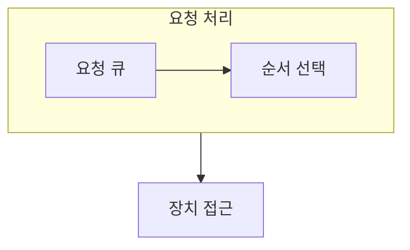

> [!abstract] 저장 장치 관리는 요청을 어떤 순서로 처리할지와 장애에 어떻게 대비할지를 함께 다룬다.
> 회전 장치의 이동 비용과 저장 구조의 신뢰성 요구는 같은 관점으로 보지 않는다.

## 이 노트의 지도



## 1. 장치 특성 읽기

회전 장치에서는 헤드 이동과 회전 대기가 접근 시간에 영향을 주며, 다른 저장 매체는 다른 병목을 가질 수 있다. ==디스크 스케줄링== 은 요청 큐의 순서를 바꾸어 이동 비용과 공정성의 균형을 찾는 정책이다.

## 2. 정책과 신뢰성

FCFS, SSTF, SCAN 계열은 요청 순서를 다르게 고르고, 복제·배열 구성은 장애에 대한 대응을 보완한다.

<details>
<summary>정책을 비교하는 방법</summary>

초기 헤드 위치와 요청 큐를 적은 뒤, 각 정책이 다음 요청을 선택하는 순서를 표시한다. 총 이동 거리뿐 아니라 특정 요청이 오래 기다리는지도 확인한다.

</details>

> [!caution] 가까운 요청만 계속 고르지 않기
> SSTF처럼 가까운 요청을 우선하면 일부 먼 요청이 계속 뒤로 밀릴 수 있으므로 대기 분포를 함께 본다.

## 한눈에 비교

```html preview
<div style="font-family:system-ui,sans-serif;padding:20px">
  <div id="cards" style="display:flex;gap:14px;flex-wrap:wrap"></div>
  <script>
    var stats = [
      ['FCFS', '도착 순서', '단순', 'var(--chart-1)'],
      ['SSTF', '가까운 요청', '이동 감소', 'var(--chart-2)'],
      ['SCAN', '방향 이동', '균형', 'var(--chart-3)']
    ];
    document.getElementById('cards').innerHTML = stats.map(function (s) {
      return '<div style="flex:1;min-width:150px;padding:16px;background:var(--card);' +
        'color:var(--card-foreground);border:1px solid var(--border);' +
        'border-radius:var(--radius)">' +
        '<div style="font-size:13px;color:var(--muted-foreground)">' + s[0] + '</div>' +
        '<div style="font-size:26px;font-weight:700;margin-top:4px">' + s[1] + '</div>' +
        '<div style="font-size:12px;font-weight:600;margin-top:4px;color:' + s[3] + '">' +
        s[2] + '</div>' +
        '</div>';
    }).join('');
  </script>
</div>
```

## 선택 기준

<Tabs>
  <Tab label="성능">

요청 순서가 헤드 이동과 대기 시간에 미치는 영향을 본다.

  </Tab>
  <Tab label="신뢰성">

저장 장치의 장애 가능성에 대비하는 구조와 복구 방식을 따로 검토한다.

  </Tab>
</Tabs>

## 식으로 확인

$$
T_{\mathrm{access}} = T_{\mathrm{seek}} + T_{\mathrm{rotation}} + T_{\mathrm{transfer}}
$$

## 핵심 정리

| 구분 | 핵심 | 학습에서 확인할 점 |
| :-- | :-- | :-- |
| FCFS | 도착 순서 | 이동 거리와 대기 |
| SSTF | 가까운 요청 | 먼 요청의 기아 |
| SCAN 계열 | 방향 기반 이동 | 왕복과 공정성 |

> [!question]- 스스로 점검
> **Q.** 디스크 스케줄링에서 총 이동 거리와 공정성을 함께 봐야 하는 이유는 무엇인가?
>
> **A.** 이동을 줄이는 선택이 일부 요청의 긴 대기를 만들 수 있기 때문이다.

## 출처 처리

> [!info] 공개 노트 정책
> 원본 연결, 이미지, 페이지 단서는 공개 노트에 남기지 않았다.