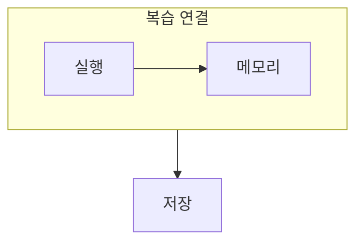

> [!abstract] 운영체제 복습은 개별 알고리즘을 외우기보다 자원 공유 문제를 어떤 계층에서 푸는지 연결하는 일이다.
> 프로세스부터 저장 장치까지의 선택은 모두 제한된 자원을 안전하게 쓰는 문제로 이어진다.

## 이 노트의 지도



## 1. 문제를 계층에 배치하기

프로세스와 스레드는 실행 단위를, 동기화와 교착상태는 공유 순서를, 메모리와 파일 시스템은 공간과 위치를 다룬다. ==자원 공유== 라는 질문은 여러 단원을 한 축에 묶어 준다.

## 2. 서술형 답의 뼈대

정의만 적지 말고, 상태·정책·트레이드오프를 차례로 설명하면 비교와 선택의 근거가 생긴다.

<details>
<summary>복습 순서 제안</summary>

먼저 실행 단위와 스케줄링을 정리하고, 그다음 동기화와 교착상태를 연결한다. 이후 주소 변환·요구 페이징·파일과 장치 관리로 자원 위치의 관점을 확장한다.

</details>

> [!warning] 단원 이름을 답으로 쓰지 않기
> 정책 이름만 나열하면 왜 선택하는지 드러나지 않는다. 조건과 비용을 함께 써야 한다.

## 한눈에 비교

```html preview
<div style="font-family:system-ui,sans-serif;padding:20px">
  <div id="cards" style="display:flex;gap:14px;flex-wrap:wrap"></div>
  <script>
    var stats = [
      ['실행', '프로세스·스레드', '흐름', 'var(--chart-1)'],
      ['메모리', '페이징·부재', '위치', 'var(--chart-2)'],
      ['저장', '파일·디스크', '지속성', 'var(--chart-3)']
    ];
    document.getElementById('cards').innerHTML = stats.map(function (s) {
      return '<div style="flex:1;min-width:150px;padding:16px;background:var(--card);' +
        'color:var(--card-foreground);border:1px solid var(--border);' +
        'border-radius:var(--radius)">' +
        '<div style="font-size:13px;color:var(--muted-foreground)">' + s[0] + '</div>' +
        '<div style="font-size:26px;font-weight:700;margin-top:4px">' + s[1] + '</div>' +
        '<div style="font-size:12px;font-weight:600;margin-top:4px;color:' + s[3] + '">' +
        s[2] + '</div>' +
        '</div>';
    }).join('');
  </script>
</div>
```

## 선택 기준

<details>
<summary>두 관점을 나란히 보기</summary>

**흐름.** 실행 단위가 CPU를 얻고, 공유 자원을 만날 때 어떤 규칙이 필요한지 연결한다.

**위치.** 주소 변환과 파일 접근에서 논리적 이름이 실제 위치로 어떻게 이어지는지 연결한다.

</details>

## 핵심 정리

| 구분 | 핵심 | 학습에서 확인할 점 |
| :-- | :-- | :-- |
| 실행 | 프로세스·스레드 | 누가 CPU를 얻는가 |
| 공유 | 동기화·교착상태 | 순서와 대기를 어떻게 관리하는가 |
| 위치 | 페이징·파일 | 논리와 물리를 어떻게 잇는가 |

<details>
<summary>스스로 점검</summary>

**Q.** 복습에서 교착상태와 동기화를 함께 봐야 하는 이유는 무엇인가?

**A.** 둘 다 공유 자원의 순서를 다루지만, 하나는 안전한 협업을, 다른 하나는 진행 불가능한 대기를 분석한다.

</details>

## 출처 처리

공개 노트에는 원본 연결, 이미지, 페이지 단서를 남기지 않았다.
