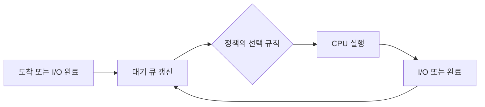

> [!abstract] 문제 모델
> CPU는 하나이고 입출력 장치는 충분하다고 가정한다. 각 스레드는 도착 시각 이후 대기 큐에 들어가며 CPU 작업과 입출력 작업을 번갈아 수행한다.

## 시간표를 그리기 전

<Tabs>
<Tab label="입력 읽기">
도착 시각과 각 CPU 구간, 그 사이의 입출력 구간을 분리해서 적는다. CPU를 마친 스레드는 즉시 입출력으로 이동한다.
</Tab>
<Tab label="대기열 갱신">
도착, 입출력 완료, 타임 슬라이스 소진 같은 사건마다 대기열을 다시 확인한다.
</Tab>
<Tab label="정책 적용">
FCFS, SJF, SRTF, RR마다 다음 CPU 소유자를 고르는 기준이 다르므로 같은 작업 집합도 다른 순서를 만든다.
</Tab>
</Tabs>



> [!important] 동점 규칙
> SJF에서 대기 큐 진입 시각이 같으면 먼저 큐에 들어온 스레드가 우선이다. SRTF에서 현재 실행 중인 스레드와 대기열 스레드의 남은 시간이 같으면 현재 CPU를 사용 중인 스레드가 우선이다.

```html preview h=170
<div style="font-family:system-ui,sans-serif;padding:16px;color:var(--foreground)">
  <div style="font-weight:700;margin-bottom:12px">사건 기반으로 시간표 읽기</div>
  <div style="display:flex;align-items:center;gap:8px;flex-wrap:wrap">
    <span style="padding:8px 10px;border-radius:var(--radius);background:var(--card);border:1px solid var(--border)">도착</span>
    <span style="color:var(--muted-foreground)">→</span>
    <span style="padding:8px 10px;border-radius:var(--radius);background:var(--card);border:1px solid var(--border)">대기</span>
    <span style="color:var(--muted-foreground)">→</span>
    <span style="padding:8px 10px;border-radius:var(--radius);background:var(--card);border:1px solid var(--border)">CPU</span>
    <span style="color:var(--muted-foreground)">→</span>
    <span style="padding:8px 10px;border-radius:var(--radius);background:var(--card);border:1px solid var(--border)">I/O</span>
  </div>
</div>
```

<details>
<summary>같은 시점에 대기열로 들어오면</summary>

원본의 우선순위는 처음으로 큐에 들어가는 스레드, 입출력을 마친 스레드, 타임 슬라이스를 소진한 스레드 순서다. 이 조건으로도 동점이면 스레드 번호가 작은 쪽을 먼저 넣는다.

</details>

## 네 정책의 비교

원본 예시는 FCFS, SJF, SRTF, RR(time slice 2)을 같은 작업 집합에 적용한다. 핵심은 결과 숫자를 암기하는 것이 아니라, ==다음 선택 직전에 대기열 상태를 다시 만드는 것==이다.

> [!note] 추출본의 표기 한계
> 일부 작업 구간 표에 백틱처럼 보이는 문자가 포함되어 별도의 CPU·I/O 사건으로 해석할 근거가 없다. 이 노트는 그 문자와 원본 시간표를 재현하지 않고 정책 적용 순서만 사용한다.

```html preview h=178
<div style="font-family:system-ui,sans-serif;padding:16px;color:var(--foreground)">
  <div style="font-weight:700;margin-bottom:12px">다음 실행 단위를 고르는 질문</div>
  <div style="display:grid;grid-template-columns:repeat(2,minmax(0,1fr));gap:10px">
    <div style="padding:10px;border:1px solid var(--border);border-radius:var(--radius)"><b>FCFS</b><br><span style="font-size:12px;color:var(--muted-foreground)">먼저 도착한 순서</span></div>
    <div style="padding:10px;border:1px solid var(--border);border-radius:var(--radius)"><b>SJF</b><br><span style="font-size:12px;color:var(--muted-foreground)">짧은 다음 CPU 작업</span></div>
    <div style="padding:10px;border:1px solid var(--border);border-radius:var(--radius)"><b>SRTF</b><br><span style="font-size:12px;color:var(--muted-foreground)">남은 CPU 시간이 더 짧은가</span></div>
    <div style="padding:10px;border:1px solid var(--border);border-radius:var(--radius)"><b>RR</b><br><span style="font-size:12px;color:var(--muted-foreground)">정해진 시간 조각 뒤 재평가</span></div>
  </div>
</div>
```

<details>
<summary>풀이용 기록 표</summary>

| 사건 시각 | 대기 큐 | 선택 근거 | CPU를 떠나는 이유 |
| --- | --- | --- | --- |
| 도착 또는 I/O 완료 | 새로 들어온 항목 반영 | 정책과 동점 규칙 | CPU 구간 종료 또는 시간 조각 종료 |

</details>

> [!success] 추적 루틴
> 사건 시각마다 현재 CPU, 대기 큐, 입출력 중인 스레드를 분리해 갱신한다. 마지막에 각 스레드의 대기 시간과 종료 시각을 계산해 정책별 결과를 비교한다.

### 빠른 자가 점검

- 입출력 완료와 타임 슬라이스 종료가 같은 시점이면 어떤 순서로 큐에 반영되는가?
- SJF와 SRTF의 선택 시점은 어떻게 다른가?
- RR에서 시간 조각을 모두 쓴 스레드는 언제 다시 경쟁하는가?
- 시간표의 한 칸을 채울 때 꼭 기록해야 할 상태는 무엇인가?
