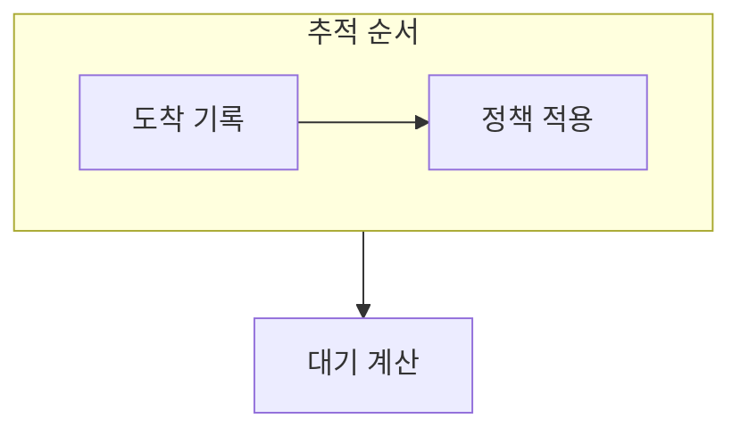

> [!abstract] 스케줄링 추적은 시간선을 만들고 정책별 선택을 따라가며 대기 시간을 검산하는 연습이다.
> 같은 작업 묶음이라도 정책이 바뀌면 CPU를 얻는 순서와 체감 응답이 달라진다.

## 이 노트의 지도



## 1. 시간선에 사건 놓기

작업의 도착, CPU 사용, 입출력 대기를 시간 순서로 적고 준비 큐의 변화를 표시한다. ==대기 시간== 은 준비 상태에서 CPU를 기다린 구간을 합친 값이다.

## 2. FCFS 예를 읽기

연습 예에서 네 작업의 FCFS 대기 시간은 각각 1, 10, 7, 8로 계산된다.

<details>
<summary>검산 절차</summary>

각 작업이 준비 큐에 들어온 시점과 실제 CPU를 받은 시점을 비교한다. 입출력 중인 시간은 준비 큐에서 기다린 시간과 구분한다.

</details>

> [!caution] 입출력 대기를 CPU 대기로 합치지 않기
> 작업이 입출력을 기다리는 시간과 준비 큐에서 CPU를 기다리는 시간은 같은 지표가 아니다.

## 한눈에 비교

```html preview
<div style="font-family:system-ui,sans-serif;padding:20px;color:var(--foreground)">
  <h3 style="margin:0 0 14px;font-size:15px;font-weight:600">FCFS 대기 시간 예</h3>
  <div id="bars" style="display:flex;align-items:flex-end;gap:14px;height:170px"></div>
  <script>
    var data = [['T1', 1], ['T2', 10], ['T3', 7], ['T4', 8]];
    var max = Math.max.apply(null, data.map(function (d) { return d[1]; }));
    document.getElementById('bars').innerHTML = data.map(function (d, i) {
      return '<div style="flex:1;display:flex;flex-direction:column;align-items:center;' +
        'gap:6px;height:100%;justify-content:flex-end">' +
        '<span style="font-size:12px;font-weight:600">' + d[1] + '</span>' +
        '<div style="width:100%;height:' + (d[1] / max * 100) + '%;' +
        'background:var(--chart-' + (i + 1) + ');' +
        'border-radius:var(--radius) var(--radius) 0 0"></div>' +
        '<span style="font-size:12px;color:var(--muted-foreground)">' + d[0] + '</span>' +
        '</div>';
    }).join('');
  </script>
</div>
```

## 선택 기준

<Tabs>
  <Tab label="기록">

도착 시점과 CPU·입출력 구간을 구분해 시간선에 적는다.

  </Tab>
  <Tab label="계산">

준비 큐에 있었던 구간만 합산해 작업별 대기 시간을 얻는다.

  </Tab>
</Tabs>

## 식으로 확인

$$
\bar{W} = \frac{1 + 10 + 7 + 8}{4} = 6.5
$$

## 핵심 정리

| 구분 | 핵심 | 학습에서 확인할 점 |
| :-- | :-- | :-- |
| T1 | 1 | 준비 큐 대기만 합산 |
| T2 | 10 | 도착과 CPU 시작을 대조 |
| T3·T4 | 7·8 | 정책 순서의 영향 확인 |

<details>
<summary>스스로 점검</summary>

**Q.** 스케줄링 추적에서 입출력 대기와 CPU 대기를 구분해야 하는 이유는 무엇인가?

**A.** 정책이 직접 바꾸는 것은 준비 큐에서 CPU를 얻는 순서이므로, 서로 다른 원인의 시간을 섞으면 평가가 흐려진다.

</details>

## 출처 처리

> [!info] 공개 노트 정책
> 원본 연결, 이미지, 페이지 단서는 공개 노트에 남기지 않았다.
