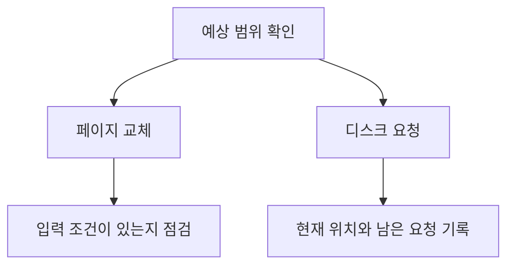

> [!abstract] 자료의 성격
> 원본은 페이지 교체 알고리즘 이름과 디스크 요청 순서 알고리즘 이름, 초기 헤드 위치와 요청 목록을 제시한다. 완성된 풀이 또는 채점 기준은 포함하지 않는다.

## 무엇을 연습 대상으로 볼 것인가

<Tabs>
<Tab label="페이지 교체">
최적 교체, FIFO, LRU, CLOCK이 예상 범위로 나열되어 있다. 원본에는 페이지 참조열이나 프레임 수가 없으므로 이 자료만으로 페이지 폴트 횟수를 계산하지 않는다.
</Tab>
<Tab label="디스크 요청">
FCFS, SSTF, SCAN, C-SCAN, LOOK, C-LOOK이 나열되어 있다. 초기 헤드 위치와 열 개의 요청 실린더가 함께 제시되어 이동 순서를 연습할 수 있다.
</Tab>
<Tab label="답안 작성">
각 단계에서 현재 위치, 남은 요청, 다음 선택의 이유를 나누어 기록한다. 계산 답은 원본이 제공하지 않으므로 별도 연습 결과로 구분한다.
</Tab>
</Tabs>



> [!important] 계산 전제
> 페이지 교체 항목에는 계산에 필요한 페이지 참조열과 프레임 수가 제시되지 않는다. 따라서 알고리즘 명칭을 보고 임의의 입력이나 정답을 추가하면 안 된다.

```html preview h=160
<div style="font-family:system-ui,sans-serif;padding:16px;color:var(--foreground)">
  <div style="font-weight:700;margin-bottom:12px">예상 범위의 두 갈래</div>
  <div style="display:flex;gap:12px;flex-wrap:wrap">
    <div style="flex:1;min-width:180px;padding:14px;border:1px solid var(--border);border-radius:var(--radius);background:var(--card)">
      <b>페이지 교체</b><br><span style="font-size:12px;color:var(--muted-foreground)">최적 · FIFO · LRU · CLOCK</span>
    </div>
    <div style="flex:1;min-width:180px;padding:14px;border:1px solid var(--border);border-radius:var(--radius);background:var(--card)">
      <b>디스크 요청</b><br><span style="font-size:12px;color:var(--muted-foreground)">FCFS · SSTF · SCAN 계열</span>
    </div>
  </div>
</div>
```

<details>
<summary>디스크 요청 순서용 빈 기록표</summary>

| 단계 | 현재 헤드 위치 | 남은 요청 | 다음 선택 이유 |
| --- | --- | --- | --- |
| 시작 | 원본의 초기 위치 | 원본의 요청 목록 | 선택 전 |
| 반복 | 직전 선택 결과 | 처리하지 않은 요청 | 해당 정책의 규칙 |
| 종료 | 마지막 처리 위치 | 없음 | 총 이동을 별도로 검산 |

</details>

## 풀이 결과와 근거를 분리하기

원본은 초기 헤드 위치를 30으로 주고 요청 목록을 제공하지만, 알고리즘별 완성 경로나 총 이동 거리는 적지 않는다. ==따라서 이 자료는 답안지가 아니라 풀이 범위와 입력의 확인 근거다==.

> [!note] 원문 근거의 한계
> 원본의 페이지 교체 부분은 알고리즘 이름만 제공한다. 디스크 요청 부분도 알고리즘별 정답 또는 방향·경계 조건을 명시하지 않으므로, 이 노트에 계산 결과를 덧붙이지 않는다.

```html preview h=170
<div style="font-family:system-ui,sans-serif;padding:16px;color:var(--foreground)">
  <div style="font-weight:700;margin-bottom:12px">풀이의 최소 단위</div>
  <div style="display:grid;grid-template-columns:repeat(3,minmax(0,1fr));gap:9px">
    <div style="padding:10px;border:1px solid var(--border);border-radius:var(--radius)"><b>상태</b><br><span style="font-size:12px;color:var(--muted-foreground)">현재 위치</span></div>
    <div style="padding:10px;border:1px solid var(--border);border-radius:var(--radius)"><b>후보</b><br><span style="font-size:12px;color:var(--muted-foreground)">남은 요청</span></div>
    <div style="padding:10px;border:1px solid var(--border);border-radius:var(--radius)"><b>이유</b><br><span style="font-size:12px;color:var(--muted-foreground)">정책 규칙</span></div>
  </div>
</div>
```

<details>
<summary>시험 전 확인 질문</summary>

- 페이지 교체 문제의 입력 조건이 충분히 주어졌는가?
- 디스크 요청 문제에서 시작 위치와 요청 목록을 모두 옮겼는가?
- SCAN 계열에서는 이동 방향과 끝 경계가 별도 조건으로 주어졌는가?
- 계산한 값과 원본이 제공한 값의 출처를 구분했는가?

</details>

> [!success] 안전한 연습 방법
> 이 자료에 있는 알고리즘 목록은 범위로만 사용하고, 실제 계산은 문제에서 주어진 입력과 조건을 먼저 적은 뒤 진행한다. 입력이 빠져 있으면 결과 대신 필요한 추가 조건을 기록한다.

### 빠른 자가 점검

- 페이지 교체와 디스크 스케줄링에 각각 어떤 입력이 필요한가?
- 원본이 제공한 값과 내가 계산한 값을 구분했는가?
- 같은 요청 목록도 정책과 추가 조건에 따라 경로가 달라질 수 있음을 설명할 수 있는가?
