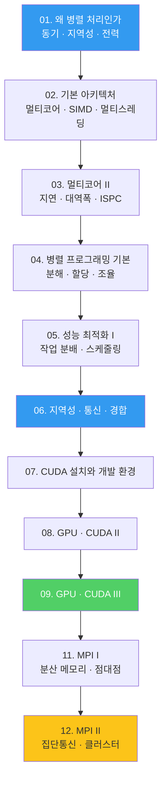
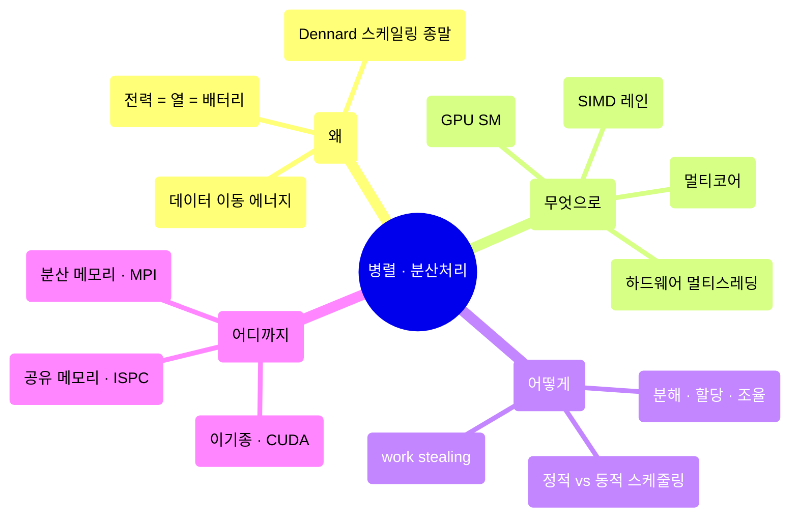

---
aliases:
  - 분산처리 인덱스
  - 병렬 분산처리 MOC
course: parallel-distributed-computing
created: '2026-08-28'
date: '2026-08-28'
semester: '3-1'
source: ''
status: stable
tags:
  - index
  - systems
  - distributed
  - 3-1
title: 00. 병렬 분산처리 인덱스
type: index
updated: '2026-08-28'
---

# 00. 병렬 분산처리 인덱스

> [!abstract] 이 과목 한 줄
> Stanford CS149를 기반으로, **왜 병렬이어야 하는가**(동기)부터
> **어떻게 병렬로 짜는가**(ISPC · CUDA · MPI)까지를 한 학기에 훑는다.
> 모든 정리문서는 `pdf/` 의 원본 강의자료를 근거로 다시 작성되었다.

## 학습 경로



## 세 개의 프로그래밍 모델

이 과목은 결국 **같은 문제를 세 가지 방식으로 병렬화**하는 법을 가르친다.

| 모델 | 병렬 단위 | 메모리 | 다루는 노트 |
|:--|:--|:--|:--|
| **SIMD / ISPC** | gang 안의 program instance | 공유 (레인 간) | 03 |
| **CUDA** | grid → block → thread | 계층적 (전역·공유·레지스터) | 08, 09 |
| **MPI** | rank (프로세스) | 분산 (메시지 전달) | 11, 12 |

## 전체 노트

| # | 노트 | 근거 원본 | 페이지 |
|:--|:--|:--|--:|
| 01 | 왜 병렬 처리인가 | `01_WhyParallelism.pdf` | 139 |
| 02 | 병렬 컴퓨터의 기본 아키텍처 | `02_기본아키텍츠_update.pdf` | 104 |
| 03 | 멀티코어 아키텍처 II — 지연·대역폭과 ISPC | `03_multicore2-update_0416.pdf` + `03_multicore2-ispc_update.pdf` | 116 + 101 |
| 04 | 병렬 프로그래밍 기본 | `04_Parallel Programming 기본.pdf` | 58 |
| 05 | 성능 최적화 I — 작업 분배와 스케줄링 | `05_Performance Optimization I ....pdf` | 75 |
| 06 | 지역성·통신·경합 | `06_Locality_Communication_Contention.pdf` | 68 |
| 07 | CUDA 설치와 개발 환경 | `07_GPU Architecture & CUDAProgramming_v01.pdf` | 47 |
| 08 | GPU 아키텍처와 CUDA 프로그래밍 II | `08_GPU Architecture & CUDAProgramming_v02.pdf` | 110 |
| 09 | GPU 아키텍처와 CUDA 프로그래밍 III | `09_GPU Architecture & CUDAProgramming_v03.pdf` | 99 |
| 11 | MPI 병렬 프로그래밍 I | `11_MPI 프로그래밍_V_01.pdf` | 39 |
| 12 | MPI 병렬 프로그래밍 II | `12_MPI 프로그래밍_V_02.pdf` | 41 |

> [!info] 10번 강의가 없는 이유
> 원본 강의자료 `pdf/` 에 10번 덱이 존재하지 않는다. 번호는 원본 파일명을 그대로 따랐다.

## 이 과목의 큰 그림



## 원본 강의자료

원본 PDF는 `pdf/` 에 Git LFS로 보관된다. 정리문서를 다시 쓸 때는 반드시 원본을 근거로 삼는다.

```bash
git lfs pull --include="ComputerScience/04_systems-infrastructure/parallel-distributed-computing/pdf/*"
python3 scripts/pdf_lecture_extract.py "<...>/pdf/01_WhyParallelism.pdf" --render none
```

작성 규격은 lecture-pdf-to-note 스킬과
지식 스키마를 따른다.

## 관련 과목

- [운영체제 — 스레드와 멀티태스킹](<../operating-systems/4. 스레드와 멀티테스킹/스레드와 멀티테스킹.md>)
- [컴퓨터 구조 — 파이프라이닝](<../computer-architecture/4. 제어 장치/5. 파이프 라이닝.md>)
- [리눅스 시스템](<../linux/1. 리눅스의 기본.md>)
- [컨테이너 오케스트레이션](<../container-orchestration/도커 기초.md>)
