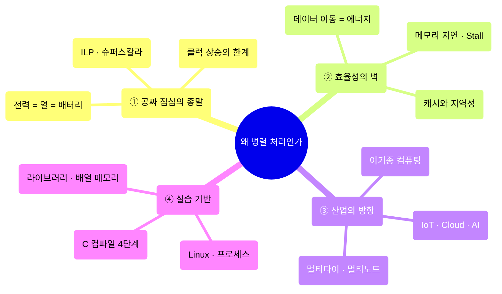
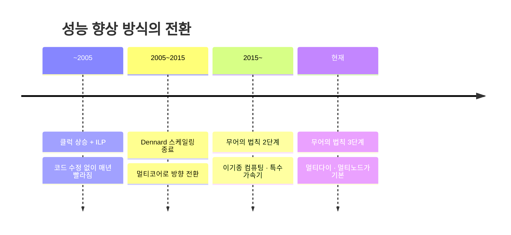
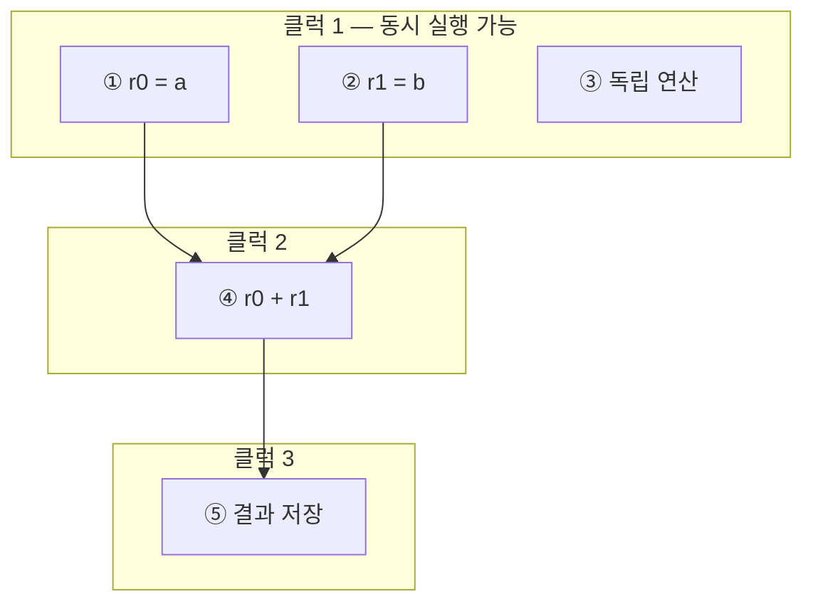
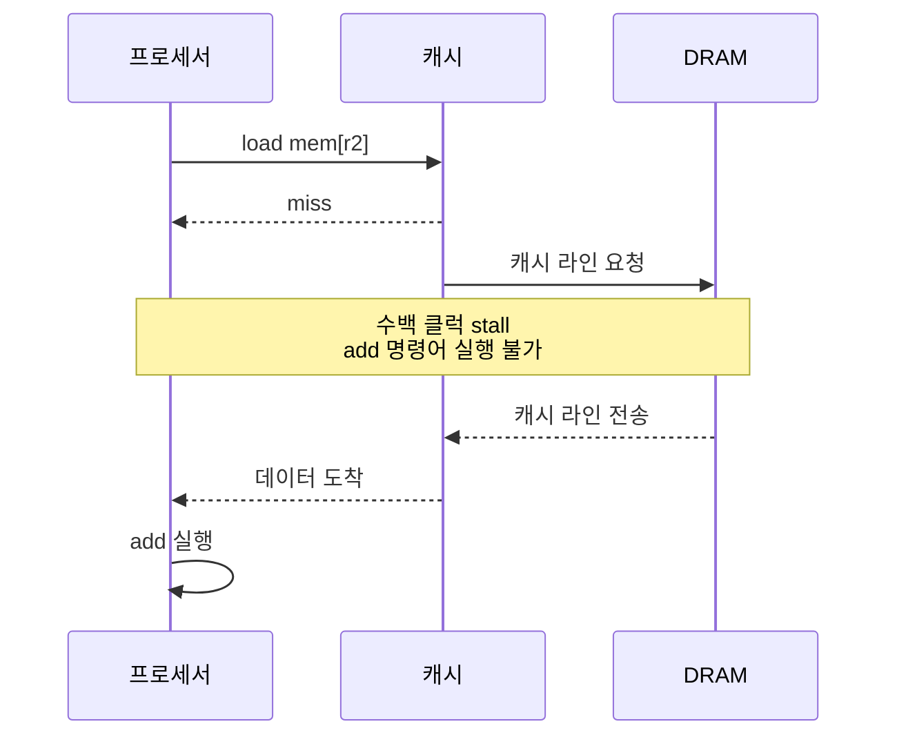
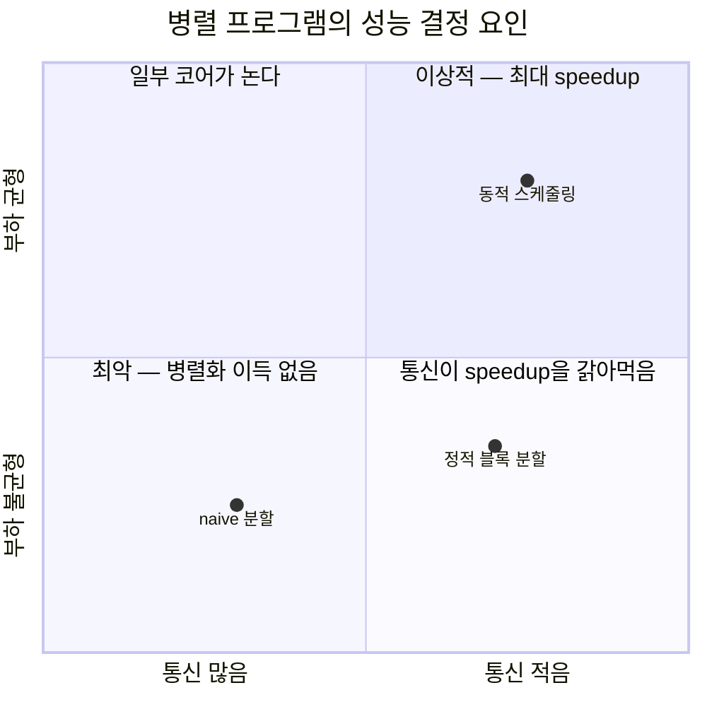
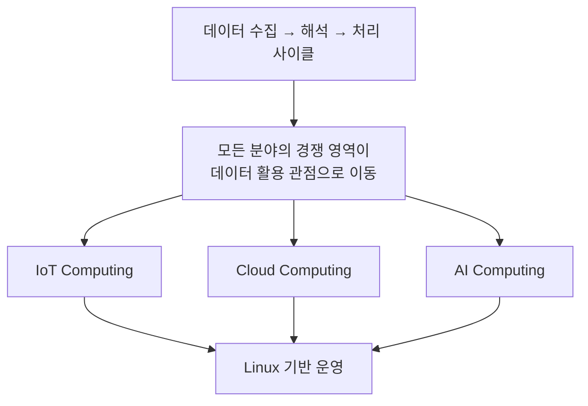
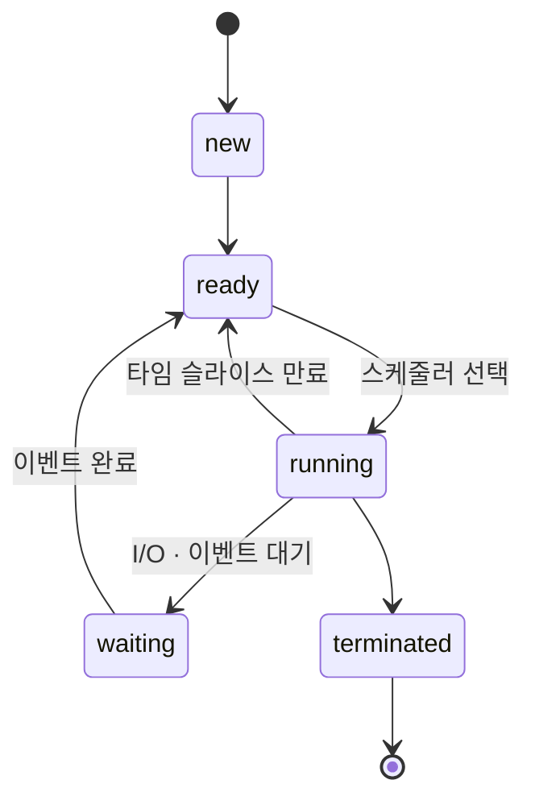
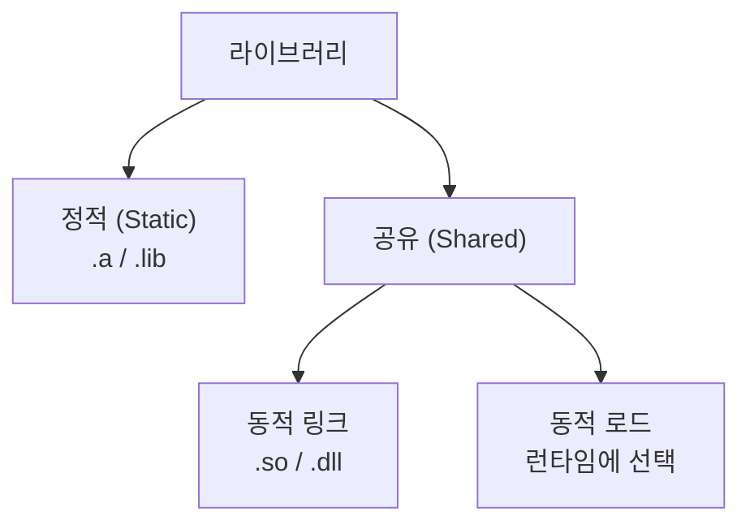

---
aliases:
  - Why Parallelism
  - 왜 병렬 처리인가
authority: primary
course: parallel-distributed-computing
created: '2025-03-04'
date: '2025-03-04'
review_state: active
semester: '3-1'
source: pdf/01_WhyParallelism.pdf
source_pages: 139
source_sha256: edb93d5812133633
source_type: lecture-slides
status: seedling
tags:
  - type/lecture
  - cs/systems
  - cs/distributed
  - cs/architecture
title: 01. 왜 병렬 처리인가
type: lecture
updated: '2026-08-28'
---

domain:: [[ComputerScience/04_systems-infrastructure/시스템 인프라 인터페이스|시스템 인프라 인터페이스]]
module:: [[ComputerScience/00_graph-interfaces/courses/병렬 분산처리 인터페이스|병렬 분산처리 인터페이스]]
source:: `pdf/01_WhyParallelism.pdf` (139p, Stanford CS149 Fall 2024 참고)
prerequisites:: [[ComputerScience/04_systems-infrastructure/computer-architecture/4. 제어 장치/5. 파이프 라이닝|파이프 라이닝]], [[ComputerScience/04_systems-infrastructure/operating-systems/3. 프로세스와 프로세스 관리/프로세스와 프로세스 관리|프로세스와 프로세스 관리]]
next:: [[ComputerScience/04_systems-infrastructure/parallel-distributed-computing/02. 병렬 컴퓨터의 기본 아키텍처|02. 병렬 컴퓨터의 기본 아키텍처]]

# 01. 왜 병렬 처리인가

> [!abstract] 한 줄 요약
> 클럭을 올려서 공짜로 빨라지던 시대(Dennard 스케일링)가 끝났기 때문에, 이제 성능은
> **여러 처리 요소를 동시에 쓰고 데이터 이동을 줄이는 방식**으로만 얻을 수 있다.
> 이 강의의 두 축은 **병렬성(parallelism)** 과 **효율성(efficiency, 특히 지역성)** 이다.

## 이 강의의 지도



---

## 1. 공짜 점심은 끝났다

> [!quote] 슬라이드 근거
> `pdf/01_WhyParallelism.pdf` p.9-10, 47-48, 127-130

15년 전까지 프로세서 성능은 개발자가 아무것도 안 해도 좋아졌다.
그 원동력은 딱 두 가지였다.

| 원동력 | 내용 | 지금 상태 |
|:--|:--|:--|
| **ILP (Instruction-Level Parallelism)** | 슈퍼스칼라 실행으로 독립 명령어를 자동 병렬화 | 뽑아낼 수 있는 양이 포화 |
| **클럭 주파수 상승** | 싱글 스레드 성능이 약 18개월마다 2배 | 전력·발열 장벽에 막힘 |

> [!info] Dennard 스케일링과 그 종말
> 트랜지스터가 작아져도 **전력 밀도가 일정하게 유지**된다는 법칙(MOSFET 스케일링).
> 이것이 성립하는 동안은 트랜지스터를 늘리면서 클럭도 같이 올릴 수 있었다.
> 이 법칙이 깨지면서 "클럭을 올리면 칩이 탄다"는 상황이 왔고, 그 결과가 멀티코어다.



### ILP는 어디까지 되는가

명령어 5개짜리 코드가 있다고 하자. 순차 프로세서라면 5클럭이 필요하다.
슈퍼스칼라 프로세서는 **의존성이 없는 명령어를 스스로 찾아** 동시에 실행한다.



> [!warning] ILP의 한계
> 명령어 1·2·3은 서로 독립이라 동시에 실행되지만, ④는 ①②의 결과를 기다려야 하고
> ⑤는 ④를 기다려야 한다. **의존성 사슬은 병렬화할 수 없다.**
> 프로그램에서 뽑아낼 수 있는 ILP는 금방 한계에 도달하고, 그래서 하드웨어가
> 알아서 빠르게 만들어 주는 시대가 끝났다.

### 전력이라는 실질적 한계

> [!example] 왜 전력이 곧 성능인가
> - **전력 = 열** — 칩이 뜨거워지면 클럭을 강제로 낮춰서(throttling) 식혀야 한다.
> - **전력 = 배터리** — 모바일에서는 같은 성능을 얼마나 오래 유지하느냐가 곧 제품 경쟁력이다.
>
> 그래서 현대 시스템은 처리 장치를 **많이** 쓸 뿐 아니라 **특수 목적 장치**(예: Google TPU)를
> 붙여 전력 효율을 끌어올린다.

---

## 2. 프로세서는 어떻게 명령어를 실행하는가

> [!quote] 슬라이드 근거
> `pdf/01_WhyParallelism.pdf` p.12-30

병렬성을 이해하려면 먼저 "프로세서가 한 클럭에 무엇을 하는가"를 알아야 한다.


| 구성 요소 | 역할 |
|:--|:--|
| **Fetch / Decode** | 메모리에서 다음 명령어를 가져와 무엇을 해야 하는지 해석 |
| **실행 유닛 (ALU)** | 명령어가 기술한 산술·논리 연산 수행, 레지스터/메모리 값 변경 |
| **레지스터** | 연산의 입력·출력 변수를 담는 초고속 저장소, 곧 "프로그램의 상태" |

> [!info] 세 가지 정의
> - **프로그램** = 프로세서 관점에서는 그냥 **실행할 명령어 목록**
> - **명령어** = 프로세서가 수행할 작업의 기술. 실행하면 컴퓨터의 상태가 바뀐다
> - **상태(state)** = 레지스터와 메모리에 들어 있는 프로그램 데이터의 값

`R0 = R0 + R1` 한 줄이 실제로는 4단계다.

| 단계 | 하는 일 |
|:--:|:--|
| 1 | 메모리에서 명령어 fetch — "R0에 R1을 더해 R0에 넣어라" |
| 2 | 레지스터 R0, R1의 값을 실행 유닛에 입력 |
| 3 | 실행 유닛이 덧셈 수행 |
| 4 | 결과를 R0에 저장 |

---

## 3. 진짜 병목은 메모리다

> [!quote] 슬라이드 근거
> `pdf/01_WhyParallelism.pdf` p.54-67

### 메모리 주소 공간

컴퓨터의 메모리는 **바이트 배열**이고, 각 바이트는 주소로 식별된다.
`Load` 명령어는 "R2에 든 주소부터 4바이트를 읽어 R0에 넣어라" 같은 형태다.

### Stall — 프로세서가 멈추는 순간

> [!info] 정의
> **Memory access latency**: 메모리 시스템이 프로세서에 데이터를 넘기는 데 걸리는 시간.
> **Stall**: 다음 명령어가 아직 끝나지 않은 이전 명령어에 의존해서 진행이 불가능한 상태.
> 메모리 접근이 stall의 주된 원인이다.



메모리 접근 시간은 **수백 클럭** 수준이다. 연산 하나 하려고 100클럭을 노는 셈이다.

### 캐시와 두 가지 지역성

> [!info] 캐시란
> 프로그램의 **출력에는 영향을 주지 않고 성능에만 영향을 주는** 하드웨어 구현 세부사항.
> 메모리 값의 부분집합을 온칩에 복사해 두며, **캐시 라인** 단위로 동작한다.
> (교체 정책은 이 강의 범위 밖 — 우선 LRU로 가정한다.)

| 지역성 | 의미 | 캐시가 이득을 보는 이유 |
|:--|:--|:--|
| **공간적 지역성** (spatial) | 인접한 주소를 곧 다시 접근 | 캐시 라인을 통째로 올려두면 이웃 주소가 미리 로드됨 |
| **시간적 지역성** (temporal) | 같은 주소를 반복 접근 | 두 번째부터는 캐시 히트 |

> [!example] 데이터 이동의 에너지 비용 — 이 강의에서 가장 중요한 숫자
> | 연산 | 에너지 |
> |:--|--:|
> | 정수 연산 | ~1 pJ |
> | 부동소수점 연산 | ~20 pJ |
> | 온칩 SRAM에서 64bit 읽기 (1mm 거리) | ~26 pJ |
> | 모바일 DRAM(LPDDR)에서 64bit 읽기 | **~1200 pJ** |
>
> 메모리에서 10 GB/s로 읽으면 약 **1.6 W**. 그런데 모바일 GPU의 전체 전력 예산이 약 **1 W**다.
> (iPhone 6 배터리 ≈ 7 Wh, MacBook Pro ≈ 99 Wh)
>
> $$E_{\text{DRAM read}} \approx 60 \times E_{\text{FP op}}$$
>
> **연산보다 데이터를 옮기는 게 훨씬 비싸다.** 그래서 지역성이 곧 성능이자 전력이다.

> [!tip] 최신 시스템 설계의 경험 법칙
> 언제나 **컴퓨터 안에서 데이터 이동량을 줄이려고 노력하라.**

원본 도해는 아래 페이지에서 직접 확인할 수 있다.

![[pdf/01_WhyParallelism.pdf#page=67]]

---

## 4. 성능을 좌우하는 두 축

> [!quote] 슬라이드 근거
> `pdf/01_WhyParallelism.pdf` p.4 (Mandelbrot fractal 예제)



> [!summary] 강의가 반복해서 말하는 두 문장
> - communication 시간을 줄이면 성능이 자연스레 오른다.
> - task를 잘 배분하면 성능이 오른다.
>
> 이 두 축이 이후 [[ComputerScience/04_systems-infrastructure/parallel-distributed-computing/05. 성능 최적화 I - 작업 분배와 스케줄링|05. 성능 최적화 I]],
> [[ComputerScience/04_systems-infrastructure/parallel-distributed-computing/06. 지역성·통신·경합|06. 지역성·통신·경합]]으로 이어진다.

---

## 5. 산업은 왜 병렬·분산으로 갔는가

> [!quote] 슬라이드 근거
> `pdf/01_WhyParallelism.pdf` p.68-75, 131-139



| 축 | 대표 기술 | 핵심 포인트 |
|:--|:--|:--|
| **IoT** | ARM (Cortex-A / R / M) | 1985년 영국 케임브리지 벤처 출발, 반도체를 직접 만들지 않는 **팹리스 IP 기업**. 전 세계 스마트폰의 90% 이상이 ARM. 2016년 소프트뱅크가 36조 원 전액 현금 인수 |
| **Cloud** | 가상화 → 하이퍼바이저 → VM | 하이퍼바이저가 하드웨어에 직접 붙어 1개 시스템을 여러 VM으로 분할. 클라우드는 네트워크 전체의 자원을 추상화·풀링 |
| **AI** | 슈퍼컴퓨터 Fugaku, RHEL | 학습·추론 모두 Linux OS 위에서 |
| **U2L** | Unix → Linux 마이그레이션 | 클라우드 비용, 대기업의 Linux 채택, IoT, 보안, 비용 민감도가 동인 |

> [!note] UNIX / Linux 계보
> 1969년 AT&T Bell Labs에서 Ken Thompson, Dennis Ritchie 등이 Multics 프로젝트에서 파생시켜 개발(Unics).
> 설계 의도는 **Portable, Multi-Tasking, Multi-User, Time-Sharing**.
> 당시에는 네트워크와 보안 개념이 없었다.

### 무어의 법칙 이후: 이기종·멀티다이


> [!important] 강의의 결론
> 단일 다이 스케일링은 끝났다. 레티클 한계를 넘는 방법은 **여러 종류의 프로세서를 붙이고
> (heterogeneous), 여러 다이를 붙이고(multi-die), 여러 노드를 붙이는(multi-node)** 것뿐이다.
> *"There Is No Future That Is Not Multi-Node."*

---

## 6. 실습 기반: Linux · C · 메모리

이 강의의 실습은 전부 Linux + C 위에서 이뤄진다. (p.76-126)

### 프로세스와 스레드



| 구분 | 프로세스 | 스레드 |
|:--|:--|:--|
| 정의 | 메모리에 올라와 실행 중인 프로그램의 인스턴스 | 프로세스 내에서 실행되는 여러 흐름의 단위 |
| 자원 | Code·Data·Stack·Heap을 **독립적으로** 할당 | **Stack만** 따로, Code·Data·Heap은 **공유** |
| 접근 | 다른 프로세스의 메모리에 직접 접근 불가 | 같은 프로세스의 힙을 서로 읽고 씀 |
| 통신 | IPC 필요 (파이프, 파일, 소켓) | 공유 메모리로 즉시 반영 |
| 식별 | 유일한 PID, 부모 프로세스가 생성 | 프로세스당 최소 1개(메인 스레드) |

> [!example] `ps` 주요 필드
> | 항목 | 설명 |
> |:--|:--|
> | `PID` / `PPID` | 프로세스 ID / 부모 프로세스 ID |
> | `TTY` | 연결된 터미널. 콘솔은 `tty숫자`, 원격/에뮬레이터는 `pts/숫자` |
> | `%CPU` / `%MEM` | CPU·메모리 사용 비율 추정치 (BSD 계열) |
> | `VSZ` / `RSS` | 가상 메모리 사용량 / 실제 메모리 사용량 |
> | `STAT` | 현재 프로세스 상태 코드 |
> | `NI` / `PRI` | nice 값 / 실제 실행 우선순위 |
>
> Linux 데스크톱 환경에서는 보통 100개 이상의 프로세스가 동시에 돈다.

### C 컴파일 4단계


| 단계 | 명령 | 산출물 | 하는 일 |
|:--|:--|:--|:--|
| 1. 전처리 | `gcc -E hello.c -o hello.i` | `.i` | 헤더 확장, `#define` 매크로/인라인 치환 |
| 2. 컴파일 | `gcc -S hello.i -o hello.s` | `.s` | 어셈블리 생성, 프로토타입으로 함수 사용 검증 |
| 3. 어셈블 | `gcc -c hello.s -o hello.o` | `.o` | 기계어 명령이 든 재배치 가능 오브젝트 |
| 4. 링크 | `gcc hello.o -o hello` | 실행 파일 | 라이브러리 바인딩, 주소 공간 할당, 로더가 실행 |

> [!tip] 자주 쓰는 gcc 옵션
> `-Wall` 모든 경고 · `-o` 출력 파일명 · `-g` 디버깅 정보 포함
> `-v` 컴파일 과정 출력 · `-save-temps` 중간 파일(`.i`, `.s`, `.o`)을 지우지 않고 보관
> `-l<library>` 라이브러리 링크 (`-lpthread`, `-lrt`) · `-L<dir>` 라이브러리 탐색 경로 추가

> [!example] 파일 여러 개 링크하기
> ```bash
> gcc -c prog1.c        # prog1.o
> gcc -c prog2.c        # prog2.o
> gcc -o prog prog1.o prog2.o
> ./prog
> ```

### 라이브러리 3종



| 종류 | 결합 시점 | 확장자 | 장점 | 단점 |
|:--|:--|:--|:--|:--|
| **정적** | 빌드 시 실행 파일에 포함 | `.a` / `.lib` | 시스템 환경이 바뀌어도 안정적, 배포 시 라이브러리 동봉 불필요 | 실행 파일 크기 증가 |
| **동적 링크** | 로드 시 링크 | `.so` / `.dll` | 코드 하나를 여러 앱이 공유 → 메모리 효율 | 배포 시 라이브러리 동봉 필요 |
| **동적 로드** | 실행 중 필요할 때 로드 | `.so` / `.dll` | 빌드 시점에 없던 라이브러리도 사용 가능 (플러그인) | 관리 복잡 |

> [!example] 정적 라이브러리 만들기
> ```bash
> ar rc libmymath.a mymath.o   # r: insert object, c: create archive
> ar t  libmymath.a            # 포함된 오브젝트 목록 확인
> ```

> [!tip] 실행 파일 분석 3종 세트
> `nm a.out` 심볼 목록 · `ldd a.out` 필요한 동적 라이브러리 경로 · `objdump -d a.out` 디스어셈블
> 런타임 탐색 경로는 `LD_LIBRARY_PATH` 로 지정한다.

### 배열은 메모리에 어떻게 놓이는가

C는 **행 우선(row-major)** 저장이다. `A[2][2]` 다음에 `A[2][3]`이 온다.

$$\text{addr}(A[i][j]) = A + \text{sizeof(type)} \times (i \times N_{cols} + j)$$

> [!example] `int A[3][4]` 에서 `A[1][2]` 의 주소
> $$A + 4 \times (1 \times 4 + 2) = A + 4 \times 6 = A + 24$$
>
> `char A[4][4]` 에서 `A[2][3]` 의 주소
> $$0 + 1 \times (2 \times 4 + 3) = 11$$

> [!warning] 왜 이게 병렬 처리 수업에 나오는가
> 행 우선 저장을 모르면 **캐시 라인을 어긋나게 훑는 루프**를 짜게 된다.
> 3절의 공간적 지역성이 그대로 깨지고, 앞에서 본 데이터 이동 에너지 비용을 그대로 문다.

---

## 핵심 정리

| 개념 | 한 줄 정의 | 왜 중요한가 |
|:--|:--|:--|
| **ILP** | 한 번에 병렬 실행 가능한 명령어를 구분하는 수준 값 | 하드웨어가 공짜로 주던 성능의 원천, 지금은 포화 |
| **슈퍼스칼라** | 독립 명령어를 자동 탐지해 여러 실행 유닛에 배분 | ILP를 실제로 뽑아내는 하드웨어 기법 |
| **Dennard 스케일링** | 트랜지스터가 작아져도 전력 밀도가 일정 | 이 법칙의 종말이 멀티코어 전환의 직접 원인 |
| **Stall** | 이전 명령어 미완료로 진행 불가한 상태 | 메모리 접근이 주원인, 수백 클럭 낭비 |
| **캐시 라인** | 캐시가 데이터를 다루는 세분화 단위 | 공간적 지역성이 성립하는 물리적 근거 |
| **공간적 지역성** | 인접 주소를 곧 다시 접근 | 캐시 라인 프리로드로 히트 |
| **시간적 지역성** | 같은 주소를 반복 접근 | 재접근이 곧 히트 |
| **이기종 컴퓨팅** | 서로 다른 종류의 프로세서를 결합 | 레티클 한계 이후 성능 확장의 유일한 길 |
| **행 우선 저장** | C의 2차원 배열은 행 방향으로 연속 | 루프 순서가 캐시 효율을 결정 |

> [!question]- 스스로 점검
> **Q1.** 병렬화가 오랫동안 "시간 대비 가치 없는 작업"이었던 이유는?
> **A1.** 싱글 스레드 성능이 약 18개월마다 2배가 됐기 때문에, 아무것도 안 해도 내년이면 코드가 빨라졌다.
>
> **Q2.** 슈퍼스칼라 프로세서가 명령어 4를 1·2와 동시에 실행할 수 없는 이유는?
> **A2.** 명령어 4가 1·2의 결과에 의존하기 때문이다. 의존성 사슬은 병렬화할 수 없다.
>
> **Q3.** 부동소수점 연산 1회와 LPDDR에서 64bit 읽기의 에너지 차이는 몇 배인가?
> **A3.** 약 20 pJ 대 1200 pJ로 **약 60배**. 그래서 연산보다 데이터 이동을 줄이는 게 우선이다.
>
> **Q4.** 캐시가 "프로그램의 출력에 영향을 주지 않는다"는 말의 의미는?
> **A4.** 캐시는 순수한 성능 최적화용 하드웨어 구현 세부사항이라, 있으나 없으나 계산 결과는 같다.
>
> **Q5.** 프로세스와 스레드가 공유하는 메모리 영역과 공유하지 않는 영역은?
> **A5.** 스레드는 Stack만 따로 갖고 Code·Data·Heap을 공유한다. 프로세스는 넷 다 독립이다.
>
> **Q6.** `gcc -save-temps` 는 무엇을 남기는가?
> **A6.** 전처리 파일 `.i`, 어셈블리 `.s`, 오브젝트 `.o` 등 중간 산출물을 현재 디렉터리에 보존한다.

## 슬라이드 근거

| 섹션 | 슬라이드 |
|:--|:--|
| 1. 공짜 점심은 끝났다 | p.9-10, 28-30, 45-50, 127-130 |
| 2. 프로세서의 명령어 실행 | p.12-27 |
| 3. 메모리 · Stall · 캐시 · 지역성 | p.54-67 |
| 4. 성능의 두 축 | p.3-4 |
| 5. 산업 방향 · 이기종 컴퓨팅 | p.68-75, 131-139 |
| 6. Linux · 프로세스 · C 컴파일 | p.76-126 |

## 관련 노트

- [[ComputerScience/04_systems-infrastructure/parallel-distributed-computing/02. 병렬 컴퓨터의 기본 아키텍처|02. 병렬 컴퓨터의 기본 아키텍처]] — 여기서 말한 "여러 처리 요소"의 실제 구조
- [[ComputerScience/04_systems-infrastructure/parallel-distributed-computing/06. 지역성·통신·경합|06. 지역성·통신·경합]] — 3절 지역성의 본편
- [[ComputerScience/04_systems-infrastructure/computer-architecture/4. 제어 장치/5. 파이프 라이닝|파이프 라이닝]] — ILP의 하드웨어 배경
- [[ComputerScience/04_systems-infrastructure/operating-systems/4. 스레드와 멀티테스킹/스레드와 멀티테스킹|스레드와 멀티테스킹]] — 6절 프로세스/스레드의 본편
- [[ComputerScience/04_systems-infrastructure/linux/1. 리눅스의 기본|리눅스의 기본]] — 실습 환경
