---
aliases:
  - 03_multicore2-update_0416
  - 03_multicore2-ispc_update
  - Multi-Core Architecture Part II
  - 지연 대역폭과 ISPC
authority: primary
course: parallel-distributed-computing
created: '2025-04-19'
date: '2025-04-19'
review_state: active
semester: '3-1'
source: pdf/03_multicore2-update_0416.pdf
source_pages: 116
source_sha256: c3243eda4c391a33
source_type: lecture-slides
status: draft
tags:
  - lecture
  - systems
  - distributed
title: 03. 멀티코어 아키텍처 II - 지연·대역폭과 ISPC
type: lecture
updated: '2026-08-28'
---

source:: `pdf/03_multicore2-update_0416.pdf` (116p, 개정본) + `pdf/03_multicore2-ispc_update.pdf` (101p, 이전본)

# 03. 멀티코어 아키텍처 II - 지연·대역폭과 ISPC

> [!abstract] 한 줄 요약
> 연산 유닛을 아무리 늘려도 **데이터를 공급하지 못하면 소용없다.**
> 현대 컴퓨팅의 임계 자원은 연산 속도가 아니라 **대역폭(bandwidth)** 이고,
> 그래서 좋은 병렬 프로그램은 "메모리에 덜 자주 접근하는" 프로그램이다.
> 그리고 이 문제를 프로그래머가 다룰 수 있게 해 주는 것이
> **추상화와 구현을 분리하는 프로그래밍 모델** — 이 강의에서는 **ISPC의 SPMD gang 추상화** 다.

> [!note] 이 노트가 합친 두 덱
> 같은 3장의 두 개정본을 하나로 정리했다. 본문의 페이지 표기는 아래 약칭을 쓴다.
>
> | 약칭 | 파일 | 페이지 | 성격 |
> | :-- | :-- | --: | :-- |
> | **덱 A** | `pdf/03_multicore2-ispc_update.pdf` | 101p | 2025-04-08 이전본 |
> | **덱 B** | `pdf/03_multicore2-update_0416.pdf` | 116p | 2025-04-19 개정본, ISPC 심화 15장 추가 |
>
> 덱 B가 덱 A를 포함하는 상위 집합에 가깝다. 프론트매터의 출처 해시·페이지 수는 **덱 B 기준**이다.

## 이 강의의 지도

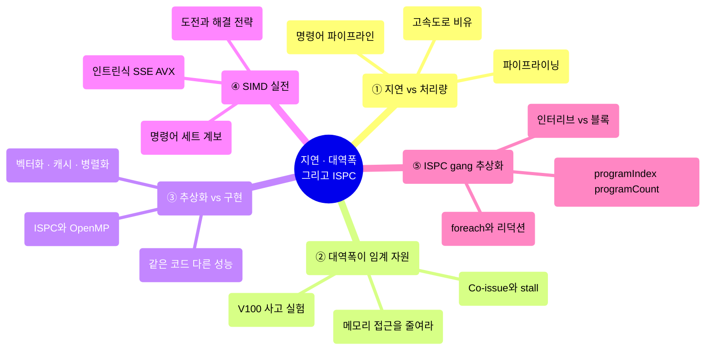

---

## 1. 지연 시간과 처리량은 다른 것이다

> [!quote] 슬라이드 근거
> 덱 B p.6-8 / 덱 A p.6-8

강의는 스탠퍼드 통학길 비유로 시작한다.
고속도로 한 차선에는 한 번에 차량 한 대만 있다고 가정하고,
차량이 스탠퍼드에 도착해야 다음 차량이 샌프란시스코를 출발한다.

| 지표 | 값 | 정의 |
| :-- | :-- | :-- |
| **지연 시간 (latency)** | 0.5시간 | 샌프란시스코에서 스탠퍼드까지 한 대가 이동하는 데 걸리는 시간 |
| **처리량 (throughput)** | 시간당 2대 | 단위 시간에 목적지에 도착하는 차량 수 |

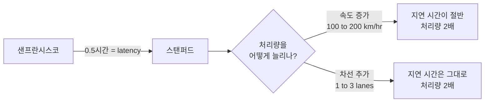

> [!important] 이 비유의 핵심
> **처리량을 두 배로 만드는 방법은 두 가지지만, 지연 시간에 미치는 영향은 전혀 다르다.**
>
> - **속도 증가** — 차량 속도를 100 km/hr에서 200 km/hr로 올리면 처리량이 두 배. 지연도 줄어든다.
> - **차선 추가** — 차선 두 개를 더하면 처리량이 두 배. **지연 시간은 하나도 안 줄어든다.**
>
> 멀티코어·SIMD·멀티스레딩은 전부 **차선 추가** 쪽이다.
> 그래서 [02강](<./02. 병렬 컴퓨터의 기본 아키텍처.md>)에서
> "멀티스레딩은 지연을 줄이지 않는다"고 했던 것이다.

---

## 2. 파이프라이닝 — 자원을 늘리지 않고 처리량을 늘리기

> [!quote] 슬라이드 근거
> 덱 B p.11-14, 27 / 덱 A p.11-14, 27

### 빨래 비유

빨래는 세 단계다. **① 빨래하기 → ② 옷 말리기 → ③ 옷 개기.**
많은 세탁물의 처리량을 극대화하는 방법은 두 가지다.

| 방법 | 내용 | 비용 |
| :-- | :-- | :-- |
| **실행 리소스 중복** | 세탁기 두 대, 건조기 두 대를 놓고 친구를 부른다 | 장비가 2배 필요 |
| **파이프라이닝** | 세탁기와 건조기를 **동시에** 돌린다 | 장비 추가 없이 처리량 2배 |

```mermaid
gantt
    title 파이프라인 세탁 - 장비를 늘리지 않고 처리량을 올린다
    dateFormat X
    axisFormat %s
    section 세탁물 A
    세탁 :done, a1, 0, 1
    건조 :active, a2, 1, 2
    개기 :a3, 2, 3
    section 세탁물 B
    세탁 :done, b1, 1, 2
    건조 :active, b2, 2, 3
    개기 :b3, 3, 4
    section 세탁물 C
    세탁 :done, c1, 2, 3
    건조 :active, c2, 3, 4
    개기 :c3, 4, 5
```

파이프라인이 채워지면 **매 단위 시간마다 세탁물 한 벌이 완성**된다.
개별 세탁물의 지연 시간(3단계)은 그대로인데 처리량만 3배가 됐다.

[03_multicore2-update_0416 p.13](<./pdf/03_multicore2-update_0416.pdf>)

> [!tip] 슬라이드가 여기서 미리 던지는 결론
> **"프로그램이 메모리에 자주 접근하지 않도록 최적화하는 것이 현대 프로세서의 효율적인 활용에 필수적이다."**
> 이 문장이 이 강의 전체의 주제문이다.

### 연결된 두 개의 파이프

굵기가 다른 파이프 두 개를 연결하면, 시스템 전체를 통과할 수 있는 최대 유량은?
답은 **50 liters/sec** — 즉 **가장 좁은 구간이 전체를 결정한다.**
프로세서가 아무리 빨라도 메모리가 좁으면 시스템 성능은 메모리에서 결정된다.

### 명령어 파이프라인

> [!question] 프로세서는 어떻게 한 클럭에 곱셈을 끝내는가?
> 사실은 끝내지 못한다. **코어가 클럭당 하나의 연산을 수행한다는 말은
> 지연 시간이 아니라 명령어 처리량(throughput)을 의미한다.**

| 4단계 명령어 파이프라인 | 값 |
| :-- | :-- |
| **지연 시간** | 명령어 1개에 4 cycles |
| **처리량** | 사이클당 1개 명령어 |

$$\text{throughput} = \frac{1}{\text{cycle}}, \qquad \text{latency} = 4\ \text{cycles}$$

> [!warning] 주의
> 연속된 명령어가 종속적인 경우, 프로그램 정확성을 보장하기 위해 주의를 기울여야 한다.
> 실제 명령어 파이프라인은 최신 CPU에서 **명령어에 따라 최대 20단계까지 가변 길이**가 될 수 있다.

---

## 3. 대역폭이 임계 자원이다

> [!quote] 슬라이드 근거
> 덱 B p.16-26 / 덱 A p.16-26

### Co-issue: 명령어 하나로 두 유닛을 동시에

프로세서는 클럭당 덧셈 하나를 수행할 수 있으며, **동시에 로드(LD) 명령을 함께 발행(co-issue)** 할 수 있다.
ADD와 LD는 별개의 연산 유닛에서 수행되므로 서로 독립적이다.

```c
1. r1 = r2 + r3        // ADD 실행
2. r4 = MEM[addr]      // LD 실행  → 1번과 독립이므로 같은 사이클에 co-issue 가능
3. r5 = r1 + r6        // ADD 실행 (1번 ADD의 결과에 의존)
```

ADD와 LD를 개별적으로 실행하면 3 클럭이 걸릴 수 있지만,
Co-issue를 적용하면 **2 클럭 만에 완료**된다. ILP를 실제로 활용하는 방식이다.

> [!warning] 그런데 여기서 stall이 발생한다
> **메모리에서 데이터를 가져오는 속도가 프로세서가 덧셈을 완료하는 속도보다 느리면,
> 프로세서는 데이터를 기다리며 대기 상태(stall)에 빠진다.**
>
> 완화책은 **메모리 요청의 병렬화** 다. 슬라이드의 프로세서는 최대 **3개의 로드 요청을 동시에** 처리할 수 있다.
> 이는 [02강](<./02. 병렬 컴퓨터의 기본 아키텍처.md>)의
> 하드웨어 스레드 병렬처리와 같은 목적(지연 숨기기)을 가진 기법이다.

### 정상 상태에서는 지연이 아니라 처리량이 문제다

> [!important] 이 강의에서 가장 오해하기 쉬운 문장
> **"정상 상태에서의 코어 활용도 저하는 메모리 지연 시간이나 미결 메모리 요청의 수가 아니라,
> 명령어와 메모리 처리량의 함수일 뿐이라는 점을 명심하라."**
>
> 즉 파이프라인이 충분히 채워진 뒤에는 latency를 아무리 숨겨도 소용없고,
> **초당 몇 바이트를 옮길 수 있느냐(bandwidth)** 만 남는다.

### 사고 실험: V100으로 벡터 곱을 한다면

작업은 단순하다. 수백만 개 원소를 가진 두 벡터 A, B의 요소별 곱이다.

```c
// Load A[i], Load B[i], Compute A[i] * B[i], Store C[i]
for (int i = 0; i < N; i++)
    C[i] = A[i] * B[i];
```

| 항목 | 값 |
| :-- | :-- |
| MUL 1회당 메모리 연산 | 3회 = **12 바이트** (load A, load B, store C) |
| NVIDIA V100 연산 능력 | 클럭당 **5120개 fp32 MUL** @ 1.6 GHz |
| 유닛을 계속 쓰려면 필요한 대역폭 | **초당 약 98 TB** |
| V100이 실제로 가진 대역폭 | HBM2, **900 GB/s** |

$$5120 \times 1.6 \times 10^{9} \times 12\ \text{B} \approx 98\ \text{TB/s}$$

$$\text{효율} = \frac{900\ \text{GB/s}}{98\ \text{TB/s}} < 1\%$$

> [!example] 그래도 CPU보다는 빠르다
>
> - **V100**: 이 계산에서 GPU 효율 **1% 미만**
> - **3.2 GHz Xeon E5v4 8코어 CPU** (76 GB/s 메모리 버스): 이 계산에서 효율 **약 3%**
>
> 둘 다 처참하지만, 절대 처리량은 여전히 V100이 8코어 CPU보다 빠르다.
> 요점은 **둘 다 대역폭에 완전히 묶여 있다(bandwidth-limited)** 는 것이다.

> [!info] 최신 GPU의 대응 — High bandwidth memories
> 최신 GPU는 **프로세서 근처에 위치한 고대역폭 메모리**를 쓴다. V100의 HBM2가 그 예로, 900 GB/s를 낸다.
> 그래도 위 계산에서 보듯 연산 능력을 다 먹이기에는 턱없이 모자란다.

### 그래서 좋은 병렬 프로그램이란

> [!important] In modern computing, bandwidth is the critical resource
> 성능이 우수한 병렬 프로그램은 다음을 수행한다.
>
> 1. **메모리에서 데이터를 덜 자주 가져오도록 계산을 구성한다**
>    - 동일한 스레드에서 이전에 로드한 데이터를 재사용 → **시간적 지역성(temporal locality) 최적화**
>    - 스레드 간 데이터 공유 → **스레드 간 협업**
> 2. **값을 저장했다가 다시 로드하느니, 차라리 추가 연산을 수행하는 쪽을 선호한다** (연산은 "무료")
> 3. 요점: **최신 프로세서를 효율적으로 활용하려면 프로그램이 메모리에 자주 액세스하지 않아야 한다**

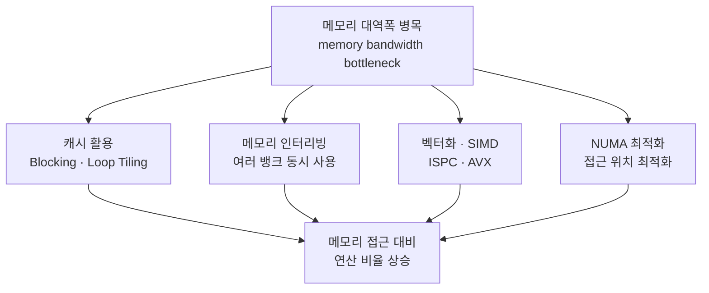

| 전략 | 구체적 방법 |
| :-- | :-- |
| **캐시 활용** | L1/L2/L3를 최대한 써서 메모리 접근 자체를 줄인다. 데이터 재사용률이 높은 알고리즘(Blocking, Loop Tiling)을 쓴다 |
| **메모리 인터리빙** | 여러 메모리 뱅크를 동시에 활용해 대역폭을 늘린다 |
| **벡터화 / SIMD** | ISPC, AVX로 한 번의 메모리 접근당 더 많은 연산을 수행한다 |
| **NUMA 최적화** | 멀티코어 시스템에서 메모리 접근 위치를 최적화한다 |

> [!note] 보충
> 메모리 대역폭 병목은 과학 계산, 그래픽 연산, AI 모델 학습 등에서 특히 자주 발생한다고 슬라이드가 못 박는다.
> 대역폭 한계를 극복하는 것은 **처리량 최적화 시스템(throughput-optimized systems)을 목표로 하는
> 소프트웨어 개발자가 직면한 가장 중요한 과제**다.

---

## 4. Part 2 — 추상화(Abstraction) vs 구현(Implementation)

> [!quote] 슬라이드 근거
> 덱 B p.28-39 / 덱 A p.28-39

> [!info] 이 파트의 문제의식
> **"추상화의 Semantic(meaning)과 구현의 세부 사항을 혼동하는 것은
> 이 과정에서 흔히 발생하는 혼란의 원인이다."**

| 개념 | 정의 | 예시 |
| :-- | :-- | :-- |
| **추상화 (Abstraction)** | 프로그래밍 모델이 하드웨어의 복잡성을 숨기는 과정 | C/C++의 `for` 루프. 프로그래머는 어떤 CPU 명령어가 실행되는지 몰라도 된다 |
| **구현 (Implementation)** | 실제 하드웨어에서 코드가 어떻게 실행되는지 | 같은 `for` 루프가 스칼라로 돌 수도, SIMD로 벡터화될 수도, 파이프라이닝될 수도 있다 |

### 예제 1 — 같은 루프, 다른 실행 방식

```c
// 추상화: 한 번에 하나씩 처리할 것처럼 보인다
for (int i = 0; i < N; i++)
    C[i] = A[i] + B[i];
```

CPU가 벡터 명령어(AVX, SSE)를 지원하면 컴파일러는 이 루프를 벡터화해
**한 번에 4~8개씩** 처리한다. 즉 성능이 4~8배 향상될 수 있다.

| 실행 방식 | 연산 속도 | 특징 |
| :-- | :-- | :-- |
| 스칼라 (Scalar) | 느림 | 한 번에 1개 처리 |
| 벡터화 (SIMD) | 빠름 | 한 번에 여러 개 처리 |
| 멀티스레드 | 더 빠름 | 여러 개의 코어 사용 |

### 예제 2 — 같은 코드, 다른 메모리 접근

```c
// 프로그래머는 "A[i]를 읽어 sum에 더한다"고만 생각한다
for (int i = 0; i < N; i++)
    sum += A[i];
```

그러나 배열 `A` 가 메모리 상에서 연속적이지 않거나 캐시 최적화가 되어 있지 않으면
**캐시 미스(Cache Miss)** 가 발생하고 성능이 급락한다.
**캐시 친화적인 접근 패턴(Cache-Friendly Access Pattern)** 을 고려해야 하는 이유다.

### 최적화 전략 세 가지

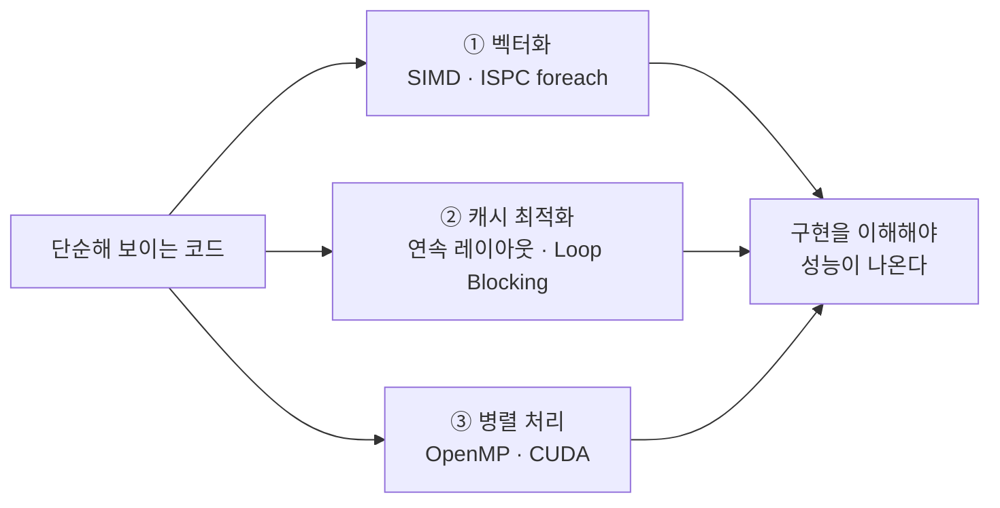

> [!summary] 이 파트의 결론
>
> - 추상화된 코드는 단순하지만, 실제 하드웨어에서는 다르게 실행될 수 있다.
> - 벡터화, 캐시 최적화, 병렬 처리를 적용하면 성능을 크게 향상시킬 수 있다.
> - **최적의 성능을 얻으려면 "구현(Implementation)"을 깊이 이해하는 것이 필수적이다.**
>
> 학생으로서의 목표: 병렬 프로그래밍 모델이 어떻게 구현되는지 아는 상태에서,
> **프로그램의 각 단계에서 병렬 컴퓨터의 각 부분이 무엇을 하는지 머릿속으로 '추적'할 수 있어야 한다.**

---

## 5. SIMD의 기본 원리와 C에서의 구현

> [!quote] 슬라이드 근거
> 덱 B p.42-48 / 덱 A p.42-48

> [!info] SIMD의 핵심 아이디어는 단순하다
> **하나의 명령어로 여러 개의 데이터를 동시에 처리하는 것.**
>
> - 스칼라 처리: `A + B = C` (한 번에 하나의 연산)
> - SIMD 처리: `[A1,A2,A3,A4] + [B1,B2,B3,B4] = [C1,C2,C3,C4]` (한 번에 여러 연산)
>
> 이렇게 하면 **데이터 병렬성(Data Parallelism)** 을 활용할 수 있고,
> 이미지 처리나 물리 시뮬레이션처럼 같은 연산을 여러 데이터에 적용할 때 큰 성능 향상을 얻는다.

### C에서 SIMD를 쓰는 세 가지 방법

| 방법 | 설명 | 평가 |
| :-- | :-- | :-- |
| **인트린식 (Intrinsics)** | 컴파일러가 제공하는 특별한 함수로 SIMD 명령어를 직접 호출 | **가장 일반적.** 어셈블리보다 쉽고, 자동 벡터화보다 세밀한 제어 가능 |
| **어셈블리 코드 삽입** | 인라인 어셈블리로 SIMD 명령어를 직접 작성 | 가장 낮은 수준, 가장 번거로움 |
| **자동 벡터화** | 컴파일러 최적화 기능이 알아서 SIMD 명령어를 생성 | 편하지만 제어가 안 됨 |

인트린식을 쓰려면 해당 헤더를 포함해야 한다. SSE라면 `#include <xmmintrin.h>` 다.

```c
#include <xmmintrin.h>

// __m128 = 128비트 SIMD 레지스터 타입, 단정밀도 float 4개를 담는다
__m128 va = _mm_load_ps(&a[i]);   // 메모리 → SIMD 레지스터
__m128 vb = _mm_load_ps(&b[i]);
__m128 vc = _mm_add_ps(va, vb);   // SIMD 덧셈 (4개 동시)
_mm_store_ps(&c[i], vc);          // SIMD 레지스터 → 메모리
```

> [!tip] 정렬되지 않은 데이터
> 데이터가 정렬(alignment)되어 있지 않으면 `_mm_loadu_ps` 같은 **비정렬 로드 명령어**를 써야 한다.
> AVX 계열에서는 `_mm256_loadu_ps` 가 메모리에서 float 8개를 읽어 256비트 벡터 레지스터에 담는다.

### SIMD 명령어 세트 계보

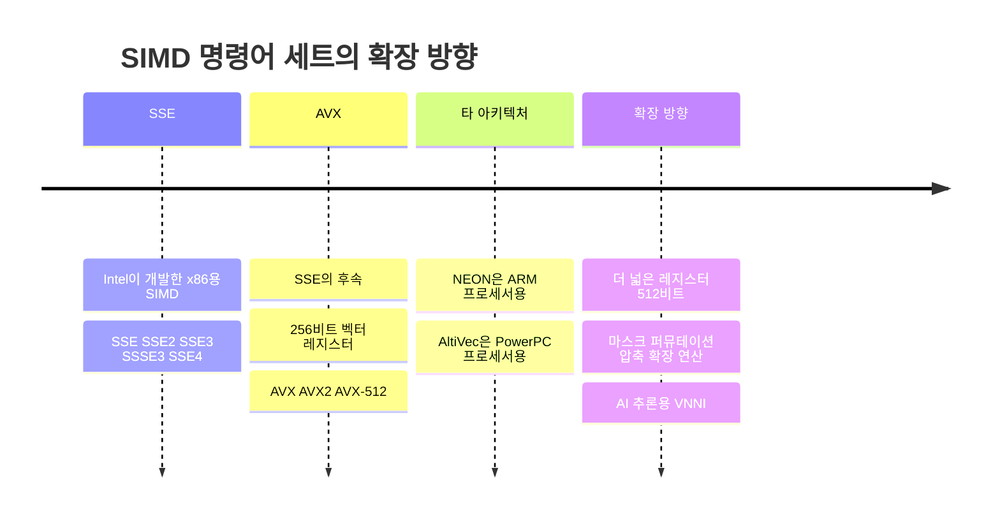

| 명령어 세트 | 아키텍처 | 특징 |
| :-- | :-- | :-- |
| **SSE** | x86 | Intel이 개발. SSE, SSE2, SSE3, SSSE3, SSE4 버전이 있다 |
| **AVX** | x86 | SSE의 후속. **256비트** 벡터 레지스터 지원. AVX, AVX2, AVX-512 |
| **NEON** | ARM | ARM 프로세서에서 사용되는 SIMD 명령어 세트 |
| **AltiVec** | PowerPC | PowerPC 프로세서에서 사용되는 SIMD 명령어 세트 |

> [!warning] 넓다고 무조건 좋은 것은 아니다
> AVX는 SSE보다 넓은 레지스터를 써서 한 번에 더 많은 데이터를 처리하지만,
> **더 높은 전력을 소비한다.** 각 명령어 세트는 고유한 장단점을 갖는다.

---

## 6. SIMD 프로그래밍의 도전과 발전 방향

> [!quote] 슬라이드 근거
> 덱 B p.62-67 / 덱 A p.61-66

### 도전 4 — 메모리 대역폭 제한

SIMD 연산은 많은 데이터를 빠르게 처리할 수 있지만, **메모리 대역폭이 병목이 될 수 있다.**
3절의 결론이 SIMD 문맥에서 다시 나오는 것이다.

| 해결 전략 | 내용 |
| :-- | :-- |
| **지역성 최대화** | 데이터 지역성을 높여 캐시 사용을 최적화 |
| **프리페치** | 프리페치 명령어로 데이터를 미리 캐시로 로드 |
| **연산 강도 상승** | 메모리 접근 대비 연산 비율(arithmetic intensity)을 개선 |

```c
// 프리페치 예시
_mm_prefetch((char*)&data[i + 64], _MM_HINT_T0);

// 연산 강도 높이기 — FMA로 한 번의 로드에서 더 많은 연산을 뽑는다
for (int i = 0; i < size; i += 8) {
    __m256 a = _mm256_load_ps(&data_a[i]);
    __m256 b = _mm256_load_ps(&data_b[i]);
    __m256 c = _mm256_load_ps(&data_c[i]);
    __m256 result = _mm256_fmadd_ps(a, b, c);   // a * b + c
    _mm256_store_ps(&output[i], result);
}
```

> [!info] 루프 언롤링도 같은 맥락
> 슬라이드는 `normal_add` 와 `unroll_add` 를 나란히 보여 준다.
> `ssize = (size / 8) * 8` 로 **8의 배수 구간**을 만들어 한 루프에서 8번씩 더하고,
> 남은 부분은 따로 처리한다. 이것이 뒤에 나올 ISPC `foreach` 의
> "unmasked main body + masked tail body" 구조와 정확히 같은 발상이다.

### 도전 5 — 이식성과 유지보수성

SIMD 코드는 **특정 명령어 세트에 의존적이고 가독성이 떨어지며**, 다른 아키텍처로의 이식이 어렵다.

```c
// SIMD 추상화 — 매크로로 명령어 세트 차이를 감춘다
#ifdef __AVX__
    #define SIMD_ADD(a, b) _mm256_add_ps(a, b)
#elif defined(__SSE__)
    #define SIMD_ADD(a, b) _mm_add_ps(a, b)
#else
    #define SIMD_ADD(a, b) ((a) + (b))
#endif

// 런타임 기능 감지 — 실행 환경에 맞는 구현을 고른다
if (cpu_supports_avx2()) {
    process_data_avx2(data, size);
} else if (cpu_supports_sse4_1()) {
    process_data_sse4_1(data, size);
} else {
    process_data_scalar(data, size);
}
```

### 발전 방향 세 가지

| 방향 | 내용 | 대표 예 |
| :-- | :-- | :-- |
| **더 넓은 레지스터** | 레지스터 폭이 계속 넓어진다 | AVX-512는 **512비트**, `__m512` 로 float 16개를 한 번에 |
| **더 유연한 연산** | 마스크 연산, 퍼뮤테이션, 압축/확장 연산 | `_mm512_mask_add_ps(a, mask, a, b)` |
| **AI 특화 명령어** | 딥러닝 추론 가속용 명령어 등장 | Intel **VNNI** (Vector Neural Network Instructions), `_mm512_dpbusds_epi32` 로 8비트 정수 행렬 곱셈 |

> [!note] 보충
> 마스크 연산은 [02강](<./02. 병렬 컴퓨터의 기본 아키텍처.md>)에서
> 본 "조건부 실행 시 ALU 출력 폐기"를 명령어 수준에서 1급 시민으로 승격시킨 것이다.
> 하드웨어가 분기 발산을 전제로 설계되기 시작했다는 신호다.

---

## 7. ISPC — SPMD 추상화를 SIMD로 구현하기

> [!quote] 슬라이드 근거
> 덱 B p.36-38, 73-88 / 덱 A p.36-38, 72-81

### ISPC란 무엇인가

> [!info] ISPC (Intel Implicit SPMD Program Compiler)
>
> - Intel이 개발한 **병렬 프로그래밍용 컴파일러**이자 **C 기반 언어**
> - **SPMD (Single Program, Multiple Data)** 모델을 기반으로 하며, CPU의 SIMD 명령어를 자동으로 활용
> - `foreach` 구문으로 자동 병렬 실행. GPU의 CUDA/OpenCL과 비슷하지만 **CPU 환경에 최적화**
> - C/C++ 코드와 함께 쓸 수 있고, C++ 함수에서 ISPC 함수를 호출할 수 있다
>
> 단, 슬라이드는 한 가지를 분명히 한다 — **ISPC는 자동 벡터화 컴파일러(Auto-Vectorizing compiler)가 아니다.**
> 벡터는 타입 시스템에서 명시적으로 선언되고, 개발자가 스칼라(`uniform`)와 벡터(`varying`)를 명시적으로 구분한다.

| 실행 방식 | 연산 속도 | 특징 |
| :-- | :-- | :-- |
| C (스칼라 연산) | 느림 | 한 번에 1개 처리 |
| C + OpenMP (멀티스레드) | 빠름 | 여러 개의 CPU 코어 활용 |
| **ISPC (벡터화 + 병렬 처리)** | 매우 빠름 | 한 번에 여러 개 처리 (SIMD + 병렬 실행) |

### ISPC vs OpenMP

| 특징 | ISPC | OpenMP |
| :-- | :-- | :-- |
| **사용 모델** | SPMD (Single Program, Multiple Data) | Shared Memory 멀티스레딩 |
| **SIMD 자동화** | 자동 벡터화 | 명시적으로 벡터화 필요 |
| **코드 복잡도** | 낮음 (간단한 `foreach` 사용) | 높음 (`pragma` 사용 필요) |
| **GPU 실행 가능 여부** | CPU 전용 | CPU 전용 |

> [!tip] 한 줄로
> **ISPC는 벡터화(Vectorization)에 강점, OpenMP는 멀티스레딩(Threading) 중심.**

### gang 추상화

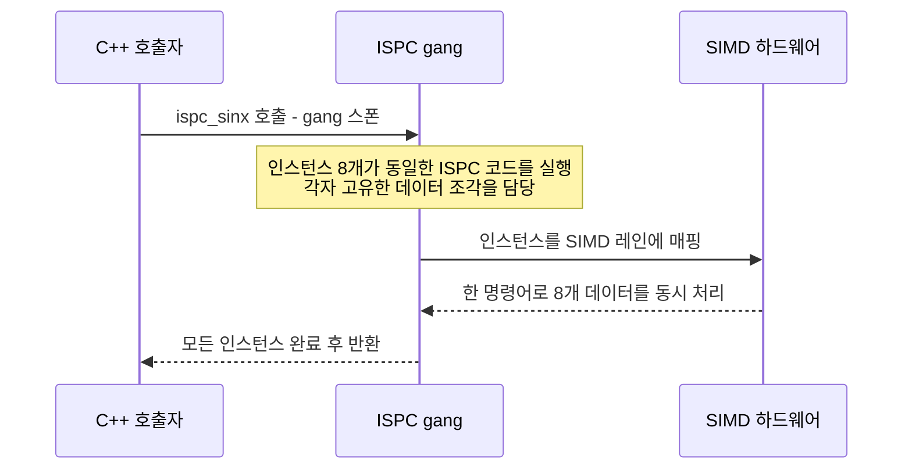

> [!info] gang이란
> **모두 같은 작업을 수행하지만 서로 다른 데이터를 다루는 작업자들로 구성된 팀.**
> ISPC 함수를 호출하면 프로그램 인스턴스의 "gang"이 스폰되고, 모든 인스턴스가 동시에 ISPC 코드를 실행하며,
> 반환 시점에 모든 인스턴스가 완료된다.
>
> - **프로그램 인스턴스** — 모든 인스턴스는 동일한 ISPC 코드를 실행하되, 각자 고유한 데이터 일부를 처리
> - **고유한 지역 변수** — 각 인스턴스는 지역 변수의 자체 복사본을 가지므로 데이터 충돌 없이 독립 계산이 가능

| 키워드 | 의미 | 타입 성격 |
| :-- | :-- | :-- |
| `programCount` | 동시에 실행 중인 인스턴스 수 = gang의 인스턴스 수 | `uniform` |
| `programIndex` | gang 안에서 현재 인스턴스의 고유 ID | `varying` (non-uniform) |
| `uniform` | 모든 인스턴스가 이 변수에 대해 **동일한 값**을 갖는다는 타입 한정자 | — |

> [!warning] `uniform` 의 진짜 의미
> 슬라이드가 강조한다 — **`uniform` 의 사용은 순전히 최적화를 위한 것이고, 정확성을 위해 필요하지는 않다.**
> 즉 `uniform` 을 빼도 프로그램은 (타입이 맞는 한) 옳게 동작하지만, 컴파일러가 스칼라 레지스터를 쓸 기회를 잃는다.

### ISPC는 gang을 SIMD 명령어로 구현한다

> [!important] 추상화와 구현의 분리, 그 실물
>
> - **추상화(SPMD)**: "이 연산을 8번 병렬로 수행하고 싶다"
> - **구현(SIMD)**: ISPC는 8개의 개별 워커를 만들지 않는다. 대신 SIMD를 사용해 CPU에
>   **"이 8개의 데이터에 대해 동시에 이 연산을 수행하라"** 고 지시한다.
>
> gang에 포함된 인스턴스 수는 **대상 하드웨어의 SIMD 폭(또는 그 작은 배수)** 이다.
> 그래야 컴파일러가 각 인스턴스를 SIMD 레인에 효율적으로 매핑할 수 있다.

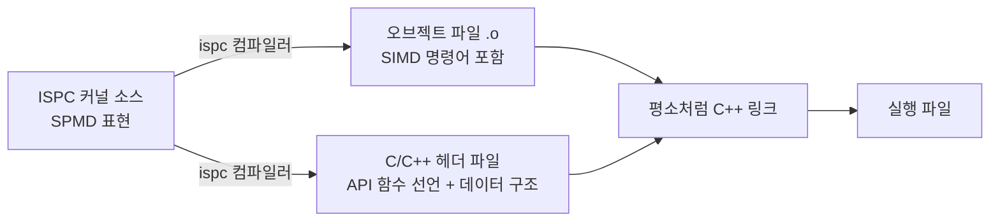

> [!info] ISPC Integration — 왜 편한가
> ISPC 컴파일러는 C/C++ 통합에 필요한 **모든 것을 생성**한다.
> 커널마다 API/함수 호출이 든 헤더, 커널에 정의된 데이터 구조, 링크할 오브젝트 파일까지.
> **런타임이나 장황한 API가 필요 없다** (예: OpenCL과 대비).
>
> 그래서 좋은 점:
>
> - 프로그래머는 더 이상 기반이 되는 **ISA를 알 필요가 없다**
> - 개발·유지 관리 비용 절감, 최적화 도달 범위 증가, 성능 향상

> [!note] ISA (Instruction Set Architecture)
> 하드웨어와 소프트웨어 사이의 인터페이스를 정의하는 것.
> 하드웨어와 프로그램 사이의 매개체 역할을 한다.

---

## 8. 작업 분배 — 인터리브 vs 블록, 그리고 `foreach`

> [!quote] 슬라이드 근거
> 덱 B p.85-99 / 덱 A p.79-88

gang이 있으면 그다음 질문은 **"루프 반복을 인스턴스들에게 어떻게 나눠 줄 것인가"** 다.
슬라이드는 이것을 **작업 분배의 핵심**이라고 부른다.

### 인터리브 할당 (interleaved)

```c
// programCount = 8 인 경우
// 인스턴스 0 → 인덱스 0, 8, 16, 24, ...
// 인스턴스 1 → 인덱스 1, 9, 17, 25, ...
export void ispc_sinx(uniform int N, uniform float* x, uniform float* y) {
    for (uniform int i = 0; i < N; i += programCount) {
        int idx = i + programIndex;      // 각 인스턴스가 고유 인덱스를 잡는다
        y[idx] = sinx(x[idx]);
    }
}
```

> [!example] 카드 덱 비유
> 카드 덱(루프 반복)을 플레이어 그룹(ISPC 프로그램 인스턴스)에게 나눠 준다고 상상하자.
> 각 플레이어에게 차례로 카드 한 장씩 주고, 마지막 플레이어 다음에는 다시 첫 번째 플레이어로 돌아간다.
> **라운드 로빈 방식**이다.

### 블록 할당 (blocked)

```c
// sinx() in ISPC: version 2 — 연속된 덩어리를 하나씩 맡는다
uniform int count = N / programCount;   // 각 인스턴스가 처리할 요소 수
int start = programIndex * count;       // 각 인스턴스의 시작 인덱스
for (uniform int i = 0; i < count; i++) {
    y[start + i] = sinx(x[start + i]);
}
```

`programCount = 4`, `count = 256` 이면 시작 인덱스는 각각 0, 256, 512, 768이다.

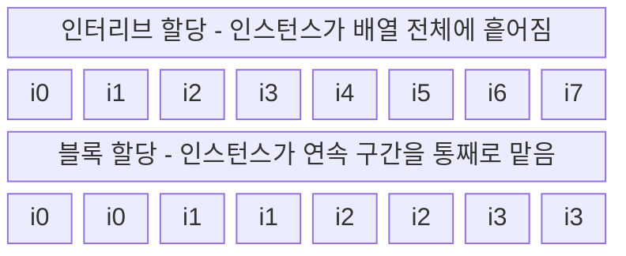

### 어느 쪽이 유리한가

| 기준 | 인터리브 할당 | 블록 할당 |
| :-- | :-- | :-- |
| **메모리 접근 패턴** | 데이터가 메모리에 순차 배치되어 있으면 **하나의 "패킹된 벡터 로드"** 로 여러 인스턴스 데이터를 한 번에 가져올 수 있다 | 각 인스턴스가 서로 떨어진 위치를 읽으므로 **gather** 가 필요 |
| **해당 인트린식** | `_mm256_load_ps` / `_mm256_loadu_ps` | `_mm256_i32gather_ps` |
| **참조 지역성** | 인스턴스별로는 흩어짐 | 각 인스턴스가 가까운 데이터를 접근 → **지역성 우수** |
| **논리 구성** | 데이터 의존성이 있으면 복잡해질 수 있음 | 경쟁 조건(race condition)을 피하는 논리가 **더 단순** |
| **약점** | — | **SIMD 벡터 로드에 최적이 아님** (비연속 접근 시 불리) |

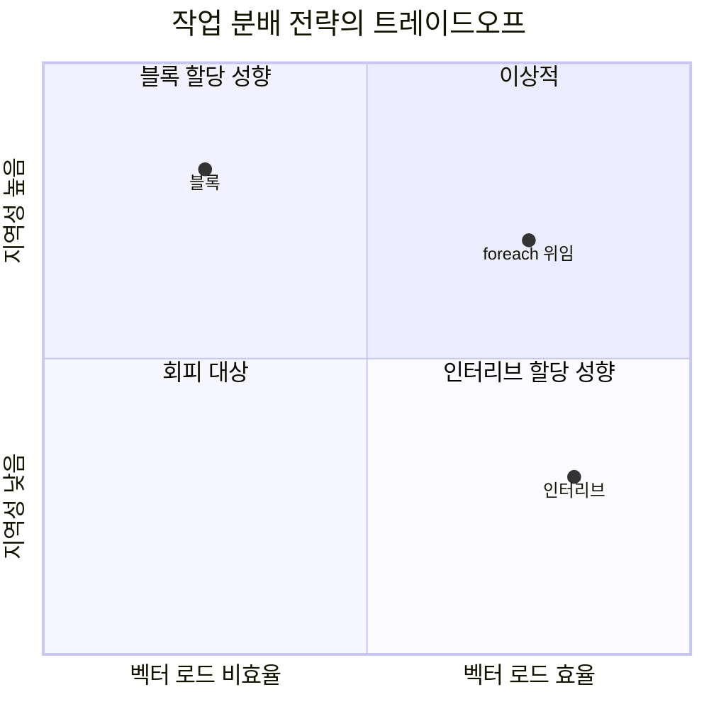

[03_multicore2-update_0416 p.85](<./pdf/03_multicore2-update_0416.pdf>)

### `foreach` — 스케줄링을 컴파일러에 위임한다

> [!info] `foreach` 의 정체
> `foreach` 는 **루프용 SIMD** 다.
>
> - **SIMD 폭의 청크(Set of Data)** 단위로 반복한다
> - 모든 SIMD 레인이 활성인 구간은 **마스킹되지 않은 Main Body**
> - 일부 레인이 비활성인 구간은 **마스킹된 Tail Body**
> - `foreach` 는 **N차원**이 될 수 있고, 각 차원은 `varying`
>
> 일반 `for` 루프와의 차이: `varying` 인덱스인 `for` 루프는 본문에서 마스킹을 사용하고,
> `uniform` 인덱스인 `for` 루프는 마스킹이 없다.

```c
export void ispc_sinx(uniform int N, uniform float* x, uniform float* y) {
    foreach (i = 0 ... N) {      // 인덱스 분배를 컴파일러에 맡긴다
        y[i] = sinx(x[i]);
    }
}
```

> [!tip] 왜 이게 좋은가
> **많은 간단한 경우, 프로그래머는 `foreach` 를 사용해 마치 순차적인 프로그램처럼 프로그램을 표현할 수 있다.**
> `programIndex` / `programCount` 를 직접 다루지 않으므로 코드가 짧아지고 오류 가능성이 줄어든다.

> [!question] `foreach` 는 어떻게 구현될 수 있는가
> 컴파일러가 고려해야 할 것: 병렬 처리 모델(SPMD), 작업 분할·할당, 메모리 접근 패턴 최적화, 제어 흐름 관리.
>
> | 구현 방식 | 장점 | 단점 |
> | :-- | :-- | :-- |
> | **정적 스케줄링** | 간단하고 효율적 | 작업 부하가 불균등하면 성능 저하 |
> | **동적 스케줄링** | 부하가 불균등해도 높은 성능 유지 | 스케줄링 오버헤드 발생 |
> | **인터리브 할당** | 메모리 접근 패턴 최적화, 캐시 효율 상승 | 데이터 의존성이 있으면 구현 복잡 |
> | **벡터화** | 데이터 수준 병렬성 극대화 | 모든 연산이 벡터화 가능한 것은 아님 |
>
> 이 표는 05강 작업 분배·스케줄링의 예고편이다.

> [!info] `foreach_active`
> **각 활성 SIMD 레인을 직렬화(serialize)** 한다.
> 용도: **atomic 연산, 커스텀 리덕션, `uniform` 함수 호출.**

---

## 9. 병렬 코드의 함정과 인스턴스 간 협력

> [!quote] 슬라이드 근거
> 덱 B p.100-107, 112-113 (덱 A에는 없는 개정본 추가분)

### 함정 1 — 쓰기 충돌과 데이터 레이스

```c
export void shift_negative(uniform int N, uniform float* x, uniform float* y) {
    foreach (i = 0 ... N) {
        if (i >= 1 && x[i] < 0)
            y[i-1] = x[i];      // 음수를 왼쪽으로 한 칸 이동
        else
            y[i] = x[i];
    }
}
```

> [!warning] The output of this program is undefined!
> `x[1]` 과 `x[2]` 가 **둘 다 음수**라면:
>
> - `i = 1` 인스턴스 → `y[0] = x[1]` 을 시도
> - `i = 2` 인스턴스 → `y[1] = x[2]` 가 아니라 `y[2-1] = x[2]`, 즉 **`y[0] = x[2]`** 를 시도
>
> 두 인스턴스가 **동시에 `y[0]` 에 쓴다.** 이것이 **데이터 레이스(Data Race)** 다.
> 여러 인스턴스가 동시에 같은 메모리 위치에 쓰면 어떤 값이 저장될지 예측할 수 없고,
> 결과가 실행할 때마다 달라지는 **정의되지 않은 동작(Undefined Behavior)** 이 된다.

### 함정 2 — 배열 합을 잘못 구하는 두 가지 방법

| 잘못된 선언 | 무엇이 문제인가 | 결과 |
| :-- | :-- | :-- |
| `float sum;` (varying) | 각 프로그램 인스턴스마다 **다른 변수**가 된다 | 여러 복사본의 `sum` 을 반환하려 하므로 **컴파일 타임 타입 오류** |
| `uniform float sum;` | 모든 인스턴스가 **동일한 변수를 공유**한다 | `x[i]` 는 인스턴스마다 값이 다르므로 어떤 값이 `sum` 에 복사될지 알 수 없다 → **컴파일 타임 타입 오류** |

올바른 방법은 **부분 합 + 리덕션** 이다.

```c
export uniform float sum_array(uniform int N, uniform float* x) {
    float partial = 0.0f;              // 인스턴스마다 개인 부분 합 (varying)
    foreach (i = 0 ... N)
        partial += x[i];               // 인스턴스 간 통신이 전혀 필요 없다
    return reduce_add(partial);        // 모든 인스턴스의 부분 합을 더해 최종 합
}
```

> [!tip] Self-test
> 슬라이드의 주석 그대로다 — *이 구현이 왜 ISPC gang 추상화의 의미를 올바르게 구현하는지 이해했다면,
> 당신은 gang 추상화를 제대로 이해한 것이다.*

### 인스턴스 간(cross program instance) 연산

| 연산 | 시그니처 | 하는 일 |
| :-- | :-- | :-- |
| `reduce_add` | `uniform int64 reduce_add(int32 x)` | gang의 모든 인스턴스 값을 더해 하나의 값으로 |
| `reduce_min` | `uniform int32 reduce_min(int32 a)` | gang의 모든 값 중 최솟값 |
| `broadcast` | `int32 broadcast(int32 value, uniform int index)` | 특정 인스턴스의 값을 모든 인스턴스에 전달 |
| `rotate` | `int32 rotate(int32 value, uniform int offset)` | 인스턴스 $i$ 의 값을 인스턴스 $(i + \text{offset}) \bmod \text{programCount}$ 로 |

### 고급 협력 — $\log_2 8 = 3$ 단계 곱 리덕션

배열 8개 원소의 곱을 **3단계**에 구하는 프로그램이다.

```c
float val1 = x[programIndex];        // 인스턴스 i는 x[i]로 초기화
float val2 = shift(val1, 1);         // 이웃 인스턴스의 값을 당겨온다

if (programIndex % 2 == 0) val1 = val1 * val2;   // x0*x1, x2*x3, x4*x5, x6*x7
val2 = shift(val1, 2);

if (programIndex % 4 == 0) val1 = val1 * val2;   // (x0..x3), (x4..x7)
val2 = shift(val1, 4);

if (programIndex % 8 == 0) { *result = val1 * val2; }   // 인스턴스 0이 최종 곱을 쓴다
```

$$T(n) = \log_2 n \quad \text{단계로 } n \text{개 원소의 리덕션 완료}$$

> [!summary] 이 예제가 말하는 것
>
> - **협력**: `programIndex` 와 인스턴스 간 통신(`shift`)으로 세분화된 협업이 가능하다
> - **효율**: 대수 시간으로 곱을 계산하는 병렬 알고리즘이라 대규모 배열에서 순차 방식보다 훨씬 빠르다
> - **낮은 수준의 제어**: ISPC는 코드가 복잡해지더라도 데이터 액세스·통신 패턴을 조율할 수 있게 해 준다

---

## 10. gang 너머 — task, 그리고 더 높은 추상화

> [!quote] 슬라이드 근거
> 덱 B p.110-116 (덱 A에는 없는 개정본 추가분)

### gang은 코어 하나짜리다

> [!warning] 지금까지 본 코드는 코어 1개만 썼다
> ISPC의 gang 추상화는 SIMD 명령어로 구현되고, 그 명령어는
> **CPU의 한 코어에서 실행되는 하나의 스레드 안에서** 작동한다.
> 즉 **이전에 실행한 모든 코드는 사실상 컴퓨터의 네 개 코어 중 단 하나에서만 돌았다.**

멀티코어를 쓰려면 ISPC의 또 다른 추상화인 **task** 가 필요하다.

| 개념 | 키워드 | 설명 |
| :-- | :-- | :-- |
| **태스크 생성** | `launch` | 여러 프로그램 인스턴스를 포함하는 작업 단위를 만든다 |
| **태스크 실행** | `launch` | 태스크가 여러 코어에서 동시에 실행된다 |
| **태스크 동기화** | `sync` | 모든 태스크가 완료될 때까지 기다린다 |

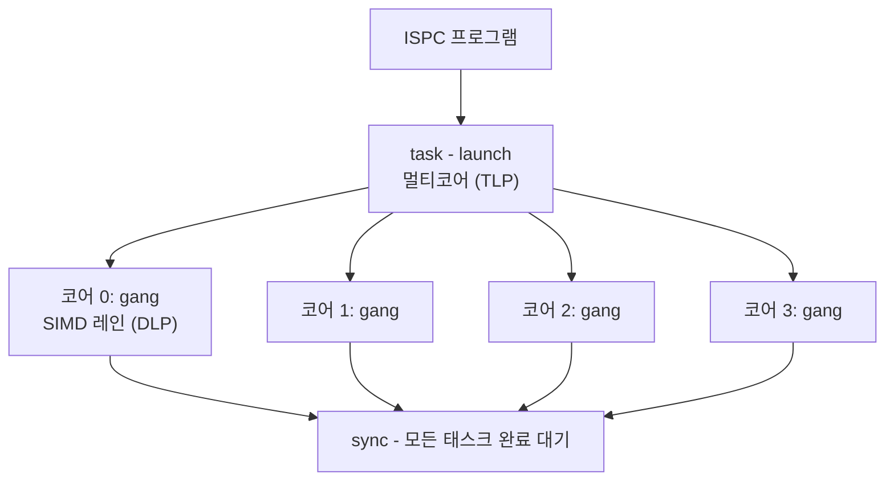

> [!tip] 02강과 연결
> **task = 아이디어 1(코어 늘리기, TLP), gang = 아이디어 2(ALU 늘리기, DLP)** 다.
> ISPC는 두 층을 서로 다른 언어 구문으로 분리해서 준다.

### 만약 ISPC가 저수준 언어가 아니라면?

`programIndex` / `programCount` 를 쓰면 병렬 실행을 세밀하게 제어할 수 있지만,
**작업을 인스턴스 간에 어떻게 분할할지 프로그래머가 명확히 생각해야 한다.**
그 세부 사항을 숨기면 어떻게 될까?

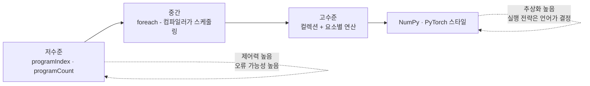

| 단계 | 프로그래머가 쓰는 것 | 컴파일러/언어가 책임지는 것 |
| :-- | :-- | :-- |
| **저수준** | `programIndex`, `programCount`로 직접 인덱스 계산 | SIMD 명령어 생성만 |
| **중간** | `foreach` | 병렬 루프의 실행 방식(스케줄링) 전체 |
| **고수준** | 컬렉션과 **요소별 연산 함수** | 데이터 저장·접근 방식, 병렬 적용 전략 전부 |

> [!note] 고수준 모델의 정체
> 배열 인덱싱 자체를 없애고, 프로그래머는 **단일 요소에 대해 동작하는 함수**만 정의한다.
> 그러면 언어가 그 함수를 컬렉션의 모든 요소에 자동으로 병렬 적용한다.
> 슬라이드는 이 모델이 **NumPy와 PyTorch가 작동하는 방식과 매우 유사**하다고 짚는다.
>
> 다만 대가가 있다. 컴파일러가 병렬 실행 최적화와 스케줄링을 더 많이 떠맡게 되고,
> **아직까지 성능 최적화에는 문제가 있다**는 것이 슬라이드의 솔직한 평가다.

### 강의 요약

> [!summary] 두 문장으로 압축된 결론
> **① 프로그래밍 모델은 "생각하는 방법"이다.**
> 병렬 프로그램 구성에 대해 생각할 수 있는 프레임워크를 제공한다.
> 건물의 건축 청사진 같은 것이다 — 벽돌 하나하나를 어떻게 놓을지는 안 알려 주지만
> 전체 설계(방의 위치, 배관의 위치)를 알려 준다.
>
> **② 추상화는 여러 가지 유효한 구현을 허용한다.**
> 자동차 핸들처럼, 기어와 링키지가 어떻게 작동하는지 몰라도 쓸 수 있다.
> `foreach` 나 `map` 같은 추상화는 하드웨어가 어떻게 실행해야 하는지 지정하지 않고도 병렬성을 표현하게 해 준다.
> 그래서 같은 `map` 이 SIMD 명령어로도, 멀티코어 처리로도 구현될 수 있다.

---

## 핵심 정리

| 개념 | 한 줄 정의 | 왜 중요한가 |
| :-- | :-- | :-- |
| **Latency vs Throughput** | 한 건이 끝나는 시간 vs 단위 시간당 끝나는 건수 | 차선 추가(병렬화)는 처리량만 늘리고 지연은 그대로 |
| **파이프라이닝** | 단계별 유닛을 겹쳐 돌려 자원 추가 없이 처리량을 올리는 기법 | "클럭당 1 연산"은 지연이 아니라 처리량이라는 사실의 근거 |
| **Co-issue** | 독립적인 ADD와 LD를 같은 사이클에 함께 발행 | ILP를 실제 하드웨어에서 쓰는 방식, 3클럭을 2클럭으로 |
| **메모리 대역폭 병목** | 연산 능력은 남는데 데이터 공급이 못 따라가는 상태 | V100조차 요소별 곱에서 효율 1% 미만 |
| **연산 강도** | 메모리 접근 1회당 수행하는 연산의 양 | 이걸 올리는 것이 대역폭 병목의 유일한 근본 해법 |
| **추상화 vs 구현** | 프로그래밍 모델의 의미 vs 하드웨어의 실제 동작 | 같은 코드가 스칼라/SIMD/멀티스레드로 다르게 실행됨 |
| **SPMD** | 하나의 프로그램이 여러 데이터에 동시 실행되는 모델 | ISPC의 추상화 계층 |
| **gang** | 같은 코드를 서로 다른 데이터에 동시 실행하는 인스턴스 팀 | 인스턴스 수 = 하드웨어 SIMD 폭 또는 그 작은 배수 |
| **`uniform` / `varying`** | 모든 인스턴스가 같은 값 / 인스턴스마다 다른 값 | 정확성이 아니라 최적화를 위한 구분 |
| **인터리브 할당** | 라운드 로빈으로 반복을 인스턴스에 분배 | 패킹된 벡터 로드가 가능해 SIMD에 유리 |
| **블록 할당** | 연속 구간을 인스턴스별로 통째로 할당 | 참조 지역성과 논리 단순성은 좋지만 gather가 필요 |
| **`foreach`** | 스케줄링을 컴파일러에 위임하는 SIMD 루프 | 마스킹되지 않은 main body + 마스킹된 tail body |
| **`reduce_add`** | gang 전체의 부분 합을 하나로 합치는 인스턴스 간 연산 | 배열 합을 올바르게 구하는 유일한 방법 |
| **task / `launch`** | 여러 코어에서 동시에 실행되는 작업 단위 | gang은 코어 1개짜리, 멀티코어는 task가 담당 |

> [!question]- 스스로 점검
> **Q1.** 고속도로에서 "속도 증가"와 "차선 추가"는 둘 다 처리량을 2배로 만든다. 무엇이 다른가?
> **A1.** 속도 증가는 지연 시간도 줄이지만, 차선 추가는 **지연 시간을 전혀 줄이지 않는다.**
> 멀티코어·SIMD·멀티스레딩은 전부 차선 추가 쪽이다.
>
> **Q2.** "코어가 클럭당 하나의 연산을 수행한다"는 말은 무슨 뜻인가?
> **A2.** **지연 시간이 아니라 명령어 처리량**을 뜻한다. 4단계 파이프라인이라면 명령어 1개의 지연은 4 cycles이지만,
> 파이프라인이 채워지면 사이클당 1개가 완료된다. 실제 CPU는 최대 20단계까지 간다.
>
> **Q3.** V100이 요소별 벡터 곱에서 1% 미만의 효율을 내는 이유는?
> **A3.** MUL 1회당 12바이트의 메모리 연산이 필요하고, 5120 MUL/clock @1.6GHz를 다 먹이려면 약 98 TB/s가 필요한데
> HBM2가 제공하는 것은 900 GB/s뿐이다. **완전히 대역폭에 묶인(bandwidth-limited) 계산**이다.
>
> **Q4.** ISPC의 `uniform` 키워드를 빼면 프로그램이 틀리는가?
> **A4.** 아니다. 슬라이드가 명시하듯 **`uniform` 의 사용은 순전히 최적화를 위한 것이고 정확성에 필요하지 않다.**
> 다만 컴파일러가 스칼라 레지스터를 쓸 기회를 잃는다.
>
> **Q5.** 인터리브 할당이 블록 할당보다 SIMD에 유리한 이유는?
> **A5.** 데이터가 메모리에 순차 배치되어 있으면, 인터리브 할당에서는 **하나의 "패킹된 벡터 로드"**
> (`_mm256_load_ps`)로 gang 전체의 데이터를 한 번에 가져올 수 있다.
> 블록 할당은 인스턴스마다 멀리 떨어진 주소를 읽어야 해서 `_mm256_i32gather_ps` 같은 gather가 필요하다.
>
> **Q6.** `foreach` 안에서 `y[i-1] = x[i];` 를 쓰면 왜 결과가 정의되지 않는가?
> **A6.** 여러 반복이 **같은 메모리 위치에 동시에 쓸 수 있기** 때문이다.
> `x[1]`, `x[2]` 가 모두 음수면 `i=1` 인스턴스와 `i=2` 인스턴스가 둘 다 `y[0]` 에 쓴다. 데이터 레이스다.
>
> **Q7.** `float sum;` 과 `uniform float sum;` 둘 다 배열 합 계산에 실패한다. 각각의 이유는?
> **A7.** 전자는 인스턴스마다 다른 변수라 여러 복사본을 반환하려다 타입 오류가 나고,
> 후자는 모든 인스턴스가 공유하는데 `x[i]` 가 인스턴스마다 달라 어떤 값이 들어갈지 정의되지 않아 타입 오류가 난다.
> 정답은 인스턴스별 `partial` 합 + `reduce_add(partial)` 이다.
>
> **Q8.** ISPC에서 gang과 task는 각각 02강의 어떤 아이디어에 대응하는가?
> **A8.** **gang = 아이디어 2(코어 안의 ALU 늘리기, DLP)**, **task = 아이디어 1(코어 늘리기, TLP)** 이다.
> gang만 쓴 코드는 멀티코어 머신에서도 코어 하나만 사용한다.

## 슬라이드 근거

| 섹션 | 덱 B `03_multicore2-update_0416.pdf` | 덱 A `03_multicore2-ispc_update.pdf` |
| :-- | :-- | :-- |
| 1. 지연 시간과 처리량 | p.6-8 | p.6-8 |
| 2. 파이프라이닝 | p.11-14, 27 | p.11-14, 27 |
| 3. 대역폭이 임계 자원 | p.16-26 | p.16-26 |
| 4. 추상화 vs 구현 | p.28-39 | p.28-39 |
| 5. SIMD 기본 원리와 C 구현 | p.42-48, 59 | p.42-48, 58 |
| 6. SIMD의 도전과 발전 방향 | p.62-67 | p.61-66 |
| 7. ISPC와 gang 추상화 | p.36-38, 73-74, 81-88 | p.36-38, 72-73, 78-81 |
| 8. 인터리브 vs 블록, `foreach` | p.75-76, 85-99 | p.74-75, 79-80, 88 |
| 9. 함정과 인스턴스 간 협력 | p.100-107, 112-113 | 해당 슬라이드 없음 |
| 10. task와 더 높은 추상화 | p.110-111, 114-116 | 해당 슬라이드 없음 |

## 관련 노트

- [02. 병렬 컴퓨터의 기본 아키텍처](<./02. 병렬 컴퓨터의 기본 아키텍처.md>) — gang/task가 대응하는 세 가지 하드웨어 아이디어
- [01. 왜 병렬 처리인가](<./01. 왜 병렬 처리인가.md>) — "데이터 이동이 곧 비용"이라는 이 강의의 전제
- [04. 병렬 프로그래밍 기본](<./04. 병렬 프로그래밍 기본.md>) — 추상화 vs 구현 논의의 직접적인 후속
- [05. 성능 최적화 I - 작업 분배와 스케줄링](<./05. 성능 최적화 I - 작업 분배와 스케줄링.md>) — 8절 `foreach` 구현 선택지(정적/동적 스케줄링)의 본편
- [06. 지역성·통신·경합](<./06. 지역성·통신·경합.md>) — 3절 대역폭·지역성 논의의 본편
