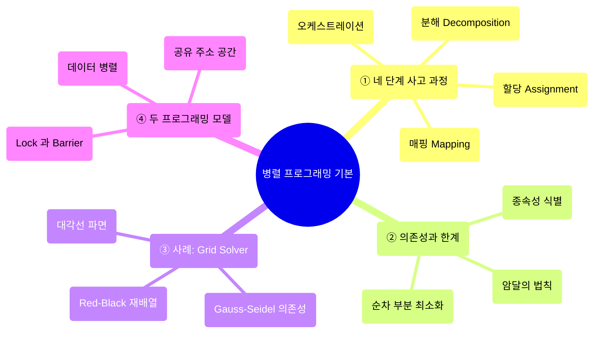
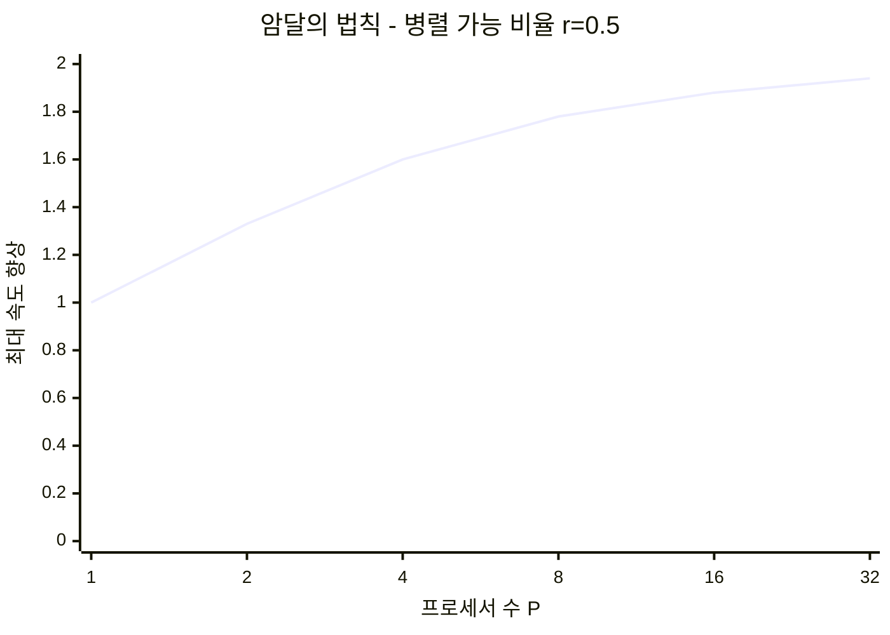
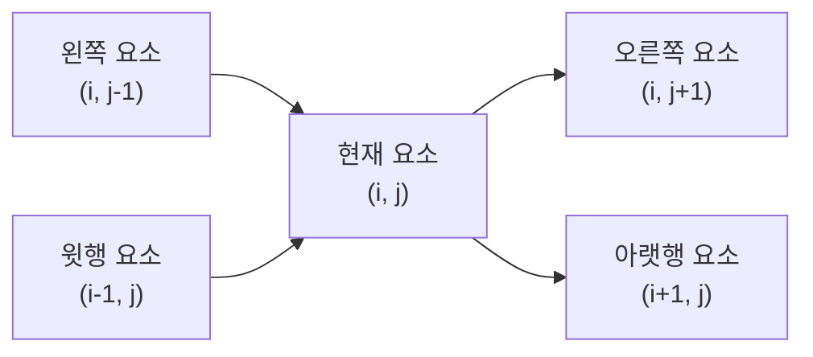
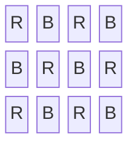
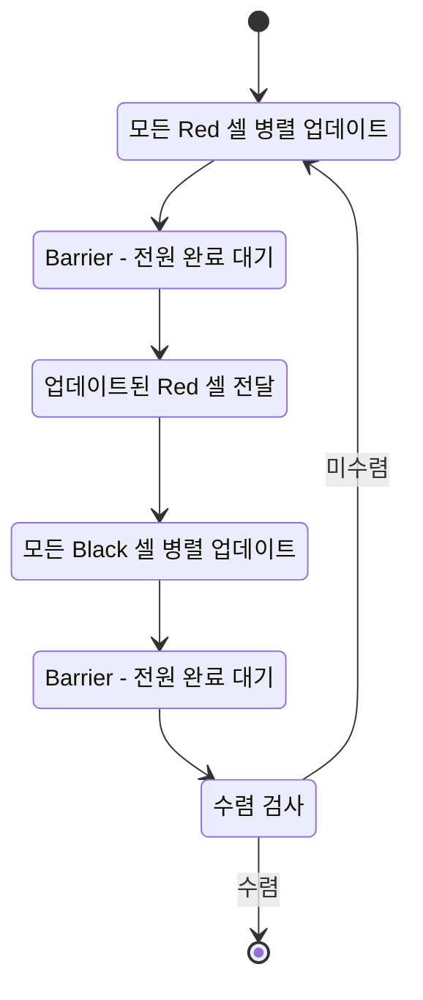
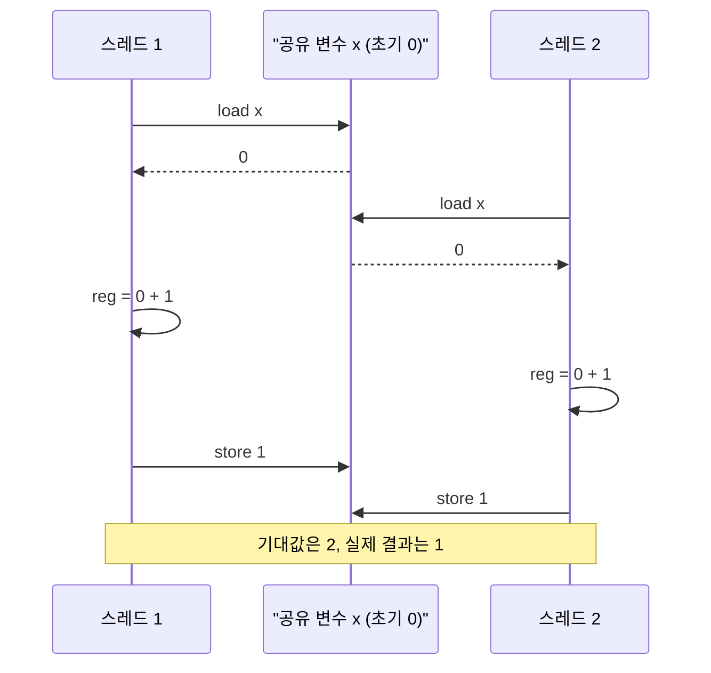

---
aliases:
  - Parallel Programming 기본
  - 병렬 프로그래밍 기본
authority: primary
course: parallel-distributed-computing
created: '2025-04-28'
date: '2025-04-28'
review_state: active
semester: '3-1'
source: pdf/04_Parallel Programming 기본.pdf
source_pages: 58
source_sha256: fbe76a6cdca38748
source_type: lecture-slides
status: draft
tags:
  - lecture
  - systems
  - distributed
title: 04. 병렬 프로그래밍 기본
type: lecture
updated: '2026-08-28'
---

source:: `pdf/04_Parallel Programming 기본.pdf` (58p)

# 04. 병렬 프로그래밍 기본

> [!abstract] 한 줄 요약
> 병렬 프로그램을 만든다는 것은 **분해 → 할당 → 오케스트레이션 → 매핑**의 네 결정을 내리는 일이고,
> 이 모든 결정의 출발점이자 상한선은 **의존성(dependency)** 이다.
> 의존성이 남긴 순차 부분은 암달의 법칙으로 속도 향상을 묶어버리므로,
> 병렬화의 핵심 기술은 결국 **의존성을 찾아내고, 가능하면 재배열해서 깨뜨리는 것**이다.

## 이 강의의 지도



---

## 1. 병렬 프로그램을 만든다는 것

> [!quote] 슬라이드 근거
> `pdf/04_Parallel Programming 기본.pdf` p.2-4, 13, 58

> [!info] 정의
> **병렬 프로그래밍**은 하나의 문제를 놓고 여러 작업을 동시에 수행해 문제를 푸는 프로그램을 만드는 것이다.
> 그런데 강의가 강조하는 진짜 주제는 "병렬로 만들기"가 아니라 **빠르고 효율적으로 만들기**,
> 즉 낭비되는 시간과 자원을 줄이는 **최적화**다.

병렬 프로그램을 쓸 때 우리가 실제로 결정하는 것은 네 가지다.


| 단계 | 결정하는 것 | 누가 책임지는가 |
| :-- | :-- | :-- |
| **분해** | 문제를 어떤 단위의 독립 작업으로 쪼갤 것인가 | 대부분 **프로그래머** |
| **할당** | 쪼갠 작업을 어느 작업자(worker)에게 줄 것인가 | 프로그래머 또는 **언어 런타임** |
| **오케스트레이션** | 통신·동기화·자료구조·스케줄링을 어떻게 조율할 것인가 | 프로그래머 (머신 특성에 크게 의존) |
| **매핑** | 실행 단위를 물리 자원에 어떻게 얹을 것인가 | **OS · 컴파일러 · 하드웨어** |

> [!info] 목표는 하나가 아니다
> 공통 목표는 **속도 향상(speedup) 극대화**지만, 그 외에도
> 높은 효율성(비용·면적·전력)을 달성하거나, **한 대의 컴퓨터로는 풀 수 없는 더 큰 문제를 푸는 것**도
> 병렬화의 정당한 목적이다.

---

## 2. 분해 — 의존성이 상한선을 정한다

> [!quote] 슬라이드 근거
> `pdf/04_Parallel Programming 기본.pdf` p.6-13, 15-16, 58

### 분해의 목표와 진짜 과제

분해의 목표는 단순하다. **머신의 모든 실행 유닛을 놀리지 않을 만큼 충분한 작업을 만드는 것.**
하지만 실제 어려움은 개수가 아니라 **의존성 식별**에 있다.
의존성이 없거나 적은 작업을 찾아내는 것이 분해의 핵심 과제다.

> [!warning] 자동 병렬화는 아직 마법이 아니다
> 순차 프로그램의 **자동 분해(자동 병렬화)** 는 여전히 열린 연구 문제다.
> 컴파일러가 프로그램을 분석해 의존성을 식별해야 하는데,
> **의존성이 데이터에 따라 결정되는 경우 컴파일 시점에는 알 수 없다.**
> 단순한 루프 중첩에서는 소소한 성공이 있었지만, 복잡한 범용 코드를 위한
> "마법의 병렬화 컴파일러"는 아직 없다. 그래서 분해는 대부분 프로그래머의 몫이다.

### 분해의 두 가지 유형

| 유형 | 내용 | 잘 맞는 상황 |
| :-- | :-- | :-- |
| **작업 분해 (task decomposition)** | 전체 문제를 **기능적으로 독립적인** 여러 작업으로 나눔. 작업 간 의존성이 거의 또는 전혀 없음 | 서로 다른 종류의 일이 동시에 돌아가는 구조 |
| **데이터 분해 (data decomposition)** | 데이터를 여러 부분으로 나누고 각 처리 장치가 자기 몫의 데이터를 처리 | **동일한 연산이 대량의 데이터에 반복**될 때 |

가장 흔한 실전 형태는 **루프 반복을 통한 분해**다. 반복(iteration)을 작업 단위로 보고
스레드에 정적으로 나눠 주거나 인터리브 방식으로 배분한다.

### 간단한 예 — 2단계 이미지 계산

$N \times N$ 이미지에 두 단계를 수행한다고 하자.

| 단계 | 하는 일 | 병렬성 |
| :-- | :-- | :-- |
| 1단계 | 모든 픽셀의 밝기에 상수를 곱함 | 각 픽셀이 **완전히 독립** |
| 2단계 | 모든 픽셀 값의 평균 계산 | 전역 합산 → 축약(reduction) 필요 |

순차 구현은 두 단계 모두 $N^2$ 시간이므로 총 $2N^2$ 이다.

> [!example] 첫 시도 — 2단계를 그냥 순차로 두면
> $$T_{\text{naive}} = \frac{N^2}{P} + N^2$$
> 1단계는 $P$배 빨라지지만 2단계가 통째로 남는다. $P$를 아무리 키워도 $N^2$ 아래로는 못 내려간다.
>
> **개선 — 부분 합을 병렬로 구하고 결과만 순차 결합**
> $$T_{\text{better}} = \frac{N^2}{P} + P$$
> 남는 $P$ 항이 **병렬 알고리즘의 오버헤드**(부분 합계 결합)다.
> 병렬화가 공짜가 아니라 "순차 부분을 오버헤드와 맞바꾸는 일"임을 보여주는 예다.

### 암달의 법칙

> [!info] 정의
> 프로그램에서 본질적으로 순차 실행되어야 하는 작업의 비율을 $s = 1 - r$ 이라 할 때,
> 프로세서 $p$개로 얻을 수 있는 **최대 속도 향상**은
> $$S(p) = \frac{1}{(1 - r) + \dfrac{r}{p}}$$
> 여기서 $r$ 은 병렬화 가능한 비율이다.

> [!example] 강의의 계산 예
> $r = 0.5$, $p = 4$ 이면
> $$S = \frac{1}{1 - 0.5 + \frac{0.5}{4}} = \frac{1}{0.625} = 1.6$$
> 절반을 병렬화하고 프로세서를 4배 넣었는데 겨우 **1.6배**다.



곡선이 $1/s = 2$ 에 붙어 평평해진다. **순차 부분이 남아 있는 한 프로세서를 늘려도 소용이 없다.**

> [!warning] 슈퍼컴퓨터도 예외가 아니다
> 강의는 수백만 개의 연산을 동시에 수행할 수 있는 슈퍼컴퓨터를 예로 든다.
> 그런 기계라도 프로그램의 일부가 순차적으로 실행되어야 한다면,
> 최대 속도 향상은 **그 순차 부분에 의해 그대로 묶인다.**
> 그래서 병렬 프로그램을 작성할 때는 **순차 실행 부분을 최소화하는 것이 최우선**이다.

---

## 3. 할당 — 작업을 작업자에게 나눠 주기

> [!quote] 슬라이드 근거
> `pdf/04_Parallel Programming 기본.pdf` p.14-18

> [!info] 정의
> **할당(assignment)** 은 분해된 하위 작업 또는 데이터를 **어떤 처리 장치**(스레드·프로세스 등)가
> 처리할지 결정하는 과정이다. 목표는 두 가지 — **워크로드 균형 달성**과 **통신 비용 절감**.

| 방식 | 결정 시점 | 특징 |
| :-- | :-- | :-- |
| **정적 할당 (static)** | 프로그램 실행 전 (컴파일 시점 또는 시작 시점) | 각 스레드가 담당할 범위가 고정. 런타임 오버헤드가 거의 없음 |
| **동적 할당 (dynamic)** | 프로그램 실행 중 | 시스템 부하 상태·작업 완료 상황을 보고 실시간으로 재배분 |

> [!example] 정적 할당의 전형적인 모습
>
> ```c
> // 배열의 전반부는 스폰된 스레드, 후반부는 메인 스레드가 담당
> void* worker(void* arg) {
>     for (int i = 0; i < N/2; i++)
>         work(x[i]);
>     return NULL;
> }
>
> pthread_create(&tid, NULL, worker, NULL);
> for (int i = N/2; i < N; i++)   // 메인 스레드 몫
>     work(x[i]);
> pthread_join(tid, NULL);
> ```
>
> 루프 반복을 **블록 단위로 스레드에 나눠 주는** 프로그래머 관리 정적 할당이다.

> [!tip] 동적 할당의 전형적인 모습 — 스레드 풀
> 런타임이 **워커 스레드 풀**을 유지하고, 프로그래머에게는 보이지 않게 작업을 배분한다.
> 구현은 의외로 단순하다. **현재 작업을 끝낸 워커 스레드가 스스로 작업 목록을 검사하고,
> 아직 끝나지 않은 다음 작업을 자기 자신에게 할당한다.**
> 이 구조의 성능 특성은 [05. 성능 최적화 I](<./05. 성능 최적화 I - 작업 분배와 스케줄링.md>)에서 본격적으로 다룬다.

> [!note] 보충 — 추상화와 구현은 다르다
> 슬라이드는 "추상화는 동적 할당을 위한 여지를 남기지만 **현재 구현은 정적**"이라고 지적한다.
> 즉 언어가 `foreach` 같은 문법으로 할당을 시스템에 맡기더라도,
> 그 시스템이 실제로 동적으로 배분하는지는 구현에 달린 별개의 문제다.

---

## 4. 오케스트레이션과 매핑

> [!quote] 슬라이드 근거
> `pdf/04_Parallel Programming 기본.pdf` p.20-22

> [!info] 정의
> **오케스트레이션(orchestration)** 은 분해된 하위 작업들이 **올바른 순서와 방식으로 실행되도록**
> 조정·관리하는 과정이다. 분해가 "작게 나누는 일"이라면, 오케스트레이션은
> 나눠진 조각들이 전체 문제를 풀기 위해 **어떻게 협력하고 상호작용할지 설계하고 제어하는 일**이다.

오케스트레이션이 실제로 하는 일:

- 커뮤니케이션 구조화
- 의존성 보존을 위한 **동기화 추가**
- 메모리 내 데이터 구조 구성
- 작업 스케줄링

목적은 **통신·동기화 비용 절감, 데이터 참조의 지역성 보존, 오버헤드 감소**다.

> [!warning] 머신 세부 사항이 설계를 바꾼다
> 오케스트레이션의 결정은 하드웨어 특성에 크게 좌우된다.
> 예를 들어 **동기화 비용이 비싼 머신이라면 프로그래머는 동기화를 더 드물게 쓰도록** 알고리즘을 고친다.
> "좋은 병렬 코드"는 기계와 독립적으로 존재하지 않는다.

### 매핑 — 실행 단위를 하드웨어에 얹기

| 매핑 주체 | 예시 |
| :-- | :-- |
| **운영체제** | 스레드를 코어의 실행 컨텍스트에 매핑 |
| **컴파일러** | 프로그램 인스턴스를 **벡터 명령어 레인**에 매핑 |
| **하드웨어** | 스레드 블록을 GPU 코어에 매핑 (GPU 강의에서 다룸) |

> [!tip] 매핑에서 나오는 흥미로운 선택지
>
> - **관련 있는 스레드를 같은 코어에** 배치 → 지역성·데이터 공유 최대화, 통신·동기화 비용 최소화
> - **관련 없는 스레드를 같은 코어에** 배치 → 하나는 대역폭 제한적이고 다른 하나는 연산 제한적이라면
>   자원이 겹치지 않아 머신을 더 효율적으로 사용할 수 있다

---

## 5. 사례 연구 — Grid Solver와 Red-Black 재배열

> [!quote] 슬라이드 근거
> `pdf/04_Parallel Programming 기본.pdf` p.24-36

### 문제 설정

격자(grid) 위에서 **편미분 방정식(PDE)** 을 푸는 문제다. 해법은 반복 알고리즘으로,
**수렴할 때까지 그리드 전체에 대해 가우스-자이델 스윕(Gauss-Seidel sweep)을 반복**한다.
물리 시뮬레이션, 이미지 처리, 유한 차분법 기반 PDE 해법 등 광범위한 분야에서 같은 구조가 나온다.
공통 특징은 **각 격자점의 값을 주변 격자점 값으로 계산**한다는 점이다.

> [!info] Gauss-Seidel / SOR 기법
> 대규모 선형 연립방정식을 푸는 **반복법** 중 하나로, 라플라스·푸아송 방정식 같은
> 타원형 PDE 문제에서 자주 등장한다.
> 기본 아이디어는 미지수 $x_i$ 를 업데이트할 때 **같은 반복 단계에서 이미 계산된 최신 값**과
> 이전 반복 단계의 값을 함께 사용하는 것이고, 수렴 속도를 높이려고 **이완 계수(relaxation factor)** 를 쓴다.

### 왜 병렬화가 어려운가 — 데이터 의존성

$$x_i^{(k+1)} \;=\; f\!\left(x_1^{(k+1)}, \dots, x_{i-1}^{(k+1)},\; x_{i+1}^{(k)}, \dots\right)$$

$j < i$ 인 항이 $x^{(k+1)}$ 을 참조하기 때문에, $x_i^{(k+1)}$ 을 계산하려면
$x_1^{(k+1)}, \dots, x_{i-1}^{(k+1)}$ 이 **순차적으로 먼저 계산되어야** 한다.
이것이 표준 Gauss-Seidel을 직접 병렬화하기 어렵게 만드는 주된 이유다.

2차원 격자로 보면 의존성은 이렇게 생겼다.



**각 행 요소는 왼쪽 요소에 종속되고, 각 행은 이전 행에 종속된다.**
(주의: 이 의존성은 한 번의 스윕 안에서의 그리드 요소 간 데이터 의존성이다.)

### 첫 번째 아이디어 — 대각선 파면

의존성을 따라가 보면 **대각선(anti-diagonal) 위의 셀들끼리는 서로 독립**이다.

| 평가 | 내용 |
|:--|:--|
| **좋은 점** | 병렬성이 실제로 존재한다. 대각선 단위로 셀을 작업으로 쪼개 병렬 업데이트한 뒤 다음 대각선으로 이동 |
| **나쁜 점** | 독립 작업을 활용하기 어렵다. **계산의 시작과 끝에서는 대각선이 짧아 병렬성이 거의 없고**, 대각선 하나가 끝날 때마다 **동기화가 잦다** |

### 두 번째 아이디어 — Red-Black 재배열

> [!info] Red-Black 채색
> 격자점을 **체스판처럼 두 색으로 번갈아 칠한다.**
> 2차원 격자에서 좌표 $(i, j)$ 에 대해 $i + j$ 가 짝수면 Red, 홀수면 Black (혹은 그 반대).
>
> **핵심 속성**: Red 격자점의 직접 이웃(상하좌우)은 **모두 Black**이고,
> Black 격자점의 직접 이웃은 **모두 Red**다.



이 성질 덕분에 의존성이 **색 단위로 깔끔하게 분리**된다.

| 단계 | 업데이트 대상 | 참조하는 값 | 병렬성 |
| :-- | :-- | :-- | :-- |
| 1 | 모든 **Red** 점 | 이웃한 Black 점 = **이전 반복 단계 $k$ 의 값** | 모든 Red 점이 서로 독립 → 완전 병렬 |
| 2 | 모든 **Black** 점 | 이웃한 Red 점 = **방금 계산된 $k+1$ 단계 값** | 모든 Black 점이 서로 독립 → 완전 병렬 |



> [!tip] 이 사례의 교훈
> Red-Black은 알고리즘의 **결과를 바꾸지 않으면서 순회 순서만 재정렬**해 의존성을 깨뜨린 것이다.
> "병렬화가 안 되는 알고리즘"을 만났을 때 첫 번째로 물어볼 질문은
> **"의존성을 없앨 수 있는 다른 순회 순서가 있는가?"** 다.

### 그래도 남는 문제 — 어떻게 나눠 줄 것인가

Red-Black으로 병렬성을 얻었어도, 격자를 프로세서에 나누는 방식에 따라 성능이 달라진다.

| 기준 | **블록 할당 (Block)** | **인터리빙 할당 (Interleaved / Cyclic)** |
| :-- | :-- | :-- |
| 개념 | 격자를 연속된 큰 덩어리로 나눠 각 덩어리를 한 프로세서에 할당 | 행(또는 열)을 카드 나누듯 순환적으로 여러 프로세서에 배분 |
| 데이터 지역성 | 담당 데이터가 메모리에 **모여 있어 캐시에 유리** | 데이터가 **흩어져 있어 캐시에 불리** |
| 부하 균형 | 특정 영역에 계산이 몰리면 불균형 발생 | 잘게 흩어 놓으므로 **부하가 비교적 균등** |
| 통신 | 주로 **블록 경계(edge)** 데이터에서만 통신 발생 | 인접 데이터 처리를 위해 **더 많고 더 잦은 통신** 필요 |

> [!important] 블록 할당이 이기는 이유
> 매 반복마다 프로세서 간에 전송해야 하는 데이터는 **경계에 있는 셀**이다.
> 블록 할당을 쓰면 경계 길이가 짧아져 **프로세서 간 통신량이 줄어든다.**
> 이 "표면적 대 부피 비율" 논리는
> [06. 지역성·통신·경합](<./06. 지역성·통신·경합.md>)에서 본격적으로 정량화된다.

원본 도해(블록 vs 인터리빙 할당의 통신량 비교)는 아래 페이지에서 직접 확인할 수 있다.

[04_Parallel Programming 기본 p.36](<./pdf/04_Parallel Programming 기본.pdf>)

한 반복의 전체 흐름은 다음과 같다. 각 단계 사이에 **배리어**가 들어간다.

1. Red 셀 업데이트를 병렬로 수행
2. 모든 프로세서가 업데이트 완료까지 대기 (배리어)
3. 업데이트된 Red 셀을 다른 프로세서에 전달
4. Black 셀 업데이트를 병렬로 수행
5. 모든 프로세서가 업데이트 완료까지 대기 (배리어)
6. 업데이트된 Black 셀을 전달 → 수렴할 때까지 반복

---

## 6. 프로그램을 바라보는 두 가지 방법

> [!quote] 슬라이드 근거
> `pdf/04_Parallel Programming 기본.pdf` p.37-57

같은 Grid Solver를 두 가지 프로그래밍 모델로 쓸 수 있다.

### 6-1. 데이터 병렬 모델

> [!info] 정의
> **대규모 데이터 집합에 동일한 연산을 동시에 적용**하는 데 초점을 맞춘 패러다임.
> 프로그래머는 주로 **데이터와 그 데이터에 적용할 연산**을 정의하고,
> 그것을 여러 처리 장치에 분산시켜 병렬 실행하는 일은 **시스템(컴파일러·런타임)** 이 담당한다.

```c
// 의사 코드 — Red 셀만 표시
for_all (red cells (i,j)) {
    float prev = A[i][j];
    A[i][j] = 0.2f * (A[i-1][j] + A[i][j-1] + A[i][j]
                    + A[i][j+1] + A[i+1][j]);
    reduceAdd(diff, abs(A[i][j] - prev));
}
// for_all 의 끝에는 암시적 대기(배리어)가 있다
```

| 요소 | 의미 |
| :-- | :-- |
| `for_all (red cells (i,j))` | 지정된 데이터 요소 집합 전체에 대해 블록 `{...}` 을 **병렬로 실행하라**는 뜻. 이론적으로 모든 Red 셀 업데이트가 동시에 일어날 수 있다 |
| 개별 그리드 요소 처리 | 서로 **독립적인 작업**으로 구성되어 있다는 것이 이 모델이 성립하는 전제 |
| `for_all` 의 끝 | 순차 제어로 돌아가기 전에 **모든 병렬 작업을 암시적으로 대기**한다 |
| `reduceAdd` | 여러 데이터 조각에 걸친 합산 같은 복잡한 통신 패턴을 위한 **내장 함수**. 시스템이 효율적으로 처리 |

### 6-2. 공유 주소 공간 모델

> [!info] 정의
> 컴퓨터 시스템의 **메인 메모리를 모든 프로세서 코어와 스레드가 함께 공유**하는 환경.
> 여러 스레드가 배열 `A` 나 변수 `diff` 처럼 동일한 메모리 위치의 데이터를 직접 읽고 쓴다.
> 마치 여러 사람이 하나의 큰 칠판에 같이 글을 쓰고 읽는 것과 비슷하다.
>
> - **통신** = 공유 메모리에 값을 쓰고 읽는 것 (메모리 load/store에 내재)
> - **동기화** = 프로그래머가 **명시적으로** 관리해야 하는 것

실행 모델은 **SPMD**다. 여러 스레드가 **동일한 프로그램 코드**를 실행하되,
각 스레드가 자신만의 고유 ID(`threadId`)를 갖고 **그 ID로 자기가 처리할 데이터 영역을 계산**한다.

```c
int n;                 // 그리드 크기
bool done = false;     // 계산 종료 플래그 (전역, 모든 스레드 접근 가능)
float diff = 0.0f;     // 반복 단계의 총 변화량
LOCK myLock;           // diff 접근 보호용
BARRIER myBarrier;     // 스레드 동기화 장벽

void solve(float* A) {
    // threadId 값은 인스턴스마다 다르다 → 담당할 행 범위를 계산
    int threadId    = getThreadId();
    int myMin       = 1 + (threadId * n / NUM_PROCESSORS);
    int myMax       = myMin + (n / NUM_PROCESSORS);

    while (!done) {
        float myDiff = 0.0f;               // 스레드 지역 부분 합
        diff = 0.0f;
        barrier(&myBarrier, NUM_PROCESSORS);

        for (int i = myMin; i < myMax; i++)
            for (int j = 1; j < n - 1; j++) {
                float prev = A[i][j];
                A[i][j] = 0.2f * (A[i-1][j] + A[i][j-1] + A[i][j]
                                + A[i][j+1] + A[i+1][j]);
                myDiff += fabs(A[i][j] - prev);   // 지역 누적
            }

        lock(&myLock);   diff += myDiff;   unlock(&myLock);  // 스레드당 한 번만
        barrier(&myBarrier, NUM_PROCESSORS);
        if (diff / (n * n) < TOLERANCE) done = true;
        barrier(&myBarrier, NUM_PROCESSORS);
    }
}
```

> [!tip] 슬라이드가 던지는 성능 질문의 답
> 처음 구현은 `diff` 를 **루프 반복마다** 락으로 보호하며 갱신했다.
> 이러면 임계 영역 진입이 $O(n^2)$ 번 일어난다.
> 위 코드처럼 **로컬 변수 `myDiff` 에 부분 합을 누적한 뒤 반복 끝에서 한 번만 합치면**,
> 락 획득이 **스레드당 한 번**으로 줄어든다.
> 이것이 강의가 말하는 "로컬 부분 합으로 성능 개선"이다.

### 6-3. 왜 동기화가 필요한가 — 경쟁 상태

> [!info] 정의
> 여러 스레드가 **순서에 상관없이** 공유 변수에 접근하면 예상치 못한 결과가 나온다.
> 이를 **경쟁 상태(race condition)** 라고 한다.

`x++` 한 줄은 실제로 세 단계다.

1. 메모리에서 `x` 의 값을 레지스터로 읽어온다
2. 레지스터 값에 1을 더한다
3. 레지스터 값을 메모리의 `x` 에 쓴다



> [!warning] 이것이 경쟁 상태다
> 두 스레드가 각각 1씩 더했으므로 최종 `x` 는 2가 되어야 한다.
> 그런데 실행 순서에 따라 **1이 되어버린다.**
> 이 세 개의 명령어 집합은 **원자적(atomic)** 이어야 한다.

### 6-4. Lock과 Barrier

> [!info] 원자성을 보존하는 메커니즘
> 강의가 제시하는 세 가지:
>
> 1. **임계 영역 주변의 뮤텍스 lock / unlock**
> 2. 일부 언어가 제공하는 **`atomic` 코드 블록** (최고 수준 지원)
> 3. **하드웨어가 지원하는 원자적 read-modify-write 연산**

```c
lock(myLock);        // 획득
x = x + 1;           // 임계 영역 — 공유 변수 접근
unlock(myLock);      // 해제
```

이렇게 하면 실행 순서가 보장된다.

1. 스레드 1이 lock을 획득
2. 스레드 1이 `x` 를 읽고 1을 더해 쓴다
3. 스레드 1이 lock을 해제
4. 스레드 2가 lock을 획득 (스레드 1이 해제했으므로)
5. 스레드 2가 `x` 를 읽고 1을 더해 쓴다
6. 스레드 2가 lock을 해제

> [!info] Barrier — 의존성을 표현하는 보수적인 방법
> **배리어는 연산을 여러 단계로 나눈다.**
> 배리어 **이전**의 모든 스레드에 의한 모든 계산이 끝나야, 배리어 **이후**의 계산이 시작될 수 있다.
> 즉 배리어는 "이후의 모든 계산이 이전의 모든 계산에 의존한다"고 **가정**해 버린다.
> 강력하지만 **보수적**이다 — 실제로는 의존하지 않는 계산까지 함께 기다리게 만든다.

> [!example] 통신은 공유 변수 읽기/쓰기 그 자체다
> 스레드가 시작될 때 공유 변수 `x = 0` 이라 하자.
>
> - 스레드 1: 어떤 작업 후 `x = 1;`
> - 스레드 2: `while (x == 0) {}` 로 대기하다가 값이 바뀌면 `print x;`
>
> 스레드 1이 값을 **쓰는 행위**와 스레드 2가 값을 **읽는 행위** 자체가 스레드 간 통신 역할을 한다.
> 별도의 메시지 전송 API가 없다. 이것이 공유 주소 공간 모델의 정의적 특징이다.

> [!tip] 의존성 제거의 일반 기법
> 연속적인 루프 반복에서 **서로 다른 변수를 사용해 종속성을 제거**하는 것은
> 널리 쓰이는 일반적인 병렬 프로그래밍 기법이다.
> (앞서 본 로컬 `myDiff` 도 같은 발상이다.)

### 6-5. 두 모델 비교

| 특징 | 데이터 병렬 모델 | 공유 주소 공간 모델 |
| :-- | :-- | :-- |
| **주요 초점** | 데이터에 대한 병렬 연산 정의 | 스레드 간 작업 분담 및 협력 방식 정의 |
| **동기화 관리** | 주로 **시스템이 암묵적**으로 (`for_all` 끝의 암시적 배리어 등) | **프로그래머가 명시적**으로 (lock, barrier) |
| **통신** | 암묵적 load/store + `reduceAdd` 같은 내장 함수 | 암묵적 load/store |
| **프로그래머 부담** | 병렬화 세부 구현 부담 **적음** | 동기화 등 세부 구현·관리 부담 **큼** |
| **제어 수준** | 상대적으로 낮음 | 상대적으로 **높음** |

> [!note] 보충 — 지금까지의 모든 논의는 공유 주소 공간을 가정했다
> 슬라이드는 "사실 지금까지 수업에서 논의한 모든 내용은 공유 주소 공간을 가정한 것"이라고 밝힌다.
> 공유 주소 공간 모델은 **순차 프로그래밍의 자연스러운 확장**이기 때문이다.
> 메시지 전달 모델은 [11. MPI 병렬 프로그래밍 I](<./11. MPI 병렬 프로그래밍 I.md>)에서 따로 다룬다.

---

## 핵심 정리

| 개념 | 한 줄 정의 | 왜 중요한가 |
| :-- | :-- | :-- |
| **분해 (Decomposition)** | 큰 문제를 병렬 처리 가능한 작고 독립적인 작업으로 나누는 과정 | 병렬화의 출발점. 자동화가 어려워 프로그래머의 몫 |
| **할당 (Assignment)** | 나눈 작업을 어떤 실행 단위가 처리할지 결정 | 부하 균형과 통신 비용을 동시에 결정 |
| **오케스트레이션** | 통신·동기화·자료구조·스케줄링을 조율 | 정확성을 보장하면서 오버헤드를 줄이는 지점 |
| **매핑 (Mapping)** | 실행 단위를 물리 하드웨어에 배치 | OS·컴파일러·하드웨어의 영역이지만 지역성을 좌우 |
| **암달의 법칙** | $S = 1 / ((1-r) + r/p)$ | 순차 부분이 속도 향상의 절대 상한선을 만든다 |
| **데이터 의존성** | 어떤 계산이 다른 계산의 결과를 필요로 하는 관계 | 병렬화 가능성의 한계를 결정하는 근본 요인 |
| **Red-Black 재배열** | 격자를 체스판처럼 두 색으로 나눠 색 단위로 병렬 업데이트 | 결과를 바꾸지 않고 의존성을 깨는 대표 기법 |
| **블록 vs 인터리빙 할당** | 연속 덩어리 배분 vs 순환 배분 | 지역성·통신량 vs 부하 균형의 트레이드오프 |
| **경쟁 상태 (Race condition)** | 접근 순서에 따라 결과가 달라지는 상태 | 공유 주소 공간 모델의 근본적 위험 |
| **Lock (뮤텍스)** | 임계 영역에 한 번에 한 스레드만 들어가게 하는 메커니즘 | 원자성을 확보해 정확성을 보장 |
| **Barrier** | 모든 스레드가 도달할 때까지 대기시키는 동기화 장치 | 단계 간 의존성을 표현하는 보수적이지만 확실한 방법 |
| **SPMD** | 여러 스레드가 같은 코드를 실행하되 ID로 분기 | 공유 주소 공간 모델의 표준 실행 모델 |

> [!question]- 스스로 점검
> **Q1.** 병렬 프로그램을 만드는 네 단계는 무엇이고, 각각 누가 책임지는가?
> **A1.** 분해(프로그래머) → 할당(프로그래머 또는 런타임) → 오케스트레이션(프로그래머) → 매핑(OS·컴파일러·하드웨어).
>
> **Q2.** 프로그램의 50%만 병렬화 가능할 때, 프로세서 4개로 얻는 최대 속도 향상은?
> **A2.** $1 / (0.5 + 0.5/4) = 1/0.625 = 1.6$배. 프로세서를 무한히 늘려도 2배를 넘지 못한다.
>
> **Q3.** $N \times N$ 이미지의 2단계 계산에서 2단계를 순차로 두면 왜 문제인가?
> **A3.** 총 시간이 $N^2/P + N^2$ 가 되어 $P$를 아무리 키워도 $N^2$ 아래로 못 내려간다.
> 부분 합을 병렬로 구하고 결합만 순차로 하면 $N^2/P + P$ 로 줄어든다.
>
> **Q4.** 표준 Gauss-Seidel을 직접 병렬화할 수 없는 이유는?
> **A4.** $x_i^{(k+1)}$ 계산이 같은 반복 단계에서 이미 계산된 $x_1^{(k+1)}, \dots, x_{i-1}^{(k+1)}$ 을
> 참조하기 때문이다. 이 데이터 의존성 때문에 순차 계산이 강제된다.
>
> **Q5.** Red-Black 채색이 의존성을 깨뜨리는 원리는?
> **A5.** 체스판처럼 칠하면 Red 점의 직접 이웃은 모두 Black, Black 점의 직접 이웃은 모두 Red가 된다.
> 따라서 같은 색끼리는 서로를 참조하지 않아 색 단위로 완전 병렬 업데이트가 가능하다.
>
> **Q6.** 블록 할당과 인터리빙 할당 중 통신량이 적은 쪽은 왜 그런가?
> **A6.** 블록 할당. 통신이 필요한 데이터는 담당 영역의 **경계 셀**인데, 연속된 덩어리로 나누면
> 경계 길이가 짧아진다. 대신 부하가 한쪽에 몰릴 위험은 인터리빙보다 크다.
>
> **Q7.** 배리어가 "보수적인" 동기화라고 하는 이유는?
> **A7.** 배리어 이후의 **모든** 계산이 이전의 **모든** 계산에 의존한다고 가정해 버리기 때문이다.
> 실제로는 독립적인 계산까지 함께 기다리게 되어 불필요한 대기가 생긴다.

## 슬라이드 근거

| 섹션 | 슬라이드 |
| :-- | :-- |
| 1. 병렬 프로그램을 만든다는 것 | p.2-4, 13, 58 |
| 2. 분해와 암달의 법칙 | p.6-13, 15-16 |
| 3. 할당 | p.14-18 |
| 4. 오케스트레이션과 매핑 | p.20-22 |
| 5. Grid Solver와 Red-Black | p.24-36 |
| 6. 데이터 병렬 / 공유 주소 공간 모델 | p.37-57 |

## 관련 노트

- [01. 왜 병렬 처리인가](<./01. 왜 병렬 처리인가.md>) — 병렬화가 필요해진 이유, 이 노트의 전제
- [05. 성능 최적화 I - 작업 분배와 스케줄링](<./05. 성능 최적화 I - 작업 분배와 스케줄링.md>) — 3절 할당의 본편(정적·동적·work stealing)
- [06. 지역성·통신·경합](<./06. 지역성·통신·경합.md>) — 5절 블록/인터리빙 통신량의 정량화
- [03. 멀티코어 아키텍처 II - 지연·대역폭과 ISPC](<./03. 멀티코어 아키텍처 II - 지연·대역폭과 ISPC.md>) — 데이터 병렬 모델의 실제 구현
- [11. MPI 병렬 프로그래밍 I](<./11. MPI 병렬 프로그래밍 I.md>) — 공유 주소 공간이 아닌 메시지 전달 모델
