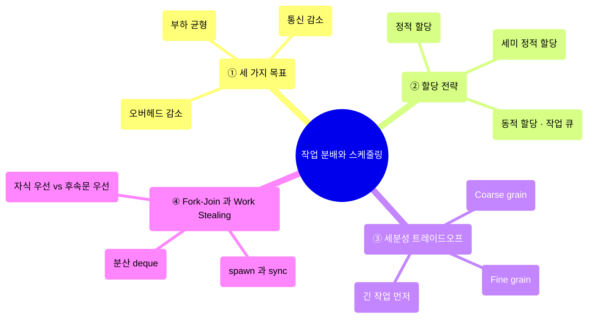
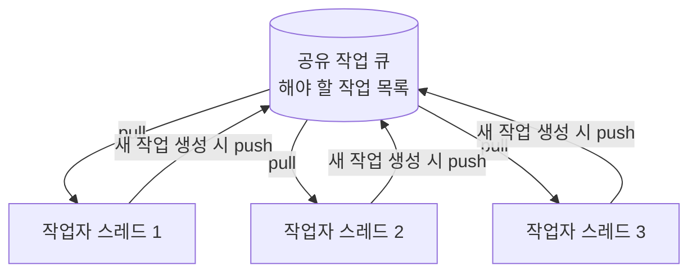
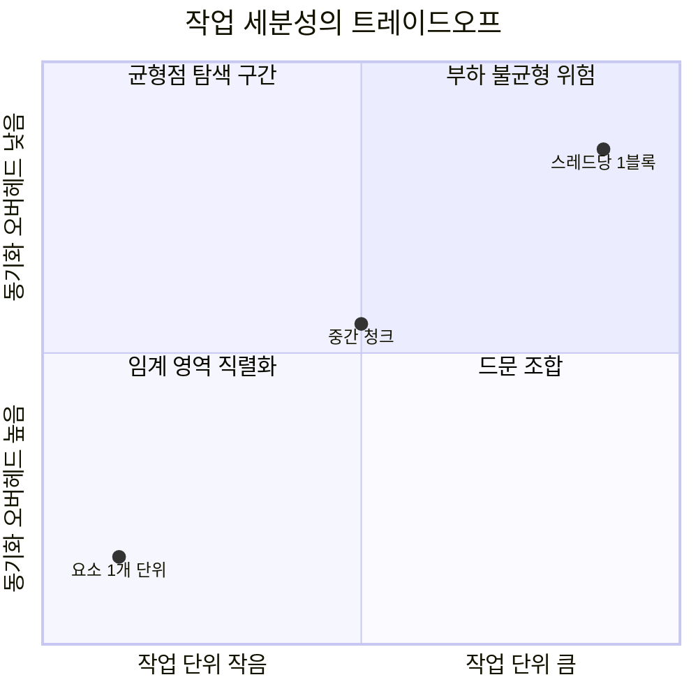
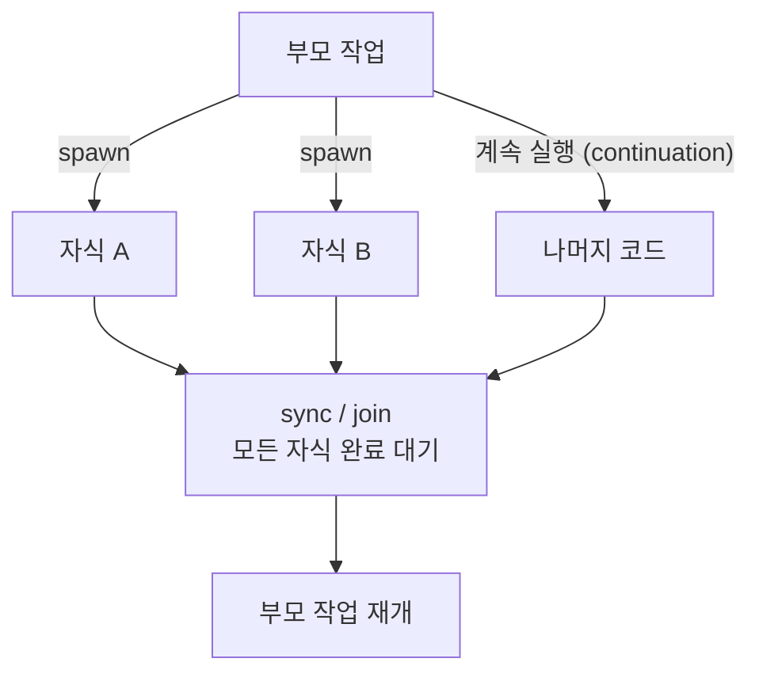
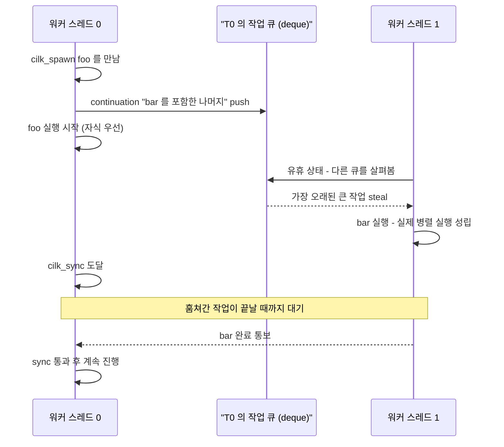
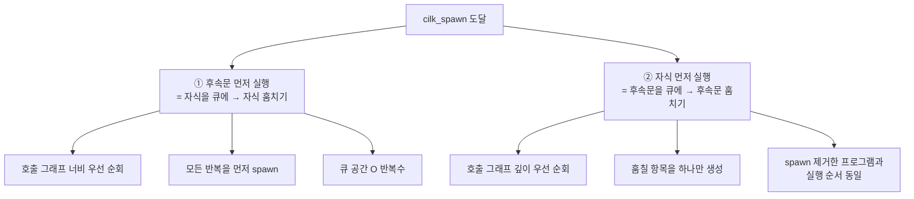

---
aliases:
  - Performance Optimization I
  - 작업 분배와 스케줄링
  - Work Distribution and Scheduling
authority: primary
course: parallel-distributed-computing
created: '2025-04-28'
date: '2025-04-28'
review_state: active
semester: '3-1'
source: pdf/05_Performance Optimization I Work Distribution and Scheduling.pdf
source_pages: 75
source_sha256: 3b1b423c175d248b
source_type: lecture-slides
status: seedling
tags:
  - lecture
  - systems
  - distributed
title: 05. 성능 최적화 I - 작업 분배와 스케줄링
type: lecture
updated: '2026-08-28'
---

source:: `pdf/05_Performance Optimization I Work Distribution and Scheduling.pdf` (75p)

# 05. 성능 최적화 I - 작업 분배와 스케줄링

> [!abstract] 한 줄 요약
> 병렬 성능 최적화는 **부하 균형 · 통신 감소 · 오버헤드 감소**라는 서로 상충하는 세 목표 사이에서
> 균형점을 찾는 반복 과정이며, 그 균형은 대부분 **작업을 얼마나 잘게 쪼개서(granularity)
> 언제 누구에게 줄 것인가(정적 vs 동적 할당)** 로 결정된다.
> 그 끝판왕 구현이 fork-join 런타임의 **work stealing** 스케줄러다.

## 이 강의의 지도



---

## 1. 최적화는 한 번에 끝나지 않는다

> [!quote] 슬라이드 근거
> `pdf/05_Performance Optimization I Work Distribution and Scheduling.pdf` p.2-4

> [!info] 정의
> 고성능 병렬 프로그래밍은 **분해 · 할당 · 조율(오케스트레이션)** 에 대한 선택을
> 계속 정제하고 수정하는 **반복적(iterative) 프로세스**다.
> 한 번에 정답을 고르는 설계가 아니라, 측정하고 고치기를 반복하는 루프다.


### 서로 상충하는 세 가지 목표

| 목표 | 내용 | 왜 중요한가 |
|:--|:--|:--|
| **1. 부하 균형 (Balance workload)** | 프로그램이 도는 동안 모든 프로세서가 최대한 쉬지 않고 **유용한 계산**을 하게 만든다. 이상적으로는 전원이 동시에 시작해 동시에 끝난다 | **아주 약간의 불균형만 있어도** 전체 실행 시간이 가장 오래 걸리는 프로세서에 맞춰진다 |
| **2. 통신 감소 (Reduce communication)** | 스레드·프로세서 간 데이터 교환의 **양과 빈도**를 최소화한다 | 통신에는 시간이 든다. 데이터를 기다리는 동안 프로세서는 아무 계산도 못 하고 **stall** 된다 |
| **3. 오버헤드 감소 (Reduce extra work)** | 순수 계산 외에 병렬화를 위해 추가로 하는 일을 줄인다 | 병렬성을 높이려는 추가 계산, **스케줄링 로직**, 락·배리어 관리 비용이 전부 오버헤드 |

> [!warning] 세 목표는 동시에 만족되지 않는다
> 부하를 잘 맞추려고 작업을 잘게 쪼개면 **스케줄링 오버헤드와 동기화 비용이 커진다.**
> 통신을 줄이려고 데이터를 크게 뭉치면 **부하 불균형이 커진다.**
> 이 강의 전체가 사실상 이 세 목표 사이의 줄다리기다.

> [!tip] 강의가 준 실전 팁
> **항상 가장 간단한 솔루션을 먼저 구현한 다음, 성능을 측정해서
> 더 나은 방법이 필요한지 결정하라.**

### 부하 불균형은 사실상 직렬 구간이다

한 프로세서가 다른 프로세서보다 훨씬 많은 일을 맡으면, 나머지는 그 프로세서를 기다리며 논다.
그 대기 구간은 **병렬 프로그램 런타임 중 사실상 직렬로 동작하는 부분**이고,
그대로 [암달의 법칙](<./04. 병렬 프로그래밍 기본.md>)의 $s$ 항에 들어간다.

$$S(p) = \frac{1}{(1 - r) + \dfrac{r}{p}}$$

> [!info] 워크로드(workload)란
> 컴퓨팅 리소스가 작업 완료나 결과 도출을 위해 수행하는 **처리 작업의 유형과 양**을 말한다.
> 컴퓨터에서 실행하는 모든 애플리케이션이 워크로드이므로, 그 성격은 실행하는 작업의
> 유형과 수에 따라 크게 달라진다. 그래서 "일반적으로 좋은 스케줄링"이란 게 없다.

---

## 2. 정적 할당 — 미리 정해 놓기

> [!quote] 슬라이드 근거
> `pdf/05_Performance Optimization I Work Distribution and Scheduling.pdf` p.5-9

> [!info] 정의
> **정적 할당(static assignment)** 은 스레드에 대한 작업 배분이 **동적 동작에 의존하지 않는** 방식이다.
> 반드시 컴파일 타임에 결정된다는 뜻은 아니다.
> **작업량과 작업자 수를 알고 있을 때 할당이 결정되면 정적**이다.
> 입력 데이터 크기나 스레드 수 같은 런타임 파라미터에 따라 실제 배분이 달라져도 여전히 정적이다.

> [!example] 가장 단순한 정적 할당
> 동일한 비용의 작업 12개와 프로세서 4개가 있다면, 각 프로세서에 3개씩 미리 나눠 준다.
> 모든 프로세서가 거의 동시에 끝나므로 부하 분산이 완벽하다.
> Grid Solver라면 **각 스레드에 동일한 수의 그리드 셀을 할당**하는 것과 같다.

```c
// 정적 할당 — 할당 구현에 드는 추가 작업은 "약간의 인덱싱 수학" 정도다
int threadId = getThreadId();
int myMin = threadId * (N / NUM_THREADS);
int myMax = myMin + (N / NUM_THREADS);

for (int i = myMin; i < myMax; i++)
    work(x[i]);
```

### 정적 할당이 효과적인 세 가지 경우

1. 전체 작업량과 각 작업의 실행 시간이 **미리 예측 가능할 때**
2. 모든 작업의 실행 시간이 **동일할 때**
3. 작업별 실행 시간은 다르지만 그 값이 **미리 알려져 있거나 통계적으로 예측 가능할 때**

> [!example] 비용이 다르지만 알고 있는 경우
> 작업 비용이 균등하지 않더라도 그 비용을 알거나 평균을 예측할 수 있다면,
> **각 프로세서에 동일한 개수의 작업을 인터리브 방식으로 배분**하는 것만으로
> 평균적으로 우수한 로드 밸런스를 얻을 수 있다.
> (Grid Solver에서 "정적 행 인터리브 할당"이 좋은 해법인 이유가 이것이다.
> 계산량이 특정 행 대역에 몰려 있어도, 행을 번갈아 나눠 주면 각 스레드가
> 무거운 행과 가벼운 행을 골고루 받게 된다.)

| 항목 | 정적 할당의 평가 |
|:--|:--|
| **장점** | 할당을 수행하기 위한 **런타임 오버헤드가 거의 없다.** 구현이 단순하다 |
| **단점** | 작업량이나 실행 시간이 **예측 불가능하게 변하면** 부하 불균형이 심해져 전체 성능이 떨어진다 |
| **대안** | 그런 상황에서는 **동적 할당**을 고려해야 한다 |

### 세미 정적 할당 — 그 중간

> [!info] 정의
> **가까운 미래의 작업 비용은 예측 가능**하다는 아이디어에 기댄 방식이다.
> "최근의 상태는 가까운 미래를 예측하는 좋은 지표"라고 가정하고,
> 애플리케이션이 **주기적으로 실행을 프로파일링해서 할당을 재조정**한다.
> **재조정 사이의 구간에서는 할당이 정적**이므로 그 구간의 오버헤드는 거의 없다.

| 사례 | 왜 세미 정적이 맞는가 |
|:--|:--|
| **파티클 시뮬레이션** | 시뮬레이션이 진행되며 파티클이 움직이면 작업자에게 파티클을 재분배한다. **동작이 느리면 재분배를 자주 할 필요가 없다** |
| **적응형 메시(adaptive mesh)** | 오브젝트가 이동하거나 변하면 메시도 변하지만 **변경이 느리게 진행**된다. 색으로 표시된 메시 조각이 각 프로세서에 할당된 영역 |

---

## 3. 동적 할당 — 실행 중에 정하기

> [!quote] 슬라이드 근거
> `pdf/05_Performance Optimization I Work Distribution and Scheduling.pdf` p.11-13

> [!info] 정의
> **동적 할당(dynamic assignment)** 은 프로그램이 **런타임에** 할당을 결정해 부하가 잘 분산되게 하는 방식이다.
> 쓰는 상황은 명확하다 — **작업의 실행 시간이나 총 작업 수를 미리 알 수 없거나 예측할 수 없을 때.**

> [!example] 왜 소수 판별이 정적 할당에 최악인가
> ```c
> for (int i = 0; i < N; i++) {
>     is_prime[i] = test_primality(x[i]);
> }
> ```
> `test_primality(x[i])` 의 실행 시간은 입력값 `x[i]` 에 따라 **크게 달라진다.**
> 어떤 숫자는 오래 걸리고 어떤 숫자는 금방 끝난다.
> 각 반복의 실행 시간을 미리 알 수 없으므로, 반복문을 정적으로 쪼개면
> 특정 스레드가 무거운 작업만 몰아 받아 **부하 불균형**이 생긴다.

```c
// 공유 카운터 + 락 기반 동적 할당
int counter = 0;              // 다음에 처리할 작업 인덱스 (공유)
LOCK counter_lock;

void worker() {
    while (true) {
        int i;
        lock(&counter_lock);
        i = counter++;        // 임계 영역 — 한 번에 한 스레드만
        unlock(&counter_lock);

        if (i >= N) break;
        is_prime[i] = test_primality(x[i]);
    }
}
```

동작 원리:

- 여러 스레드가 공유 변수 `counter` 에 접근해 **다음에 처리할 작업 인덱스를 가져간다**
- 동시에 변경하려 할 수 있으므로 **락으로 한 번에 하나만** 접근하게 해 일관성을 유지한다
- 작업이 짧은 스레드는 빠르게 다음 작업을 집어가고, 긴 작업을 맡은 스레드는 그동안 그 작업만 한다
- 결과적으로 **실행 중에 자연스럽게 부하가 분산된다**

### 공유 작업 큐 추상화



| 역할 | 동작 |
|:--|:--|
| **공유 작업 큐** | 해야 할 작업 목록. 지금은 각 작업이 **서로 독립**이라고 가정 |
| **작업자 스레드** | 큐에서 작업을 가져오고, 새 작업이 생기면 큐에 push |

---

## 4. 세분성(granularity) — 얼마나 잘게 쪼갤 것인가

> [!quote] 슬라이드 근거
> `pdf/05_Performance Optimization I Work Distribution and Scheduling.pdf` p.14-16

> [!info] 정의
> **작업 세분성(granularity)** 은 병렬 처리를 위해 작업을 나누는 **단위 크기**다.
> 이 크기는 **부하 분산 능력과 동기화 비용 사이의 트레이드오프**를 직접 결정한다.

| 구분 | Fine granularity (세분화된 분할) | Coarse granularity (거친 분할) |
|:--|:--|:--|
| **작업 단위** | 루프 반복 1회 = 요소 1개 | 요소 여러 개를 묶은 청크 |
| **부하 분산** | **매우 좋음** — 작업 수가 스레드 수보다 훨씬 많아, 유휴 프로세서가 다음 작은 작업을 집어가며 불균형을 흡수 | 나빠질 수 있음 — 큰 덩어리 하나가 늦게 끝나면 그대로 대기 |
| **동기화 비용** | **높음** — 작업 하나 끝날 때마다 공유 큐/카운터 접근, 즉 임계 영역 진입 | **낮음** — 임계 영역 진입 횟수가 청크 크기만큼 줄어듦 |
| **핵심 위험** | 임계 영역에서의 **직렬화**. 이 오버헤드는 정적 할당에는 존재하지 않는다 | 부하 불균형 |

```c
// Coarse granularity — 한 번에 GRANULARITY 개씩 집어간다
#define GRANULARITY 8

void worker() {
    while (true) {
        int i;
        lock(&counter_lock);
        i = counter;
        counter += GRANULARITY;      // 임계 영역 진입 횟수가 1/8로 감소
        unlock(&counter_lock);

        if (i >= N) break;
        int end = (i + GRANULARITY < N) ? i + GRANULARITY : N;
        for (int j = i; j < end; j++)
            is_prime[j] = test_primality(x[j]);
    }
}
```



> [!important] 이상적인 세분성을 고르는 원칙
> - **프로세서보다 많은 작업**을 만들어야 동적 할당으로 부하 균형을 맞출 수 있다 → 작은 작업 선호
> - 그러나 **할당 관리 오버헤드를 최소화**하려면 가능한 한 작업 수가 적어야 한다 → 큰 작업 선호
> - 따라서 이상적인 세분성은 **문제의 특성, 작업 시간의 변동성, 하드웨어 특성**에 따라 달라진다
>
> 이 수업의 공통 주제가 여기서도 반복된다 — **워크로드와 머신을 알아야 한다.**

---

## 5. 더 똑똑한 스케줄링 — 긴 작업을 먼저

> [!quote] 슬라이드 근거
> `pdf/05_Performance Optimization I Work Distribution and Scheduling.pdf` p.17-19

공유 작업 큐에서 작업을 **왼쪽에서 오른쪽 순서로** 그냥 꺼내 주면 어떻게 될까?
가장 긴 작업이 하필 **마지막에 배정**되면, 그 작업이 끝날 때까지 다른 스레드는 전부 논다.

```mermaid
gantt
    title 긴 작업을 마지막에 스케줄링한 경우
    dateFormat X
    axisFormat %s
    section P1
    T1 :a1, 0, 2
    T5 :a2, 2, 12
    section P2
    T2 :b1, 0, 2
    T6 :b2, 2, 4
    idle :crit, b3, 4, 12
    section P3
    T3 :c1, 0, 3
    T7 :c2, 3, 5
    idle :crit, c3, 5, 12
    section P4
    T4 :d1, 0, 2
    T8 :d2, 2, 4
    idle :crit, d3, 4, 12
```



계산 끝자락에 생기는 이 낭비 구간을 강의는 **슬로프(slope)** 라고 부른다.
해결책은 두 가지다.

| 해결책 | 방법 | 한계 |
|:--|:--|:--|
| **① 더 잘게 쪼개기** | 긴 작업을 더 많은 수의 작은 작업으로 분할해, 전체 실행 시간 대비 가장 긴 작업이 짧아지길 기대 | **동기화 오버헤드 증가**. 그리고 **애초에 불가능할 수도 있다** — 긴 작업이 근본적으로 순차적일 수 있다 |
| **② 긴 작업을 먼저 스케줄링** | 비용이 큰 작업부터 배정한다. 긴 작업을 맡은 스레드는 **작업 개수는 적지만 다른 스레드와 거의 같은 양의 일**을 하게 된다 | 작업량에 대한 **어느 정도의 사전 지식**(비용 예측 가능성)이 필요하다 |

```mermaid
gantt
    title 긴 작업을 먼저 스케줄링한 경우
    dateFormat X
    axisFormat %s
    section P1
    T5 :e1, 0, 10
    T1 :e2, 10, 12
    section P2
    T6 :f1, 0, 6
    T2 :f2, 6, 8
    T3 :f3, 8, 11
    section P3
    T7 :g1, 0, 7
    T4 :g2, 7, 9
    T8 :g3, 9, 11
```



> [!tip] 요약하면
> 긴 작업을 먼저 예약해서 **계산이 끝날 때 남는 낭비 시간(슬로프)을 줄여라.**

원본 슬라이드의 스케줄링 타임라인 도해(작업 순서에 따라 끝자락 낭비 구간이 어떻게 달라지는지)는
아래 페이지에서 직접 확인할 수 있다.

[05_Performance Optimization I Work Distribution and Scheduling p.19](<./pdf/05_Performance Optimization I Work Distribution and Scheduling.pdf>)

---

## 6. 분산 작업 큐와 작업 의존성

> [!quote] 슬라이드 근거
> `pdf/05_Performance Optimization I Work Distribution and Scheduling.pdf` p.20-22

### 단일 큐의 병목을 없애기

**모든 작업자가 단일 작업 대기열에서 동기화할 필요는 없다.** 각 스레드가 자기 큐를 갖게 하면 된다.

- 자체 작업 대기열에서 작업 가져오기
- 새 작업을 자체 작업 대기열로 push
- **로컬 작업 대기열이 비었을 때만** 다른 작업 대기열에서 작업을 **훔친다(steal)**

이것이 9절에서 자세히 볼 **work stealing** 의 기본형이다.

### 애플리케이션이 지정하는 작업 의존성

> [!info] 정의
> 특정 작업은 **다른 작업이 완료된 후에만** 실행할 수 있다. 이 관계가 **작업 의존성**이다.
> 태스크 관리 시스템의 스케줄러가 이 의존성을 관리하며,
> **의존성이 충족될 때까지 해당 작업을 워커 스레드에 할당하지 않는다.**

```c
// 명시적 의존성 지정 (Explicit Dependency Specification)
foo_handle = enqueue_task(foo);              // 다른 작업과 독립
bar_handle = enqueue_task(bar, foo_handle);  // foo 완료 전에는 실행 불가
```

프로그래머는 새 작업을 태스크 시스템에 제출할 때 **선행 작업의 핸들을 넘겨** 의존성을 명시할 수 있다.

### 여기까지의 결론

> [!important] 부하 균형은 양자택일이 아니다
> - 모든 프로세서가 항상 일하게 만들고 싶다. 아니면 리소스가 유휴 상태로 낭비된다
> - 그러나 그 균형을 **저비용으로** 달성하고 싶다 — 스케줄링·할당 로직의 계산 오버헤드 최소화, 동기화 비용 최소화
> - **정적 할당과 동적 할당은 양자택일이 아니라 연속적인 스펙트럼**이다
> - 워크로드에 대한 사전 지식을 최대한 활용해서 부하 불균형과 작업 관리 비용을 함께 줄여라
> - 시스템이 **모든 것을 알고 있다면 완전 정적 할당**이 최선이다

---

## 7. 병렬 프로그래밍의 기본 패턴

> [!quote] 슬라이드 근거
> `pdf/05_Performance Optimization I Work Distribution and Scheduling.pdf` p.24-30, 37-38

| 패턴 | 내용 |
|:--|:--|
| **데이터 병렬 처리** | 많은 데이터 요소에 대해 **동일한 작업 시퀀스**를 수행 (루프 병렬성) |
| **포크-조인 병렬성 (fork-join)** | 하나의 작업(부모)이 여러 자식 작업을 **생성(fork)** 해 병렬 실행시킨 후, 모든 자식이 완료될 때까지 기다렸다가(**join**) 다시 실행을 이어가는 방식 |

fork-join은 **분할 정복(divide-and-conquer) 알고리즘**(퀵 정렬, 병합 정렬 등)을 병렬화하는 데
내재된 독립 작업을 자연스럽게 표현한다.



### spawn / sync 의 의미

| 구문 | 의미 |
|:--|:--|
| **`cilk_spawn foo()`** | `foo` 를 호출하되, 표준 함수 호출과 달리 **호출자는 `foo` 의 실행과 함께 비동기적으로 계속 진행**할 수 있다 |
| **`cilk_sync`** | 현재 함수가 생성한 **모든 spawn 호출이 완료되면** 반환한다. 스폰된 호출과 동기화하는 지점 |
| **암시적 sync** | `cilk_spawn` 을 포함하는 **모든 함수의 끝에는 암시적 `cilk_sync`** 가 있다. 즉 함수가 반환되면 그 함수와 관련된 모든 작업이 완료된 상태다 |

> [!note] 보충 — 이 언어 확장의 정체
> 슬라이드는 이 시스템을 "원래 어느 대학에서 개발되어 현재 **오픈 표준**으로 채택되었고,
> **인텔**이 지원하는 **언어 확장**"이라고 설명한다.
> 추출된 PDF 텍스트에서는 고유명사가 대부분 누락되어 있으나,
> `spawn` / `sync` 프리미티브와 work stealing 스케줄러라는 설명은 **Cilk / Cilk Plus** 에 해당한다.
> 아래에서는 가독성을 위해 `cilk_spawn` / `cilk_sync` 표기를 사용한다.

```c
// 분할 정복의 fork-join 병렬화 — 퀵 정렬
void quick_sort(int* a, int lo, int hi) {
    if (hi - lo <= THRESHOLD) {         // 문제가 충분히 작으면 순차 정렬
        insertion_sort(a, lo, hi);      // spawn 오버헤드가 병렬화 이득을 능가
        return;
    }
    int p = partition(a, lo, hi);
    cilk_spawn quick_sort(a, lo, p);    // 자식은 병렬로
    quick_sort(a, p + 1, hi);           // 호출자는 계속 진행
    cilk_sync;                          // 자식 완료 대기
}
```

> [!important] 임계값(THRESHOLD)의 의미
> 병합 정렬 구현에서 재귀를 **최소 단위까지 쪼개지 않고**, 요소 수가 임계값 이하로 떨어지면
> 분할을 멈추고 삽입 정렬 같은 간단한 알고리즘으로 전환하는 것이 일반적이다.
> **이 임계값 설정이 곧 fork-join 모델에서 말하는 "적절한 작업 세분성 선택"** 이다.
> 문제가 충분히 작을 때 순차 정렬로 넘어가는 이유는 명확하다 —
> **spawn 오버헤드가 잠재적 병렬화의 이점을 능가하기 때문**이다.

### 계산 효율을 극대화하는 네 원칙

fork-join 프레임워크에서 계산 효율을 극대화하려면 네 가지를 지켜야 한다.

1. **병렬성 극대화**
2. **오버헤드 최소화**
3. **리소스 충돌 최소화**
4. **지역성(국소성) 극대화**

> [!warning] 한쪽만 최적화하면 안 된다
> 병렬성과 오버헤드는 **트레이드오프 관계**다.
> 태스크의 동시 실행 수를 높이려 하면 병렬 처리 관련 오버헤드가 증가하고,
> 오버헤드를 낮추려 하면 병렬성이 희생된다.
> **어느 한쪽에 치우쳐 최적화한다고 전체 계산 효율(처리 시간 최소화)이 최적화되지 않는다.**
> 둘의 **균형**을 맞춘 최적화가 필요하다.

### 병렬 슬랙(parallel slack)

> [!info] 정의
> **병렬 슬랙** = 독립 작업의 수 : 머신의 병렬 실행 능력의 비율.
>
> - 최소한 머신의 모든 처리 리소스를 **채울 만큼**의 작업은 만들어야 한다
> - 코어 간 워크로드 균형을 맞추려면 **실행 능력보다 더 많은** 독립 작업이 필요하다
> - 그러나 **너무 많은 슬랙**은 세분화된 작업을 관리하는 오버헤드를 유발한다

---

## 8. 프로세스 생성 방식 — spawn과 fork

> [!quote] 슬라이드 근거
> `pdf/05_Performance Optimization I Work Distribution and Scheduling.pdf` p.31-35

병렬 실행 단위를 만드는 방법 자체도 성능에 영향을 준다.
강의는 Python `multiprocessing` 을 예로 두 방식을 비교한다.

| 항목 | **spawn** | **fork** |
|:--|:--|:--|
| **동작** | 자식 프로세스를 위해 **새 Python 인터프리터를 켜고**, 타겟이 있는 스크립트를 다시 import한 뒤 타겟 함수 실행 | Unix 계열의 **시스템 콜**. 부모 프로세스의 상태와 메모리를 **복제**해 자식 생성 |
| **메모리** | 부모의 환경(메모리)을 복제하지 않음 → **완전히 독립적인 메모리 공간** | 생성한 객체, 열려 있는 파일, import된 것까지 **전부 그대로 복사** 후 타겟 실행 |
| **장점** | **이식성** — 다양한 OS에서 잘 동작(특히 Windows). **안정성** — 자원 복제가 없어 메모리 누수나 상태 공유 문제가 적음 | **성능** — 메모리 페이지 복제 방식이라 프로세스 생성이 매우 빠름. **자원 효율성** — `copy-on-write` 덕분에 실제 수정 전까지는 페이지를 부모와 공유 |
| **단점** | **시작 시간** — 매번 전체 환경을 다시 로드해야 해 느림. **자원 사용량** — 초기 구성 비용이 큼 | **이식성** — 일부 OS(Windows)에서 미지원. **안정성** — 파일 핸들러·소켓 등 자원을 공유해 예상치 못한 문제 발생. **메모리** — 부모가 큰 메모리를 쓰면 자식도 동일하게 잡아 전체 사용량이 급증 |

> [!warning] spawn의 함정 — 부모의 현재 상태가 전달되지 않는다
> 프로세스가 spawn 방식으로 생성되면, 현재 실행 중인 코드의 상태
> (예: 전역 변수, 모듈 수준에서 설정된 값)가 **새 프로세스에 자동으로 전달되지 않는다.**
> 즉 실행 중 코드에서 동적으로 변경한 사항이 있어도, 새로 spawn된 프로세스는
> **그 변경이 적용되지 않은 채로 시작**할 수 있다.
> 외부 라이브러리나 시뮬레이션 환경을 쓸 때 특히 문제가 되는데,
> 이는 자식이 부모의 현재 상태를 **복제하지 않기 때문**이다.

> [!note] 보충 — 실무에서의 의미
> 슬라이드는 PyTorch 등 주요 프레임워크가 기본적으로 **spawn 방식**을 쓴다고 언급한다.
> 데이터 로더 워커에 전역 설정이 반영되지 않는 문제의 근원이 바로 위 함정이다.

> [!tip] 함수 호출과의 대비
> 일반 함수 호출은 제어가 호출된 함수로 **이동**하고, 반환되면 제어가 호출자에게 **되돌아온다.**
> 한 스레드가 이 전부를 실행한다.
> fork-join의 `spawn` 은 이 "제어의 이동과 복귀"를 **두 갈래로 찢는 것**이다.

---

## 9. Work Stealing — fork-join 런타임의 구현

> [!quote] 슬라이드 근거
> `pdf/05_Performance Optimization I Work Distribution and Scheduling.pdf` p.39-60, 62-75

### 가장 순진한 스케줄러가 실패하는 이유

`cilk_spawn` 을 만날 때마다 **OS 스레드를 하나씩 만들고**, `cilk_sync` 를 `join` 호출로 바꾸면 어떨까?

| 문제 | 내용 |
|:--|:--|
| **헤비급 spawn** | 스레드 생성 자체가 비싸다 |
| **과다 구독** | 코어 수보다 훨씬 많은 스레드가 동시에 실행된다 |
| **컨텍스트 전환 오버헤드** | 스레드가 많을수록 전환 비용이 누적된다 |
| **캐시 지역성 악화** | 필요 이상으로 큰 작업 세트를 동시에 다뤄 캐시 지역성이 나빠진다 |

### 실제 구현 — 워커 스레드 풀

> [!info] 런타임의 기본 구조
> 런타임은 **워커 스레드 풀**을 유지한다. 모든 스레드는 애플리케이션 실행 시 생성되며,
> **머신의 실행 컨텍스트 수만큼 정확히** 만들어진다.
> (예: 하이퍼스레딩을 사용하는 쿼드코어 노트북 → 8스레드 워커 풀)
>
> 실제 런타임은 게으르게 동작해서 첫 번째 `cilk_spawn` 에서 풀을 초기화하는 경향이 있다.
> 이는 일반적인 구현 전략이고, `main` 을 실행하는 워커 스레드에서도 동일하게 적용된다.

### spawn을 만나면 무슨 일이 일어나는가



| 단계 | 동작 |
|:--|:--|
| **spawn 처리** | 현재 스레드(T0)가 **즉시 `foo` 를 실행**하기 시작한다. `cilk_spawn` 다음의 코드, 즉 `bar` 를 포함한 나머지 작업(**continuation**)은 T0의 **로컬 작업 큐**(보통 deque로 구현)에 넣어 둔다 |
| **work stealing** | 다른 워커 스레드(T1)가 할 일이 없어 유휴 상태가 되면 T0의 작업 큐를 살펴본다. 큐의 **앞부분(top)에서 가장 오래된 큰 작업**을 훔쳐 간다 |
| **병렬 성립** | T1이 `bar` 를 실행하면 T0의 `foo` 와 **실제 병렬 실행**이 이루어진다 |
| **sync 처리** | 스레드가 `cilk_sync` 에 도달했을 때, 이전에 spawn했지만 다른 스레드에게 **훔쳐진 작업이 아직 안 끝났으면** 완료까지 기다린다. 아무것도 훔쳐지지 않았고 자식 실행이 이미 끝났다면 **sync는 아무 일도 하지 않고 바로 통과**한다 |

### Continuation(후속문)이란

> [!info] 정의
> **후속문(continuation)** 은 **프로그램 제어에 관한 추상화 개념**이다. 모든 프로그램은 후속문 관점으로 볼 수 있다.
> - `if` 문은 **2가지 후속문 중 선택**
> - 예외(Exception)는 **후속문을 버리는 것**
> - `for` 문은 **후속문의 반복**
>
> 모든 언어가 후속문을 암묵적으로 쓰지만, **일급 객체(first class)로 명시적으로 지원**하는 언어는
> 오랫동안 Lisp나 ML 계열의 일부뿐이었다.
> 최근에는 Python(Stackless Python), Ruby(Continuation), C++(boost.context.continuation),
> Java(Loom Project), JavaScript(rhino) 등 주류 언어들도 지원하거나 지원 예정이다.

### 두 가지 선택 — 자식 훔치기 vs 후속문 훔치기

`cilk_spawn` 에 도달했을 때 **호출자 스레드가 무엇을 먼저 실행할지**에 두 가지 선택지가 있다.



| 기준 | **후속문 먼저 실행 (자식 훔치기)** | **자식 먼저 실행 (후속문 훔치기)** |
|:--|:--|:--|
| 호출자 스레드의 행동 | **하나라도 반복을 실행하기 전에 모든 반복에 대해 spawn을 수행** | 훔칠 항목을 **하나만** 생성 (나머지 모든 반복을 대표하는 continuation) |
| 호출 그래프 순회 | **너비 우선(breadth-first)** | **깊이 우선(depth-first)** |
| 큐 저장 공간 | spawn된 작업 수만큼 필요 (**최대 공간**) | 훔칠 항목이 없으면 큐에서 continuation을 pop하고 갱신된 값으로 새 continuation을 push하며 진행 |
| 실행 순서 | 스틸링이 없으면 **spawn을 제거한 순차 프로그램과 매우 다름** | 스틸링이 없으면 **spawn을 제거한 순차 프로그램과 동일** |

> [!important] 자식 우선(후속문 훔치기)이 이긴다
> continuation을 훔치는 방식에서는 **$T$ 개의 스레드를 가진 시스템의 작업 큐 저장 공간이
> 단일 스레드 실행에 필요한 스택 저장 공간의 $T$ 배를 넘지 않음을 증명할 수 있다.**
> 순차 실행과 같은 순서로 진행되면서도 공간 사용량이 유계라는 점이 결정적이다.

### deque — 어디서 훔칠 것인가

> [!info] Deque
> **Deque**는 double-ended queue의 약자로, 스택과 큐를 합친 자료구조다.
> **양쪽 모두에서 삽입과 삭제가 가능하다.**

| 주체 | 접근 위치 | 동작 |
|:--|:--|:--|
| **로컬 스레드** | **아래쪽(tail)** | push / pop |
| **원격(훔치는) 스레드** | **위쪽(top)** | steal |

> [!tip] 왜 위쪽에서 훔치는가
> - 유휴 스레드는 **무작위로 victim 스레드를 선택**해 훔치기를 시도한다 (random victim selection)
> - deque **맨 위에서 훔치면 가장 큰 덩어리의 작업**을 가져오게 되어 **훔치는 횟수 자체가 줄어든다**
> - 자식 우선 실행 방식과 결합하면 **각 스레드가 수행하는 작업의 지역성이 최대**가 된다
> - 훔치는 스레드와 로컬 스레드가 **deque의 같은 요소를 두고 경합하지 않는다**
> - 이 구조 위에서 **효율적인 lock-free deque 구현이 존재**한다

유휴 스레드가 작업 중인 스레드의 대기열에서 작업을 찾아 **자기 대기열로 옮긴 뒤 실행을 재개**하는
일련의 과정은 슬라이드에 애니메이션 도해로 나온다. 원본은 아래 페이지에서 볼 수 있다.

[05_Performance Optimization I Work Distribution and Scheduling p.48](<./pdf/05_Performance Optimization I Work Distribution and Scheduling.pdf>)

### sync는 어떻게 구현되는가

> [!info] 블록 디스크립터(block descriptor)
> `cilk_sync` 는 한 블록 안에서 spawn된 모든 호출에 대한 동기화다.
> 런타임은 블록마다 **디스크립터**를 만들어
> **미결(pending) spawn 수와 완료된 spawn 수를 추적**한다.
>
> - 다른 스레드에게 **작업이 도난당하지 않았다면** 동기화 지점에서 **할 일이 없다**
> - 훔쳐 간 스레드가 있으면 그 스레드가 완료를 보고하고, 마지막에 남은 스레드가 continuation을 재개한다
> - 모든 spawn이 완료되면 **블록 디스크립터가 해제**된다

### 요약 — work stealing 스케줄러의 특성

> [!important] 부하 균형
> - 할 일이 없으면 모든 스레드가 **항상 훔치기를 시도**한다
> - 스레드는 **시스템 전체에 훔칠 작업이 없을 때만** 유휴 상태가 된다
> - spawn을 시작한 워커 스레드가 **sync 이후 로직을 실행하는 스레드가 아닐 수 있다**

> [!important] 오버헤드
> - continuation을 기록하고 동기화 지점을 관리하는 오버헤드는 **steal이 발생할 때만** 든다
> - 대량의 작업이 spawn되는 경우 steal은 **드물게 발생해야** 한다
> - 대부분의 경우 스레드는 그냥 **자기 deque에서 continuation을 push/pop** 할 뿐이다

> [!note] 보충 — 다른 시스템의 fork-join
> 강의는 특정 런타임을 예로 들었지만 **다른 많은 시스템에도 fork-join 프리미티브가 있다.**
> 구현 정책은 다를 수 있다. 예를 들어 어떤 런타임은
> **항상 spawn된 자식을 실행**하고, **join에서 탐욕적(greedy)으로 동작**한다 —
> 스레드가 join에서 그냥 대기하지 않고 **즉시 훔칠 다른 작업을 찾는다.**

---

## 핵심 정리

| 개념 | 한 줄 정의 | 왜 중요한가 |
|:--|:--|:--|
| **부하 균형** | 모든 프로세서가 쉬지 않고 유용한 계산을 하게 만드는 것 | 조금의 불균형도 전체 시간을 최장 프로세서에 묶는다 |
| **정적 할당** | 작업량과 작업자 수를 알고 있을 때 미리 결정되는 배분 | 런타임 오버헤드가 거의 없지만 예측 불가 워크로드에 취약 |
| **세미 정적 할당** | 주기적으로 프로파일링해 재조정하되 구간 내에서는 정적 | 파티클 시뮬레이션·적응형 메시처럼 느리게 변하는 문제에 적합 |
| **동적 할당** | 런타임에 작업을 배분하는 방식 (공유 큐 + 락) | 작업 비용을 예측할 수 없을 때 유일한 해법 |
| **세분성 (Granularity)** | 병렬 작업 한 조각의 크기 | 부하 분산 능력과 동기화 비용의 트레이드오프를 직접 결정 |
| **Fine grain** | 요소 1개 = 작업 1개 | 부하 분산 최상, 임계 영역 직렬화 오버헤드 최악 |
| **Coarse grain** | 여러 요소를 묶은 청크 단위 | 동기화 횟수 감소, 부하 불균형 위험 증가 |
| **슬로프 (slope)** | 계산 끝자락에 일부 스레드만 일하는 낭비 구간 | 긴 작업을 먼저 스케줄링하면 줄일 수 있다 |
| **작업 의존성** | 선행 작업 완료 후에만 실행 가능한 관계 | 스케줄러가 의존성 충족 전까지 워커에 배정하지 않는다 |
| **Fork-Join** | 자식을 spawn해 병렬 실행하고 join으로 완료를 기다리는 패턴 | 분할 정복 알고리즘의 병렬성을 자연스럽게 표현 |
| **Continuation** | 프로그램 제어의 "나머지 부분"에 대한 추상화 | work stealing이 훔쳐 가는 단위 |
| **Work Stealing** | 유휴 스레드가 다른 스레드의 큐에서 작업을 가져오는 방식 | 단일 큐 병목 없이 동적 부하 균형을 달성 |
| **Deque** | 양쪽에서 삽입·삭제가 가능한 자료구조 | 로컬은 아래, 원격은 위를 써서 경합을 구조적으로 제거 |
| **자식 우선 실행** | spawn 시 자식을 먼저 실행하고 continuation을 큐에 | 순차 실행과 동일한 순서 + 큐 공간이 스레드 수 배로 유계 |
| **spawn vs fork** | 새 인터프리터 기동 vs 부모 메모리 복제 | 이식성·안정성과 생성 속도·자원 효율의 트레이드오프 |

> [!question]- 스스로 점검
> **Q1.** 병렬 성능 최적화의 세 가지 목표는 무엇이며 왜 서로 상충하는가?
> **A1.** 부하 균형, 통신 감소, 오버헤드 감소. 부하를 맞추려 잘게 쪼개면 동기화 오버헤드가 커지고,
> 통신을 줄이려 크게 뭉치면 부하 불균형이 커진다.
>
> **Q2.** "정적 할당"이 컴파일 타임 결정과 같은 말이 아닌 이유는?
> **A2.** 작업량과 작업자 수를 알고 있을 때 결정되면 정적이다.
> 입력 크기나 스레드 수 같은 런타임 파라미터에 따라 실제 배분이 달라져도,
> 실행 중 동적 동작에 의존하지 않으면 여전히 정적 할당이다.
>
> **Q3.** `test_primality` 루프가 정적 할당에 부적합한 이유는?
> **A3.** 실행 시간이 입력값에 따라 크게 달라져 각 반복의 비용을 미리 알 수 없기 때문이다.
> 정적으로 쪼개면 특정 스레드가 무거운 작업만 몰아 받아 부하 불균형이 생긴다.
>
> **Q4.** 작업 단위를 극단적으로 작게 만들면 어떤 문제가 생기는가?
> **A4.** 부하 분산은 좋아지지만, 작업이 끝날 때마다 공유 큐/카운터의 임계 영역에 접근해야 해서
> 동기화 오버헤드가 커지고 임계 영역에서 직렬화가 일어난다. 이 비용은 정적 할당에는 없던 것이다.
>
> **Q5.** 긴 작업을 먼저 스케줄링하면 왜 유리한가? 그 대가는?
> **A5.** 계산 끝자락의 낭비 구간(슬로프)이 줄어든다. 긴 작업을 맡은 스레드는 작업 개수는 적지만
> 총 작업량은 다른 스레드와 비슷해진다. 대가는 **작업 비용에 대한 사전 지식**이 필요하다는 점이다.
>
> **Q6.** work stealing에서 훔치는 스레드가 deque의 위쪽을 쓰는 이유는?
> **A6.** 위쪽에는 가장 오래된 큰 작업이 있어 한 번 훔칠 때 많은 일을 가져오므로 훔치는 횟수가 줄고,
> 로컬 스레드는 아래쪽을 쓰므로 같은 요소를 두고 경합하지 않는다. lock-free 구현도 가능해진다.
>
> **Q7.** 자식 우선 실행(후속문 훔치기)이 선호되는 결정적 이유는?
> **A7.** 스틸링이 없을 때 실행 순서가 spawn을 제거한 순차 프로그램과 동일하고,
> $T$ 스레드 시스템의 작업 큐 저장 공간이 단일 스레드 스택 저장 공간의 $T$ 배를 넘지 않음을 증명할 수 있다.
>
> **Q8.** Python `multiprocessing` 에서 spawn 방식이 부모의 전역 설정 변경을 반영하지 못하는 이유는?
> **A8.** spawn은 부모의 메모리를 복제하지 않고 새 인터프리터를 켜서 스크립트를 다시 import하므로,
> 실행 중 동적으로 바꾼 상태가 자식에 전달되지 않는다.

## 슬라이드 근거

| 섹션 | 슬라이드 |
|:--|:--|
| 1. 최적화의 세 목표 | p.2-4 |
| 2. 정적 · 세미 정적 할당 | p.5-10 |
| 3. 동적 할당과 공유 작업 큐 | p.11-13 |
| 4. 작업 세분성 트레이드오프 | p.14-16 |
| 5. 스마트 스케줄링 (긴 작업 먼저) | p.17-19 |
| 6. 분산 큐 · 작업 의존성 · 요약 | p.20-22 |
| 7. 병렬 패턴과 fork-join | p.24-30, 37-38 |
| 8. spawn vs fork 프로세스 생성 | p.31-35 |
| 9. Work stealing 스케줄러 구현 | p.39-60, 62-75 |

## 관련 노트

- [04. 병렬 프로그래밍 기본](<./04. 병렬 프로그래밍 기본.md>) — 분해·할당·오케스트레이션·매핑의 원본 틀
- [01. 왜 병렬 처리인가](<./01. 왜 병렬 처리인가.md>) — 부하 균형과 통신 감소라는 두 축의 출처
- [06. 지역성·통신·경합](<./06. 지역성·통신·경합.md>) — 통신 감소 목표의 본편
- [02. 병렬 컴퓨터의 기본 아키텍처](<./02. 병렬 컴퓨터의 기본 아키텍처.md>) — 워커 스레드 풀이 얹히는 하드웨어 실행 컨텍스트
- [08. GPU 아키텍처와 CUDA 프로그래밍 II](<./08. GPU 아키텍처와 CUDA 프로그래밍 II.md>) — 하드웨어 스케줄러가 담당하는 작업 분배
