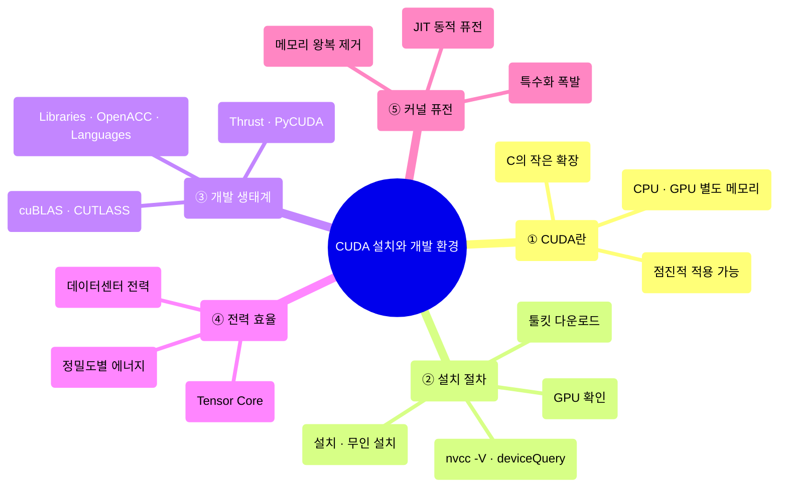
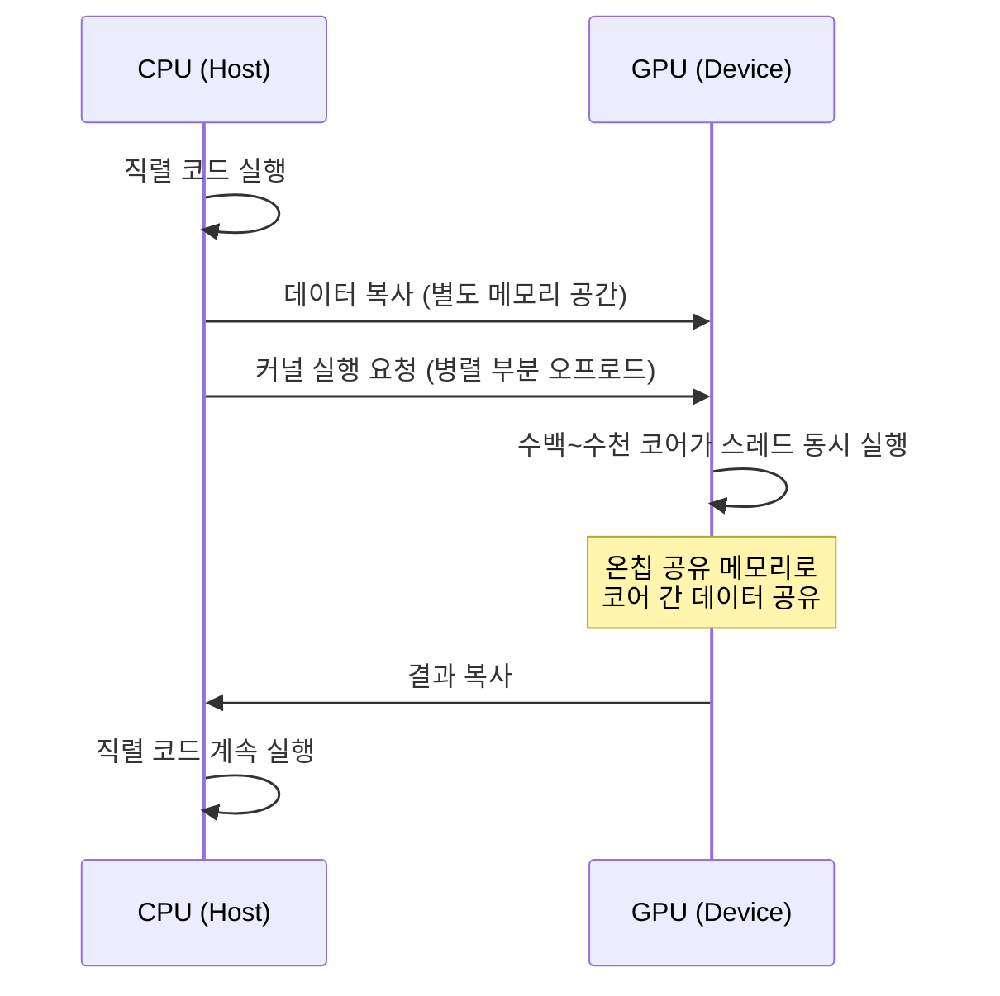
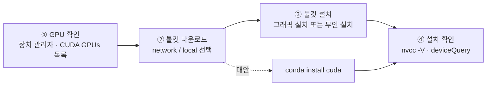
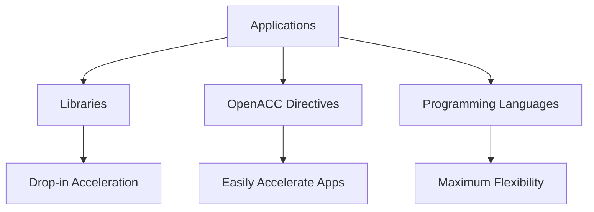
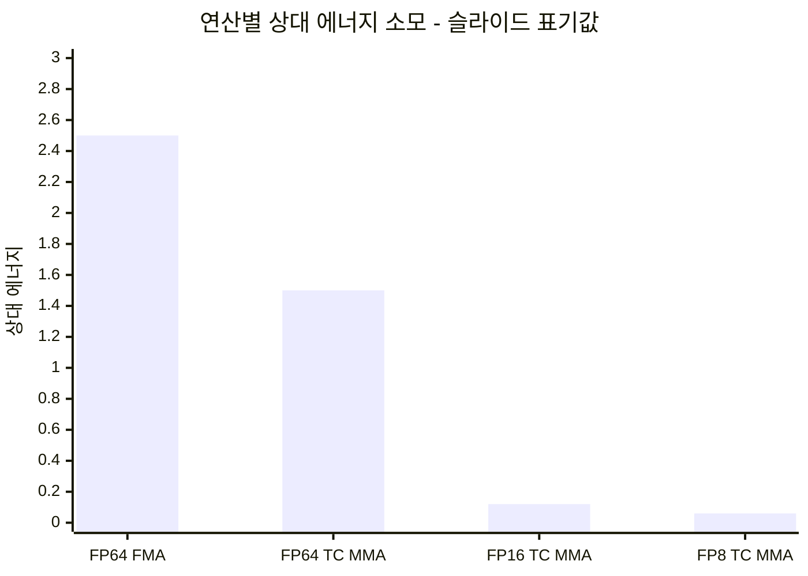
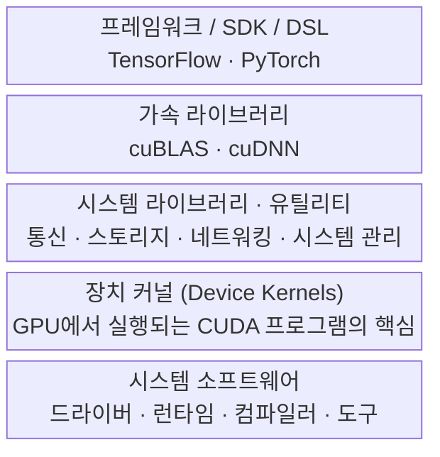

---
aliases:
  - CUDA 12.6 설치
  - GPU Architecture & CUDA Programming I
authority: primary
course: parallel-distributed-computing
created: '2025-05-17'
date: '2025-05-17'
review_state: active
semester: '3-1'
source: pdf/07_GPU Architecture & CUDAProgramming_v01.pdf
source_pages: 47
source_sha256: a2e10429c3be1b3c
source_type: lecture-slides
status: draft
tags:
  - lecture
  - systems
  - distributed
title: 07. CUDA 설치와 개발 환경
type: lecture
updated: '2026-08-28'
---

source:: `pdf/07_GPU Architecture & CUDAProgramming_v01.pdf` (47p)

# 07. CUDA 설치와 개발 환경

> [!abstract] 한 줄 요약
> CUDA는 **CPU와 GPU를 각자 메모리를 가진 별도 장치로 취급하는 이기종 컴퓨팅 플랫폼**이다.
> 이 차시는 두 덩어리다. 앞쪽은 CUDA 12.6 툴킷을 Windows/Linux에 설치하고 `nvcc -V` 와 `deviceQuery` 로
> 검증하는 실무 절차, 뒤쪽은 **"가속 컴퓨팅은 성능이 아니라 전력 효율의 문제"** 라는 2024년 NVIDIA의 논지다.
> 후자의 결론은 6차시와 같다 — **데이터 이동이 가장 비싸고, 커널 퓨전이 그것을 줄인다.**

## 이 강의의 지도



---

## 1. CUDA는 무엇을 노리고 설계됐나

> [!quote] 슬라이드 근거
> `pdf/07_GPU Architecture & CUDAProgramming_v01.pdf` p.2-3

> [!info] 정의
> **CUDA**는 NVIDIA가 개발한 **병렬 컴퓨팅 플랫폼이자 프로그래밍 모델**이다.
> GPU의 성능을 활용해 컴퓨팅 성능을 극적으로 끌어올리는 것을 목표로 한다.

강의가 나열한 설계 목표 네 가지는 그대로 CUDA의 성격을 설명한다.

| 설계 목표 | 의미 |
| :-- | :-- |
| **C 계열 언어의 작은 확장** | 표준 프로그래밍 언어에 **작은 확장 세트**만 얹어 병렬 알고리즘을 간단히 구현하게 함 |
| **알고리즘에 집중** | CUDA C/C++를 쓰면 구현 잡일 대신 **알고리즘의 병렬화 작업**에 시간을 쓸 수 있음 |
| **이기종 연산 지원** | 애플리케이션이 CPU와 GPU를 **모두** 사용 |
| **점진적 적용** | 직렬 부분은 CPU에서, 병렬 부분만 GPU로 오프로드 → **기존 애플리케이션에 조금씩 적용 가능** |



> [!important] CPU와 GPU는 "별도 장치"다
> CUDA는 CPU와 GPU를 **각자 자기 메모리 공간을 가진 별도의 장치**로 취급한다.
> 이 구성 덕분에 **메모리 리소스에 대한 경합 없이** CPU와 GPU가 동시에 계산할 수 있다.
> ([06. 지역성·통신·경합](<./06. 지역성·통신·경합.md>) 의 경합 개념이 여기서 하드웨어 설계 근거로 등장한다)

> [!example] CUDA 지원 GPU의 리소스 구조
>
> - 코어가 수백 ~ 수천 개 있고, 이들이 총체적으로 **수천 개의 컴퓨팅 스레드**를 실행한다.
> - 코어들은 **레지스터 파일**과 **공유 메모리** 같은 공유 리소스를 갖는다.
> - **온칩 공유 메모리** 덕분에 병렬 작업들이 **시스템 메모리 버스를 거치지 않고** 데이터를 공유할 수 있다.

---

## 2. 시스템 요구사항 — 무엇이 지원되고 무엇이 잘렸나

> [!quote] 슬라이드 근거
> `pdf/07_GPU Architecture & CUDAProgramming_v01.pdf` p.4

| 항목 | 요구사항 |
| :-- | :-- |
| GPU | **CUDA 지원 GPU** |
| 툴체인 | gcc 컴파일러 및 툴체인이 지원되는 Linux 버전 |
| 툴킷 | NVIDIA CUDA 툴킷 (`https://developer.nvidia.com/cuda-downloads`) |
| Windows | Windows 11 21H2(SV1) / 22H2(SV2) / 23H2, Windows 10 22H2, Windows Server 2022 |

> [!warning] 릴리스별로 잘려 나간 것들
>
> | 대상 | 상태 |
> | :-- | :-- |
> | Visual Studio 2015 | 릴리스 **11.1** 에서 지원 중단 |
> | Visual Studio 2017 | 릴리스 **12.5** 에서 지원 중단 |
> | 32비트 컴파일 (네이티브·교차) | **CUDA 12.0 이상 툴킷에서 제거됨** → 필요하면 이전 릴리스를 써야 함 |
> | 32비트 애플리케이션 바이너리 실행 | GeForce GPU 기준 **Ada까지** 드라이버가 지원. Ada가 마지막 아키텍처 |
> | Hopper | **32비트 애플리케이션 미지원** |
> | x86_64 Windows에서 x86 32비트 실행 | 제한적 지원 — CUDA 드라이버, 런타임(`cudart`), 수학 라이브러리(`math.h`)만 |

---

## 3. Windows 설치 4단계

> [!quote] 슬라이드 근거
> `pdf/07_GPU Architecture & CUDAProgramming_v01.pdf` p.5-16

강의가 정리한 절차는 딱 네 걸음이다.



| 단계 | 하는 일 | 확인 수단 |
| :--: | :-- | :-- |
| **1** | 시스템에 CUDA 지원 GPU가 있는지 확인 | 장치 관리자 → 디스플레이 어댑터에서 **공급업체 이름과 모델** 확인 |
| **2** | NVIDIA CUDA 툴킷 다운로드 | 플랫폼 선택 후 **network / local** 인스톨러 중 택1, MD5 체크섬 대조 |
| **3** | NVIDIA CUDA 툴킷 설치 | 그래픽 설치(화면 지시) 또는 `-s` 무인 설치 |
| **4** | 설치된 소프트웨어가 하드웨어와 제대로 통신하는지 테스트 | `nvcc -V`, `deviceQuery` 샘플 |

### 3-1. GPU 확인

```bash
# Windows 장치 관리자 열기 (실행 창 / 명령 프롬프트)
control /name Microsoft.DeviceManager
```

디스플레이 어댑터 섹션에서 그래픽 카드의 공급업체와 모델을 확인한 뒤,
`https://developer.nvidia.com/cuda-gpus` 목록에 있으면 그 GPU는 CUDA를 지원한다.
CUDA 툴킷의 **릴리스 노트**에도 지원 제품 목록이 들어 있다.

### 3-2. 인스톨러 선택

| 인스톨러 | 성격 | 적합한 상황 |
| :-- | :-- | :-- |
| **네트워크 설치 프로그램** (network) | 최소 인스톨러. 선택한 패키지만 나중에 내려받음 | **다운로드 시간을 최소화**하고 싶을 때 |
| **전체 설치 관리자** (local) | 모든 구성 요소 포함, 추가 다운로드 불필요 | **네트워크가 열악한 시스템**, 기업 배포 |

CUDA 툴킷은 CUDA 애플리케이션을 생성·빌드·실행하는 데 필요한 **드라이버와 툴, 라이브러리, 헤더 파일**을 함께 설치한다.

> [!warning] 다운로드 무결성 확인은 건너뛰지 말 것
> 다운로드한 파일의 체크섬을
> `https://developer.download.nvidia.com/compute/cuda/12.6.3/docs/sidebar/md5sum.txt` 에 게시된
> MD5 체크섬과 비교한다. **하나라도 다르면 손상된 파일이므로 다시 받아야 한다.**

실제 다운로드 화면(Operating System / Architecture / Version / Installer Type 선택)은 아래에서 볼 수 있다.
강의 예시는 `Windows · x86_64 · 11 · exe (local)` 조합으로 `cuda_12.6.3_561.17_windows.exe` 를 받는다.

[07_GPU Architecture & CUDAProgramming_v01 p.12](<./pdf/07_GPU Architecture & CUDAProgramming_v01.pdf>)

### 3-3. 설치

> [!warning] 드라이버가 먼저다
> CUDA가 작동하려면 **드라이버와 툴킷이 모두** 설치되어 있어야 한다.
> 독립 실행형 드라이버를 따로 깔지 않았다면 CUDA 툴킷 인스톨러가 드라이버까지 설치하게 두어야 한다.
>
> 또한 **설치 도중 Windows 업데이트가 시작되면 설치가 실패할 수 있다.**
> 업데이트가 끝날 때까지 기다렸다가 다시 시도한다.

```bash
# 그래픽 설치: 인스톨러를 실행하고 화면 지시를 따른다
cuda_12.6.3_561.17_windows.exe

# 무인(silent) 설치: -s 플래그
cuda_12.6.3_561.17_windows.exe -s

# 특정 하위 패키지만 설치 — 예: 컴파일러 + 드라이버만
cuda_12.6.3_561.17_windows.exe -s nvcc_12.1 Display.Driver

# 설치/제거 후 자동 재부팅을 막고 싶을 때
cuda_12.6.3_561.17_windows.exe -s -n
```

> [!tip] 수동으로 파일 추출·검사하기
> 엔터프라이즈 배포처럼 **설치 전에 파일을 직접 들여다보고 싶을 때**가 있다.
> 전체 설치 패키지는 7-zip이나 WinZip처럼 **LZMA 압축을 지원하는 도구**로 풀 수 있다.
>
> - 압축을 풀면 CUDA 툴킷 파일은 `CUDAToolkit` 폴더에 있고, Visual Studio 통합도 별도 폴더에 있다.
> - 각 디렉터리의 `.dll`, `.nvi` 파일은 **설치 가능한 파일의 일부가 아니므로 무시**해도 된다.

### 3-4. Conda로 설치하기

```bash
# 설치 (패키지는 https://anaconda.org/nvidia 에서 제공)
conda install cuda -c nvidia

# 제거
conda remove cuda
```

### 3-5. 설치 확인

```bash
# 시작 > 모든 프로그램 > 보조 프로그램 > 명령 프롬프트
nvcc -V
```

`nvcc -V` 로 툴킷 버전을 확인한 뒤, 샘플로 하드웨어까지 검증한다.

| 검증 항목 | 방법 |
| :-- | :-- |
| CUDA 샘플 확보 | `https://github.com/nvidia/cuda-samples` 프로젝트를 clone |
| 빌드 | GitHub 페이지 지침에 따라 샘플 빌드 |
| **하드웨어·소프트웨어 구성 검증** | **`deviceQuery`** 샘플을 빌드·실행 (`deviceQuery` 폴더의 VS 솔루션 파일 사용) |

> [!note] 보충
> 슬라이드는 "기본 설치 디렉터리 구조를 사용했다고 가정"하며, 제대로 설치·구성되었다면
> `deviceQuery` 출력이 슬라이드의 그림 1과 비슷하게 나온다고만 안내한다. 구체적 출력 예시는 덱에 없다.

---

## 4. Linux (Ubuntu 24.04)

> [!quote] 슬라이드 근거
> `pdf/07_GPU Architecture & CUDAProgramming_v01.pdf` p.17

> [!warning] 이 덱에는 Linux 설치 명령이 없다
> Linux 파트는 슬라이드 한 장이고, 내용은 외부 문서 링크
> **"How to Install CUDA on Ubuntu 24.04: Step-by-Step"** 하나뿐이다.
> 실제 `apt` 명령 시퀀스는 이 덱의 근거로 존재하지 않으므로, 실습 시에는 링크 문서나
> `https://developer.nvidia.com/cuda-downloads` 의 Linux 탭에서 생성되는 명령을 그대로 따라야 한다.

---

## 5. CUDA 개발 생태계

> [!quote] 슬라이드 근거
> `pdf/07_GPU Architecture & CUDAProgramming_v01.pdf` p.18-28

### 5-1. 애플리케이션을 가속하는 세 가지 길



| 접근 | 성격 | 트레이드오프 |
| :-- | :-- | :-- |
| **Libraries** | 기존 라이브러리 호출을 CUDA 라이브러리 호출로 갈아 끼우는 **"Drop-in" 가속** | 손은 가장 덜 가지만 제공되는 것만 쓸 수 있음 |
| **OpenACC Directives** | 지시문만 붙여 **손쉽게 가속** | 중간 수준의 제어 |
| **Programming Languages** | CUDA C/C++ 등으로 직접 작성, **최대 유연성** | 가장 많은 노력 |

> [!example] SMALL CHANGES, BIG SPEED-UP
> 애플리케이션 코드에서 **연산 집약적 함수는 보통 5% 정도**다.
> 그 5%만 GPU로 보내고 나머지 순차 CPU 코드는 그대로 두는 것이 CUDA의 기본 전략이다.

### 5-2. 라이브러리 방식의 3단계 (STEPS TO CUDA-ACCELERATED APPLICATION)

| 단계 | 내용 | 예 |
| :--: | :-- | :-- |
| **Step 1** | 라이브러리 호출을 동등한 CUDA 라이브러리 호출로 치환 | `saxpy(...)` → `cublasSaxpy(...)` |
| **Step 2** | **데이터 지역성 관리** | CUDA: `cudaMalloc()`, `cudaMemcpy()` / CUBLAS: `cublasAlloc()`, `cublasSetVector()` |
| **Step 3** | 재빌드 후 CUDA 가속 라이브러리를 링크 | `gcc myobj.o -l cublas` |

```bash
gcc myobj.o -l cublas
```

> [!important] Step 2가 진짜 일이다
> 세 단계 중 실제로 성능을 좌우하는 것은 **데이터 지역성 관리**다.
> 호출만 바꾸고 호스트-디바이스 복사를 방치하면 6차시에서 본 **인위적 통신**이 그대로 재현된다.

### 5-3. 언어별 GPU 프로그래밍 경로

| 언어 | 경로 |
| :-- | :-- |
| Numerical analytics | MATLAB, Mathematica, LabVIEW |
| Fortran | OpenACC, CUDA Fortran |
| C | OpenACC, CUDA C |
| C++ | **Thrust**, CUDA C++ |
| Python | PyCUDA, Copperhead |
| F# | Alea.cuBase |

> [!info] Thrust — C++ STL을 닮은 고수준 인터페이스
>
> - **개발 생산성 향상**, GPU와 멀티코어 CPU 사이의 **성능 이식성**
> - **유연성**: CUDA·OpenMP·TBB 백엔드, 확장·커스터마이즈 가능, 기존 소프트웨어와 통합
> - **오픈 소스**

```cpp
// generate 32M random numbers on host
thrust::host_vector<int> h_vec(32 << 20);
thrust::generate(h_vec.begin(), h_vec.end(), rand);

// transfer data to device (GPU)
thrust::device_vector<int> d_vec = h_vec;

// sort data on device
thrust::sort(d_vec.begin(), d_vec.end());

// transfer data back to host
thrust::copy(d_vec.begin(), d_vec.end(), h_vec.begin());
```

> [!tip] CUDA 샘플로 감 잡기
> `https://github.com/NVIDIA/cuda-samples` 는 CUDA 툴킷의 기능을 시연하는 공식 샘플 모음이다.
> 설치 검증(`deviceQuery`)과 학습을 같은 저장소에서 해결할 수 있다.

---

## 6. 가속 컴퓨팅은 성능만의 문제가 아니다

> [!quote] 슬라이드 근거
> `pdf/07_GPU Architecture & CUDAProgramming_v01.pdf` p.29-37 (CUDA: New Features and Beyond, 2024)

### 6-1. 전력이 제약이 된 배경

| 관찰 | 내용 |
| :-- | :-- |
| **데이터센터 전력 급증** | 북미 데이터센터의 전력 용량이 기하급수적으로 증가 → 운영 비용 증가 → 에너지 효율이 핵심 지표 |
| 중간 규모 데이터센터 기준 | 20,000 ~ 100,000 평방 피트, 서버 2,000 ~ 10,000대, **최대 시스템 전력 1.5 kW ~ 3 kW** |
| **트랜지스터 밀도의 역설** | 밀도는 계속 오르지만 **트랜지스터의 전력 효율은 떨어진다.** 더 많이 넣어도 같은 전력으로 더 많은 성능을 주지는 못한다 |

> [!important] 전력을 쓰는 곳은 딱 두 가지
> **① 데이터 이동 (Data movement)** 과 **② 계산 (Computation)**.
> 그중 **데이터 이동이 많은 전력을 소비**하며, 이것이 시스템 전체의 에너지 효율을 좌우한다.
>
> 이 문장은 [01. 왜 병렬 처리인가](<./01. 왜 병렬 처리인가.md>) 의
> "DRAM 읽기 ≈ FP 연산의 60배" 와 정확히 같은 이야기다. 6년 뒤 NVIDIA 슬라이드에도 그대로 남아 있다.

### 6-2. 정밀도와 Tensor Core의 에너지 비용

부동소수점 연산의 전력 비용은 **정밀도에 따라 다르다.** FP64는 많이 쓰고 FP8은 훨씬 적게 쓴다.
그리고 Tensor Core를 쓴 연산은 일반 부동소수점 연산보다 **전력 효율이 1.5 ~ 4배 높다.**



| 연산 | 슬라이드가 제시한 상대 에너지 | 비교 기준 |
| :-- | --: | :-- |
| **FP64 FMA** | 2.5배 | FP64 부동소수점 연산 수행 에너지 기준 |
| **FP64 Tensor Core MMA** | 1.5배 | 〃 |
| **FP16 Tensor Core MMA** | 0.12배 | **일반 FP16 FMA 대비** |
| **FP8 Tensor Core MMA** | 0.06배 | 〃 |

> [!warning] 이 표의 기준선은 슬라이드에서 통일되어 있지 않다
> FP64 항목은 "FP64 연산 에너지 기준", FP16·FP8 항목은 "같은 정밀도의 일반 FMA 대비"로 서술되어 있다.
> 숫자를 한 축에 놓고 직접 비교하기보다, **"정밀도를 낮추고 Tensor Core를 쓰면 에너지가 급격히 준다"**
> 는 방향성만 읽는 것이 안전하다. (MMA = Matrix Multiply-Accumulate)

### 6-3. 낮은 에너지 트랜지스터로 높은 에너지 문제 풀기

Mixed-Precision Iterative Refinement 를 쓴 LU 분해가 대표 사례다.

| 단계 | 내용 |
| :--: | :-- |
| 1 | **입력 및 변환** — 64비트 행렬 $A_{64}$ 를 16비트 $A_{16}$ 으로 변환 |
| 2 | **LU 분해** — $A_{16}$ 에서 LU 분해를 수행해 초기 해 $x_0$ 를 구함 |
| 3 | **정밀도 변환** — $x_0$ 를 64비트 정밀도로 변환 |
| 4 | **잔차 계산** — $r_i = b - A x_i$ (현재 해와 실제 값의 차이) |
| 5 | **보정 계산** — GMRES로 $U^{-1} L^{-1} A c_i = U^{-1} L^{-1} r_i$ 를 풀어 $x_{i+1} = x_i + c_i$ |
| 6 | **반복** — 위를 반복해 최종적으로 64비트 정밀도의 정확한 해 $x$ 를 얻음 |

$$r_i = b - A x_i \qquad U^{-1}L^{-1}A\,c_i = U^{-1}L^{-1} r_i \qquad x_{i+1} = x_i + c_i$$

> [!example] 성능·전력 효율 수치
>
> - **GH200 GPU** 에서 복잡한 행렬 LU 분해: FP64 연산 대비 **약 3.9배 성능**, **5.7배 와트당 성능**
> - **비네이티브 하드웨어에서의 FP64 GEMM**: Ootomo et al. 의 방법(정수 텐서 코어를 DGEMM에 적용)으로
>   **L40S GPU가 네이티브 FP64 대비 약 7배** 성능을 달성, **A100의 FP64 텐서 코어 성능의 절반 이상**에 도달

핵심 아이디어는 "정확도는 64비트로 지키면서 무거운 계산만 16비트 + Tensor Core로 내려보낸다"는 것이다.
원본 알고리즘 도해는 아래에서 볼 수 있다.

[07_GPU Architecture & CUDAProgramming_v01 p.36](<./pdf/07_GPU Architecture & CUDAProgramming_v01.pdf>)

### 6-4. Tensor Core를 쓰는 세 계층의 API

| 라이브러리 | 성격 | 제공하는 것 |
| :-- | :-- | :-- |
| **cuBLAS** | 기본 | GPU 가속 선형대수 API. GEMM 연산에서 성능 극대화를 위해 **자동으로 Tensor Core 사용**. 낮은/혼합 정밀도를 지원하는 GEMM 확장 |
| **cuBLASLt** | 고급 | GEMM용 고급 API. 다양한 **혼합 정밀도와 에필로그(후처리)** 지원. 커널 선택·성능을 위한 **AI 훈련 휴리스틱** 프로그래밍 가능 |
| **CUTLASS** | 프로그래밍 추상화 | Tensor Core를 위한 **C++ 및 Python 추상화**. 전체 커널을 구성하거나 커널 내에서 Tensor Core를 인라인 호출. 구성·정밀도·실행을 **완전히 제어** |

> [!tip] 고르는 기준
> 위로 갈수록 손이 덜 가고, 아래로 갈수록 제어권이 커진다.
> 5-1절의 "Libraries → OpenACC → Languages" 축이 Tensor Core 안에서 한 번 더 반복되는 구조다.

---

## 7. 커널 퓨전 — 6차시의 결론이 CUDA에서 재등장

> [!quote] 슬라이드 근거
> `pdf/07_GPU Architecture & CUDAProgramming_v01.pdf` p.41-43

> [!info] 커널 퓨전 (Kernel Fusion)
> 여러 개의 커널 실행을 **하나의 커널 실행으로 결합**해 성능과 에너지 효율을 동시에 높이는 방법.
> 예: FP32 → FP16 변환, 행렬 곱셈, 활성화 연산을 **하나의 퓨전 커널**로 묶는다.

| 방식 | 커널 실행 | 메모리 로드 | 데이터 저장 |
| :-- | --: | --: | --: |
| 전통적 방식 (연산마다 개별 커널) | **3회** | **3회** | **3회** |
| 단일 퓨전 커널 | **1회** | **1회** | **1회** |

$$\text{메모리 트래픽 감소율} = 1 - \frac{1}{3} \approx 67\%$$

> [!warning] 퓨전의 대가 — 특수화 폭발 (Specialization Explosion)
> 연산 조합이 늘어나면 **필요한 특수화 커널 수가 조합적으로 폭발**한다.
> 이렇게 되면 유지 보수와 관리가 어려워진다.
>
> 해법은 **동적 퓨전 + JIT 컴파일** 이다. 런타임에 필요한 퓨전을 동적으로 생성하고
> Just-In-Time 컴파일로 처리해, 다양한 연산 조합에 효율적으로 대응한다.

> [!important] 6차시와 같은 문장
> 6차시의 `fused()` 예제에서 산술 집약도가 $1/3 \to 3/5$ 로 올라간 이유와,
> 여기서 커널 3개를 1개로 합쳐 메모리 왕복이 $3 \to 1$ 로 준 이유는 **완전히 같다.**
> 중간 결과를 메모리에 내렸다 다시 올리는 비용을 없애는 것 — 그것이 지역성 관리의 본체다.

---

## 8. 개발자 피라미드와 Python 도구

> [!quote] 슬라이드 근거
> `pdf/07_GPU Architecture & CUDAProgramming_v01.pdf` p.44-47

CUDA 생태계는 **저수준 함수(low-level functions)** 위에 층층이 쌓인 구조다.
슬라이드는 이것을 "역(inverted) CUDA 개발자 피라미드"로 표현한다.



| 계층 | 내용 |
| :-- | :-- |
| **프레임워크 / SDK / DSL** | 개발자가 CUDA 생태계를 쉽게 활용하게 돕는 프레임워크·SDK·도메인 특화 언어 (TensorFlow, PyTorch 등) |
| **가속 라이브러리** | 고성능 연산에 최적화된 라이브러리 — 선형대수 가속 **cuBLAS**, 신경망 가속 **cuDNN** |
| **시스템 라이브러리 · 유틸리티** | 통신·스토리지·네트워킹·시스템 관리 기능 (cuBLAS, cuFFT, cuDNN 등) |
| **장치 커널** | GPU에서 실행되는 커널 코드. **CUDA 프로그램의 핵심**이며 고성능 컴퓨팅에 최적화 |
| **시스템 소프트웨어** | 드라이버·런타임·컴파일러·도구. **저수준 함수로 구성되어 하드웨어와 직접 상호작용** |

> [!note] 왜 "역" 피라미드인가
> 슬라이드의 논지는 **저수준 함수의 중요성**이다. 위쪽 프레임워크 사용자가 압도적으로 많지만,
> 그 전부를 떠받치는 것은 바닥의 시스템 소프트웨어와 장치 커널이다.
> 이 피라미드는 내부·외부 개발자 생태계를 함께 아울러 CUDA의 광범위한 채택을 촉진한다.

### Python 쪽 최신 도구 (2024)

| 도구 | 목적 |
| :-- | :-- |
| **nvmath-python** | CUDA 수학 라이브러리 기능에 대한 **Python의 손쉬운 접근성** 제공 |
| **CUTLASS Python Interface** | PyTorch 같은 **DL 프레임워크로의 간편한 통합** |
| **Python Developer Tools** | Python 기반 **GPU 및 CPU 실행에 대한 자세한 검사** |

> [!note] 보충
> p.45-47은 제목과 한 줄 설명만 있는 이미지 슬라이드다. 각 도구의 API나 사용 예시는 이 덱에 없다.

---

## 핵심 정리

| 개념 | 한 줄 정의 | 왜 중요한가 |
| :-- | :-- | :-- |
| **CUDA** | NVIDIA의 병렬 컴퓨팅 플랫폼 및 프로그래밍 모델 | C 계열 언어의 작은 확장으로 GPU 병렬성을 쓸 수 있게 함 |
| **이기종 연산** | 직렬은 CPU, 병렬은 GPU로 오프로드 | 기존 애플리케이션에 **점진적** 적용이 가능한 이유 |
| **별도 메모리 공간** | CPU와 GPU를 각자 메모리를 가진 별도 장치로 취급 | 메모리 리소스 **경합 없이** 동시 계산 가능 |
| **온칩 공유 메모리** | 코어들이 공유하는 온칩 저장소 | 시스템 메모리 버스를 거치지 않고 데이터 공유 |
| **network / local 인스톨러** | 최소 다운로드형 / 전체 포함형 | 네트워크 환경과 배포 방식에 따라 선택 |
| **무인 설치 (`-s`)** | 화면 지시 없이 패키지 설치, 하위 패키지 지정 가능 | 기업 배포·자동화 |
| **`nvcc -V` / `deviceQuery`** | 툴킷 버전 확인 / 하드웨어·소프트웨어 구성 검증 | 설치 성공 여부를 판단하는 두 관문 |
| **3 Ways to Accelerate** | Libraries · OpenACC · Programming Languages | 노력과 유연성 사이의 트레이드오프 축 |
| **Thrust** | C++ STL을 닮은 고수준 병렬 라이브러리 | GPU와 멀티코어 CPU 간 **성능 이식성** |
| **Tensor Core** | 행렬 곱셈-누산(MMA) 전용 하드웨어 | 일반 FP 연산보다 전력 효율 **1.5 ~ 4배** |
| **Mixed-Precision Iterative Refinement** | 저정밀도로 풀고 고정밀도로 보정 반복 | GH200에서 FP64 대비 3.9배 성능, 5.7배 와트당 성능 |
| **커널 퓨전** | 여러 커널을 하나로 합침 | 커널 실행·메모리 로드·저장을 각각 3회 → 1회 |
| **특수화 폭발** | 연산 조합만큼 특수화 커널이 필요해짐 | 동적 퓨전 + JIT 컴파일로 대응 |

> [!question]- 스스로 점검
> **Q1.** CUDA가 "기존 애플리케이션에 점진적으로 적용 가능"한 이유는?
> **A1.** 이기종 연산을 지원하기 때문이다. 애플리케이션의 직렬 부분은 CPU에서 그대로 돌리고, 연산 집약적인 병렬 부분(대략 코드의 5%)만 GPU로 오프로드하면 된다.
>
> **Q2.** CUDA 12.0 이상에서 32비트 컴파일을 하려면 어떻게 해야 하나?
> **A2.** 할 수 없다. 32비트 네이티브·교차 컴파일은 CUDA 12.0 이상 툴킷에서 제거되었으므로 **이전 릴리스의 CUDA 툴킷**을 써야 한다. 실행 지원도 GeForce 기준 Ada가 마지막이고 Hopper는 32비트 애플리케이션을 지원하지 않는다.
>
> **Q3.** 설치 도중 실패했을 때 슬라이드가 지목한 첫 번째 원인은?
> **A3.** Windows 업데이트다. 설치가 시작된 후 Windows 업데이트가 돌면 설치가 실패할 수 있으므로, 업데이트 완료를 기다렸다 재시도해야 한다.
>
> **Q4.** 컴파일러와 드라이버만 무인 설치하려면?
> **A4.** `<패키지명>.exe -s nvcc_12.1 Display.Driver` 처럼 `-s` 뒤에 하위 패키지 이름을 나열한다. 재부팅을 막으려면 `-n` 을 추가한다.
>
> **Q5.** 라이브러리 방식으로 CUDA를 도입하는 3단계 중 성능을 가장 크게 좌우하는 단계는?
> **A5.** Step 2, 데이터 지역성 관리다. `cudaMalloc`/`cudaMemcpy` 또는 `cublasAlloc`/`cublasSetVector` 로 호스트-디바이스 데이터 이동을 통제하지 않으면 호출만 바꾼 효과가 사라진다.
>
> **Q6.** 커널 퓨전이 에너지 효율까지 높이는 이유는?
> **A6.** 커널 3개를 1개로 합치면 커널 실행·메모리 로드·데이터 저장이 각각 3회에서 1회로 준다. 시스템이 전력을 쓰는 두 곳(데이터 이동, 계산) 중 더 비싼 **데이터 이동**을 직접 줄이기 때문이다.
>
> **Q7.** cuBLAS, cuBLASLt, CUTLASS는 어떤 기준으로 나뉘는가?
> **A7.** Tensor Core에 대한 제어 수준이다. cuBLAS는 GEMM에서 Tensor Core를 자동 사용하고, cuBLASLt는 혼합 정밀도·에필로그·AI 휴리스틱까지 프로그래밍하게 해 주며, CUTLASS는 C++/Python 추상화로 커널 구성·정밀도·실행을 완전히 제어하게 한다.

## 슬라이드 근거

| 섹션 | 슬라이드 |
| :-- | :-- |
| 1. CUDA의 설계 목표와 이기종 연산 | p.2-3 |
| 2. 시스템 요구사항과 지원 중단 항목 | p.4 |
| 3. Windows 설치 4단계 · Conda · 설치 확인 | p.5-16 |
| 4. Linux (Ubuntu 24.04) | p.17 |
| 5. 개발 생태계 · 3 Ways · Thrust · 언어별 경로 | p.18-28 |
| 6. 전력 효율 · 정밀도별 에너지 · Tensor Core | p.29-40 |
| 7. 커널 퓨전과 특수화 폭발 | p.41-43 |
| 8. 개발자 피라미드 · Python 도구 | p.44-47 |

## 관련 노트

- [06. 지역성·통신·경합](<./06. 지역성·통신·경합.md>) — 커널 퓨전과 데이터 이동 비용의 원리편
- [08. GPU 아키텍처와 CUDA 프로그래밍 II](<./08. GPU 아키텍처와 CUDA 프로그래밍 II.md>) — 설치를 마친 뒤의 실제 CUDA 프로그래밍
- [09. GPU 아키텍처와 CUDA 프로그래밍 III](<./09. GPU 아키텍처와 CUDA 프로그래밍 III.md>) — GPU 아키텍처 심화
- [01. 왜 병렬 처리인가](<./01. 왜 병렬 처리인가.md>) — 데이터 이동 에너지 비용의 원출처
- [03. 멀티코어 아키텍처 II - 지연·대역폭과 ISPC](<./03. 멀티코어 아키텍처 II - 지연·대역폭과 ISPC.md>) — GPU 이전의 SIMD·지연 은닉 배경
