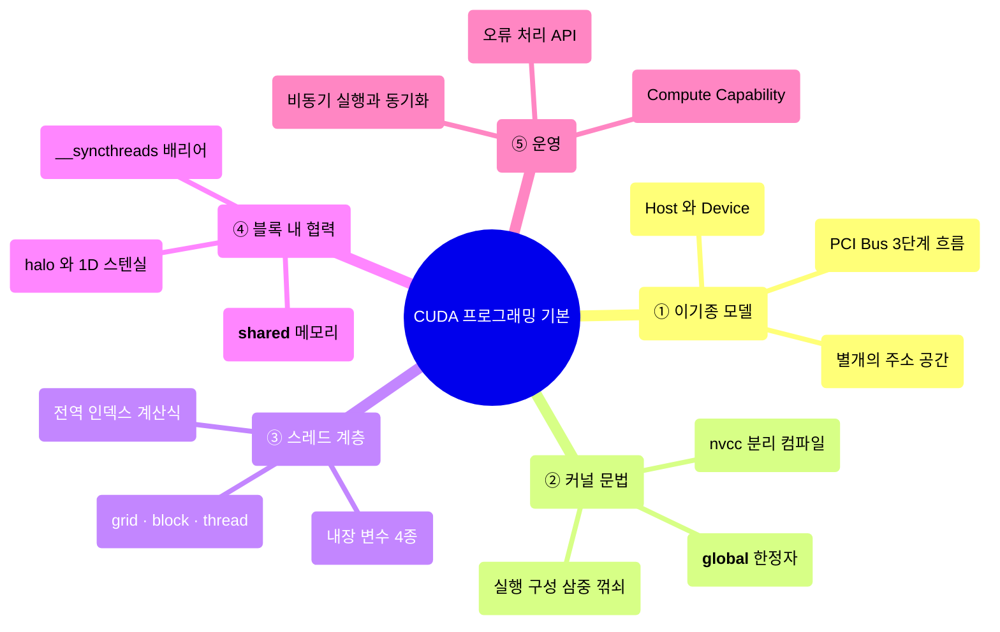
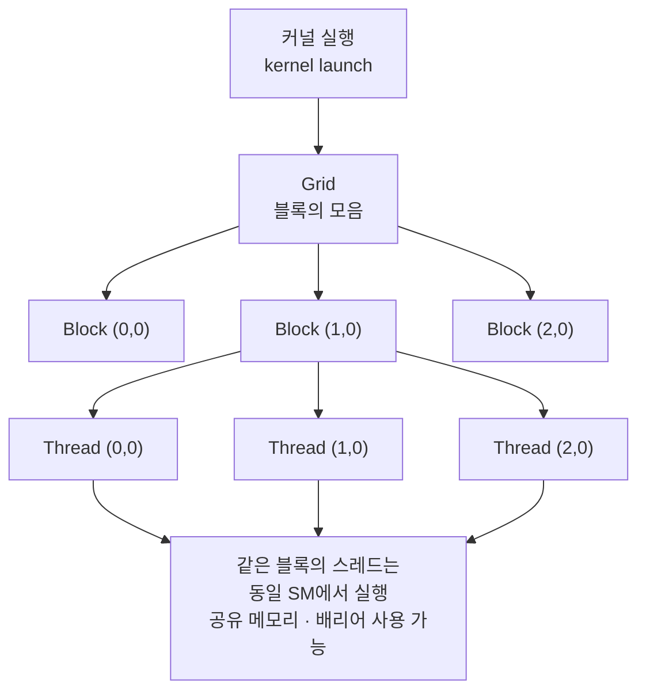
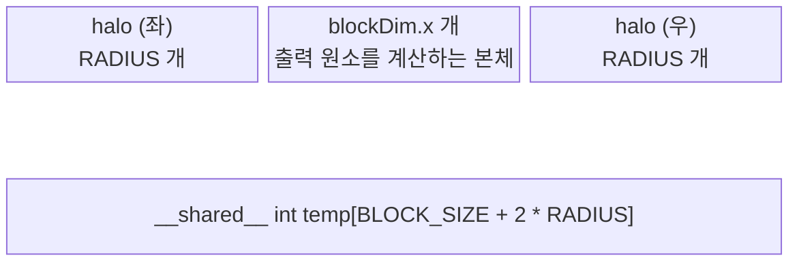
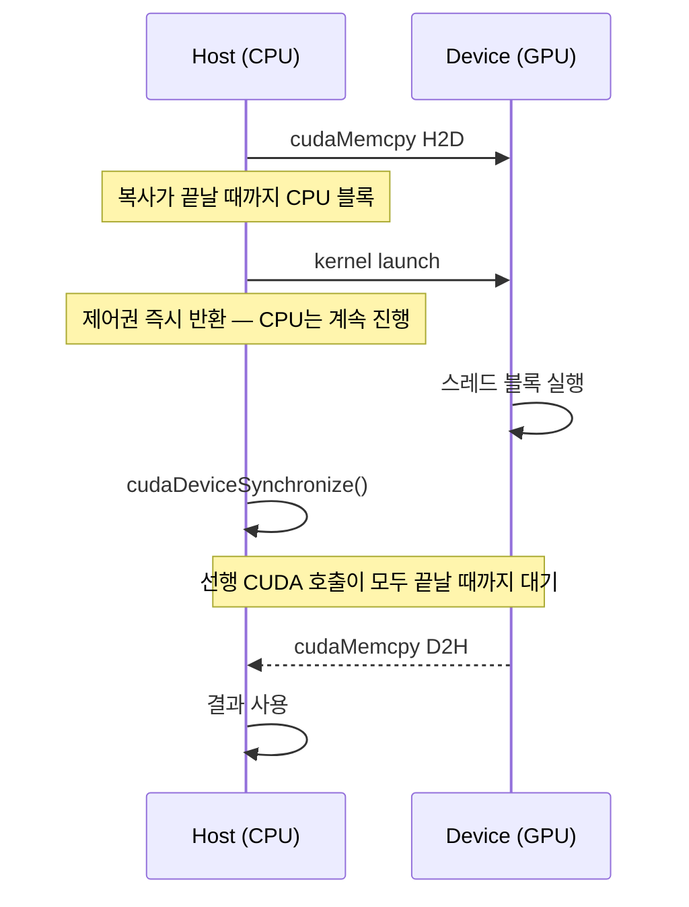
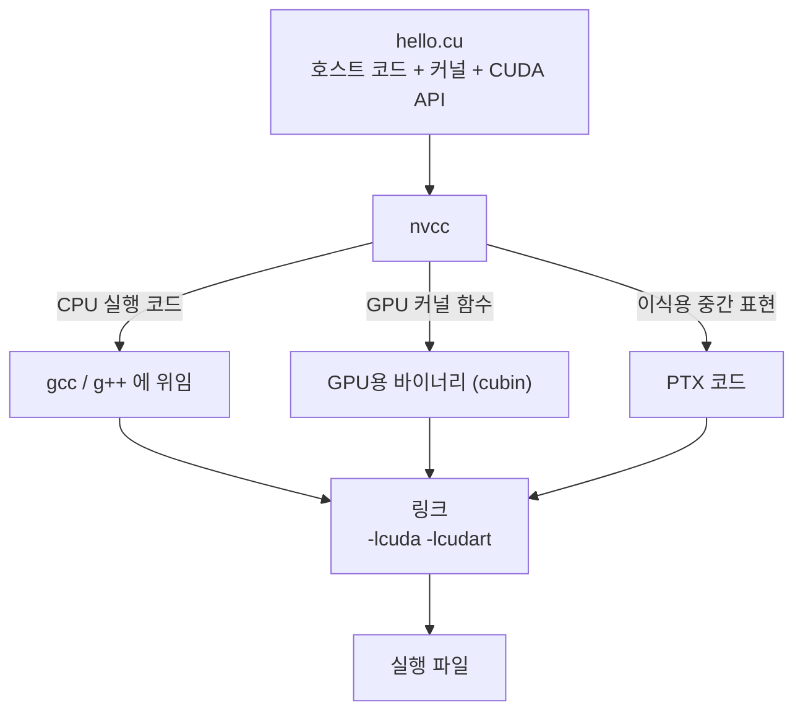

---
aliases:
  - GPU Architecture & CUDA Programming v02
  - CUDA 기본 문법
authority: primary
course: parallel-distributed-computing
created: '2025-05-17'
date: '2025-05-17'
review_state: active
semester: '3-1'
source: pdf/08_GPU Architecture & CUDAProgramming_v02.pdf
source_pages: 110
source_sha256: 7b7a6e6bdda88f54
source_type: lecture-slides
status: seedling
tags:
  - lecture
  - systems
  - distributed
title: 08. GPU 아키텍처와 CUDA 프로그래밍 II
type: lecture
updated: '2026-08-28'
---

source:: `pdf/08_GPU Architecture & CUDAProgramming_v02.pdf` (110p, Stanford CS149 Fall 2024 참고)

# 08. GPU 아키텍처와 CUDA 프로그래밍 II

> [!abstract] 한 줄 요약
> CUDA 프로그램은 **호스트(CPU)와 디바이스(GPU)가 서로 다른 주소 공간을 가진 이기종 시스템**이라는
> 전제 위에 세워진다. 프로그래머가 할 일은 딱 세 가지다 — ① 디바이스 메모리를 확보하고 데이터를 옮기고,
> ② `그리드 → 블록 → 스레드` 계층으로 일을 쪼개 인덱스를 계산하고,
> ③ 블록 안에서는 **공유 메모리 + `__syncthreads()`** 로 협력시키는 것.

## 이 강의의 지도



---

## 1. 이기종 컴퓨팅: 호스트와 디바이스

> [!quote] 슬라이드 근거
> `pdf/08_GPU Architecture & CUDAProgramming_v02.pdf` p.2-8, 67, 72-73

CPU에서 프로그램을 실행할 때는 OS가 프로그램 텍스트를 메모리에 올리고, 실행 컨텍스트를 고르고,
레지스터와 프로그램 카운터를 세팅한 뒤 프로세서를 출발시킨다. GPU는 이 흐름에 **하나의 계층이 더** 붙는다.
GPU는 단독으로 동작하지 않고, **CPU에서 실행되는 호스트 코드가 CUDA API와 커널 함수를 호출하는 방식**으로만 움직인다.

| 용어 | 가리키는 것 |
|:--|:--|
| **Host** | CPU와 CPU의 메모리 (host memory) |
| **Device** | GPU와 GPU의 메모리 (device memory) |
| **Host code** | CPU에서 도는 일반 C/C++ 코드. CUDA API 호출과 커널 호출을 포함 |
| **Device code** | GPU 커널 함수. 스레드 1개가 무엇을 할지 기술. **반환값을 쓸 수 없다** |

> [!info] CUDA란
> NVIDIA GPU에서 GPU 컴퓨팅을 가능하게 하는 **컴파일러·라이브러리를 포함한 프레임워크**다.
> 디바이스 코드는 스레드 ID 같은 내장 변수와 특수 함수가 추가된 것 외에는 평범한 C를 쓸 수 있다.

### 가장 단순한 처리 흐름


세 단계 모두 **PCI Bus**를 건너간다. 즉 ①과 ③은 명백한 비용이고,
이 비용을 넘어설 만큼 ②가 커야 GPU를 쓸 가치가 있다.

> [!warning] 호스트 포인터와 디바이스 포인터를 섞지 말 것
> 호스트와 디바이스 메모리는 **별도의 엔티티**다.
> - 디바이스 포인터는 GPU 메모리를 가리킨다. 호스트 코드에 값으로 전달할 수는 있지만 **호스트에서 역참조 불가**.
> - 호스트 포인터는 CPU 메모리를 가리킨다. 디바이스 코드로 전달할 수는 있지만 **디바이스에서 역참조 불가**.

---

## 2. 첫 커널: `__global__` 과 삼중 꺾쇠

> [!quote] 슬라이드 근거
> `pdf/08_GPU Architecture & CUDAProgramming_v02.pdf` p.9-12, 80-81, 86-88, 93

디바이스 코드가 하나도 없는 `printf("Hello World")` 도 `nvcc` 로 컴파일된다. 여기에 커널을 한 줄 얹으면 이렇게 된다.

```cuda
__global__ void mykernel(void) { }

int main(void) {
    mykernel<<<1, 1>>>();
    printf("Hello World!\n");
    return 0;
}
```

새로 등장한 문법 요소는 두 가지뿐이다.

| 문법 | 의미 |
|:--|:--|
| `__global__` | 이 함수는 **디바이스에서 실행되고 호스트에서 호출된다**는 표시 |
| `kernel<<<Dg, Db>>>(...)` | 호스트 코드에서 디바이스 코드로의 호출 = **커널 실행(kernel launch)** |

### 함수 한정자 3종

| 한정자 | 실행되는 곳 | 호출할 수 있는 곳 |
|:--|:--|:--|
| `__global__` | Device | Host |
| `__device__` | Device | Device |
| `__host__` | Host | Host (일반 C 함수라 보통 생략) |

### 실행 구성의 네 인자

```cuda
kernel_function<<< Dg, Db, Ns, S >>>(a, b, c, ...);
```

| 인자 | 타입 | 의미 |
|:--|:--|:--|
| `Dg` | `dim3` | **그리드 크기** — 그리드 안의 블록 개수 |
| `Db` | `dim3` | **블록 크기** — 블록 안의 스레드 개수 |
| `Ns` | `size_t` | 실행 시 동적으로 잡을 shared 메모리 크기. 생략하면 0 |
| `S` | `cudaStream_t` | 비동기 실행 스트림 번호. 생략하면 0 |

`dim3` 는 3차원 크기 타입이고, 지정하지 않은 차원은 자동으로 1이 된다.

```cuda
dim3 a;             // == dim3 a(1, 1, 1)
dim3 a(n, m);       // == dim3 a(n, m, 1)
dim3 a(n, m, k);    // a.x = n; a.y = m; a.z = k;
```

> [!tip] 커널 안에서 `printf` 를 쓰려면
> 커널 함수 안의 `printf()` 는 Compute Capability 2.0 이상에서만 동작한다.
> `nvcc -arch sm_20 sample01.cu` 처럼 아키텍처를 명시해야 출력이 보인다.
>
> ```cuda
> __global__ void built_in(void) {
>     printf("threadIdx.x=%d\n", threadIdx.x);
> }
> // built_in<<<1, 3>>>();  →  스레드 3개가 각자 자기 threadIdx.x 를 찍는다
> ```

---

## 3. 디바이스 메모리 관리

> [!quote] 슬라이드 근거
> `pdf/08_GPU Architecture & CUDAProgramming_v02.pdf` p.14-19, 77-79

디바이스 코드가 다루는 포인터는 디바이스 메모리를 가리켜야 하므로, **GPU 위에 메모리를 먼저 잡아야 한다.**
CUDA는 C의 `malloc / free / memcpy` 와 거의 1:1로 대응하는 API를 준다.

| CUDA API | C 대응 | 하는 일 |
|:--|:--|:--|
| `cudaMalloc(void **devptr, size_t count)` | `malloc` | 디바이스에 `count` 바이트 확보, 주소를 `devptr` 에 기록 |
| `cudaFree(void *devptr)` | `free` | 디바이스 메모리 해제 |
| `cudaMemcpy(dst, src, count, kind)` | `memcpy` | 주소 공간 사이 데이터 전송 |
| `cudaMallocHost(void **ptr, size_t count)` | `malloc` (특수) | 호스트에 **pinned(page-lock) 메모리** 확보 |

`kind` 에는 `cudaMemcpyHostToDevice`, `cudaMemcpyDeviceToHost`, `cudaMemcpyDeviceToDevice` 를 넣는다.

> [!info] pinned 메모리를 왜 쓰나
> `cudaMallocHost` 로 잡은 호스트 메모리는 페이지 잠금(page lock) 상태라 **전송 속도가 일반 pageable 메모리보다 빠르다.**
> 그리고 **비동기 전송은 page-lock 메모리에 한해서만** 가능하다.

### 정수 두 개 더하기 — 전체 골격

```cuda
__global__ void add(int *a, int *b, int *c) {
    *c = *a + *b;
}

int main(void) {
    int a, b, c;                 // host copies
    int *d_a, *d_b, *d_c;        // device copies
    int size = sizeof(int);

    cudaMalloc((void **)&d_a, size);
    cudaMalloc((void **)&d_b, size);
    cudaMalloc((void **)&d_c, size);

    a = 2; b = 7;
    cudaMemcpy(d_a, &a, size, cudaMemcpyHostToDevice);
    cudaMemcpy(d_b, &b, size, cudaMemcpyHostToDevice);

    add<<<1, 1>>>(d_a, d_b, d_c);          // GPU에서 실행

    cudaMemcpy(&c, d_c, size, cudaMemcpyDeviceToHost);
    cudaFree(d_a); cudaFree(d_b); cudaFree(d_c);
    return 0;
}
```

이 코드의 골격 — **확보 → 전송 → 커널 → 회수 → 해제** — 는 이후 모든 예제에서 그대로 반복된다.

---

## 4. 병렬로 가는 세 가지 방법

> [!quote] 슬라이드 근거
> `pdf/08_GPU Architecture & CUDAProgramming_v02.pdf` p.20-36

`add<<<1,1>>>()` 는 커널을 딱 한 번 실행한다. GPU 컴퓨팅은 대규모 병렬 처리인데 이러면 의미가 없다.
슬라이드는 병렬화를 **세 단계로 점점 발전시킨다.**

| 단계 | 실행 구성 | 커널 인덱싱 | 한계 |
|:--|:--|:--|:--|
| ① 블록만 사용 | `add<<<N, 1>>>` | `blockIdx.x` | 블록끼리는 협력할 수 없다 |
| ② 스레드만 사용 | `add<<<1, N>>>` | `threadIdx.x` | 블록 1개의 스레드 수 한계(최대 1024) |
| ③ 블록 + 스레드 | `add<<<N/M, M>>>` | `threadIdx.x + blockIdx.x * blockDim.x` | 실전에서 쓰는 형태 |

> [!info] 용어 정리
> `add()` 의 **각 병렬 호출을 블록(block)** 이라 하고, **블록의 집합을 그리드(grid)** 라고 한다.
> 각 호출은 `blockIdx.x` 로 자기 블록 인덱스를 알 수 있다.

```cuda
// ① 블록 병렬 — 블록 하나가 원소 하나를 담당
__global__ void add(int *a, int *b, int *c) {
    c[blockIdx.x] = a[blockIdx.x] + b[blockIdx.x];
}

// ② 스레드 병렬 — 블록 안 스레드 하나가 원소 하나를 담당
__global__ void add(int *a, int *b, int *c) {
    c[threadIdx.x] = a[threadIdx.x] + b[threadIdx.x];
}

// ③ 결합 — 실전에서 쓰는 형태
__global__ void add(int *a, int *b, int *c) {
    int index = threadIdx.x + blockIdx.x * blockDim.x;
    c[index] = a[index] + b[index];
}
```

### 전역 인덱스 계산식

블록당 스레드 수를 $M$ (= `blockDim.x`) 이라 할 때, 각 스레드의 고유 인덱스는

$$\text{index} = \texttt{threadIdx.x} + \texttt{blockIdx.x} \times M$$

> [!example] 슬라이드의 확인 문제
> 블록당 스레드 8개($M = 8$)로 배열을 인덱싱한다고 하자.
> `blockIdx.x = 2`, `threadIdx.x = 5` 인 스레드가 담당하는 원소는?
>
> $$\text{index} = 5 + 2 \times 8 = 21$$

### 배열 크기가 딱 안 떨어질 때

`N` 이 `blockDim.x` 의 배수가 아닌 경우가 훨씬 흔하다. **배열 밖 접근을 반드시 막아야 한다.**

```cuda
__global__ void add(int *a, int *b, int *c, int n) {
    int index = threadIdx.x + blockIdx.x * blockDim.x;
    if (index < n)                    // 경계 검사
        c[index] = a[index] + b[index];
}

// 블록 수를 올림으로 계산: ceil(N / M)
add<<<(N + M - 1) / M, M>>>(d_a, d_b, d_c, N);
```

$$\#\text{blocks} = \left\lceil \frac{N}{M} \right\rceil = \frac{N + M - 1}{M}$$

> [!warning] 왜 스레드를 굳이 쓰는가
> 블록만 써도 병렬화는 된다. 스레드는 오히려 복잡성을 더한다.
> 그런데도 스레드를 쓰는 이유는 딱 하나 — **병렬 블록과 달리 스레드에는 통신 메커니즘이 있다.**
> (6절의 공유 메모리와 `__syncthreads()`)

---

## 5. 스레드 계층과 인덱싱 공식

> [!quote] 슬라이드 근거
> `pdf/08_GPU Architecture & CUDAProgramming_v02.pdf` p.38-46, 66, 82-85, 92

커널은 **그리드가 블록을 관리하고, 블록이 스레드를 관리하는 계층 구조**로 실행된다.



### 내장 변수 4종

디바이스 코드 안에서 **선언 없이 참조만 가능**하고, 값을 바꿀 수는 없다. 모두 `.x / .y / .z` 를 갖는다.

| 변수 | 의미 |
|:--|:--|
| `gridDim` | 그리드의 각 방향 크기 = **블록 개수** |
| `blockIdx` | 그리드 안에서 이 블록의 인덱스 |
| `blockDim` | 블록의 각 방향 크기 = **스레드 개수** |
| `threadIdx` | 블록 안에서 이 스레드의 인덱스 |

> [!info] 블록에 걸린 하드웨어 제약
> - 한 블록의 스레드는 **모두 같은 SM(Streaming Multiprocessor)** 에서 실행된다.
> - 동일 블록 내 스레드 최대치는 **1024**.
> - MP 안에 SP가 32개뿐이어도 **64개 이상의 스레드로 돌리는 편이 효율적**이다 (지연 은닉).
> - 블록 내 스레드 수를 늘리면 스레드 하나가 쓸 수 있는 **레지스터 수가 줄어든다.**
>   (Fermi 기준 256 스레드 병렬이면 스레드당 레지스터는 $32768 / 256 = 128$ 개)

### 차원 조합별 전역 스레드 ID 공식

슬라이드는 그리드/블록 차원 조합마다 공식을 하나씩 유도한다. 원리는 언제나 같다 —
**앞선 블록들이 소비한 스레드 수를 모두 더하고, 블록 안에서의 오프셋을 더한다.**

| 조합 | 공식 |
|:--|:--|
| 1D grid of 1D blocks | `blockIdx.x * blockDim.x + threadIdx.x` |
| 1D grid of 2D blocks (열 우선 누적) | `blockIdx.x * blockDim.x * blockDim.y + threadIdx.y * blockDim.x + threadIdx.x` |
| 1D grid of 2D blocks (행 우선 누적) | `gridDim.x * blockDim.x * threadIdx.y + blockDim.x * blockIdx.x + threadIdx.x` |
| 2D grid of 1D blocks | `blockId = gridDim.x * blockIdx.y + blockIdx.x`<br/>`threadId = blockId * blockDim.x + threadIdx.x` |
| 2D grid of 2D blocks | `blockId = gridDim.x * blockIdx.y + blockIdx.x`<br/>`threadId = blockId * (blockDim.x * blockDim.y) + threadIdx.y * blockDim.x + threadIdx.x` |

> [!example] 슬라이드의 검산 두 개
> **2D grid of 1D blocks** — `gridDim.x = 2`, `blockDim.x = 3`, 블록 (1,1) 의 스레드 (1,0):
> $$\text{blockId} = 2 \times 1 + 1 = 3, \qquad \text{threadId} = 3 \times 3 + 1 = 10$$
>
> **2D grid of 2D blocks** — `gridDim.x = 2`, `blockDim = (3,2)`, 블록 (0,1) 의 스레드 (2,1):
> $$\text{blockId} = 2 \times 1 + 0 = 2, \qquad \text{threadId} = 2 \times (3 \times 2) + 1 \times 3 + 2 = 17$$

원본 도해(블록·스레드 번호가 색으로 표시된 격자 그림)는 아래 페이지에서 직접 확인할 수 있다.
텍스트로 옮기면 오히려 헷갈리는 부분이라, 위 공식과 함께 그림을 같이 보는 편이 빠르다.

[08_GPU Architecture & CUDAProgramming_v02 p.46](<./pdf/08_GPU Architecture & CUDAProgramming_v02.pdf>)

> [!note] 보충 — 산수 연습 문제 비유 (p.97-98)
> 슬라이드는 이 계층 구조를 학급에 비유한다.
> **호스트 코드는 선생님**이다. 48명을 몇 개 반으로 나눌지 정하고, 전교생에게 **똑같은 지시**만 내릴 수 있다.
> **디바이스 코드는 학생 개개인**이다. "우리 반이 몇 번째 반인지(`blockIdx`), 반에 몇 명이 있는지(`blockDim`),
> 내가 몇 번인지(`threadIdx`)"를 조합해 **자기가 풀 문제 번호를 스스로 계산**한다.
> SPMD(Single Program Multiple Data)가 정확히 이 구조다.

---

## 6. 1D 스텐실: 공유 메모리와 동기화

> [!quote] 슬라이드 근거
> `pdf/08_GPU Architecture & CUDAProgramming_v02.pdf` p.48-61

### 스텐실이란

> [!info] 정의
> **스텐실(stencil)** 은 한 점의 계산에 영향을 주는 **인접한 점들의 집합**이자,
> 그 점의 값을 자기 값과 이웃 값으로부터 계산하는 방법을 정의한 것이다.
> 반드시 바로 옆 점일 필요는 없고, 반경(radius)만큼 떨어진 점도 포함할 수 있다.

1D 배열에 반경 3짜리 스텐실을 적용하면, **출력 원소 하나가 입력 원소 7개의 합**이 된다.
2D에서는 5점 라플라스 연산자가 대표적이고, 이는 이미지의 가장자리(edge)를 찾는 데 쓰인다.

$$\text{out}[i] = \sum_{k=-R}^{R} \text{in}[i+k] \qquad (R = \texttt{RADIUS})$$

### 문제: 경계와 중복 읽기

각 스레드가 출력 원소 하나를 맡으면 블록당 `blockDim.x` 개의 출력이 나온다.
그런데 **반경 3이면 입력 원소 하나를 7번 읽는다.** 전역 메모리를 7번 왕복하는 건 낭비다.

또 배열을 청크로 나눠 병렬 처리하면 **청크 경계에서 이웃 청크의 값이 필요**해진다.
필요할 때마다 이웃에서 하나씩 가져오면 작은 통신이 잔뜩 발생해 지연이 커진다.

> [!tip] 해결책 — 고스트 셀(ghost cell)과 halo
> 각 청크 가장자리에 **여분의 공간(고스트 셀)** 을 미리 잡아 두고, 이웃의 테두리를 **한 번에 복사**해 둔다.
> 이 복제 테두리가 청크를 감싸는 **halo** 를 형성한다. 고스트 셀은 로컬로 갱신되지 않지만,
> 이 청크의 테두리를 계산할 때 스텐실 값을 제공한다.



### 공유 메모리

> [!info] `__shared__`
> 블록 내부의 스레드는 **공유 메모리(shared memory)** 를 통해 데이터를 주고받는다.
> - **매우 빠른 온칩 메모리**, 하드웨어가 아니라 **사용자가 직접 관리**한다.
> - `__shared__` 로 선언하며 **블록당 하나씩** 할당된다.
> - **다른 블록의 스레드에는 보이지 않는다.** 참조 자체가 불가능하다.

전략은 이렇다.
1. 전역 메모리 → 공유 메모리로 `blockDim.x + 2 * RADIUS` 개 입력을 읽는다.
2. 공유 메모리 위에서 `blockDim.x` 개의 출력을 계산한다.
3. 결과를 전역 메모리에 쓴다.

```cuda
__global__ void stencil_1d(int *in, int *out) {
    __shared__ int temp[BLOCK_SIZE + 2 * RADIUS];
    int gindex = threadIdx.x + blockIdx.x * blockDim.x;  // 전역 인덱스
    int lindex = threadIdx.x + RADIUS;                   // 공유 메모리 내 인덱스

    // 입력 원소를 공유 메모리로 읽어 들인다
    temp[lindex] = in[gindex];
    if (threadIdx.x < RADIUS) {                          // 앞쪽 스레드가 halo 담당
        temp[lindex - RADIUS]     = in[gindex - RADIUS];
        temp[lindex + BLOCK_SIZE] = in[gindex + BLOCK_SIZE];
    }

    __syncthreads();   // ★ 모든 데이터가 준비될 때까지 대기

    // 스텐실 적용
    int result = 0;
    for (int offset = -RADIUS; offset <= RADIUS; offset++)
        result += temp[lindex + offset];

    out[gindex] = result;
}
```

### `__syncthreads()` 가 없으면 — Data Race

> [!warning] 배리어를 빼면 이 커널은 틀린 답을 낸다
> 스레드 0이 halo를 아직 가져오지 않았는데 스레드 15가 먼저 `temp[19]` 를 읽는 상황을 생각해 보자.
>
> | 스레드 | 하는 일 | 결과 |
> |:--|:--|:--|
> | 스레드 15 | `temp[lindex] = in[gindex]` | `temp[18]` 에 저장 |
> | 스레드 15 | `if (threadIdx.x < RADIUS)` | **건너뜀** (15 > 3) |
> | 스레드 15 | `result += temp[lindex + 1]` | `temp[19]` 를 읽음 — **아직 아무도 안 채웠다** |
>
> 초기화되지 않은 값이 합산에 들어간다. 이것이 전형적인 **data race** 다.

> [!info] `void __syncthreads();`
> **블록 내의 모든 스레드를 동기화하는 배리어**다. RAW / WAR / WAW 위험(hazard)을 막는 데 쓴다.
> - **모든 스레드가 배리어에 도달해야 한다.**
> - 따라서 조건문 안에 넣으려면 **그 조건이 블록 전체에서 균일**해야 한다. 일부만 도달하면 교착이다.

> [!summary] 이 절의 요약 (p.60-61 Review)
> - `kernel<<<N, M>>>(...)` — 블록 N개, 블록당 스레드 M개
> - `blockIdx.x` 로 그리드 내 블록 인덱스, `threadIdx.x` 로 블록 내 스레드 인덱스 접근
> - 원소 할당은 `int index = threadIdx.x + blockIdx.x * blockDim.x;`
> - `__shared__` 로 블록 내 공유 변수 선언 → 다른 블록에서는 안 보임
> - `__syncthreads()` 로 데이터 위험 방지

---

## 7. 호스트와 디바이스의 협력 · 오류 처리

> [!quote] 슬라이드 근거
> `pdf/08_GPU Architecture & CUDAProgramming_v02.pdf` p.62-64, 101-102, 105

> [!important] 커널 실행은 **비동기(asynchronous)** 다
> `kernel<<<...>>>()` 를 호출하면 제어권이 **즉시 CPU로 돌아온다.**
> CPU가 결과를 소비하기 전에 반드시 동기화해야 한다.



| API | 동작 |
|:--|:--|
| `cudaMemcpy()` | 복사가 끝날 때까지 **CPU를 블록**. 선행 CUDA 호출이 모두 끝나야 복사를 시작 |
| `cudaMemcpyAsync()` | **비동기**. CPU를 블록하지 않음 |
| `cudaDeviceSynchronize()` | 선행 CUDA 호출이 전부 끝날 때까지 CPU를 블록 |

### 오류 처리

모든 CUDA API 호출은 `cudaError_t` 타입의 에러 코드를 반환한다. 이 코드는 두 가지를 알려준다 —
**그 API 호출 자체의 오류**, 또는 **앞서 실행된 비동기 연산(예: 커널)의 오류**.

```cuda
cudaError_t cudaGetLastError(void);        // 마지막 에러 코드
char*       cudaGetErrorString(cudaError_t);  // 사람이 읽을 문자열

printf("%s\n", cudaGetErrorString(cudaGetLastError()));
```

> [!example] 실제로 마주치는 에러 두 개
> - `cudaMalloc` 없이 `cudaMemcpy` 를 호출 → **invalid device pointer**
> - `grid.x = 65536` 으로 커널 실행 → **invalid configuration argument**
>   (최대값 65535 초과. 커널 함수는 반환값이 없으므로 이런 오류는 `cudaGetLastError()` 로만 잡힌다.)

### 디바이스 관리

같은 노드에 GPU가 여러 개일 때 필수다. 여러 스레드가 한 디바이스를 공유할 수도 있고,
한 스레드가 여러 디바이스를 관리할 수도 있다 (`cudaSetDevice(i)` 로 전환, `cudaMemcpy` 로 P2P 복사).

| API | 하는 일 |
|:--|:--|
| `cudaGetDeviceCount(int *count)` | CUDA가 동작하는 GPU 개수 |
| `cudaSetDevice(int device)` | 이후 실행을 해당 GPU로 설정 |
| `cudaGetDevice(int *device)` | 현재 지정된 디바이스 번호 |
| `cudaGetDeviceProperties(cudaDeviceProp *prop, int device)` | `deviceQuery` 와 동일한 정보를 구조체로 |

---

## 8. 빌드 환경: nvcc 와 Compute Capability

> [!quote] 슬라이드 근거
> `pdf/08_GPU Architecture & CUDAProgramming_v02.pdf` p.65, 74-76

CUDA 소스는 `.cu` 확장자를 쓰고 `nvcc` 로 컴파일한다. `nvcc` 가 하는 핵심 일은 **분리**다.



| 라이브러리 | 링크 옵션 |
|:--|:--|
| CUDA core library | `-lcuda` |
| CUDA runtime library | `-lcudart` |

### 주요 컴파일 옵션

| 옵션 | 의미 |
|:--|:--|
| `-arch sm_20` | Compute Capability에 맞춰 컴파일. `deviceQuery` 로 확인한 값 **이하**를 지정 |
| `--maxrregcount <N>` | 커널당 사용할 레지스터 개수를 N으로 제한. 지정한 병렬 수를 확보할 수 있지만, **초과분은 local 메모리로 밀려나 느려진다** |
| `-use_fast_math` | 빠른 수학 함수 사용 |
| `-G` | 디바이스 코드 디버깅 활성화 |
| `--ptxas-options=-v` | 레지스터·메모리 사용 현황 출력 |
| `--generate-code arch=...,code=...` | 특정 환경에 최적화된 코드 생성 |

```bash
nvcc --generate-code arch=compute_30,code=sm_30 \
     --generate-code arch=compute_50,code=sm_50 prog.cu
```

> [!info] Compute Capability
> GPU의 **아키텍처 버전 지표**다. 레지스터 개수, 메모리 크기, 지원 기능이 여기에 따라 결정된다.
>
> | CC | 추가된 주요 기능 | Tesla 모델 |
> |:--:|:--|:--|
> | 1.0 | 기본 CUDA 지원 | 870 |
> | 1.3 | 배정밀도, 개선된 메모리 접근, atomics | 10-series |
> | 2.0 | 캐시, FMA, 3D 그리드, surface, ECC, P2P, 동시 커널/복사, 함수 포인터, 재귀 | 20-series |
>
> 현재는 7.x, 8.x 같은 버전으로 구분된다.

> [!warning] PTX의 호환 방향은 한쪽뿐이다
> 특정 CC용으로 만든 PTX는 **같거나 더 새로운 CC** 에서 바이너리로 컴파일할 수 있다.
> CC 5.0(`compute_50`)용 PTX는 CC 6.0 환경에서 (최적은 아니어도) 쓸 수 있지만,
> **CC 4.0 환경에서는 쓸 수 없다.** 여러 CC를 지원하려면 그만큼 컴파일 시간을 지불해야 한다.

---

## 9. 실습: 전송 · 시간 측정 · 다차원 배열

> [!quote] 슬라이드 근거
> `pdf/08_GPU Architecture & CUDAProgramming_v02.pdf` p.89-91, 94-95, 99-100, 103-110

### 데이터 전송 테스트

호스트 배열 `a_h[n]` → 디바이스 `a_d[n]` → (커널에서 복사) → `b_d[n]` → 호스트 `b_h[n]` 로 한 바퀴 돌린다.

```cuda
#define NUM (1024*1024*1)          // 1~16 등으로 바꿔가며 실험
int n = NUM;
double *a_h, *b_h, *a_d, *b_d;

a_h = (double *)malloc(n * sizeof(double));
for (int i = 0; i < n; i++) a_h[i] = 9.3;
b_h = (double *)malloc(n * sizeof(double));
for (int i = 0; i < n; i++) b_h[i] = 0.0;

cudaMalloc((void **)&a_d, n * sizeof(double));
cudaMalloc((void **)&b_d, n * sizeof(double));

cudaMemcpy(a_d, a_h, n * sizeof(double), cudaMemcpyHostToDevice);

dim3 grid(n / 256), block(256);    // 블록 크기 256
g2g_copy<<<grid, block>>>(a_d, b_d);
// 또는 g2g_copy<<<n/256, 256>>>(a_d, b_d);

cudaMemcpy(b_h, b_d, n * sizeof(double), cudaMemcpyDeviceToHost);
```

CPU에서 같은 일을 하면 그냥 `for (int j = 0; j < N; j++) b_h[j] = a_h[j];` 한 줄이다.
**N개의 스레드를 만들어 스레드 하나가 배열 원소 하나에 접근**하는 것이 GPU 방식이다.

### 소요 시간 측정

> [!tip] 왜 재는가
> 경과 시간을 측정하면 GPU Computing의 성능을 확인할 수 있고, **하드웨어의 실행 모습을 상상할 수 있다.**
> 튜닝에는 필수다.

```c
#include <cutil.h>
unsigned int timer;
cutCreateTimer(&timer);

cudaThreadSynchronize();   // 이전 비동기 실행이 끝날 때까지 대기
cutStartTimer(timer);
    /* ── 계측 범위 ── */
cudaThreadSynchronize();   // 이 구간의 비동기 실행이 끝날 때까지 대기
cutStopTimer(timer);

double elapsed_time = cutGetTimerValue(timer);   // msec
```

> [!warning] 동기화 없이 재면 0에 가까운 값이 나온다
> 커널 실행이 비동기이기 때문에, 타이머 시작/종료 **양쪽에** `cudaThreadSynchronize()` 를 넣지 않으면
> "커널을 호출하는 데 걸린 시간"을 재게 된다. 실제 실행 시간이 아니다.

FLOPS는 여기서 나온다. `C[i] = A[i] + B[i]` 는 **스레드당 연산이 1회**이므로,

$$\text{FLOPS} = \frac{N \times 1}{\text{elapsed time (s)}}$$

### 다차원 배열

GPU 커널 함수 안에서 다차원 배열을 쓰고 싶은 경우가 있지만, `cudaMallocPitch()` / `cudaMemcpy2D()` 를 써도
**커널에서 쉽게 다차원 배열로 다룰 수는 없다.** 슬라이드는 프로그래밍적으로 권장하지 않는다고 못 박으면서
간접 참조를 통한 우회 방법을 제시한다. 실무에서는 `NX * NY` 짜리 **1차원 배열을 2차원처럼 인덱싱**하는 쪽이 정석이다.

$$\text{index}(y, x) = y \times N_X + x$$

> [!warning] 그리드 크기 상한
> `#define N (1024*1024*20)` 처럼 크게 잡으면 1D 그리드로는 **최대 블록 수 제한(65535)** 을 넘어간다.
> 2차원 인덱싱은 이 제한을 피하는 수단이기도 하다.

---

## 핵심 정리

| 개념 | 한 줄 정의 | 왜 중요한가 |
|:--|:--|:--|
| **Host / Device** | CPU와 그 메모리 / GPU와 그 메모리 | 두 주소 공간이 분리돼 있다는 것이 CUDA의 모든 제약의 출발점 |
| **`__global__`** | 디바이스에서 실행되고 호스트에서 호출되는 함수 | 커널을 커널로 만드는 유일한 표시 |
| **실행 구성 `<<<Dg, Db, Ns, S>>>`** | 그리드 크기·블록 크기·동적 공유 메모리·스트림 | 병렬성의 형태를 프로그래머가 직접 정한다 |
| **Grid / Block / Thread** | 블록의 모음 / 스레드의 모음 / 실행 단위 | 인덱싱과 하드웨어 매핑이 모두 이 계층 위에서 정의됨 |
| **`blockDim` 기반 전역 인덱스** | `threadIdx.x + blockIdx.x * blockDim.x` | 블록·스레드를 동시에 쓰는 실전 커널의 표준 관용구 |
| **`__shared__`** | 블록당 할당되는 사용자 관리형 온칩 메모리 | 전역 메모리 중복 읽기를 없애는 핵심 도구 |
| **halo / 고스트 셀** | 청크 가장자리에 미리 잡아 두는 이웃 값 복제본 | 경계 계산 때마다 작은 통신이 터지는 것을 막는다 |
| **`__syncthreads()`** | 블록 내 전 스레드 배리어 | 없으면 공유 메모리 예제가 곧바로 data race |
| **비동기 커널 실행** | 커널 호출 후 제어권이 즉시 CPU로 반환 | 시간 측정·결과 소비 전에 반드시 동기화해야 함 |
| **Compute Capability** | GPU의 아키텍처·기능 버전 지표 | `-arch` 지정과 PTX 호환 범위를 결정 |

> [!question]- 스스로 점검
> **Q1.** `add<<<N,1>>>` 과 `add<<<1,N>>>` 은 둘 다 N개를 병렬 처리한다. 그런데도 실전에서 `add<<<N/M,M>>>` 을 쓰는 이유는?
> **A1.** 블록 하나의 스레드 수에는 상한(최대 1024)이 있어 `<<<1,N>>>` 은 확장되지 않고, `<<<N,1>>>` 은 스레드가 하나뿐이라 **블록 내 협력(공유 메모리·배리어)** 을 전혀 쓸 수 없다. 둘을 결합해야 확장성과 협력을 동시에 얻는다.
>
> **Q2.** 블록당 스레드가 8개이고 `blockIdx.x = 2`, `threadIdx.x = 5` 인 스레드가 담당하는 배열 원소 번호는?
> **A2.** $5 + 2 \times 8 = 21$ 번.
>
> **Q3.** `N` 이 `blockDim.x` 의 배수가 아닐 때 커널과 실행 구성을 어떻게 고쳐야 하나?
> **A3.** 커널 안에 `if (index < n)` 경계 검사를 넣고, 블록 수를 올림으로 계산해 `add<<<(N + M - 1) / M, M>>>(..., N)` 로 실행한다.
>
> **Q4.** 스텐실 커널에서 `__syncthreads()` 를 빼면 정확히 무슨 일이 벌어지나?
> **A4.** halo를 채우는 앞쪽 스레드(`threadIdx.x < RADIUS`)보다 뒤쪽 스레드가 먼저 `temp[]` 를 읽을 수 있다. 아직 아무도 쓰지 않은 공유 메모리 값을 합산하게 되고, 결과가 틀린다. 전형적인 data race다.
>
> **Q5.** `__syncthreads()` 를 조건문 안에 넣을 때 지켜야 할 규칙은?
> **A5.** 그 조건이 **블록 전체에 걸쳐 균일**해야 한다. 일부 스레드만 배리어에 도달하면 나머지가 영원히 기다린다.
>
> **Q6.** 커널을 실행한 직후 `cutStopTimer()` 로 시간을 쟀더니 거의 0이 나왔다. 원인은?
> **A6.** 커널 실행이 비동기라 제어권이 즉시 CPU로 돌아왔기 때문이다. 계측 구간 앞뒤에 `cudaThreadSynchronize()`(또는 `cudaDeviceSynchronize()`)를 넣어야 실제 실행 시간을 잰다.
>
> **Q7.** CC 5.0용으로 빌드한 PTX 코드를 CC 4.0 GPU에서 쓸 수 있나?
> **A7.** 없다. PTX는 **같거나 더 새로운** Compute Capability 쪽으로만 컴파일된다. CC 6.0에서는 (최적은 아니어도) 쓸 수 있다.

## 슬라이드 근거

| 섹션 | 슬라이드 |
|:--|:--|
| 1. 이기종 컴퓨팅 — 호스트와 디바이스 | p.2-8, 16, 67, 72-73 |
| 2. 첫 커널 — `__global__` 과 삼중 꺾쇠 | p.9-12, 80-81, 86-88, 93 |
| 3. 디바이스 메모리 관리 | p.14-19, 77-79 |
| 4. 병렬로 가는 세 가지 방법 | p.20-37 |
| 5. 스레드 계층과 인덱싱 공식 | p.38-46, 66, 82-85, 92, 97-98 |
| 6. 1D 스텐실 — 공유 메모리와 동기화 | p.48-61 |
| 7. 호스트·디바이스 협력, 오류 처리 | p.62-64, 101-102, 105 |
| 8. nvcc 와 Compute Capability | p.65, 74-76 |
| 9. 실습 — 전송·시간 측정·다차원 배열 | p.89-91, 94-95, 99-100, 103-110 |

## 관련 노트

- [07. CUDA 설치와 개발 환경](<./07. CUDA 설치와 개발 환경.md>) — 이 노트의 코드를 실제로 돌릴 환경 준비
- [09. GPU 아키텍처와 CUDA 프로그래밍 III](<./09. GPU 아키텍처와 CUDA 프로그래밍 III.md>) — 여기서 쓴 추상화가 SM·워프 위에서 **어떻게 구현되는지**
- [06. 지역성·통신·경합](<./06. 지역성·통신·경합.md>) — 공유 메모리와 halo가 해결하려는 통신 문제의 원리
- [04. 병렬 프로그래밍 기본](<./04. 병렬 프로그래밍 기본.md>) — 분해·할당·조정이라는 일반 틀에서 본 CUDA
- [01. 왜 병렬 처리인가](<./01. 왜 병렬 처리인가.md>) — 데이터 이동 비용이 왜 성능을 지배하는가
