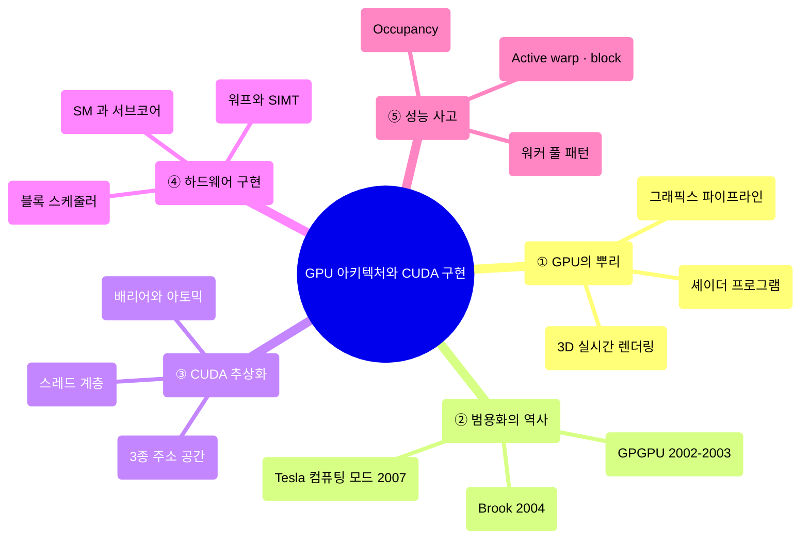
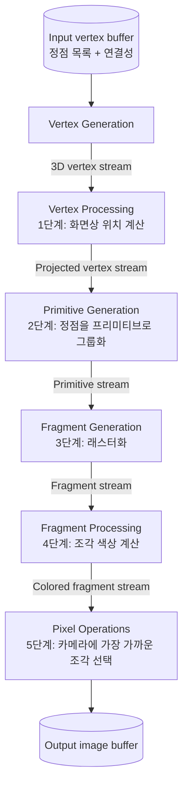
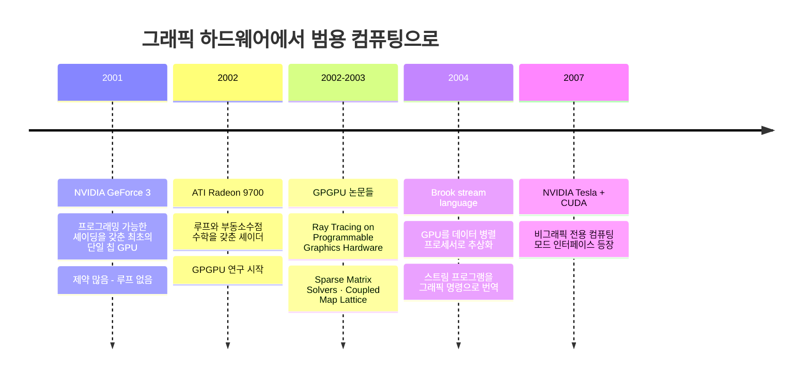
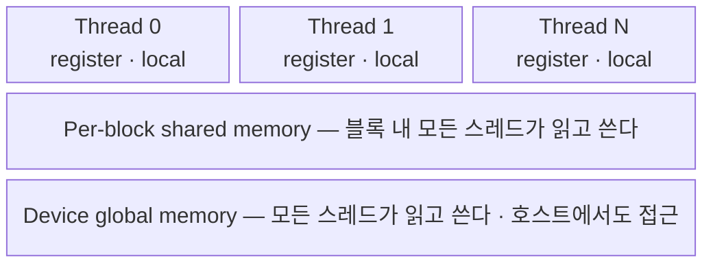
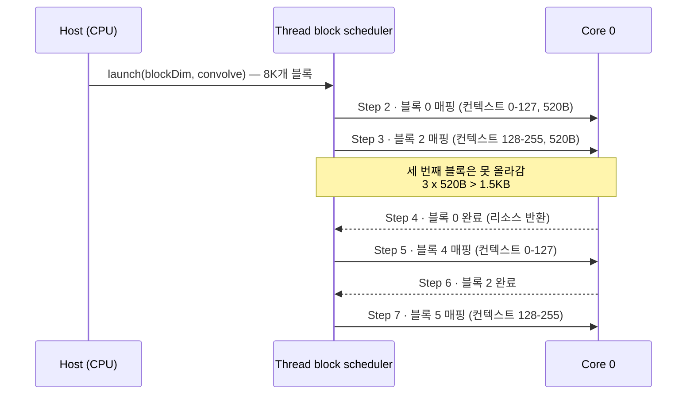
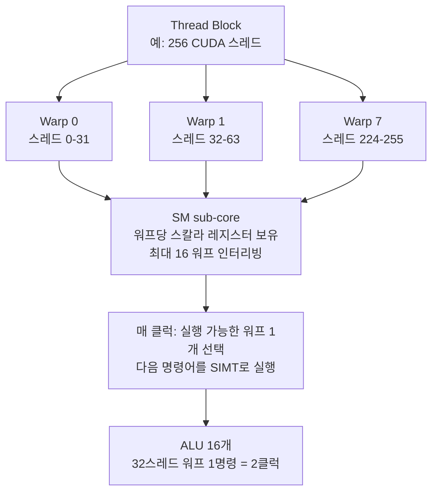

---
aliases:
  - GPU Architecture & CUDA Programming v03
  - 워프와 SM
authority: primary
course: parallel-distributed-computing
created: '2025-05-17'
date: '2025-05-17'
review_state: active
semester: '3-1'
source: pdf/09_GPU Architecture & CUDAProgramming_v03.pdf
source_pages: 99
source_sha256: 7aece6ba94128e10
source_type: lecture-slides
status: seedling
tags:
  - lecture
  - systems
  - distributed
title: 09. GPU 아키텍처와 CUDA 프로그래밍 III
type: lecture
updated: '2026-08-28'
---

source:: `pdf/09_GPU Architecture & CUDAProgramming_v03.pdf` (99p, Stanford CS149 Fall 2024 참고)

# 09. GPU 아키텍처와 CUDA 프로그래밍 III

> [!abstract] 한 줄 요약
> GPU는 3D 렌더링 전용 하드웨어에서 출발해 **셰이더 → GPGPU → CUDA 컴퓨팅 모드**를 거쳐 범용 병렬 엔진이 되었다.
> CUDA가 프로그래머에게 보여주는 것은 **스레드 계층 + 3종 주소 공간 + 배리어/아토믹**이라는 추상화뿐이고,
> 그 아래에서 하드웨어는 **스레드 블록을 SM에 동적으로 배치하고, 블록을 32스레드 워프로 잘라 SIMT로 실행**한다.
> 이 둘의 간극 — 추상화와 구현 — 을 정확히 구분하는 것이 이 강의의 목표다.

## 이 강의의 지도



---

## 1. GPU는 원래 무엇을 하려고 만들어졌나

> [!quote] 슬라이드 근거
> `pdf/09_GPU Architecture & CUDAProgramming_v03.pdf` p.2-8

> [!info] 이 강의의 출발점
> 원래 **3D 게임 가속**을 위해 설계된 그래픽 프로세서가, 어떻게 **딥러닝 · 컴퓨터 비전 · 과학 계산**을 위한
> 고도의 병렬 컴퓨팅 엔진으로 진화했는가를 따라간다.

기본 GPU 아키텍처는 결국 **멀티코어 칩**이고, 여기에 두 가지가 얹혀 있다.

| 특징 | 내용 |
|:--|:--|
| **코어 내 SIMD 실행** | 하나의 코어 안에서 여러 실행 유닛이 **동일한 명령**을 수행 |
| **코어 내 멀티스레딩** | 하나의 코어에서 여러 스레드가 동시에 살아 있음 (지연 은닉) |
| **고대역폭 메모리** | 하이엔드 GPU 기준 **~150-300 GB/s**, DDR5 DRAM 수 GB |

렌더링이란 무엇인가? **3D 메시의 각 삼각형이 이미지의 각 픽셀 모양에 어떻게 기여하는지를 계산하는 것**이다.
입력은 장면(3D 표면 기하, 재질, 조명, 카메라), 출력은 이미지다. 하이엔드 GPU는 이걸 **실시간 30 fps** 로 해낸다.

| 그래픽스 기본 요소 | 의미 |
|:--|:--|
| **Vertex** | 3D 공간의 점 |
| **Primitive** | 정점들을 묶은 도형 (삼각형, 점, 선) |
| **Fragment** | 프리미티브가 덮은 픽셀 하나에 대응하는 후보 조각 |
| **Pixel** | 최종 이미지의 화소 |

---

## 2. 실시간 그래픽스 파이프라인

> [!quote] 슬라이드 근거
> `pdf/09_GPU Architecture & CUDAProgramming_v03.pdf` p.11-17

파이프라인은 **그림을 그리는 과정을 정점 → 프리미티브 → 조각 → 픽셀에 대한 일련의 연산으로 추상화**한 것이다.



| 단계 | 하는 일 |
|:--|:--|
| **Vertex Processing** | 카메라 위치가 주어졌을 때 정점이 **화면 어디에 놓이는지** 계산 |
| **Primitive Generation** | 정점 3개마다 삼각형 하나 식으로 **프리미티브를 구성** |
| **Fragment Generation (Rasterization)** | 프리미티브가 겹치는 **각 픽셀마다 조각 하나** 생성 |
| **Fragment Processing** | 조명과 재질 속성을 바탕으로 **조각의 색을 계산** |
| **Pixel Operations** | 여러 표면이 겹친 픽셀에서 **카메라에 가장 가까운 조각의 색**을 채택 |

> [!info] 입력 정점 버퍼는 그냥 배열이다
> ```c
> list_of_positions = { v0x, v0y, v0z,
>                       v1x, v1y, v1z,
>                       v2x, v2y, v2z,
>                       v3x, v3y, v3z };
> // triangle 0 = {v0, v1, v2}
> // triangle 1 = {v1, v2, v3}
> ```
> 정점 3개마다 삼각형 하나를 정의하는 규칙만 있으면 된다. **대규모 데이터 스트림 위의 균일한 연산** —
> 이 구조가 나중에 CUDA로 이어진다.

---

## 3. 셰이더: 프로그래밍 가능해진 파이프라인

> [!quote] 슬라이드 근거
> `pdf/09_GPU Architecture & CUDAProgramming_v03.pdf` p.18-28

초기 OpenGL API는 조명과 재질을 **파라미터 설정**으로만 다뤘다.

```c
glLight(light_id, parameter_id, parameter_value);       // color, position, direction
glMaterial(face, parameter_id, parameter_value);        // color, shininess
```

문제는 세상의 재질과 조명이 이 파라미터 몇 개로 표현되지 않는다는 것이었다.
그래서 **셰이딩 언어**가 등장한다. 프로그래머가 파이프라인 특정 단계의 로직을 정의하는 **미니 프로그램(셰이더)** 을 제공하면,
**파이프라인이 그 함수를 입력 스트림의 모든 원소에 매핑**한다.

```c
// GLSL fragment shader — 삼각형이 덮은 픽셀마다 한 번씩 실행
uniform sampler2D myTexture;   // read-only global variables
uniform float3 lightDir;
varying vec3 norm;             // per-fragment inputs
varying vec2 uv;

void myFragmentShader()
{
    vec3 kd = texture2D(myTexture, uv);
    kd *= clamp(dot(lightDir, norm), 0.0, 1.0);
    return vec4(kd, 1.0);      // per-fragment output: 픽셀의 RGBA 색상
}
```

> [!important] 이 코드에서 중요한 건 문법이 아니다
> 슬라이드가 강조하는 포인트는 딱 하나 — **이것은 입력 스트림 위에서 동작하는 커널 함수다.**
> 이름만 "fragment shader"일 뿐, 구조는 CUDA 커널과 동일하다.

### 셰이더를 그래픽 말고 다른 계산에 쓰면?

> [!example] GPGPU의 발상 (p.25)
> 1. OpenGL 출력 이미지 크기를 원하는 **출력 배열 크기**(예: 512 × 512)로 설정한다.
> 2. 화면을 정확히 덮는 **삼각형 2개**를 렌더링한다.
> 3. 그러면 픽셀당 셰이더 계산 1회 = **출력 배열 원소당 계산 1회**가 된다.
>
> 이제 GPU를 **데이터 병렬 프로그래밍 시스템처럼** 쓸 수 있다.



> [!note] 보충 — Brook (2004, Stanford graphics lab)
> Brook 컴파일러는 일반 스트림 프로그램을 **당시 GPU가 실행할 수 있는 그래픽 명령어**
> (예: `drawTriangles`)와 셰이더 프로그램 세트로 번역했다.
> 즉 2004년까지는 GPU를 쓰려면 여전히 "그림을 그리는 척"을 해야 했다.

---

## 4. 컴퓨팅 모드의 등장: 2007년 Tesla

> [!quote] 슬라이드 근거
> `pdf/09_GPU Architecture & CUDAProgramming_v03.pdf` p.31-36, 40-46

CPU에서 코드를 실행하는 과정은 OS가 프로그램 텍스트를 로드하고, 실행 컨텍스트를 고르고,
레지스터와 PC를 세팅한 뒤 출발시키는 것이다. **2007년 이전의 GPU에는 이런 인터페이스가 아예 없었다.**

| 시기 | GPU에 코드를 올리는 방법 |
|:--|:--|
| **2007년 이전** | 드라이버를 통해 **셰이더 바이너리**를 제공 → 파이프라인 파라미터 설정 → 정점 버퍼 제공 → `drawPrimitives(vertex_buffer)`. **그래픽 파이프라인 계산만 실행 가능** |
| **2007년 Tesla 이후** | GPU 메모리에 버퍼 할당 후 데이터 복사 → **단일 커널 바이너리** 제공 → `launch(myKernel, N)` 으로 **SPMD 방식 실행** 지시 |

> [!tip] 흥미로운 역전
> 컴퓨팅 모드의 `launch(myKernel, N)` 은 그래픽 연산 `drawPrimitives()` 보다 **훨씬 단순한 연산**이다.
> 범용 컴퓨팅 인터페이스가 그래픽 인터페이스보다 오히려 얇다.

> [!info] CUDA 언어의 성격
> - 2007년 NVIDIA Tesla 아키텍처와 함께 도입된 **"C와 유사한" 언어**
> - 비교적 **낮은 수준** — CUDA의 추상화는 최신 GPU의 기능/성능 특성과 거의 일치한다.
>   (설계 목표: **낮은 추상화 거리(abstraction distance) 유지**)
> - **OpenCL** 은 CUDA의 개방형 표준 버전이다. CUDA는 NVIDIA GPU 전용, OpenCL은 여러 벤더의 CPU·GPU에서 동작.
>   CUDA에 대해 말하는 거의 모든 내용은 OpenCL에도 그대로 적용된다.

> [!warning] "CUDA 스레드"라는 말에 주의할 것
> CUDA 스레드는 **논리적 제어 스레드**라는 점에서 pthread와 비슷한 추상화를 제공하지만,
> **구현은 완전히 다르다.** (8절의 워프에서 그 차이가 드러난다.)

### 호스트 코드와 디바이스 코드의 정적 분리

```cuda
#include <stdio.h>

__device__ void device_strcpy(char *dst, const char *src) {
    while (*dst++ = *src++);
}

__global__ void kernel(char *A) {
    device_strcpy(A, "Hello, World!");
}

int main() {
    char *d_hello;
    char hello[32];

    cudaMalloc((void**)&d_hello, 32);
    kernel<<<1,1>>>(d_hello);                                  // 스레드 블록 그리드 실행
    cudaMemcpy(hello, d_hello, 32, cudaMemcpyDeviceToHost);
    cudaFree(d_hello);
    puts(hello);
}
```

> [!important] 두 가지 의미론적 포인트
> - **실행을 호스트 코드와 디바이스 코드로 나누는 것은 프로그래머가 정적으로 수행한다.** 런타임이 알아서 나눠주지 않는다.
> - **SPMD 스레드 수는 프로그램에 명시된다.** 커널 호출 횟수는 데이터 컬렉션 크기에 의해 결정되지 않는다.
>   즉 커널 실행은 그래픽 셰이더처럼 `map(kernel, collection)` 이 **아니다.**
> - 커널 호출은 **모든 스레드가 종료되면 반환**된다.

---

## 5. CUDA 추상화 ①: 스레드 계층

> [!quote] 슬라이드 근거
> `pdf/09_GPU Architecture & CUDAProgramming_v03.pdf` p.37-39, 64-66

CUDA 프로그램은 **동시 실행 스레드의 계층 구조**로 구성된다. 스레드 ID는 최대 3차원까지 가능하고,
다차원 ID는 본래 N차원인 문제(이미지, 격자)에 자연스럽게 들어맞는다.

| 내장 변수 | 의미 |
|:--|:--|
| `gridDim` | 그리드의 차원 |
| `blockIdx` | 그리드 내 블록 인덱스 |
| `blockDim` | 블록의 차원 |
| `threadIdx` | 블록 내 스레드 인덱스 |

핵심은 **CUDA 블록이 GPU 코어(SM, Streaming Multiprocessor)에 매핑된다**는 것이다.

> [!question] 강의가 던지는 질문 (p.35)
> - CUDA는 **데이터 병렬** 프로그래밍 모델인가?
> - **공유 주소 공간** 모델의 예시인가?
> - 아니면 **메시지 전달** 모델인가?
> - ISPC 인스턴스/태스크와 비유할 수 있나? pthread는?
>
> 답은 "블록 안에서는 공유 주소 공간 SPMD, 블록 사이는 데이터 병렬"이다. 9절에서 정리한다.

> [!warning] 스레드를 100만 개 만들면 스택도 100만 개인가?
> `pthread_create()` 나 `std::thread()` 를 구현한다고 생각해 보자. 스레드마다 **스택 공간**과
> **OS 스케줄링용 제어 블록**을 할당해야 한다.
> 그런데 CUDA에서 **100만 개 이상의 스레드(8K 스레드 블록 이상)** 를 실행하면 로컬 변수/스택 인스턴스가 100만 개 생기는가?
> 이 질문의 답이 7-8절의 **블록 스케줄러와 워프**다.

---

## 6. CUDA 추상화 ②: 메모리 모델

> [!quote] 슬라이드 근거
> `pdf/09_GPU Architecture & CUDAProgramming_v03.pdf` p.48-57

CUDA는 **호스트와 디바이스의 고유한 주소 공간**을 가지며, 그 사이를 `cudaMemcpy` 라는
**memcpy 프리미티브**로 오간다. 디바이스 안에서도 커널에 보이는 메모리는 **세 종류**다.



| 범위 | 종류 | 접근 권한 |
|:--|:--|:--|
| **Per-thread** | private memory (register, local) | 그 스레드만 읽고 씀 |
| **Per-block** | shared memory (`__shared__`) | 블록 내 모든 스레드가 읽고 씀 |
| **Per-grid** | global / constant / texture | 모든 스레드가 읽고 씀 |

> [!important] 왜 주소 공간을 나눠 놓았나
> 서로 다른 주소 공간은 **프로그램의 서로 다른 지역성(locality)을 반영**한다.
> 이것이 CUDA의 GPU 구현 효율성에 결정적이다.
> 특정 스레드들이 같은 변수에 접근한다는 걸 **미리 알 수 있으면**, 그 스레드들을 같은 코어에 배치할 수 있다.
> 즉 **프로그래머가 메모리 계층 구조를 직접 제어**한다.

### 메모리 종류별 특성

| 메모리 | 위치 | 속도 / 크기 | 특징 |
|:--|:--|:--|:--|
| **Register** | On-chip (각 SM 내부) | 가장 빠름 / 가장 작음 | 보통 블록당 8K-64K개의 32bit 레지스터. 스레드들이 레지스터 영역을 **나눠 가지므로 컨텍스트 스위칭이 필요 없다** |
| **Local** | Off-chip (DRAM) | 느림 / 제약 거의 없음 | 레지스터에 다 못 올라간 것들이 밀려나는 곳 |
| **Shared** | On-chip (SM 내부) | 빠름 / 적음 | 블록 안 모든 스레드가 공유, **스레드 간 통신 가능**. SM 내 블록들이 나눠 쓰므로 **블록 개수를 제한** |
| **Global** | Off-chip | 가장 느림 / 가장 큼 | 모든 스레드 + 호스트 접근 가능 |
| **Constant** | Off-chip + 전용 캐시 | 캐시 히트 시 빠름 / 적음 | **읽기 전용**. global로 선언하고 호스트가 초기화. 자주 읽는 값(인자 등)에 유리 |
| **Texture** | Off-chip + 전용 캐시 | Constant와 유사 | **2차원 배열에 최적화**, 하드웨어 필터링 제공. 그래픽용이라 CUDA에서는 잘 안 씀 |

### 하드웨어가 관리하는 캐시

| 캐시 | 위치 | 특징 |
|:--|:--|:--|
| **L1** | SM마다 | **shared memory와 같은 공간**에 존재. 둘 사이 비율을 조절할 수 있다 |
| **L2** | SM 바깥 | **모든 SM이 공유**. read-only constant/texture 캐시도 여기 계열 |

정리하면 온칩은 **레지스터 · 공유 메모리 · constant/texture 캐시**, 오프칩은 **local · global · constant/texture 메모리 · L2 캐시**다.

---

## 7. CUDA 추상화 ③: 동기화, 그리고 컴파일 결과

> [!quote] 슬라이드 근거
> `pdf/09_GPU Architecture & CUDAProgramming_v03.pdf` p.60-64, 67-68

### 동기화 프리미티브 3종

| 프리미티브 | 범위 | 의미 |
|:--|:--|:--|
| `__syncthreads()` | 블록 | **배리어** — 블록의 모든 스레드가 이 지점에 도착할 때까지 대기 |
| `atomicAdd(float* addr, float amount)` 등 | 전역/공유 | **원자 연산** — 전역 메모리와 공유 메모리 변수 모두에 적용 |
| 커널 반환 | 호스트/디바이스 | 커널이 반환될 때 **모든 스레드에 대한 암시적 배리어** |

> [!summary] CUDA 추상화 총정리 (p.64)
> - **실행**: 스레드 계층. 2단계 구조(스레드 → 스레드 블록)
> - **분산 주소 공간**: 호스트/디바이스 사이 memcpy 프리미티브 내장, 디바이스 안에 3종 주소 공간
>   (스레드당 / 블록당 `shared` / 프로그램당 `global`)
> - **배리어 동기화** 프리미티브 (스레드 블록 내)
> - 추가 동기화를 위한 **원자 프리미티브** (공유 및 전역 변수)

### 컴파일된 커널 바이너리에는 무엇이 들어 있나

1D convolution 커널을 예로 들자.

```cuda
#define THREADS_PER_BLK 128

__global__ void convolve(int N, float* input, float* output) {
    __shared__ float support[THREADS_PER_BLK + 2];        // per block allocation
    int index = blockIdx.x * blockDim.x + threadIdx.x;    // thread local var

    support[threadIdx.x] = input[index];
    if (threadIdx.x < 2) {
        support[THREADS_PER_BLK + threadIdx.x] = input[index + THREADS_PER_BLK];
    }
    __syncthreads();

    float result = 0.0f;                                   // thread-local variable
    for (int i = 0; i < 3; i++)
        result += support[threadIdx.x + i];

    output[index] = result;
}

int N = 1024 * 1024;
cudaMalloc(&devInput, N + 2);
cudaMalloc(&devOutput, N);
convolve<<<N/THREADS_PER_BLK, THREADS_PER_BLK>>>(N, devInput, devOutput);  // 8K개 블록
```

> [!info] 컴파일된 CUDA 디바이스 바이너리에 담기는 것
> - **프로그램 텍스트** (명령어)
> - **필요한 리소스 정보**
>   - 블록당 **128 스레드**
>   - 스레드당 로컬 데이터 **B 바이트**
>   - 스레드 블록당 공유 공간 **128 + 2 = 130 floats = 520 바이트**
>
> 이 정보가 있어야 하드웨어 스케줄러가 "이 코어에 블록을 몇 개나 올릴 수 있는지" 판단할 수 있다.

---

## 8. 하드웨어 구현 ①: 블록 스케줄러

> [!quote] 슬라이드 근거
> `pdf/09_GPU Architecture & CUDAProgramming_v03.pdf` p.66, 68-70, 83-91, 95

> [!important] CUDA의 핵심 가정
> **스레드 블록의 실행은 어떤 순서로든 수행될 수 있다.** (블록 간 종속성 없음)
> 그래서 GPU 구현은 리소스 요구 사항을 존중하는 **동적 스케줄링 정책**으로 블록("작업")을 코어에 매핑한다.
>
> 덕분에 같은 CUDA 프로그램이 **6코어 중급 GPU에서도, 16코어 이상 하이엔드 GPU에서도 수정 없이** 돈다.
> 앞에서 본 CUDA 프로그램에는 `num_cores` 라는 개념 자체가 없었다는 걸 떠올리자.

### 2코어 가상 GPU에서 convolve 커널 돌려 보기

커널의 실행 요구 사항: 블록당 스레드 128개, 블록당 공유 메모리 520바이트.
가상 코어는 스레드 실행 컨텍스트 256개, 공유 스토리지 1.5KB를 가진다고 하자.



> [!example] 왜 3개가 아니라 2개인가
> 코어의 공유 스토리지가 1.5KB인데 블록당 520바이트가 필요하다.
> $$3 \times 520\,\text{B} = 1560\,\text{B} > 1536\,\text{B}\ (1.5\text{KB})$$
> **공유 메모리가 모자라서** 블록 2개까지만 동시에 올라간다.
> 즉 **커널이 공유 메모리를 얼마나 쓰느냐가 곧 병렬도의 상한**이다.

블록 스케줄러는 GPU 안의 **전용 하드웨어**다. 호스트가 보낸 `launch(blockDim, convolve)` 명령을 받아,
각 코어에 남아 있는 실행 컨텍스트와 공유 메모리를 확인하며 블록을 하나씩 꽂아 넣는다.
아래 페이지가 그 구조(스케줄러 → 코어별 공유 메모리 → device global memory)를 한 장으로 보여준다.

[09_GPU Architecture & CUDAProgramming_v03 p.68](<./pdf/09_GPU Architecture & CUDAProgramming_v03.pdf>)

> [!tip] 이건 CUDA만의 이야기가 아니다 — 워커 스레드 풀 패턴
> **모범 사례: 병렬 머신을 "채울" 만큼의 워커만 만들고 그 이상은 만들지 않는다.**
> - 병렬 실행 리소스당 워커 하나 (CPU 코어, 코어 실행 컨텍스트)
> - 메모리/IO 지연을 숨길 만큼 코어당 N개의 워커가 필요할 수도 있다
> - 각 워커에 대한 **리소스를 사전 할당**하고, 작업은 **동적으로 할당**한다
>
> 같은 패턴의 다른 예: **ISPC의 태스크 런치**(하이퍼스레드마다 pthread 하나 생성 후 유지),
> **웹 서버의 스레드 풀**(스레드 수는 미결 요청 수가 아니라 **코어 수의 함수**).

---

## 9. 하드웨어 구현 ②: SM, 서브코어, 그리고 워프

> [!quote] 슬라이드 근거
> `pdf/09_GPU Architecture & CUDAProgramming_v03.pdf` p.71-80, 93-95

> [!info] 워프(warp)의 정의
> **스레드 블록의 32개 스레드 그룹**을 워프라고 한다.
> - 스레드 블록에서 스레드 0-31이 같은 워프, 32-63이 다음 워프…
> - 따라서 **256 스레드짜리 블록은 8개의 워프**로 매핑된다.
> - V100의 각 **서브코어**는 최대 **16개 워프**의 실행을 스케줄링하고 인터리빙할 수 있다.



> [!important] SIMT — Single Instruction Multiple Thread
> 워프의 스레드들은 **동일한 명령어를 공유할 때 SIMD 방식으로 실행**된다. NVIDIA는 이를 SIMT라고 부른다.
> - **32개 CUDA 스레드가 같은 명령어를 공유하지 않으면**(분기 발산, divergence) **성능이 떨어진다.**
> - ISPC가 프로그램 인스턴스를 **갱(gang)** 으로 실행하는 방식과 유사한 매핑이다.
> - **결정적 차이**: CUDA 프로그램은 ISPC 갱처럼 SIMD 명령어로 **컴파일되지 않는다.**
>   GPU 하드웨어가 **런타임에 동적으로** 32개 독립 스레드가 한 명령을 공유하는지 확인하고, 그렇다면 SIMD로 실행한다.

> [!warning] 워프는 CUDA의 일부가 아니다
> 워프는 **프로그래밍 모델에 존재하지 않는다.** NVIDIA GPU의 **CUDA 구현 세부 사항**일 뿐이다.
> 그런데도 반드시 알아야 하는 이유는, 워프를 모르면 **왜 내 커널이 느린지 설명할 수 없기 때문**이다.
> (ISPC 갱은 프로그래밍 모델에 명시적으로 존재한다는 점이 대조적이다.)

V100 SM 하나는 이런 서브코어 4개와 공유 메모리, L1 캐시로 구성되고, V100 GPU 전체에는 이런 SM이 **80개** 들어간다.
서브코어 내부의 워프 스케줄러·레지스터 파일·ALU 배치는 아래 원본 블록도로 확인하는 편이 정확하다.

[09_GPU Architecture & CUDAProgramming_v03 p.76](<./pdf/09_GPU Architecture & CUDAProgramming_v03.pdf>)

### 명령어 실행의 산수

V100 서브코어의 ALU가 16개라면, 32스레드 워프 하나의 명령어 하나를 실행하는 데 **2클럭**이 필요하다.

$$\text{클럭 수} = \left\lceil \frac{\text{워프 폭 } 32}{\text{ALU 개수 } 16} \right\rceil = 2$$

매 클럭마다 SM 코어가 하는 일:
1. **각 서브코어**가 (파티션의 16개 워프 중에서) **실행 가능한 워프 하나를 선택**
2. 그 워프 안 CUDA 스레드의 **다음 명령어를 실행** — 발산 여부에 따라 워프 전체가 아니라 일부에만 적용될 수 있다

### 워프와 스레드 블록의 관계

| 항목 | 내용 |
|:--|:--|
| **실행 단위** | 워프가 SM의 **기본 실행 단위(unit of execution)** |
| **분배** | 스레드 블록의 그리드를 실행하면 블록들이 SM들로 분배된다 |
| **파티셔닝** | 블록이 SM에 스케줄되면 그 블록의 스레드들이 **워프로 파티셔닝**된다 |
| **선형화** | 블록은 1/2/3차원일 수 있지만 **하드웨어 관점에서는 모든 스레드가 1차원으로 정렬**된다 |
| **그룹화 규칙** | 연속된 `threadIdx.x` 를 가진 스레드들이 워프로 묶인다 |

> [!note] 보충 — 세대별 수치가 다르다
> 슬라이드는 V100(80 SM)의 각 서브코어가 최대 16 워프를, 이전 세대 GTX 980의 각 "SMM" 코어는 최대 64 워프를
> 스케줄링·인터리빙할 수 있다고 서술한다. **숫자는 세대마다 바뀌지만 구조는 같다** —
> 코어가 여러 워프 컨텍스트를 유지하고, 매 클럭 그중 하나를 골라 실행한다.

### CUDA 추상화가 하드웨어에 매핑되는 방식

| CUDA 추상화 | 하드웨어 구현 |
|:--|:--|
| 스레드 블록은 **어떤 순서로든 스케줄 가능** | 시스템이 블록 간 종속성이 없다고 가정. 논리적으로만 동시적 |
| 같은 블록의 스레드는 **동시에 실행됨(동시에 살아 있음)** | 블록 실행이 시작되면 모든 스레드가 존재하고 레지스터 상태가 할당됨 → 시스템에 스케줄링 제약을 가한다 |
| 블록 내부는 **SPMD 공유 주소 공간 프로그램** | 블록의 모든 워프가 **같은 SM에 스케줄**되므로 공유 메모리로 고대역폭·저지연 통신 가능 |
| 블록 완료 | 블록의 모든 스레드가 끝나면 **리소스(공유 메모리, 워프 실행 컨텍스트)가 다음 블록에 반환**됨 |

> [!question] 앞 절의 질문에 대한 답
> - 스레드 블록은 ISPC 태스크와 매우 비슷하다.
> - 스레드 블록 안의 스레드들은 **동시적이며 협력하는 워커**다. (ISPC의 프로그램 인스턴스 갱과 같은 위치)
> - NVIDIA GPU의 워프는 ISPC 인스턴스 갱과 유사한 성능 특성을 갖지만, **워프는 프로그래밍 모델에 없다.**

---

## 10. 성능 사고: Active Warp, Active Block, Occupancy

> [!quote] 슬라이드 근거
> `pdf/09_GPU Architecture & CUDAProgramming_v03.pdf` p.58-59

> [!warning] 스레드를 많이 만든다고 빨라지지 않는다
> 각 메모리 모델을 이해하고 **적당한 공간에 데이터를 배치**해야 한다 (design your kernel and block).
> 결론적으로 성능은 **Active Warp와 Active Block이 많아야** 나온다.

### Active Warp

일부 스레드가 요구하는 레지스터 공간을 할당받지 못할 수 있다.

$$(\#\text{thread in a block}) \times (\text{register per thread}) > (\text{registers in a SM})$$

이 조건이 되면 곤란하다. **Active warp이란 워프 내부의 모든 스레드가 요구하는 레지스터 공간을 확보한 워프**다.
따라서 active warp을 늘리려면 **스레드당 레지스터를 적당히 배분**해야 한다.

### Active Block

하나의 블록이 요구하는 메모리 자원을 모두 확보한 상태다.
- 레지스터 — 블록 안 모든 워프가 active warp
- 공유 메모리 공간

SM 내의 active block들은 **동시에 실행될 수 있다.** 늘리려면 **공유 메모리를 적당히 배분**해야 한다.

### Occupancy

> [!info] 정의
> $$\text{Occupancy} = \frac{\#\text{active warps}}{\#\text{maximum warps}}$$
>
> 이론적으로 가능한 워프 대비 **실제로 active한 워프가 얼마나 되는가**를 나타낸다.
> active block이 많을수록 높은 성능의 병렬 처리가 될 확률이 높다.

커널과 스레드 레이아웃은 **최대한 많은 active warp이 나오도록** 설계해야 하고, 조절 손잡이는 세 개다.

| 조절 대상 | 영향 |
|:--|:--|
| 스레드당 레지스터 수 | 너무 많으면 active warp 수가 줄어듦 |
| 블록당 스레드 수 | 워프 개수와 레지스터 총 수요를 동시에 결정 |
| 블록당 공유 메모리 크기 | SM에 동시에 올라갈 수 있는 블록 수를 결정 (8절의 520B 예시) |

---

## 11. 예외적인 패턴 두 가지

> [!quote] 슬라이드 근거
> `pdf/09_GPU Architecture & CUDAProgramming_v03.pdf` p.96-97

### 히스토그램과 아토믹

> [!example] 블록 사이에 의존성이 있어도 되나?
> 배열 값의 히스토그램을 만드는 프로그램에서는 **모든 CUDA 스레드가 전역 메모리의 공유 변수를 원자적으로 갱신**한다.
>
> 이건 유효한 코드다. CUDA는 **블록의 독립성을 보장한다고 주장한 적이 없다.**
> 다만 **어떤 순서로든 스케줄링할 권리를 보유한다**고 했을 뿐이다.
> 아토믹은 **상호 배제**를 위한 것이고 그 이상은 아니므로, 임의 순서 스케줄링 능력에 영향을 주지 않는다.

### Persistent thread 스타일

> [!warning] 추상화를 일부러 깨는 스타일
> **아이디어**: GPU 구현이 지원하는 **코어 수와 코어당 블록 수를 알아내서** 딱 GPU를 채울 만큼의 블록만 실행한다.
> - 블록에 대한 작업 할당은 전적으로 **애플리케이션이 구현**한다 (GPU의 블록 스케줄러 우회).
> - 프로그래머의 정신 모델은 "**모든** CUDA 스레드가 한 번에 GPU에서 동시에 실행되고 있다"가 된다.
>
> 대신 **프로그램이 GPU 구현에 대해 강한 가정**을 하게 된다. 슬라이드도 "윽!"이라는 반응을 붙여 놓았다.
> 이식성을 포기하고 성능을 얻는 선택이다.

---

## 핵심 정리

| 개념 | 한 줄 정의 | 왜 중요한가 |
|:--|:--|:--|
| **그래픽스 파이프라인** | 정점 → 프리미티브 → 조각 → 픽셀로 이어지는 고정 단계 | GPU의 하드웨어 구조가 여기서 결정됐다 |
| **셰이더** | 파이프라인 특정 단계의 로직을 정의하는 미니 프로그램 | 스트림의 모든 원소에 매핑되는 **커널 함수**의 원형 |
| **GPGPU** | 그래픽 API를 우회해 GPU로 일반 계산을 하던 시기 | CUDA 이전에는 "그림 그리는 척"이 필요했다 |
| **컴퓨팅 모드** | `launch(myKernel, N)` 식 비그래픽 인터페이스 (Tesla 2007) | 그래픽 연산보다 오히려 단순한 인터페이스 |
| **SPMD 실행** | 스레드 수가 데이터 크기가 아니라 **프로그램에 명시** | 커널 실행은 `map(kernel, collection)` 이 아니다 |
| **3종 주소 공간** | per-thread / per-block(`shared`) / per-grid(global) | 프로그래머가 지역성을 직접 선언하는 수단 |
| **블록 스케줄러** | 리소스 요구를 존중해 블록을 코어에 동적 배치 | 같은 바이너리가 6코어·16코어 GPU에서 그대로 동작 |
| **워프 (warp)** | 32개 CUDA 스레드 그룹, SM의 기본 실행 단위 | CUDA에는 없지만 성능을 결정하는 구현 세부 사항 |
| **SIMT** | 하드웨어가 런타임에 32스레드의 명령 공유를 확인해 SIMD 실행 | 발산이 생기면 성능이 떨어지는 이유 |
| **Occupancy** | active warp 수 / 최대 warp 수 | 레지스터·공유 메모리 배분이 곧 병렬도 |
| **Persistent thread** | GPU를 딱 채울 만큼의 블록만 띄우고 작업 분배를 직접 함 | 이식성을 포기하고 스케줄러를 우회하는 극단적 선택 |

> [!question]- 스스로 점검
> **Q1.** 프래그먼트 셰이더와 CUDA 커널의 공통점은 무엇인가?
> **A1.** 둘 다 **입력 스트림의 모든 원소에 매핑되는 커널 함수**다. 셰이더는 조각(픽셀) 스트림에, CUDA 커널은 스레드 그리드에 매핑될 뿐이다. GPGPU는 이 공통점을 이용해 화면을 덮는 삼각형 2개를 그려 출력 배열을 계산했다.
>
> **Q2.** 2007년 Tesla 이전에는 GPU에서 일반 계산을 어떻게 실행했나?
> **A2.** 그래픽 드라이버를 통해 셰이더 바이너리를 올리고, 파이프라인 파라미터와 정점 버퍼를 준 뒤 `drawPrimitives()` 를 호출하는 것이 **유일한 인터페이스**였다. GPU는 그래픽 파이프라인 계산만 실행할 수 있었다.
>
> **Q3.** 커널이 8K개의 블록을 요청했는데 GPU 코어가 2개뿐이면 무슨 일이 일어나나?
> **A3.** 블록 스케줄러가 리소스 요구(스레드 컨텍스트, 공유 메모리)를 보고 코어에 올릴 수 있는 만큼만 매핑하고, 블록이 끝나 리소스가 반환되면 다음 블록을 올린다. 블록 간 종속성이 없다는 가정 덕분에 순서는 자유다.
>
> **Q4.** 공유 스토리지 1.5KB인 코어에 블록당 520바이트를 쓰는 블록은 몇 개나 올라가나?
> **A4.** 2개. $3 \times 520 = 1560\,\text{B} > 1536\,\text{B}$ 라 세 번째는 들어가지 않는다. **공유 메모리 사용량이 병렬도의 상한**이 되는 대표 사례다.
>
> **Q5.** 256개 스레드로 구성된 스레드 블록은 몇 개의 워프가 되나?
> **A5.** $256 / 32 = 8$ 개. 스레드 0-31이 워프 0, 32-63이 워프 1 식으로 **연속된 `threadIdx.x` 기준**으로 묶인다.
>
> **Q6.** 워프와 ISPC 갱의 결정적 차이는?
> **A6.** ISPC 갱은 **프로그래밍 모델에 존재**하고 컴파일 시점에 SIMD 명령어로 컴파일된다. 워프는 **프로그래밍 모델에 없는 구현 세부 사항**이고, GPU 하드웨어가 **런타임에 동적으로** 32스레드가 한 명령을 공유하는지 확인해 SIMD로 실행한다.
>
> **Q7.** Occupancy를 높이려면 무엇을 조절해야 하나?
> **A7.** 스레드당 레지스터 수, 블록당 스레드 수, 블록당 공유 메모리 크기. 이 셋이 active warp / active block 수를 결정한다.
>
> **Q8.** 모든 스레드가 전역 변수를 아토믹하게 갱신하는 히스토그램 커널은 CUDA 모델을 위반하나?
> **A8.** 아니다. CUDA는 블록의 **독립성을 보장한다고 한 적이 없고**, 임의 순서로 스케줄링할 권리만 주장한다. 아토믹은 상호 배제 용도일 뿐이라 스케줄링 자유도를 해치지 않는다.

## 슬라이드 근거

| 섹션 | 슬라이드 |
|:--|:--|
| 1. GPU의 뿌리 — 3D 렌더링 | p.2-8 |
| 2. 실시간 그래픽스 파이프라인 | p.11-17 |
| 3. 셰이더와 GPGPU | p.18-28 |
| 4. 컴퓨팅 모드의 등장 (Tesla 2007) | p.31-36, 40-46 |
| 5. CUDA 추상화 ① 스레드 계층 | p.37-39, 64-66 |
| 6. CUDA 추상화 ② 메모리 모델 | p.48-57 |
| 7. CUDA 추상화 ③ 동기화 · 컴파일 결과 | p.60-64, 67-68 |
| 8. 블록 스케줄러 | p.66, 68-70, 83-91, 95 |
| 9. SM · 서브코어 · 워프 | p.71-80, 93-95 |
| 10. Active warp · Occupancy | p.58-59 |
| 11. 아토믹 · persistent thread | p.96-97 |
| 종합 요약 | p.98-99 |

## 관련 노트

- [08. GPU 아키텍처와 CUDA 프로그래밍 II](<./08. GPU 아키텍처와 CUDA 프로그래밍 II.md>) — 이 노트가 "구현"을 설명하는 그 **CUDA 문법과 추상화**
- [03. 멀티코어 아키텍처 II - 지연·대역폭과 ISPC](<./03. 멀티코어 아키텍처 II - 지연·대역폭과 ISPC.md>) — 워프와 비교되는 ISPC 갱, 지연 은닉의 원리
- [05. 성능 최적화 I - 작업 분배와 스케줄링](<./05. 성능 최적화 I - 작업 분배와 스케줄링.md>) — 블록 스케줄러 = 동적 작업 분배, 워커 풀 패턴
- [02. 병렬 컴퓨터의 기본 아키텍처](<./02. 병렬 컴퓨터의 기본 아키텍처.md>) — SIMD / SIMT를 분류 체계 안에서 보기
- [06. 지역성·통신·경합](<./06. 지역성·통신·경합.md>) — 3종 주소 공간이 반영하는 지역성의 본편
