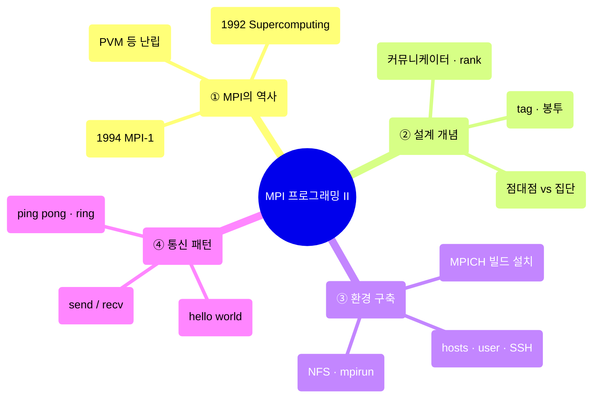
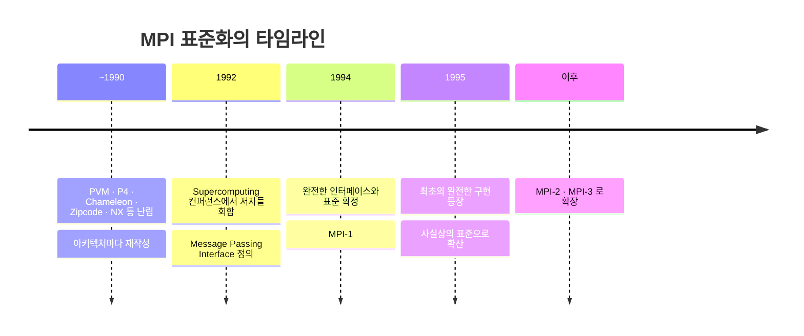
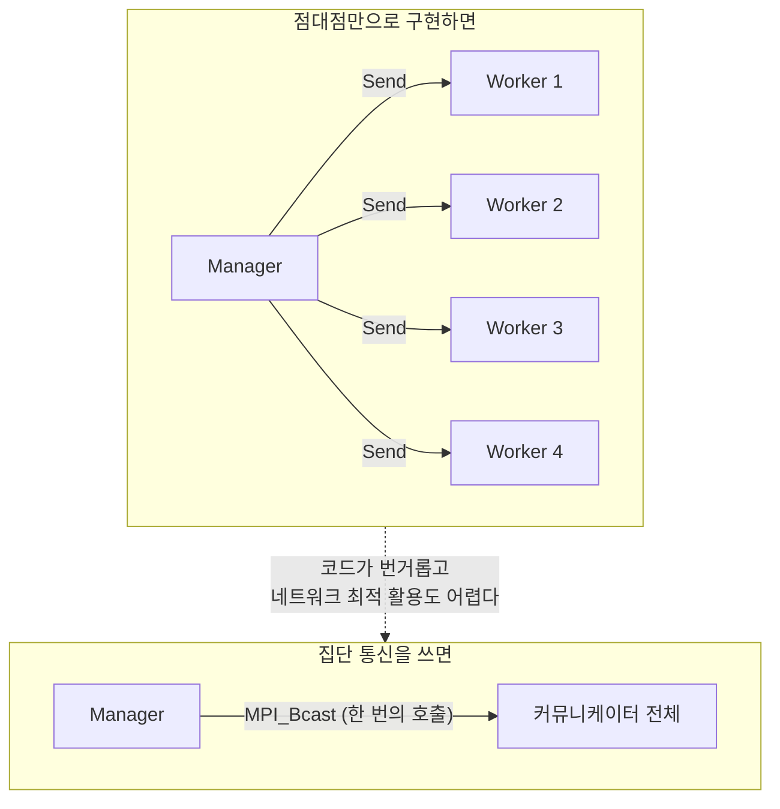
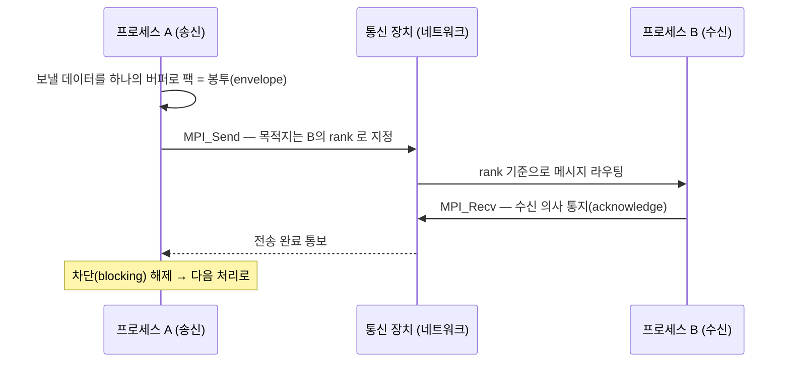
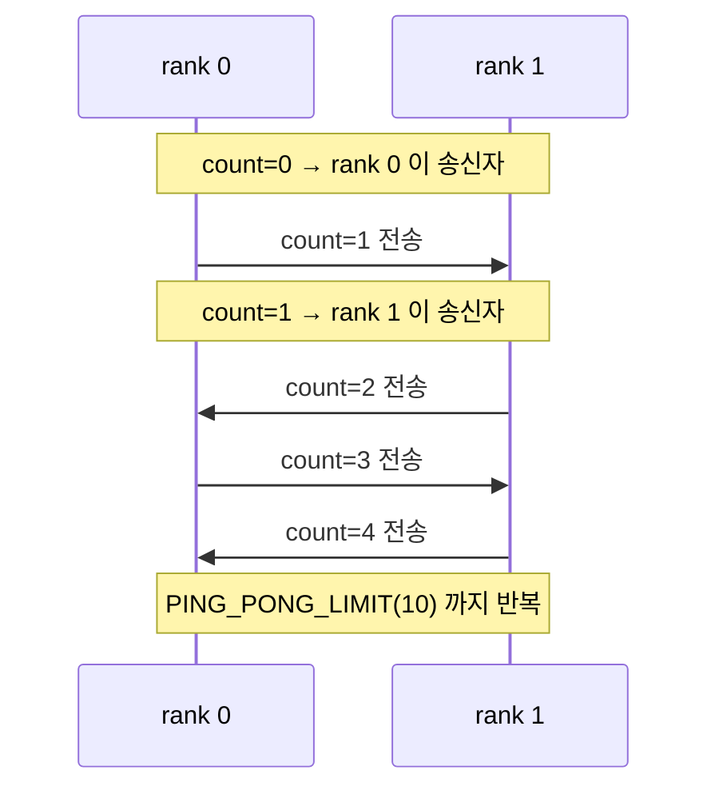
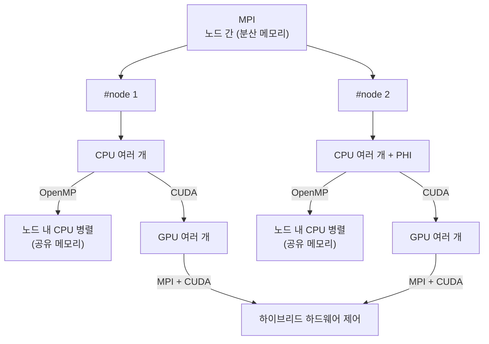

---
aliases:
  - MPI 병렬 프로그래밍 II
  - MPI 클러스터와 Send Recv
authority: primary
course: parallel-distributed-computing
created: '2025-05-17'
date: '2025-05-17'
review_state: active
semester: '3-1'
source: pdf/12_MPI 프로그래밍_V_02.pdf
source_pages: 41
source_sha256: 39b84047e0b2ff16
source_type: lecture-slides
status: seedling
tags:
  - type/lecture
  - cs/systems
  - cs/distributed
title: 12. MPI 병렬 프로그래밍 II
type: lecture
updated: '2026-08-28'
---

domain:: [[ComputerScience/04_systems-infrastructure/시스템 인프라 인터페이스|시스템 인프라 인터페이스]]
module:: [[ComputerScience/00_graph-interfaces/courses/병렬 분산처리 인터페이스|병렬 분산처리 인터페이스]]
source:: `pdf/12_MPI 프로그래밍_V_02.pdf` (41p)
prev:: [[ComputerScience/04_systems-infrastructure/parallel-distributed-computing/11. MPI 병렬 프로그래밍 I|11. MPI 병렬 프로그래밍 I]]

# 12. MPI 병렬 프로그래밍 II

> [!abstract] 한 줄 요약
> 앞 강의가 "MPI가 무엇인가"였다면 이번 강의는 **"실제로 돌려 보기"** 다.
> MPICH를 빌드해 단일 머신에 올리고, LAN에 묶인 두 대를 hosts·SSH·NFS 5단계로 클러스터로 만든 뒤,
> **블로킹 점대점 통신(`MPI_Send` / `MPI_Recv`)** 하나만으로
> hello world → send/recv → ping-pong → ring 까지 통신 패턴을 쌓아 올린다.

## 이 강의의 지도



---

## 1. MPI는 어떻게 표준이 되었나

> [!quote] 슬라이드 근거
> `pdf/12_MPI 프로그래밍_V_02.pdf` p.2-3

### 표준 이전의 세계

1990년대 이전에는 지금과 같은 스타일로 병렬 계산 프로그램을 작성할 수 없었다.

- 서로 다른 컴퓨터 아키텍처마다 따로 프로그래밍해야 했고, 그것은 **어렵고 지루하기 짝이 없는 일**이었다.
- PVM을 비롯한 몇 개의 라이브러리가 태어났지만 **어느 것도 표준이 되지는 못했다.**
- 그 시대의 병렬 애플리케이션은 대부분 **과학·연구 분야**를 위한 것이었다.

그중 가장 널리 채택된 라이브러리 모델이 **메시지 패싱 모델**이었다.
이 모델을 쓰는 애플리케이션은 특정 작업을 수행하기 위해 **프로세스 간에 메시지를 주고받는다.**

> [!example] 메시지 패싱이 잘 맞는 두 가지 그림
> - **관리자–작업자 구조**: 관리자 프로세스가 작업 명령이 담긴 메시지를 작업자 프로세스에 전달해 일을 할당한다.
> - **병렬 병합 정렬**: 각 프로세스가 로컬 데이터를 정렬하고, 정렬된 결과를 인접 프로세스에 전달해 전체를 병합한다.
>
> 슬라이드의 표현대로 **"많은 병렬 애플리케이션을 메시지 전달 모델로 표현할 수 있다."**

### 1992년, 저자들이 한자리에 모이다

이 시기의 라이브러리들은 모두 메시지 패싱 모델이었고 **기능 차이가 크지 않았다.**
그래서 1992년 Supercomputing 컨퍼런스에서 각 라이브러리의 저자들이 모여
메시지 패싱의 실행 표준 인터페이스인 **Message Passing Interface**를 정의했다.



| 사실 | 내용 |
|:--|:--|
| MPI의 정체 | **특정 구현이 아니라 인터페이스의 정의** |
| 구현의 책임 | 각 아키텍처에 맞는 인터페이스 구현은 **개발자에게 맡겨져 있었다** |
| 확산 속도 | 완전한 구현을 쓸 수 있게 되기까지 **1년 정도밖에** 걸리지 않았다 |
| 오늘의 위치 | 첫 구현 이후 널리 채택되어 메시지 패싱 애플리케이션의 **사실상(de facto) 표준** |

> [!important] 이 역사에서 얻을 교훈
> MPI의 가치는 성능 그 자체보다 **"모든 주요 병렬 아키텍처에 이식 가능한 병렬 애플리케이션을
> 작성할 수 있게 되었다"** 는 데 있다. 인터페이스와 구현을 분리한 설계가 그것을 가능하게 했다.

---

## 2. 메시지 전달 모델의 설계 개념

> [!quote] 슬라이드 근거
> `pdf/12_MPI 프로그래밍_V_02.pdf` p.4

MPI 설계에는 몇 가지 고전적인 개념이 깔려 있다.

> [!info] 정의 — 커뮤니케이터(Communicator)
> **서로 통신할 수 있는 프로세스 그룹.** 이 그룹 안에서 각 프로세스에는 **고유한 rank가 할당**되어 있고,
> 프로세스들은 이 rank로 서로를 구분하여 **명시적으로** 통신을 수행한다.

통신의 기본은 프로세스 간의 **송수신 작업**이다.

| 역할 | 하는 일 |
|:--|:--|
| **송신 측** | rank와, 메시지를 식별하기 위한 고유한 **태그(tag)** 를 사용해 다른 프로세스에 메시지를 전송 |
| **수신 측** | 지정된 태그를 가진 메시지를 수신하여 데이터를 처리 |

> [!info] 정의 — 점대점 통신 (Point-to-Point)
> 이처럼 **하나의 발신자와 하나의 수신자가 관련된 통신**을 점대점 통신이라고 한다.

### 왜 집단 통신이 따로 필요한가

어떤 프로세스가 **다른 모든 프로세스와 통신하고 싶을 때**가 있다.
예를 들어 관리자 프로세스가 모든 워커 프로세스에 데이터를 브로드캐스트하는 경우다.



- 일일이 송수신하는 코드를 작성하는 것은 **번거롭고**, 네트워크를 **최적의 방법으로 이용하기도 어렵다.**
- MPI는 이런 **전체 프로세스를 포함한 다양한 종류의 집단 통신**을 처리할 수 있다.

| 개념 | 한 줄 정리 |
|:--|:--|
| **rank** | 커뮤니케이터 안에서 프로세스를 구분하는 고유 번호 |
| **tag** | 같은 상대에게 오가는 여러 메시지를 구분하는 식별 번호 |
| **점대점 통신** | 발신자 1 : 수신자 1 |
| **집단 통신** | 커뮤니케이터 전체가 참여, 라이브러리가 최적 경로를 알아서 씀 |

---

## 3. 단일 머신에 MPICH 설치하기

> [!quote] 슬라이드 근거
> `pdf/12_MPI 프로그래밍_V_02.pdf` p.5-9

클러스터로 가기 전에 **한 대에서 먼저 동작을 확인**하는 것이 순서다.
소스를 받아 직접 빌드하는 전형적인 3단계다.

```bash
tar -xzf mpich-3-3.2.tar.gz      # 1. 소스 압축 해제
cd mpich-3-3.2
./configure                      # 2. 빌드 환경 설정 → "Configuring MPICH version 3.3.2"
make; sudo make install          # 3. 빌드 및 설치

mpiexec --version                # 설치 확인
# HYDRA build details:
#   Version: 3.3.2   Release Date: Tue Nov 12 21:23:16 CST 2019
#   CC: gcc   CXX: g++   F77: gfortran   F90: gfortran
```

> [!tip] `mpiexec --version` 출력에서 읽어야 할 것
> `CC` / `CXX` / `F77` / `F90` 항목은 **이 MPICH가 어떤 컴파일러 위에 얹혀 있는지**를 보여준다.
> `mpicc` 는 결국 이 컴파일러를 감싼 래퍼이므로, 여기 적힌 컴파일러와 실제 빌드 환경이 어긋나면
> 링크 단계에서 문제가 생긴다.

> [!note] 보충 — 추천 도서 (p.11)
> 1. *Parallel Programming with MPI* (1st Edition)
> 2. *Using MPI* (3rd Edition) / *Using Advanced MPI* (1st Edition)
> 3. *Parallel Programming in C with MPI and OpenMP*
> 4. *MPI: The Complete Reference*
> 5. *Beginning MPI (An Introduction in C)*

---

## 4. LAN 위에 MPI 클러스터 구축하기

> [!quote] 슬라이드 근거
> `pdf/12_MPI 프로그래밍_V_02.pdf` p.10, 13-23

이제 같은 작업을 **한 대가 아니라 LAN에 연결된 여러 노드**에서 돌린다.
단순화를 위해 **두 대**만 고려하지만, 노드를 더 붙이는 것도 같은 방식이다.
리눅스 머신 두 대를 각각 **관리자(manager)** 와 **작업자(worker)** 라고 부른다.


| 단계 | 목적 | 왜 필요한가 |
|:--|:--|:--|
| 1. hosts | 호스트 이름 ↔ IP 매핑 | `mpirun -host worker` 처럼 **이름으로** 노드를 지정하기 위해 |
| 2. 사용자 생성 | 모든 노드에 동일 계정 `mpiuser` | 계정·경로가 노드마다 다르면 실행이 꼬인다 |
| 3. SSH | 암호 없이 노드 간 접속 | `mpirun` 이 원격 노드에서 프로세스를 띄우는 통로 |
| 4. NFS | 공유 디렉터리 `cloud` | **모든 노드가 같은 실행 파일을 같은 경로에서** 봐야 한다 |
| 5. 실행 | `mpirun -np N --hosts ...` | 실제 병렬 실행 |

### Step 1 — hosts 파일 준비

hosts 파일은 운영체제가 **호스트 이름을 IP 주소에 매핑**하는 데 쓰인다.

```bash
cat /etc/hosts
# 127.0.0.1     localhost
# 172.50.88.34  worker

# 노드가 늘어나면 이렇게 확장된다 (p.21)
# #MPI CLUSTER SETUP
# 172.50.88.22  manager
# 172.50.88.56  worker1
# 172.50.88.34  worker2
# 172.50.88.54  worker3
```

이것은 manager의 hosts이고, `worker` 는 계산을 수행할 다른 머신의 이름이다.
**worker 쪽에도 마찬가지로 manager를 등록**해야 한다.

### Step 2 — 새 사용자 생성

기존 계정으로 클러스터를 운영할 수도 있지만, **설정을 단순화하기 위해 새 계정을 만드는 편이 좋다.**
모든 호스트에서 동일하게 `mpiuser` 를 생성한다.

```bash
sudo adduser mpiuser
```

> [!warning] `useradd` 를 쓰지 말 것
> 슬라이드가 명시적으로 경고한다. **`adduser` 가 아닌 `useradd` 를 쓰면 홈 디렉터리가 생성되지 않는다.**
> 뒤 단계에서 `~/.ssh` 와 `~/cloud` 를 홈 아래 만들어야 하므로 그대로 막힌다.

### Step 3 — SSH 키 기반 접속

```bash
sudo apt-get install openssh-server   # manager/worker 양쪽에 SSH 서버 설치
su - mpiuser                          # mpiuser 로 전환

ssh-keygen -t dsa                     # 키 쌍 생성
ssh-copy-id worker                    # 상대 노드에 공개키 등록 (ip-address 도 가능)

eval `ssh-agent`                      # 매번 패스프레이즈를 묻지 않도록
ssh-add ~/.ssh/id_dsa

ssh worker                            # 확인
```

> [!important] 이 단계의 의미
> `mpirun` 은 원격 노드에 프로세스를 띄울 때 SSH를 통로로 쓴다.
> **암호 입력 없이 `ssh worker` 가 성공해야** 병렬 실행이 자동으로 돌아간다.
> 여기서 막히면 이후 모든 단계가 실패한다.

### Step 4 — NFS 설정

> [!info] 왜 NFS인가
> manager는 NFS를 통해 디렉터리를 공유하고, **worker가 그것을 마운트하여 데이터를 주고받는다.**
> 실행 파일과 데이터를 노드마다 복사해 두는 대신, **한 곳에 두고 모두가 같은 경로로 본다.**

**NFS 서버 (manager)**

```bash
sudo apt-get install nfs-kernel-server
mkdir cloud                              # mpiuser 홈에 공유 폴더 생성

cat /etc/exports                         # 공유 설정
# /home/mpiuser/cloud *(rw,sync,no_root_squash,no_subtree_check)
# /home/mpiuser/cloud 12.33.44.55(rw,sync,no_root_squash,no_subtree_check)

exportfs -a                              # 설정 반영
sudo service nfs-kernel-server restart
```

| `/etc/exports` 옵션 | 의미 |
|:--|:--|
| `rw` | 읽기·쓰기 허용 |
| `sync` | 변경을 디스크에 동기적으로 반영 |
| `no_root_squash` | 클라이언트의 root를 서버 root로 그대로 취급 |
| `no_subtree_check` | 서브트리 검사 생략 |
| `*` vs `12.33.44.55` | 모든 호스트에 공개할지, **특정 IP에만** 공개할지 |

**NFS 클라이언트 (worker)**

```bash
sudo apt-get install nfs-common
mkdir cloud
sudo mount -t nfs manager:/home/mpiuser/cloud ~/cloud
df -h    # → manager:/home/mpiuser/cloud  49G  15G  32G  32%  /home/mpiuser/cloud

# 재부팅 때마다 수동 마운트하지 않으려면 /etc/fstab 에 항목 추가
cat /etc/fstab
# #MPI CLUSTER SETUP
# manager:/home/mpiuser/cloud /home/mpiuser/cloud nfs
```

### Step 5 — MPI 프로그램 실행

MPICH2 설치 패키지의 `mpich2/examples/cpi` 샘플을 병렬 실행해 정상 여부를 확인한다.
직접 만든 코드는 `mpicc` 로 빌드해 **공유 디렉터리 `cloud` 에 두거나 그 안에서 컴파일**한다.

```bash
mpicc -o mpi_sample mpi_sample.c
cd cloud/ && pwd                                     # /home/mpiuser/cloud

mpirun -np 2 ./cpi                                   # 관리자 머신에서만, 프로세스 2개
mpirun -np 5 -hosts worker,localhost ./cpi           # 여러 호스트에 걸쳐
mpirun -np 10 --hosts manager,worker1,worker2 ./cpi
mpirun -np 10 --hosts worker1 ./cpi                  # 원격 worker 에서만
mpirun -np 5 --hostfile mpi_file ./cpi               # hostfile 로 지정
```

hostfile은 노드마다 몇 개의 슬롯을 쓸지 명시할 수 있다.

```bash
# This is an example hostfile. Comments begin with #
# The following node is a single processor machine:
foo.example.com
# The following node is a dual-processor machine:
bar.example.com slots=2
# The following node is a quad-processor machine, and we absolutely
# want to disallow over-subscribing it:
yow.example.com slots=4 max-slots=4
```

| hostfile 지시자 | 의미 |
|:--|:--|
| (없음) | 단일 프로세서 머신 |
| `slots=N` | 이 노드에서 **기본으로 쓸 프로세스 수** |
| `max-slots=N` | **초과 배치(over-subscribing)를 금지**하는 상한 |

---

## 5. 첫 MPI 프로그램 — Hello World

> [!quote] 슬라이드 근거
> `pdf/12_MPI 프로그래밍_V_02.pdf` p.24-28

```c
#include <mpi.h>
#include <stdio.h>

int main(int argc, char** argv) {
    // Initialize the MPI environment — MPI 환경 초기화
    MPI_Init(NULL, NULL);

    // Get the number of processes — 프로세스의 수를 얻는다
    int world_size;
    MPI_Comm_size(MPI_COMM_WORLD, &world_size);

    // Get the rank of the process — 이 커뮤니케이터에서 자신의 rank 를 얻는다
    int world_rank;
    MPI_Comm_rank(MPI_COMM_WORLD, &world_rank);

    // Get the name of the processor — 이 프로세서의 이름을 얻는다
    char processor_name[MPI_MAX_PROCESSOR_NAME];
    int name_len;
    MPI_Get_processor_name(processor_name, &name_len);

    // Print off a hello world message
    printf("Hello world from processor %s, rank %d out of %d processors\n",
           processor_name, world_rank, world_size);

    // Finalize the MPI environment — MPI 환경을 마무리
    MPI_Finalize();
}
```

### 함수별 정확한 역할

```c
int MPI_Init(int* argc, char*** argv);
int MPI_Comm_size(MPI_Comm communicator, int* size);
int MPI_Comm_rank(MPI_Comm communicator, int* rank);
int MPI_Get_processor_name(char* name, int* name_length);
int MPI_Finalize(void);
```

| 함수 | 역할 |
|:--|:--|
| `MPI_Init` | MPI의 **글로벌 변수와 내부 변수를 초기화·설정**한다. 이 과정에서 **모든 프로세스에 각각 rank를 할당하고, 이를 모두 포함하는 커뮤니케이터를 생성**한다. 특별히 설정할 인수가 없으며, 추가 파라미터는 향후 구현에 대비해 **예약**되어 있다 |
| `MPI_Comm_size` | **커뮤니케이터의 크기를 반환**한다. `MPI_COMM_WORLD` 는 작업의 모든 프로세스를 포함하므로, 이 호출은 **작업에 요청한 프로세스 수**를 돌려준다 |
| `MPI_Comm_rank` | 커뮤니케이터 내 **해당 프로세스의 rank를 반환**한다. rank는 커뮤니케이터 내에서 **0부터 순서대로** 할당되며, 주로 **메시지 송수신**에 사용된다 |
| `MPI_Get_processor_name` | **프로세서의 이름**을 가져온다. 실제 코드에서 많이 쓰이지는 않고 **주로 확인용** |
| `MPI_Finalize` | MPI 환경을 정리한다. **이 함수 이후에는 MPI 함수를 사용할 수 없다** |

> [!important] `MPI_Init` 이 하는 일을 한 문장으로
> "rank를 나눠 주고 `MPI_COMM_WORLD` 를 만든다." — 앞으로 나오는 모든 통신은
> **이 초기화가 만들어 준 rank와 커뮤니케이터 위에서** 이루어진다.

### 빌드와 실행

```makefile
EXECS=mpi_hello_world
MPICC?=mpicc

all: ${EXECS}

mpi_hello_world: mpi_hello_world.c
	${MPICC} -o mpi_hello_world mpi_hello_world.c

clean:
	rm ${EXECS}
```

```bash
export MPICC=/home/kendall/bin/mpicc
make                    # /home/kendall/bin/mpicc -o mpi_hello_world mpi_hello_world.c

cat host_file           # cetus1 / cetus2 / cetus3 / cetus4
```

> [!tip] `mpicc` 의 정체
> 슬라이드의 표현대로 **`mpicc` 는 필요한 library와 include를 대신 처리해 주는 gcc의 래퍼**다.
> 위 Makefile은 `MPICC` 환경 변수가 설정되어 있으면 그것을 쓰므로,
> MPICH2를 로컬 디렉터리에 설치한 경우 `MPICC` 를 알맞은 `mpicc` 바이너리 경로로 지정해야 한다.

---

## 6. 블로킹 점대점 통신 — Send와 Recv

> [!quote] 슬라이드 근거
> `pdf/12_MPI 프로그래밍_V_02.pdf` p.29-33

> [!important] 이 절의 전제
> **송수신(send, recv)은 MPI의 가장 기본적인 개념이며, MPI의 거의 모든 기능은 send와 recv로 구현할 수 있다.**
> 그래서 이 강의는 블로킹 송수신 하나만 붙들고 데이터 전송의 기본 개념을 끝까지 밀고 간다.

### 봉투(envelope)와 확인(acknowledge)

프로세스 A가 프로세스 B에게 메시지를 보내는 과정은 이렇다.

1. A는 B에 보낼 데이터를 **모두 하나로 묶어(팩) 버퍼에 저장**한다.
   이 버퍼는 데이터를 하나의 메시지로 묶어 놓았기 때문에 **봉투(envelope)** 라고도 부른다.
   (우편 편지가 봉투에 포장되는 것과 같은 이치)
2. 데이터가 버퍼에 담기면 **통신 장치(대부분 네트워크)가 메시지를 라우팅**한다.
   메시지의 목적지는 **프로세스의 rank에 따라 정의**된다.
3. 프로세스 B는 **A로부터 데이터를 수신할 의사가 있음을 명확하게 통지(acknowledge)** 해야 한다.
4. 통지가 완료되면 데이터가 전송된 것으로 간주하고, **A에 전송 완료를 알려 A의 차단이 풀린다.**



> [!info] 태그(tag)가 있는 이유
> A가 B에게 **여러 종류의 메시지**를 보낸다고 하자. B가 이를 구분하기 위해 특별한 방법을 쓰지 않더라도,
> MPI는 메시지에 **ID(태그)** 를 붙여 송수신할 수 있다.
> 프로세스 B는 **특정 태그의 메시지만 요청**할 수 있고,
> **다른 태그의 메시지는 B가 수신 요청을 할 때까지 네트워크 계층이 버퍼링**한다.

### 함수 시그니처와 인자

```c
MPI_Send(
    void*         data,
    int           count,
    MPI_Datatype  datatype,
    int           destination,
    int           tag,
    MPI_Comm      communicator);

MPI_Recv(
    void*         data,
    int           count,
    MPI_Datatype  datatype,
    int           source,
    int           tag,
    MPI_Comm      communicator,
    MPI_Status*   status);
```

| 인자 | `MPI_Send` | `MPI_Recv` |
|:--|:--|:--|
| 1. `data` | 데이터 **버퍼의 주소** | 동일 |
| 2. `count` | 버퍼에 있는 **요소의 수**. **정확한 수**를 전송 | **"최소" 개수**의 요소를 수신 |
| 3. `datatype` | 버퍼 요소의 **유형** | 동일 |
| 4. `destination` / `source` | **보낼** 프로세스의 rank | **받을** 프로세스의 rank |
| 5. `tag` | 메시지 식별 태그 | 동일 |
| 6. `communicator` | 커뮤니케이터 지정 | 동일 |
| 7. `status` | — | **recv에만 있는 인자.** 수신된 메시지에 대한 정보 포인터 |

> [!warning] Send와 Recv의 count는 의미가 다르다
> `MPI_Send` 는 **정확히 `count` 개**를 전송하지만, `MPI_Recv` 는 **"최소" `count` 개**를 수신한다.
> 즉 `count` 는 수신 측에서 "이만큼은 받을 준비가 되어 있다"는 **버퍼 용량의 상한**에 가깝다.

### 기본 MPI 데이터 유형

`MPI_Send` 와 `MPI_Recv` 는 메시지의 데이터 구조를 **C 언어 데이터 타입이 아니라 더 높은 수준의
데이터 타입**으로 지정한다. 예를 들어 정수 하나를 전송하면 `count`는 1, 타입은 `MPI_INT` 다.

| MPI 데이터 유형 | C 언어 데이터 유형 |
|:--|:--|
| `MPI_SHORT` | `short int` |
| `MPI_INT` | `int` |
| `MPI_LONG` | `long int` |
| `MPI_LONG_LONG` | `long long int` |
| `MPI_UNSIGNED_CHAR` | `unsigned char` |
| `MPI_UNSIGNED_SHORT` | `unsigned short int` |
| `MPI_UNSIGNED` | `unsigned int` |
| `MPI_UNSIGNED_LONG` | `unsigned long int` |
| `MPI_UNSIGNED_LONG_LONG` | `unsigned long long int` |
| `MPI_FLOAT` | `float` |
| `MPI_DOUBLE` | `double` |
| `MPI_LONG_DOUBLE` | `long double` |
| `MPI_BYTE` | `char` |

> [!note] 보충 — 이 표의 유효 범위
> 슬라이드는 **"이 데이터 유형은 초보자를 위한 MPI 튜토리얼에서만 사용"** 한다고 못박는다.
> 기초를 익힌 뒤에는 **복잡한 메시지를 처리하기 위해 자신만의 MPI 데이터 유형을 만들 수 있다.**

---

## 7. 통신 패턴 3종 — send_recv · ping pong · ring

> [!quote] 슬라이드 근거
> `pdf/12_MPI 프로그래밍_V_02.pdf` p.34-39

세 예제는 난이도가 아니라 **통신 구조**가 다르다.

| 예제 | 구조 | 프로세스 수 | 배우는 것 |
|:--|:--|:--:|:--|
| `send_recv.c` | 단방향 1회 | 2 | rank 분기 + Send/Recv 짝 맞추기 |
| `ping_pong.c` | 왕복 반복 | 2 | 송신자·수신자 역할이 **번갈아 바뀌는** 구조 |
| `ring.c` | 순환 전달 | N | **데드락을 피하는 순서 설계** |

### ① send_recv — 단방향 1회

```c
// Find out rank, size
int world_rank;
MPI_Comm_rank(MPI_COMM_WORLD, &world_rank);
int world_size;
MPI_Comm_size(MPI_COMM_WORLD, &world_size);

int number;
if (world_rank == 0) {
    number = -1;
    MPI_Send(&number, 1, MPI_INT, 1, 0, MPI_COMM_WORLD);
} else if (world_rank == 1) {
    MPI_Recv(&number, 1, MPI_INT, 0, 0, MPI_COMM_WORLD,
             MPI_STATUS_IGNORE);
    printf("Process 1 received number %d from process 0\n", number);
}
```

```bash
./run.py send_recv
# mpirun -n 2 ./send_recv
# Process 1 received number -1 from process 0
```

- 프로세스 0은 정수 데이터를 `-1` 로 초기화하고 이 값을 프로세스 1에 전송한다.
- 프로세스 1은 `if / else if` 로 분기하여 숫자를 수신하고 값을 출력한다.
- 송수신하는 것이 **INT 하나뿐이므로** 각 프로세스는 `MPI_INT` 하나를 주고받는다.
- 메시지 식별을 위해 **태그 번호 0**을 지정했다.

> [!tip] `MPI_ANY_TAG`
> 전송되는 메시지 종류가 한 종류뿐이므로, 태그 번호에 이미 정의된 상수 **`MPI_ANY_TAG`** 를 써도 된다.
> 마찬가지로 status를 확인할 필요가 없으면 `MPI_STATUS_IGNORE` 를 넘긴다.

### ② ping pong — 역할이 번갈아 바뀐다

두 프로세스가 하나의 값을 주고받으며 **중지될 때까지 증가시키는** 프로그램이다.

```c
int ping_pong_count = 0;
int partner_rank = (world_rank + 1) % 2;

while (ping_pong_count < PING_PONG_LIMIT) {
    if (world_rank == ping_pong_count % 2) {
        // Increment the ping pong count before you send it
        ping_pong_count++;
        MPI_Send(&ping_pong_count, 1, MPI_INT, partner_rank, 0, MPI_COMM_WORLD);
        printf("%d sent and incremented ping_pong_count %d to %d\n",
               world_rank, ping_pong_count, partner_rank);
    } else {
        MPI_Recv(&ping_pong_count, 1, MPI_INT, partner_rank, 0, MPI_COMM_WORLD,
                 MPI_STATUS_IGNORE);
        printf("%d received ping_pong_count %d from %d\n",
               world_rank, ping_pong_count, partner_rank);
    }
}
```

핵심은 두 줄이다.

$$\text{partner\_rank} = (\text{world\_rank} + 1) \bmod 2$$

$$\text{내가 송신자인가?} \iff \text{world\_rank} = \text{ping\_pong\_count} \bmod 2$$

- 이 코드는 **두 개의 프로세스로만 실행된다고 가정**한다.
  그래서 `world_size != 2` 면 `MPI_Abort` 로 종료시킨다.
- 각 프로세스는 간단한 연산으로 **상대방의 rank를 결정**한다.
- `ping_pong_count` 는 0으로 초기화되고 **전송 단계마다 +1씩 증가**하며,
  송신 측과 수신 측을 **번갈아 가며 담당**한다.
- limit 횟수(예제에서는 10)에 도달하면 프로세스가 작동을 멈춘다.



```bash
./run.py ping_pong
# 0 sent and incremented ping_pong_count 1 to 1
# 1 received ping_pong_count 1 from 0
# 1 sent and incremented ping_pong_count 2 to 0
# ...  (PING_PONG_LIMIT = 10 까지)
```

### ③ ring — N개 프로세스의 순환 전달

두 개 이상의 프로세스에서 통신하는 경우다. 값을 **모든 프로세스에서 링 모양으로 전달**한다.

```c
int token;
if (world_rank != 0) {
    MPI_Recv(&token, 1, MPI_INT, world_rank - 1, 0,
             MPI_COMM_WORLD, MPI_STATUS_IGNORE);
    printf("Process %d received token %d from process %d\n",
           world_rank, token, world_rank - 1);
} else {
    // rank 0 은 토큰을 -1 로 초기화한다
    token = -1;
}
MPI_Send(&token, 1, MPI_INT, (world_rank + 1) % world_size,
         0, MPI_COMM_WORLD);

// 여기서 프로세스 0 은 링의 마지막 수신 처리를 수행한다
if (world_rank == 0) {
    MPI_Recv(&token, 1, MPI_INT, world_size - 1, 0,
             MPI_COMM_WORLD, MPI_STATUS_IGNORE);
    printf("Process %d received token %d from process %d\n",
           world_rank, token, world_size - 1);
}
```


```bash
./run.py ring
# Process 1 received token -1 from process 0
# Process 2 received token -1 from process 1
# Process 3 received token -1 from process 2
# Process 4 received token -1 from process 3
# Process 0 received token -1 from process 4
```

> [!important] 이 예제가 데드락을 피하는 방식
> 링 프로그램은 **프로세스 0에서 값을 초기화하고, 그 값을 다음 프로세스에 전달**한다.
> 프로세스 0이 마지막 프로세스로부터 값을 받으면 프로그램이 종료된다.
> **데드락이 발생하지 않도록 특수한 로직**으로 되어 있는데, 그 핵심은
> **프로세스 0이 (마지막 프로세스로부터) 값을 차단적으로 수신하기 전에 첫 번째 전송을 완료한다**는 보장이다.
> 다른 모든 프로세스는 `MPI_Recv`(인접한 낮은 rank로부터 수신) → `MPI_Send`(인접한 높은 rank로 전송)
> 순서로 링을 따라 값을 전달한다.

> [!warning] 출력 순서가 항상 저렇게 나오는 이유
> **메시지가 전송될 때까지 블로킹**하기 때문이다. 따라서 `printf` 는 **값이 전달되는 순서대로** 실행된다.
> 논블로킹 통신으로 바꾸면 이 출력 순서 보장은 사라진다.

---

## 8. MPI는 병렬성 계층의 어디에 있는가

> [!quote] 슬라이드 근거
> `pdf/12_MPI 프로그래밍_V_02.pdf` p.41

MPI는 병렬화 수단 전부가 아니라, **노드를 가로지르는 층**을 담당한다.



| 계층 | 담당 기술 | 메모리 모델 |
|:--|:--|:--|
| 노드 간 | **MPI** | 분산 메모리 |
| 노드 내 CPU 간 | **OpenMP** | 공유 메모리 |
| CPU ↔ GPU | **CUDA / OpenCL** | 디바이스 메모리 |
| 전체 하이브리드 | **MPI + CUDA** 조합 | 혼합 |

슬라이드의 결론은 한 줄이다 — **"하이브리드 하드웨어를 어떻게 제어할 것인가: MPI – OpenMP – CUDA – OpenCL …"**

원본 도해에서 두 노드에 걸친 CPU·GPU·PHI 배치와 각 화살표가 어느 기술에 대응하는지를 확인할 수 있다.

![[pdf/12_MPI 프로그래밍_V_02.pdf#page=41]]

위 그림에서 맨 위 **MPI** 화살표는 두 노드의 모든 CPU로 뻗고, 각 노드 안에서 **OpenMP** 가 CPU들을,
**CUDA** 가 CPU→GPU를 잇는다. 맨 아래 **MPI+CUDA** 는 노드를 가로질러 GPU들을 직접 묶는 경로다.

---

## 핵심 정리

| 개념 | 한 줄 정의 | 왜 중요한가 |
|:--|:--|:--|
| **MPI = 인터페이스** | 특정 구현이 아니라 표준 인터페이스의 정의 | 같은 소스를 모든 주요 병렬 아키텍처에 이식 가능 |
| **커뮤니케이터** | 서로 통신할 수 있는 프로세스 그룹 | 각 프로세스의 rank가 여기서 정의된다 |
| **tag** | 메시지를 식별하는 ID | 같은 상대에게 오는 여러 메시지를 구분, 미수신 메시지는 네트워크 계층이 버퍼링 |
| **봉투(envelope)** | 보낼 데이터를 하나로 팩한 버퍼 | 메시지 전송의 물리적 단위 |
| **acknowledge** | 수신 측이 수신 의사를 통지하는 절차 | 이 통지가 끝나야 송신 측 blocking이 풀린다 |
| **`MPI_Send` count** | **정확히** 그 개수를 전송 | 송신은 정확, 수신은 "최소" — 의미가 다르다 |
| **`MPI_Recv` status** | 수신된 메시지 정보 포인터 | recv에만 있는 7번째 인자, 보통 `MPI_STATUS_IGNORE` |
| **`MPI_Init`** | 글로벌·내부 변수 초기화, rank 할당, 커뮤니케이터 생성 | 이후 모든 통신의 전제 |
| **`mpicc`** | 필요한 library·include를 처리하는 gcc 래퍼 | MPI 프로그램 빌드의 표준 경로 |
| **NFS 공유** | 모든 노드가 같은 실행 파일을 같은 경로로 본다 | 클러스터 실행의 필수 전제 |
| **hostfile `slots`** | 노드별 기본 프로세스 수 / `max-slots` 는 상한 | over-subscribing 방지 |
| **ring의 순서 설계** | rank 0이 먼저 Send를 끝낸 뒤 마지막에 Recv | 블로킹 통신에서 데드락을 피하는 전형적 패턴 |

> [!question]- 스스로 점검
> **Q1.** 1992년에 MPI가 만들어질 수 있었던 배경은 무엇인가?
> **A1.** 당시 등장한 라이브러리들이 모두 메시지 패싱 모델이었고 **기능 차이가 크지 않았기** 때문에, Supercomputing 컨퍼런스에서 저자들이 모여 공통 인터페이스를 정의할 수 있었다. 완전한 표준은 1994년 MPI-1로 확정됐다.
>
> **Q2.** "MPI는 인터페이스의 정의일 뿐"이라는 말이 실무에서 갖는 의미는?
> **A2.** 각 아키텍처에 맞는 구현은 개발자·벤더의 몫이므로 MPICH·OpenMPI·MVAPICH처럼 여러 구현이 공존한다. 대신 소스 코드는 구현을 바꿔도 그대로 컴파일·실행된다.
>
> **Q3.** 클러스터 구축 5단계에서 NFS가 없으면 무엇이 곤란한가?
> **A3.** 모든 노드가 같은 실행 파일을 같은 경로에서 봐야 `mpirun` 이 원격 노드에서 동일한 프로그램을 띄울 수 있다. NFS는 그 공유 디렉터리(`/home/mpiuser/cloud`)를 제공한다.
>
> **Q4.** 사용자 계정을 만들 때 `useradd` 대신 `adduser` 를 써야 하는 이유는?
> **A4.** `useradd` 는 홈 디렉터리를 만들어 주지 않는다. 이후 `~/.ssh` 키와 `~/cloud` 마운트 지점이 홈 아래에 필요하므로 그대로 막힌다.
>
> **Q5.** `MPI_Send` 와 `MPI_Recv` 의 `count` 인자는 어떻게 다른가?
> **A5.** `MPI_Send` 는 **정확한 수**의 요소를 전송하고, `MPI_Recv` 는 **"최소" 개수**의 요소를 수신한다. 또 `MPI_Recv` 에만 마지막 인자 `status`(수신 메시지 정보 포인터)가 있다.
>
> **Q6.** 프로세스 B가 A로부터 여러 종류의 메시지를 받을 때 이를 어떻게 구분하는가?
> **A6.** 메시지에 붙은 **태그(tag)** 로 구분한다. B는 특정 태그의 메시지만 요청할 수 있고, 다른 태그의 메시지는 B가 수신 요청을 할 때까지 네트워크 계층이 버퍼링한다.
>
> **Q7.** ring 프로그램이 데드락에 빠지지 않는 핵심 장치는?
> **A7.** rank 0이 마지막 프로세스로부터 값을 **차단적으로 수신하기 전에 첫 번째 전송을 완료**하도록 순서를 짜 둔 것이다. 나머지 프로세스는 낮은 rank로부터 Recv → 높은 rank로 Send 순서로 링을 따라간다.
>
> **Q8.** ping pong 예제에서 매 반복마다 송신자가 바뀌는 원리는?
> **A8.** `world_rank == ping_pong_count % 2` 조건으로 판단한다. `ping_pong_count` 가 전송마다 1씩 증가하므로 조건을 만족하는 rank가 0과 1 사이에서 번갈아 바뀐다.

## 슬라이드 근거

| 섹션 | 슬라이드 |
|:--|:--|
| 1. MPI는 어떻게 표준이 되었나 | p.2-3 |
| 2. 메시지 전달 모델의 설계 개념 | p.4 |
| 3. 단일 머신에 MPICH 설치 | p.5-9, 11 |
| 4. LAN 위에 MPI 클러스터 구축 | p.10, 13-23 |
| 5. 첫 MPI 프로그램 — Hello World | p.24-28 |
| 6. 블로킹 점대점 통신 | p.29-33 |
| 7. 통신 패턴 3종 | p.34-39 |
| 8. 병렬성 계층에서의 MPI | p.40-41 |

## 관련 노트

- [[ComputerScience/04_systems-infrastructure/parallel-distributed-computing/11. MPI 병렬 프로그래밍 I|11. MPI 병렬 프로그래밍 I]] — MPI 실행 모델과 rank·커뮤니케이터의 기초
- [[ComputerScience/04_systems-infrastructure/parallel-distributed-computing/09. GPU 아키텍처와 CUDA 프로그래밍 III|09. GPU 아키텍처와 CUDA 프로그래밍 III]] — 8절 MPI+CUDA 하이브리드의 CUDA 쪽 절반
- [[ComputerScience/04_systems-infrastructure/parallel-distributed-computing/06. 지역성·통신·경합|06. 지역성·통신·경합]] — 통신 비용과 블로킹 대기 시간의 성능 영향
- [[ComputerScience/04_systems-infrastructure/parallel-distributed-computing/04. 병렬 프로그래밍 기본|04. 병렬 프로그래밍 기본]] — 관리자–작업자 구조 등 병렬 패턴의 일반론
- [[ComputerScience/04_systems-infrastructure/parallel-distributed-computing/02. 병렬 컴퓨터의 기본 아키텍처|02. 병렬 컴퓨터의 기본 아키텍처]] — 노드·네트워크·클러스터의 하드웨어 배경
