> [!abstract] 사용법
> 이 지도는 현재 폴더의 원본 PDF를 파일 순서대로 묶어 강의 진행 → 핵심 단서 → 점검 포인트를 연결합니다. 세부 개념은 같은 폴더의 주제 노트와 함께 대조하세요.

## 강의 흐름

```mermaid
flowchart LR
    A["01 — 01_WhyParallelism"]
    B["02 — 02_기본아키텍츠_update 2"]
    C["03 — 02_기본아키텍츠_update"]
    D["04 — 03_multicore2-강의자료업데이트_0415"]
    E["05 — 03_multicore2-ispc_update 2"]
    F["06 — 03_multicore2-ispc_update"]
    G["07 — 03_multicore2-update_0416 2"]
    H["08 — 03_multicore2-update_0416"]
    A --> B
    B --> C
    C --> D
    D --> E
    E --> F
    F --> G
    G --> H
```



<Tabs>
  <Tab label="파일 순서">파일명에 포함된 주차·장·버전 표기를 먼저 읽어 강의의 큰 흐름을 잡습니다.</Tab>
  <Tab label="중복 자료">같은 접두사나 버전이 겹치면 앞 자료를 기준으로 뒤 자료의 보충·실습 여부를 비교합니다.</Tab>
  <Tab label="검증">파일명과 쪽수는 탐색용 단서입니다. 정의·식·코드·도식은 각 원본 PDF에서 다시 확인합니다.</Tab>
</Tabs>

## 원본 PDF 목록

| 파일 | 쪽수 | 확인 메모 |
| :-- | --: | :-- |
| 01_WhyParallelism.pdf | 139 | 원본 첫 페이지·본문 대조 |
| 02_기본아키텍츠_update 2.pdf | 104 | 원본 첫 페이지·본문 대조 |
| 02_기본아키텍츠_update.pdf | 104 | 원본 첫 페이지·본문 대조 |
| 03_multicore2-강의자료업데이트_0415.pdf | 112 | 원본 첫 페이지·본문 대조 |
| 03_multicore2-ispc_update 2.pdf | 101 | 원본 첫 페이지·본문 대조 |
| 03_multicore2-ispc_update.pdf | 101 | 원본 첫 페이지·본문 대조 |
| 03_multicore2-update_0416 2.pdf | 116 | 원본 첫 페이지·본문 대조 |
| 03_multicore2-update_0416.pdf | 116 | 원본 첫 페이지·본문 대조 |
| 04_Parallel Programming 기본 2.pdf | 58 | 원본 첫 페이지·본문 대조 |
| 04_Parallel Programming 기본.pdf | 58 | 원본 첫 페이지·본문 대조 |
| 05_Performance Optimization I Work Distribution and Scheduling.pdf | 75 | 원본 첫 페이지·본문 대조 |
| 06_Locality_Communication_Contention.pdf | 68 | 원본 첫 페이지·본문 대조 |
| 07_GPU Architecture & CUDAProgramming_v01.pdf | 47 | 원본 첫 페이지·본문 대조 |
| 08_GPU Architecture & CUDAProgramming_v02.pdf | 110 | 원본 첫 페이지·본문 대조 |
| 09_GPU Architecture & CUDAProgramming_v03 2.pdf | 99 | 원본 첫 페이지·본문 대조 |
| 09_GPU Architecture & CUDAProgramming_v03.pdf | 99 | 원본 첫 페이지·본문 대조 |
| 11_MPI 프로그래밍_V_01 2.pdf | 39 | 원본 첫 페이지·본문 대조 |
| 11_MPI 프로그래밍_V_01.pdf | 39 | 원본 첫 페이지·본문 대조 |
| 12_MPI 프로그래밍_V_02 2.pdf | 41 | 원본 첫 페이지·본문 대조 |
| 12_MPI 프로그래밍_V_02.pdf | 41 | 원본 첫 페이지·본문 대조 |
| 쿠다.pdf | 3 | 원본 첫 페이지·본문 대조 |

## 원본 단계 인터랙티브

```html preview
<div style="font-family:system-ui,sans-serif;padding:20px;color:var(--foreground)">
  <label for="flow101583346" style="font-size:14px;font-weight:600">원본 자료 단계</label>
  <div id="flow101583346-out" style="font-size:24px;font-weight:700;color:var(--chart-1);margin:6px 0">01_WhyParallelism</div>
  <input id="flow101583346" type="range" min="1" max="21" step="1" value="1" style="width:100%;accent-color:var(--primary)" />
  <p style="font-size:13px;color:var(--muted-foreground)">슬라이더를 움직이면 파일명 순서대로 자료의 위치를 확인합니다.</p>
  <script>
    var flow101583346 = document.getElementById('flow101583346');
    var flow101583346Out = document.getElementById('flow101583346-out');
    var flow101583346Steps = ["01_WhyParallelism","02_기본아키텍츠_update 2","02_기본아키텍츠_update","03_multicore2-강의자료업데이트_0415","03_multicore2-ispc_update 2","03_multicore2-ispc_update","03_multicore2-update_0416 2","03_multicore2-update_0416","04_Parallel Programming 기본 2","04_Parallel Programming 기본","05_Performance Optimization I Work Distribution and Scheduling","06_Locality_Communication_Contention","07_GPU Architecture & CUDAProgramming_v01","08_GPU Architecture & CUDAProgramming_v02","09_GPU Architecture & CUDAProgramming_v03 2","09_GPU Architecture & CUDAProgramming_v03","11_MPI 프로그래밍_V_01 2","11_MPI 프로그래밍_V_01","12_MPI 프로그래밍_V_02 2","12_MPI 프로그래밍_V_02","쿠다"];
    flow101583346.addEventListener('input', function () {
      flow101583346Out.textContent = flow101583346Steps[Number(flow101583346.value) - 1] || '';
    });
  </script>
</div>
```

## 점검 포인트

- **범위:** 21개 PDF, 총 1670쪽.
- **근거:** 쪽수와 파일명은 현재 sources/ 디렉터리에서 직접 수집했습니다.
- **학습 순서:** 흐름도와 슬라이더를 먼저 훑은 뒤, 주제 노트의 정의·절차·실습 결과를 순서대로 대조합니다.

> [!warning] 과해석 방지
> 이 지도에는 파일명·쪽수·확인 메모만 기록했습니다. PDF에 없는 구현 세부, 성능 수치, 권장 설정은 추가하지 않습니다.

<details>
<summary>다음 읽기</summary>

현재 단계의 원본을 열어 제목·절차·도식을 확인한 뒤, 같은 폴더의 주제 노트에 해당 근거가 반영되었는지 점검하세요.

</details>
