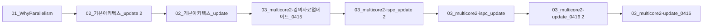

> [!abstract] 사용법
> 이 문서는 원본 PDF의 **순서 → 핵심 단서 → 학습 점검**을 한 번에 보는 지도입니다. 세부 개념은 같은 폴더의 주제 노트와 원본 PDF를 함께 대조하세요.

## 강의 흐름



<Tabs>
  <Tab label="파일 순서">파일명과 주차·장 제목을 강의 진행 신호로 삼아 처음부터 읽습니다.</Tab>
  <Tab label="읽기 전략">이론에서 실습·평가로 이동하며 같은 주제의 중복 PDF는 보조 자료로 비교합니다.</Tab>
  <Tab label="검증">텍스트가 빈약한 자료는 추출되지 않은 도식·수식을 임의로 채우지 않고 원본에서 확인합니다.</Tab>
</Tabs>

## 원본 PDF 목록

| 파일 | 쪽수 | 첫 페이지 단서 |
| :-- | --: | :-- |
| 01_WhyParallelism.pdf | — | Parallel Computing Stanford CS149, Fall 2024 수업 자료 참고 분산처리 Computer & Ai Department of Computer En |
| 02_기본아키텍츠_update 2.pdf | — | 분산처리 Department of Computer Engineering |
| 02_기본아키텍츠_update.pdf | — | 분산처리 Department of Computer Engineering |
| 03_multicore2-강의자료업데이트_0415.pdf | — | Parallel Computing Stanford CS149, Fall 2024 수업 자료 참고 분산처리 Multi-Core Architecture, Part II (latenc |
| 03_multicore2-ispc_update 2.pdf | — | 수업 자료 참고 분산처리 Department of Computer Engineering |
| 03_multicore2-ispc_update.pdf | — | 수업 자료 참고 분산처리 Department of Computer Engineering |
| 03_multicore2-update_0416 2.pdf | — | Parallel Computing Stanford CS149, Fall 2024 수업 자료 참고 분산처리 Multi-Core Architecture, Part II (latenc |
| 03_multicore2-update_0416.pdf | — | Parallel Computing Stanford CS149, Fall 2024 수업 자료 참고 분산처리 Multi-Core Architecture, Part II (latenc |
| 04_Parallel Programming 기본 2.pdf | — | 수업 자료 참고 분산처리 Department of Computer Engineering |
| 04_Parallel Programming 기본.pdf | — | 수업 자료 참고 분산처리 Department of Computer Engineering |
| 05_Performance Optimization I Work Distribution and Scheduling.pdf | — | 수업 자료 참고 분산처리 Department of Computer Engineering |
| 06_Locality_Communication_Contention.pdf | — | 수업 자료 참고 분산처리 Department of Computer Engineering |
| 07_GPU Architecture & CUDAProgramming_v01.pdf | — | 교과목 : 분산처리 1. CUDA 12.6 설치 및 사용 환경 설정 2025학년도 1학기 옥수열 Computer & Ai Department of Computer Engineering |
| 08_GPU Architecture & CUDAProgramming_v02.pdf | — | Parallel Computing Stanford CS149, Fall 2024 수업 자료 참고 분산처리 GPU Architecture & CUDA Programming |
| 09_GPU Architecture & CUDAProgramming_v03 2.pdf | — | Parallel Computing Stanford CS149, Fall 2024 수업 자료 참고 분산처리 GPU Architecture & CUDA Programming |
| 09_GPU Architecture & CUDAProgramming_v03.pdf | — | Parallel Computing Stanford CS149, Fall 2024 수업 자료 참고 분산처리 GPU Architecture & CUDA Programming |
| 11_MPI 프로그래밍_V_01 2.pdf | — | MPI 병렬 프로그래밍 Computer & Ai Department of Computer Engineering 1 |
| 11_MPI 프로그래밍_V_01.pdf | — | MPI 병렬 프로그래밍 Computer & Ai Department of Computer Engineering 1 |
| 12_MPI 프로그래밍_V_02 2.pdf | — | MPI 병렬 프로그래밍 Department of Computer Engineering |
| 12_MPI 프로그래밍_V_02.pdf | — | MPI 병렬 프로그래밍 Department of Computer Engineering |
| 쿠다.pdf | — | CUDA의 gridDim, blockIdx, blockDim, threadIdx 시각 CUDA 에서 하드웨어와 논리의 매핑 적 구조 는 NVIDIA의 GPU에서 대규모 병렬 처리를 지원하는 플랫폼 |

## 원본 단계 인터랙티브

```html preview
<div style="font-family:system-ui,sans-serif;padding:20px;color:var(--foreground)">
  <label for="flow600816" style="font-size:14px;font-weight:600">원본 자료 단계</label>
  <div id="flow600816-out" style="font-size:24px;font-weight:700;color:var(--chart-1);margin:6px 0">01_WhyParallelism</div>
  <input id="flow600816" type="range" min="1" max="21" step="1" value="1" style="width:100%;accent-color:var(--primary)" />
  <p style="font-size:13px;color:var(--muted-foreground)">슬라이더를 움직이면 파일명 순서대로 자료의 역할을 확인합니다.</p>
  <script>
    var flow600816 = document.getElementById('flow600816');
    var flow600816Out = document.getElementById('flow600816-out');
    var flow600816Steps = ["01_WhyParallelism","02_기본아키텍츠_update 2","02_기본아키텍츠_update","03_multicore2-강의자료업데이트_0415","03_multicore2-ispc_update 2","03_multicore2-ispc_update","03_multicore2-update_0416 2","03_multicore2-update_0416","04_Parallel Programming 기본 2","04_Parallel Programming 기본","05_Performance Optimization I Work Distributio","06_Locality_Communication_Contention","07_GPU Architecture & CUDAProgramming_v01","08_GPU Architecture & CUDAProgramming_v02","09_GPU Architecture & CUDAProgramming_v03 2","09_GPU Architecture & CUDAProgramming_v03","11_MPI 프로그래밍_V_01 2","11_MPI 프로그래밍_V_01","12_MPI 프로그래밍_V_02 2","12_MPI 프로그래밍_V_02","쿠다"];
    flow600816.addEventListener('input', function () {
      flow600816Out.textContent = flow600816Steps[Number(flow600816.value) - 1];
    });
  </script>
</div>
```

## 점검 포인트

- **범위:** 21개 PDF, 총 0쪽.
- **근거:** 첫 페이지 추출 단서를 표에 남겨 주제명과 흐름을 확인했습니다.
- **시각 자료:** 0개 파일은 첫 페이지 텍스트가 빈약하므로 필요한 경우 승인된 크롭 후보로만 별도 검토합니다.

> [!warning] 과해석 방지
> 이 지도에는 파일명·쪽수·추출된 첫 페이지 단서만 기록했습니다. PDF에 없는 구현 세부, 성능 수치, 권장 설정은 추가하지 않습니다.

<details>
<summary>다음 읽기</summary>

현재 단계의 파일을 선택한 뒤, 같은 폴더의 주제 노트에서 정의·절차·실습 결과를 대조하세요.

</details>
