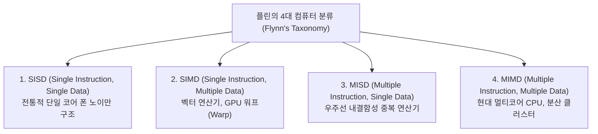

> [!abstract] 핵심 요약
> 클록 주파수 증대의 물리적 한계(Power Wall)로 인해 컴퓨팅 성능 향상의 패러다임은 단일 코어에서 **병렬 멀티코어/매니코어(GPU)**로 전환되었다. 
> 병렬화 가능한 비율 $p$와 프로세서 수 $N$에 따른 최대 속도 향상(Speedup)은 **암달의 법칙(Amdahl's Law)**으로 정량화된다.

$$\text{Speedup} = \frac{1}{(1 - p) + \frac{p}{N}}$$

