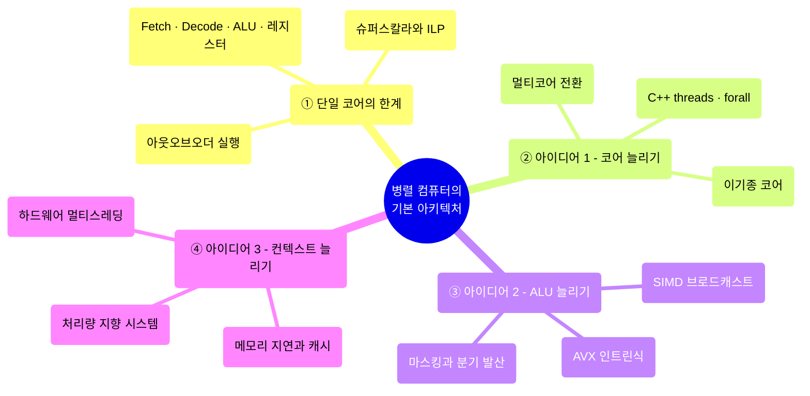
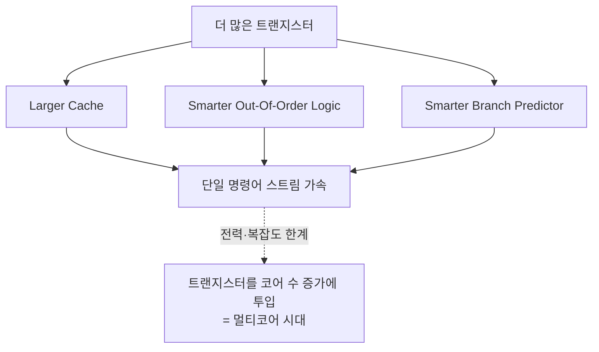
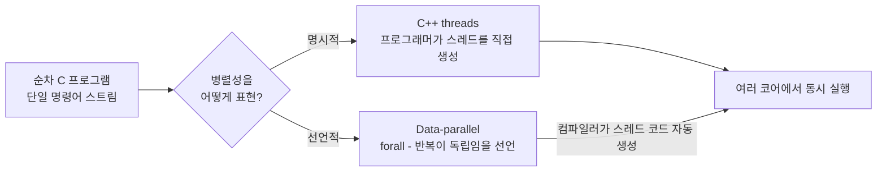
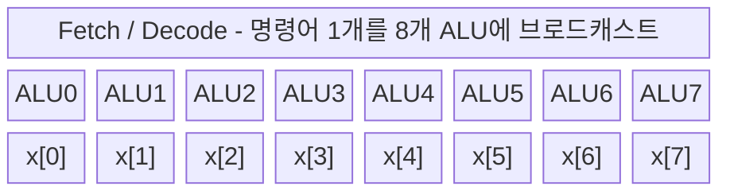
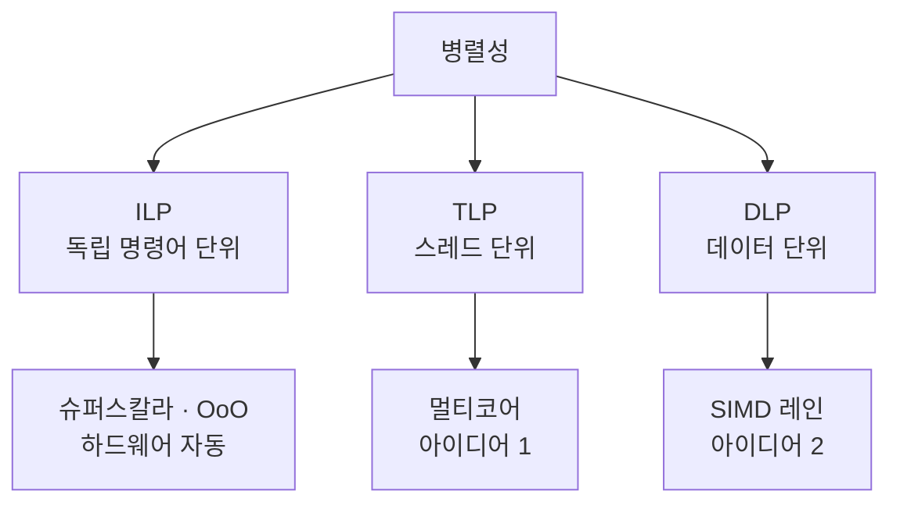
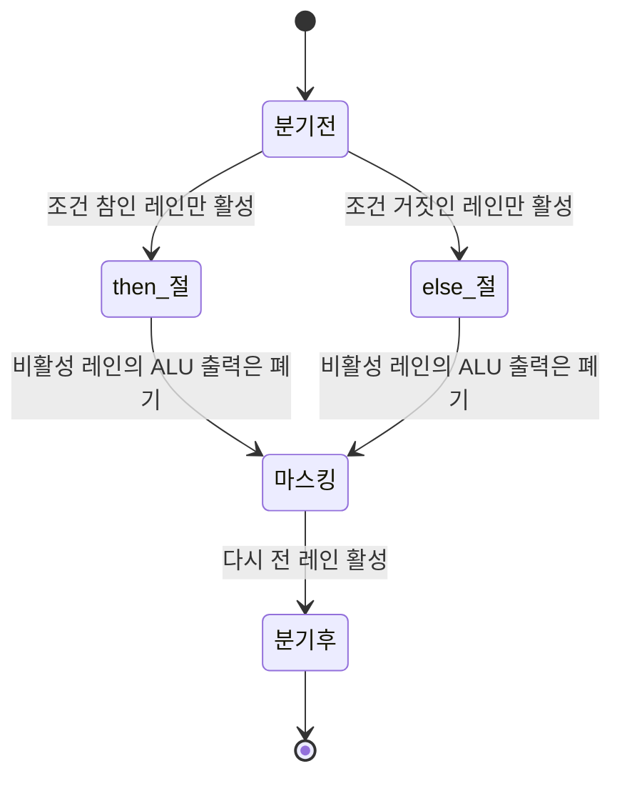
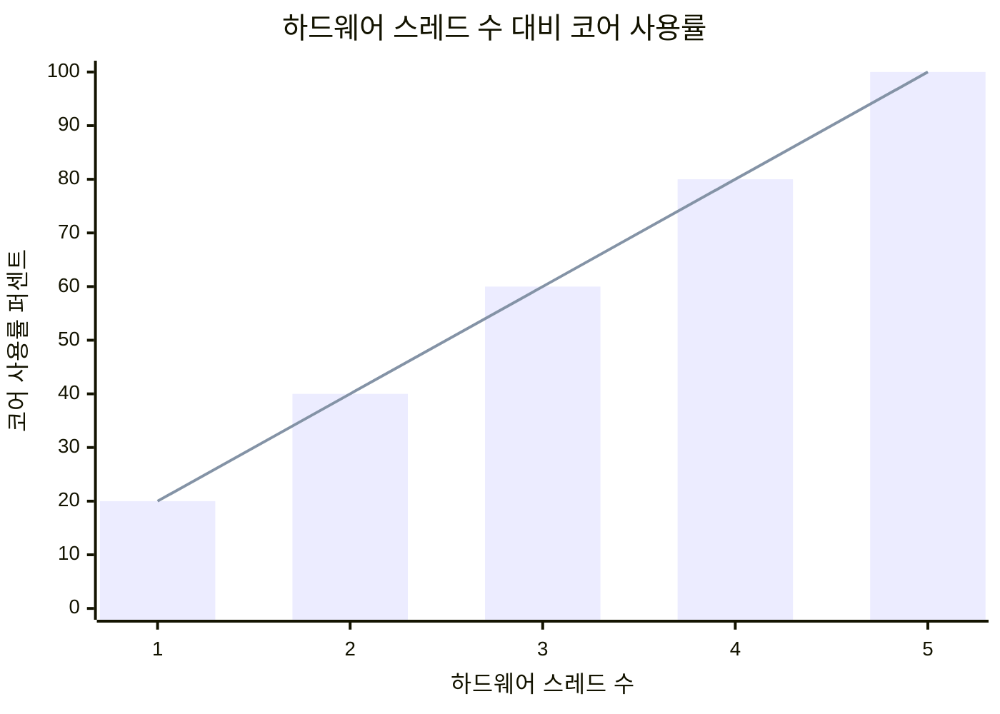
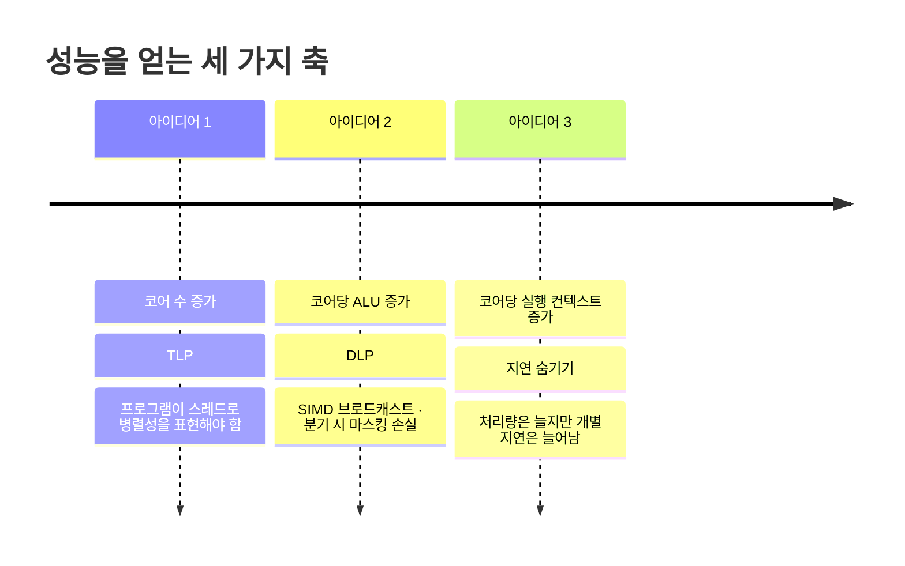

---
aliases:
  - 병렬 컴퓨터의 기본 아키텍처
  - Multi-Core Architecture Part I
  - 02_기본아키텍츠_update
authority: primary
course: parallel-distributed-computing
created: '2025-03-25'
date: '2025-03-25'
review_state: active
semester: '3-1'
source: pdf/02_기본아키텍츠_update.pdf
source_pages: 104
source_sha256: bb1c494242629f73
source_type: lecture-slides
status: draft
tags:
  - lecture
  - systems
  - distributed
title: 02. 병렬 컴퓨터의 기본 아키텍처
type: lecture
updated: '2026-08-28'
---

source:: `pdf/02_기본아키텍츠_update.pdf` (104p)

# 02. 병렬 컴퓨터의 기본 아키텍처

> [!abstract] 한 줄 요약
> 현대 프로세서는 **코어를 늘리고(멀티코어), 코어 안의 ALU를 늘리고(SIMD),
> 코어당 실행 컨텍스트를 늘려(하드웨어 멀티스레딩)** 성능을 얻는다.
> 이 세 가지는 각각 **TLP · DLP · 지연 숨기기**에 대응하며,
> **프로그램이 병렬성을 표현하지 않으면 셋 다 무용지물**이다.

## 이 강의의 지도



---

## 1. 출발점: 아주 간단한 프로세서

> [!quote] 슬라이드 근거
> `pdf/02_기본아키텍츠_update.pdf` p.4-8, 15

병렬 아키텍처를 이해하려면 먼저 **가장 단순한 프로세서 한 개**가 무엇을 갖고 있는지부터 봐야 한다.
슬라이드의 "Very Simple Processor"는 세 덩어리로만 되어 있다.


| 구성 요소 | 슬라이드가 정의한 역할 |
| :-- | :-- |
| **Fetch / Decode** | 다음에 실행할 명령어를 결정한다 |
| **실행 단위 (ALU)** | 명령어로 기술된 작업을 수행하며, 프로세서 레지스터 또는 컴퓨터 메모리의 값을 수정할 수 있다 |
| **레지스터** | 프로그램 상태를 유지한다. 연산의 입력·출력으로 쓰이는 변수의 값을 저장한다 |

> [!info] 기준선
> **아주 간단한 프로세서는 매 클럭마다 정확히 하나의 명령어를 실행한다.**
> 이 강의의 모든 성능 이야기는 "그래서 이 1 IPC를 어떻게 넘길 것인가"에 대한 답이다.

---

## 2. 슈퍼스칼라, 그리고 멀티코어 이전 시대

> [!quote] 슬라이드 근거
> `pdf/02_기본아키텍츠_update.pdf` p.16-19

### 슈퍼스칼라: 하드웨어가 알아서 두 개씩

슈퍼스칼라 프로세서는 **ILP(Instruction-Level Parallelism)** 를 이용해
매 클럭마다 두 개의 명령어를 해독하고 실행할 수 있다.
단, **명령어 스트림에 서로 독립적인 명령어가 존재할 때만** 그렇다.

### 트랜지스터를 어디에 쓸 것인가

멀티코어 시대 이전에는, 늘어난 칩 트랜지스터를 거의 전부
**단일 명령어 스트림 하나를 더 빠르게 돌리는 데** 투입했다.



> [!info] 아웃오브오더(Out-Of-Order) 처리란
> 프로그램의 **실행 결과가 변하지 않도록** 고려하면서, 데이터 의존 관계상 처리 가능한
> 명령어에 대해 **실행 및 완료 순서를 바꿔** 병렬도를 높이고 성능을 향상시키는 기법이다.
>
> - **아웃오브오더(out of order)** — 명령어를 동적으로 바꾸어, 의존관계가 없는 순서대로 순차 실행
> - **인오더(in order)** — 명령어를 읽은 순서 그대로 실행

| 시대 | 트랜지스터 사용처 | 프로그래머가 할 일 |
| :-- | :-- | :-- |
| **멀티코어 이전** | 캐시 확대, OoO 로직 정교화, 분기 예측기 개선 | 없음 (하드웨어가 알아서) |
| **멀티코어 이후** | 코어 개수 증가 (추측 연산 등 정교함은 오히려 축소) | **병렬성을 직접 표현해야 함** |

---

## 3. 아이디어 #1 — 코어를 늘린다

> [!quote] 슬라이드 근거
> `pdf/02_기본아키텍츠_update.pdf` p.19-31

코어가 2개면 원소 2개를 동시에 계산할 수 있다. 4개면 4개, 16개면 16개다.
문제는 그다음 슬라이드가 던지는 반문이다.

> [!warning] But our program expresses no parallelism
> 평범한 C 프로그램은 **하나의 프로세서 코어에서 하나의 스레드로 실행되는
> 명령어 스트림**으로 컴파일된다.
> 그런데 멀티코어 전환 과정에서 개별 코어는 단순해졌다.
> 단순해진 코어 하나가 예전의 복잡한 단일 코어보다 25% 느리다면,
> **병렬성을 표현하지 않은 프로그램은 이제 예전보다 25% 더 느리게 돈다.**
> 코어를 늘렸는데 프로그램이 더 느려지는 것이다.

### 병렬성을 표현하는 두 가지 방법



> [!info] Data-parallel expression
> `forall` 로 루프를 쓰면 프로그래머는 **루프 반복이 서로 독립적**이라고 선언하는 것이다.
> 이 정보만 있으면 컴파일러가 스레드 코드를 자동으로 생성하는 방법을 상상할 수 있다.
>
> 그리고 이 코드에는 흥미로운 속성이 하나 더 있다.
> 루프의 모든 반복은 **정확히 동일한 명령어 시퀀스**(루프 본문)를 수행하지만,
> `x[i]` 로 주어지는 **서로 다른 입력 데이터**에 대해 수행한다.
> 이것이 다음 절 SIMD의 근거가 된다.

### 실물 예시

슬라이드는 실제 칩 사진으로 넘어간다. 멀티코어 CPU, 멀티코어 GPU,
**Apple A15 Bionic**, 그리고 **Apple M1 Silicon (also heterogeneous cores)** 이다.

> [!note] 보충
> M1 슬라이드에 붙은 "heterogeneous cores"라는 단서는
> [01. 왜 병렬 처리인가](<./01. 왜 병렬 처리인가.md>)
> 마지막의 이기종 컴퓨팅 논의와 그대로 이어진다.
> 성능 코어와 효율 코어를 한 다이에 섞는 것도 "코어를 늘리는" 전략의 한 형태다.

원본 다이 사진은 아래 페이지에서 확인할 수 있다.

[02_기본아키텍츠_update p.30](<../sources/02_기본아키텍츠_update.pdf>)

---

## 4. 아이디어 #2 — 코어 안의 ALU를 늘린다 (SIMD)

> [!quote] 슬라이드 근거
> `pdf/02_기본아키텍츠_update.pdf` p.32-36

코어를 통째로 늘리면 Fetch/Decode도 같이 늘어난다. 비싸다.
슬라이드가 제시하는 **아이디어 #2**는 이렇다.

> [!info] 아이디어 #2 — Add execution units (ALUs)
> **여러 ALU에서 명령어 스트림을 관리하는 데 드는 비용·복잡성을 완화한다.**
> 즉 Fetch/Decode는 하나만 두고, 그 아래 ALU만 여러 개 붙인다.
>
> **SIMD processing (Single Instruction, Multiple Data)**
>
> - 모든 ALU에 **동일한 명령어를 브로드캐스팅**한다
> - 이 연산은 모든 ALU에서 **병렬로 실행**된다



### AVX 인트린식으로 직접 써 보면

AVX 레지스터는 **256비트**이므로 **32비트 부동소수점 8개**를 한 번에 담는다.

```c
// 스칼라 버전 — 한 번에 원소 1개
for (int i = 0; i < N; i++)
    y[i] = a * x[i] + y[i];
```

```c
// 벡터 버전 — AVX 인트린식으로 한 번에 원소 8개
__m256 vx = _mm256_load_ps(&x[i]);   // 메모리에서 x를 벡터 레지스터로 로드
__m256 vt = _mm256_mul_ps(va, vx);   // 벡터 곱셈
__m256 vy = _mm256_add_ps(vt, vy);   // 벡터 덧셈
_mm256_store_ps(&y[i], vy);          // 결과를 y로 저장
```

| 인트린식 | 하는 일 |
| :-- | :-- |
| `_mm256_load_ps` | 메모리에서 `x` 를 256비트 벡터 레지스터로 로드 |
| `_mm256_mul_ps` / `_mm256_add_ps` | 8개 레인에 대해 곱셈 / 덧셈을 동시에 수행 |
| `_mm256_store_ps` | 벡터 레지스터의 결과를 `y` 로 저장 |

### 두 아이디어를 곱한다

$$\text{동시 처리 원소 수} = (\text{코어 수}) \times (\text{SIMD 폭})$$

슬라이드의 결론 한 장이 정확히 이 곱이다 — **16 SIMD cores: 128 elements in parallel.**
코어 16개 × 레인 8개 = 128이다.

[02_기본아키텍츠_update p.36](<../sources/02_기본아키텍츠_update.pdf>)

---

## 5. 병렬성의 세 종류: ILP · TLP · DLP

> [!quote] 슬라이드 근거
> `pdf/02_기본아키텍츠_update.pdf` p.37-39

앞의 두 아이디어를 프로그래머 관점에서 분류하면 세 가지가 된다.

| 종류 | 정식 명칭 | 누가 뽑아내는가 | 프로그래머의 관여 |
| :-- | :-- | :-- | :-- |
| **ILP** | Instruction Level Parallelism | 하드웨어가 명령어 윈도우 크기 안에서 **암묵적(implicit)** 으로. 컴파일러가 윈도우 안에 독립 명령어가 오도록 도와줌 | 거의 없음 |
| **TLP** | Thread Level Parallelism | 컴파일러 또는 **프로그래머**가 프로그램을 여러 스레드로 나눔 | **직접 나눠야 함** |
| **DLP** | Data Level Parallelism | TLP의 변형. 같은 명령어를 여러 데이터에 적용 | 데이터 병렬 구조로 표현해야 함 |



> [!tip] 정리 감각
> **ILP는 공짜, TLP와 DLP는 내 일이다.**
> 그래서 이 수업의 나머지 전부가 TLP와 DLP를 어떻게 표현하고 스케줄링하느냐에 대한 것이다.

---

## 6. SIMD의 약점: 조건부 실행과 마스킹

> [!quote] 슬라이드 근거
> `pdf/02_기본아키텍츠_update.pdf` p.43-47

SIMD는 **하나의 명령어를 모든 ALU에 브로드캐스트**하는 구조다.
그런데 코드 안에 `if-else` 가 있으면 어떻게 될까?
레인마다 가야 할 길이 달라지는데, 명령어는 하나뿐이다.



> [!info] 마스크(mask)
> 조건에 해당하지 않는 레인도 ALU는 **어쨌든 계산을 수행한다.**
> 다만 그 출력을 **무시(discard)** 할 뿐이다.
> 즉 조건문 구간에서는 일부 ALU의 연산 결과가 그냥 버려진다.

> [!warning] 최악의 경우 1/8
> 8-wide SIMD에서 조건 때문에 레인 하나만 활성화된다면,
> 그 구간의 실효 성능은 **SIMD 최대 성능의 1/8** 이다.
>
> $$\text{SIMD 효율} = \frac{\text{활성 레인 수}}{\text{SIMD 폭}}$$
>
> 다행히 **분기 부분을 지나면 다시 모든 ALU의 성능을 쓸 수 있다.**

> [!example] Breakout question
>
> ```c
> forall (int i from 0 to N) {
>     float t = x[i];
>     if (i % 8 == 0) {
>         t = t * t;
>     }
>     y[i] = t;
> }
> ```
>
> 8-wide SIMD로 이 루프를 돌리면, 한 묶음(8개 원소)마다 `i % 8 == 0` 을 만족하는 레인은
> **정확히 1개**다. 즉 `t = t * t` 를 수행하는 동안 8개 ALU 중 1개만 유효한 일을 한다.
> 이 구간의 SIMD 효율은 **1/8** 이다.

---

## 7. Part 2 — 메모리에 접근하기

> [!quote] 슬라이드 근거
> `pdf/02_기본아키텍츠_update.pdf` p.56-63

여기서 강의는 "연산 유닛을 어떻게 늘리나"에서 **"그 유닛에 데이터를 어떻게 공급하나"** 로 넘어간다.

> [!info] 프로세서에 캐시가 왜 필요한가
> **→ 지연 시간(Latency)을 줄이는 것이 목적이다.**
> 프로세서와 메모리 사이에 캐시를 두면, 캐시는 CPU에 **높은 대역폭(Bandwidth)** 과
> **낮은 지연 시간(Latency)** 을 함께 제공한다.
>
> 슬라이드 주석 그대로: *Caches also provide high bandwidth data transfer.*

| 자원 | 의미 | 캐시가 기여하는 방식 |
| :-- | :-- | :-- |
| **Latency** | 요청한 데이터가 도착할 때까지 걸리는 시간 | 온칩 사본에서 바로 반환해 왕복 시간을 단축 |
| **Bandwidth** | 단위 시간당 옮길 수 있는 데이터의 양 | 캐시 라인 단위 전송으로 높은 처리량 제공 |

> [!warning] 캐시만으로는 부족하다
> 캐시는 **지연을 줄이는(reduce)** 장치다. **지연을 없애지는 못한다.**
> 캐시가 미스나면 여전히 수백 클럭을 기다려야 한다.
> 그래서 아키텍처는 세 번째 아이디어를 꺼낸다 — **지연을 숨기는 것(hide).**

---

## 8. 아이디어 #3 — 하드웨어 멀티스레딩으로 지연 숨기기

> [!quote] 슬라이드 근거
> `pdf/02_기본아키텍츠_update.pdf` p.67-80

### 처리량 지향 시스템의 사고방식

> [!important] Throughput-Oriented System의 핵심
> 여러 스레드를 실행할 때 **전체 시스템 처리량을 늘리기 위해**,
> **하나의 스레드가 하나의 작업을 완료하는 데 걸리는 시간을 잠재적으로 늘린다.**
>
> 개별 작업의 완료 시간(latency)을 희생해서 전체 처리량(throughput)을 얻는다는,
> 지금까지의 CPU 설계 철학과 정반대의 거래다.

### 실행 컨텍스트는 유한한 자원이다

슬라이드는 **실행 컨텍스트(execution contexts)의 온칩 스토리지를 유한한 리소스로 간주**하라고 말한다.
같은 면적을 어떻게 쪼개느냐에 따라 두 가지 설계가 나온다.


| 설계 | 컨텍스트 수 | 컨텍스트당 스토리지 | 지연 숨기기 능력 |
| :-- | :--: | :-- | :-- |
| **많은 작은 컨텍스트** | 16 | 스레드당 소규모 작업 세트 | **높음** |
| **적은 큰 컨텍스트** | 4 | 스레드당 대규모 작업 세트 | 낮음 |

> [!note] 보충
> 이 트레이드오프가 그대로 GPU 설계 철학이 된다.
> GPU가 레지스터 파일을 거대하게 두고 수천 개의 스레드 컨텍스트를 유지하는 이유가 바로
> "많은 작은 컨텍스트" 쪽을 극단까지 밀어붙인 결과다.
> (자세한 내용은 07~09강 CUDA 파트)

### 숫자로 보는 지연 숨기기

슬라이드의 시나리오는 이렇다.
**멀티스레드 코어(단일 코어, 2 스레드)는 매 클럭 하드웨어 스레드 중 하나에서
스칼라 명령어 하나를 실행할 수 있다.**
그리고 프로그램은 **산술 명령어 3개를 수행한 후 메모리를 로드하며, 그 지연은 12주기**다.

```mermaid
gantt
    title 스레드 1개일 때 - 15주기 중 3주기만 일한다
    dateFormat X
    axisFormat %s
    section Thread 0
    산술 3주기       :done, t1, 0, 3
    메모리 대기 12주기 :crit, t2, 3, 15
    산술 3주기       :done, t3, 15, 18
```



한 스레드만 있으면 15주기 중 3주기만 일한다. 사용률 20%다.
스레드를 늘리면 그 12주기 동안 다른 스레드의 명령어를 실행할 수 있다.



> [!example] 100% 사용률에 필요한 스레드 수
> 산술 구간 $W$ 주기, 메모리 지연 $L$ 주기일 때, 한 스레드의 주기는 $W + L$ 이고
> 그중 실제로 일하는 구간은 $W$ 다. 따라서 코어를 쉬지 않게 하려면
>
> $$T \ge \left\lceil \frac{W + L}{W} \right\rceil$$
>
> | 시나리오 | $W$ | $L$ | 필요한 스레드 수 |
> | :-- | :--: | :--: | :--: |
> | 산술 3개 후 로드 | 3 | 12 | $\lceil 15/3 \rceil = 5$ |
> | 산술 6개 후 로드 | 6 | 12 | $\lceil 18/6 \rceil = 3$ |
>
> 슬라이드가 던지는 질문 — *"메모리 지연 시간 대비 수학 명령어 비율이 높으면
> 지연 시간 숨기기에 필요한 스레드 수에 어떤 영향을 미치나요?"* — 의 답이 이 표다.
> **연산 밀도가 높을수록 더 적은 스레드로 충분하다.**

> [!warning] 멀티스레딩은 지연을 줄이지 않는다
> 슬라이드가 못 박아 두는 문장이다.
> **"메모리 작업의 지연 시간은 멀티스레딩으로 인해 변경되지 않으며,
> 단지 프로세서 사용률이 더 이상 감소하지 않을 뿐입니다."**
>
> 즉 멀티스레딩은 지연을 **숨기는(hide)** 것이지 **줄이는(reduce)** 것이 아니다.
> 줄이는 쪽은 7절의 캐시가 담당한다.

### 세 아이디어의 종합



---

## 핵심 정리

| 개념 | 한 줄 정의 | 왜 중요한가 |
| :-- | :-- | :-- |
| **슈퍼스칼라** | ILP를 이용해 클럭당 2개 이상의 명령어를 해독·실행 | 독립 명령어가 있을 때만 이득, 프로그래머가 못 건드림 |
| **아웃오브오더 실행** | 결과 불변을 보장하며 실행·완료 순서를 바꿔 병렬도를 높이는 기법 | 멀티코어 이전 시대에 트랜지스터를 쏟아부은 곳 |
| **멀티코어 전환** | 단일 스트림 가속 대신 코어 수를 늘리는 방향 전환 | 개별 코어가 단순해져서, 병렬성 없는 코드는 오히려 느려짐 |
| **`forall` / data-parallel** | 루프 반복이 서로 독립임을 선언하는 표현 | 컴파일러가 스레드 코드를 자동 생성할 근거 |
| **SIMD** | 하나의 명령어를 여러 ALU에 브로드캐스트해 병렬 실행 | Fetch/Decode 비용을 늘리지 않고 처리량을 배로 |
| **AVX 256비트** | 32비트 float 8개를 한 레지스터에 담는 벡터 확장 | 8-wide SIMD의 물리적 실체 |
| **마스킹** | 비활성 레인의 ALU 출력을 폐기하는 조건부 실행 방식 | 분기가 심하면 8-wide에서도 1/8 성능 |
| **ILP / TLP / DLP** | 명령어 / 스레드 / 데이터 단위의 병렬성 | ILP만 공짜, 나머지는 프로그래머 책임 |
| **실행 컨텍스트** | 스레드의 상태를 담는 유한한 온칩 스토리지 | 개수와 크기의 트레이드오프가 곧 CPU/GPU 성격 차이 |
| **처리량 지향 시스템** | 개별 작업 완료 시간을 늘려서라도 전체 처리량을 높이는 설계 | GPU 설계 철학의 출발점 |

> [!question]- 스스로 점검
> **Q1.** 슈퍼스칼라 프로세서가 클럭당 2개의 명령어를 실행하려면 무엇이 전제되어야 하는가?
> **A1.** 명령어 스트림 안에 **서로 독립적인 명령어**가 존재해야 한다. 의존 관계가 이어져 있으면 ILP를 뽑을 수 없다.
>
> **Q2.** 코어를 2배로 늘렸는데 프로그램이 오히려 느려질 수 있는 이유는?
> **A2.** 병렬성을 표현하지 않은 C 프로그램은 단일 스레드로 컴파일되어 코어 하나만 쓴다.
> 멀티코어 전환 과정에서 개별 코어가 단순해져 예전보다 25% 느려졌다면, 그 프로그램은 그대로 25% 느려진다.
>
> **Q3.** 아이디어 #2(ALU 추가)가 아이디어 #1(코어 추가)보다 싼 이유는?
> **A3.** Fetch/Decode를 하나만 두고 ALU만 복제하기 때문에, **여러 ALU에서 명령어 스트림을 관리하는
> 비용과 복잡성이 완화된다.** 대신 모든 ALU가 같은 명령어를 실행해야 한다는 제약이 생긴다.
>
> **Q4.** 8-wide SIMD에서 `if (i % 8 == 0)` 블록의 실효 효율은?
> **A4.** 8개 레인 중 1개만 조건을 만족하므로 **1/8**. 나머지 7개 레인은 계산은 하되 결과가 폐기된다.
> 다만 분기를 지나면 다시 전 레인이 활성화된다.
>
> **Q5.** 캐시와 하드웨어 멀티스레딩은 메모리 지연에 대해 각각 무엇을 하는가?
> **A5.** 캐시는 지연을 **줄이고(reduce)**, 멀티스레딩은 지연을 **숨긴다(hide)**.
> 멀티스레딩을 써도 메모리 작업의 지연 시간 자체는 전혀 변하지 않고, 프로세서 사용률만 유지된다.
>
> **Q6.** 산술 명령어 6개 후 12주기 로드를 하는 프로그램이 3개 후 로드하는 프로그램보다 필요한 스레드가 적은 이유는?
> **A6.** 한 스레드가 스스로 채우는 구간이 길어져 $\lceil (W+L)/W \rceil$ 이 작아지기 때문이다.
> 3개면 5스레드, 6개면 3스레드다. **메모리 접근당 연산이 많을수록 지연 숨기기가 쉽다.**

## 슬라이드 근거

| 섹션 | 슬라이드 |
| :-- | :-- |
| 1. 아주 간단한 프로세서 | p.4-8, 15 |
| 2. 슈퍼스칼라 · 멀티코어 이전 시대 | p.16-19 |
| 3. 아이디어 1 — 코어 늘리기 | p.19-31 |
| 4. 아이디어 2 — SIMD | p.32-36 |
| 5. ILP · TLP · DLP | p.37-39 |
| 6. 조건부 실행과 마스킹 | p.41-47 |
| 7. Part 2 — 메모리 접근과 캐시 | p.56-63 |
| 8. 아이디어 3 — 하드웨어 멀티스레딩 | p.67-80 |

## 관련 노트

- [01. 왜 병렬 처리인가](<./01. 왜 병렬 처리인가.md>) — 왜 이 세 아이디어가 필요해졌는지의 배경
- [03. 멀티코어 아키텍처 II - 지연·대역폭과 ISPC](<./03. 멀티코어 아키텍처 II - 지연·대역폭과 ISPC.md>) — 8절의 지연/대역폭 논의를 정면으로 다루는 본편
- [04. 병렬 프로그래밍 기본](<./04. 병렬 프로그래밍 기본.md>) — 3절에서 미룬 "병렬성을 어떻게 표현하는가"
- [06. 지역성·통신·경합](<./06. 지역성·통신·경합.md>) — 7절 캐시·지역성의 본편
- [08. GPU 아키텍처와 CUDA 프로그래밍 II](<./08. GPU 아키텍처와 CUDA 프로그래밍 II.md>) — 8절 실행 컨텍스트 트레이드오프를 극단까지 민 사례
