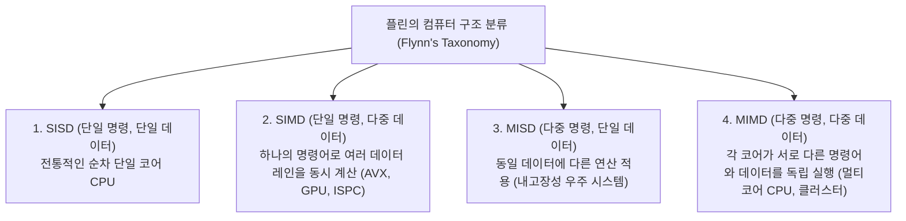
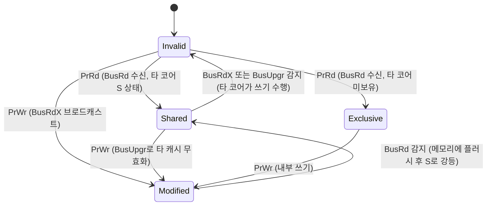

> [!abstract] 핵심 요약
> 현대 CPU는 단일 코어 내부에서도 **SIMD 벡터 연산 유닛**과 **SMT(동시 멀티스레딩)**을 통해 다차원적 병렬성을 구현한다.
> 다중 코어가 L1/L2 프라이빗 캐시를 보유하면서 발생하는 데이터 불일치를 해결하기 위한 **스누핑(Snooping) 기반 MESI 캐시 일관성 프로토콜**과, 서로 다른 변수가 동일 64바이트 캐시 라인에 위치해 불필요한 버스 트래픽을 유발하는 **거짓 공유(False Sharing)** 병목을 해결하는 원리를 이해해야 한다.

---

## 1. Flynn의 아키텍처 분류와 SIMD vs MIMD



---

## 2. MESI 캐시 일관성 프로토콜 4대 상태 전이

| 상태 | 상태 명칭 (State) | 캐시 라인 유효성 | 타 코어 보유 여부 | 메인 메모리와의 일치성 |
| :--: | :-- | :--: | :--: | :-- |
| **M** | **Modified (수정됨)** | 유효 (Valid) | **단독 보유 (No)** | **불일치 (더티, 메모리보다 최신)** |
| **E** | **Exclusive (독점 클린)** | 유효 (Valid) | **단독 보유 (No)** | 일치 (클린) |
| **S** | **Shared (공유됨)** | 유효 (Valid) | 타 코어도 보유 가능 | 일치 (클린, 읽기 전용) |
| **I** | **Invalid (무효화됨)** | **무효 (Invalid)** | - | 사용 불가 (캐시 미스 발생) |



---

## 3. 실시간 멀티코어 MESI 캐시 일관성 시뮬레이터

```html preview
<div style="font-family:system-ui,-apple-system,sans-serif;padding:20px;background:var(--card);color:var(--card-foreground);border:1px solid var(--border);border-radius:var(--radius)">
  <div style="font-size:16px;font-weight:700;margin-bottom:14px;color:var(--primary);display:flex;align-items:center;gap:8px">
    <span>🔄 멀티코어 L1 캐시 일관성(MESI) 상태 전이 시뮬레이터</span>
  </div>

  <div style="display:grid;grid-template-columns:1fr 1fr;gap:12px;margin-bottom:14px">
    <div style="padding:10px;background:var(--background);border:1px solid var(--border);border-radius:var(--radius)">
      <div style="font-size:12px;font-weight:700;color:var(--chart-1);margin-bottom:6px">Core 0 (L1 Cache)</div>
      <div style="font-family:monospace;font-size:12px;line-height:1.6">
        • 상태: <span id="c0State" style="font-weight:800;color:var(--chart-2)">S (Shared)</span><br/>
        • 데이터 x: <span id="c0Val" style="font-weight:700">100</span>
      </div>
      <div style="display:flex;gap:4px;margin-top:8px">
        <button id="btnC0Read" style="flex:1;padding:4px;background:var(--card);color:var(--foreground);border:1px solid var(--border);border-radius:var(--radius);font-size:10px;cursor:pointer">Read x</button>
        <button id="btnC0Write" style="flex:1;padding:4px;background:var(--primary);color:#fff;border:none;border-radius:var(--radius);font-size:10px;font-weight:700;cursor:pointer">Write x = 200</button>
      </div>
    </div>

    <div style="padding:10px;background:var(--background);border:1px solid var(--border);border-radius:var(--radius)">
      <div style="font-size:12px;font-weight:700;color:var(--chart-2);margin-bottom:6px">Core 1 (L1 Cache)</div>
      <div style="font-family:monospace;font-size:12px;line-height:1.6">
        • 상태: <span id="c1State" style="font-weight:800;color:var(--chart-2)">S (Shared)</span><br/>
        • 데이터 x: <span id="c1Val" style="font-weight:700">100</span>
      </div>
      <div style="display:flex;gap:4px;margin-top:8px">
        <button id="btnC1Read" style="flex:1;padding:4px;background:var(--card);color:var(--foreground);border:1px solid var(--border);border-radius:var(--radius);font-size:10px;cursor:pointer">Read x</button>
        <button id="btnC1Write" style="flex:1;padding:4px;background:var(--primary);color:#fff;border:none;border-radius:var(--radius);font-size:10px;font-weight:700;cursor:pointer">Write x = 300</button>
      </div>
    </div>
  </div>

  <div id="mesiBusLog" style="padding:10px;background:var(--background);border:1px solid var(--border);border-radius:var(--radius);font-family:monospace;font-size:11px">
    [Bus Idle] 양쪽 코어가 x=100을 Shared(S) 상태로 공유하고 있습니다.
  </div>

  <script>
    document.getElementById('btnC0Write').onclick = function() {
      document.getElementById('c0State').textContent = "M (Modified)";
      document.getElementById('c0State').style.color = "var(--destructive,#ef4444)";
      document.getElementById('c0Val').textContent = "200";

      document.getElementById('c1State').textContent = "I (Invalid)";
      document.getElementById('c1State').style.color = "var(--muted-foreground)";

      document.getElementById('mesiBusLog').innerHTML = "<span style='color:var(--chart-1);font-weight:700'>[BusUpgr 브로드캐스트]</span> Core 0이 쓰기를 위해 버스에 무효화 신호를 송출하여 Core 1의 캐시를 <b>Invalid(I)</b>로 강등시키고 독점 <b>Modified(M)</b> 상태로 전이했습니다.";
    };

    document.getElementById('btnC1Read').onclick = function() {
      var c0St = document.getElementById('c0State').textContent;
      if (c0St.indexOf('M') !== -1) {
        document.getElementById('c0State').textContent = "S (Shared)";
        document.getElementById('c0State').style.color = "var(--chart-2)";
        document.getElementById('c1State').textContent = "S (Shared)";
        document.getElementById('c1State').style.color = "var(--chart-2)";
        document.getElementById('c1Val').textContent = "200";

        document.getElementById('mesiBusLog').innerHTML = "<span style='color:var(--chart-2);font-weight:700'>[BusRd 스누핑]</span> Core 1의 읽기 요청을 감지한 Core 0이 더티 데이터(200)를 메모리에 쓰고 양쪽 모두 <b>Shared(S)</b> 상태로 전이했습니다.";
      }
    };

    document.getElementById('btnC0Read').onclick = function() {
      document.getElementById('mesiBusLog').textContent = "[Cache Hit] Core 0이 현재 캐시 라인 데이터를 직접 읽었습니다.";
    };

    document.getElementById('btnC1Write').onclick = function() {
      document.getElementById('c1State').textContent = "M (Modified)";
      document.getElementById('c1State').style.color = "var(--destructive,#ef4444)";
      document.getElementById('c1Val').textContent = "300";

      document.getElementById('c0State').textContent = "I (Invalid)";
      document.getElementById('c0State').style.color = "var(--muted-foreground)";

      document.getElementById('mesiBusLog').innerHTML = "<span style='color:var(--chart-1);font-weight:700'>[BusRdX 브로드캐스트]</span> Core 1이 쓰기를 수행하여 Core 0의 캐시 라인을 <b>Invalid(I)</b>로 무효화했습니다.";
    };
  </script>
</div>
```
