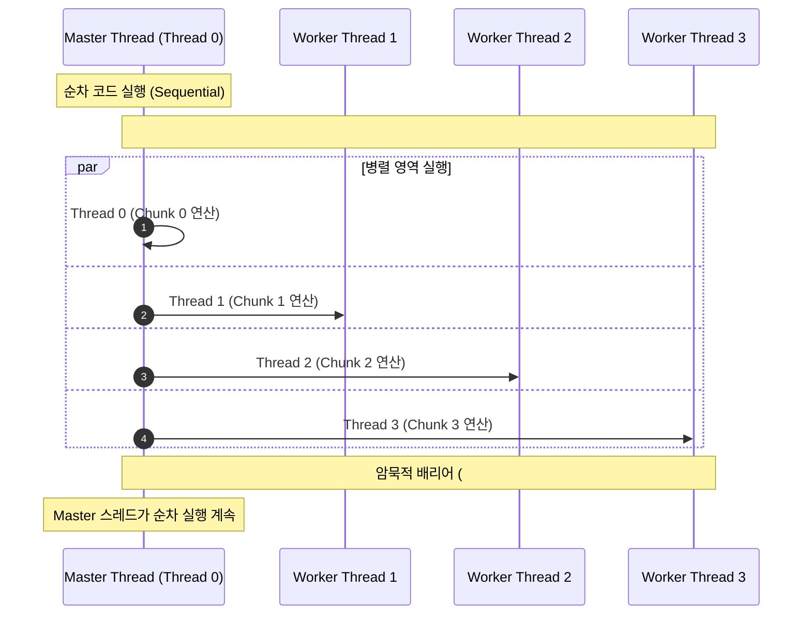

> [!abstract] 핵심 요약
> **OpenMP(Open Multi-Processing)**는 C/C++/Fortran 환경에서 공유 메모리 기반 병렬화를 구현하는 표준 컴파일러 지시어(Pragma) 프레임워크이다.
> 메인 스레드가 작업 영역 진입 시 워커 스레드 풀을 분기하고 완료 후 합류하는 **Fork-Join 모델**, 작업 부하 균등 여부에 따른 **`schedule(static)` vs `schedule(dynamic)`** 스케줄링 최적화, 그리고 뮤텍스 락 오버헤드 없이 각 스레드의 부분합을 병렬 취합하는 **`reduction` 절**은 고성능 멀티스레딩의 핵심 기법이다.

---

## 1. OpenMP Fork-Join 병렬 실행 모델



---

## 2. 루프 스케줄링 및 축약(Reduction) 성능 비교

```c
// 비효율적인 Critical 방식 (순차 락 병목)
#pragma omp parallel for
for(int i=0; i<N; i++) {
    #pragma omp critical
    sum += A[i];
}

// 고성능 Reduction 방식 (스레드 로컬 합산 후 O(log P) 병합)
#pragma omp parallel for reduction(+:sum)
for(int i=0; i<N; i++) {
    sum += A[i];
}
```

| 스케줄링 절 | 할당 시점 | 오버헤드 | 최적 활용 시나리오 |
| :-- | :-- | :--: | :-- |
| **`schedule(static, chunk)`** | 컴파일/기동 시 정적 분할 | **최소 (거의 0)** | 루프 반복 간 연산량이 일정하고 균등한 경우 |
| **`schedule(dynamic, chunk)`** | 런타임 작업 큐에서 동적 획득 | 락/큐 오버헤드 존재 | Mandelbrot 등 반복 간 연산량 편차가 극심한 경우 |
| **`schedule(guided, chunk)`** | 큰 청크에서 점진 축소 | 중간 | 동적 분배 오버헤드를 낮추면서 불균형 완화 |

---

## 3. 실시간 OpenMP 루프 스케줄링(Static vs Dynamic) 분배 시뮬레이터

```html preview
<div style="font-family:system-ui,-apple-system,sans-serif;padding:20px;background:var(--card);color:var(--card-foreground);border:1px solid var(--border);border-radius:var(--radius)">
  <div style="font-size:16px;font-weight:700;margin-bottom:14px;color:var(--primary);display:flex;align-items:center;gap:8px">
    <span>🧵 OpenMP 루프 스케줄링(Static vs Dynamic) 워커 스레드 분배기</span>
  </div>

  <div style="display:grid;grid-template-columns:1fr 1fr;gap:12px;margin-bottom:14px">
    <div>
      <label style="font-size:11px;color:var(--muted-foreground)">스케줄링 전략 (Schedule Clause):</label>
      <select id="ompSchedType" style="width:100%;padding:4px 8px;background:var(--background);color:var(--foreground);border:1px solid var(--border);border-radius:var(--radius);font-weight:700">
        <option value="static">schedule(static, chunk=4)</option>
        <option value="dynamic">schedule(dynamic, chunk=2)</option>
      </select>
    </div>
    <div>
      <label style="font-size:11px;color:var(--muted-foreground)">총 루프 반복 횟수 (N):</label>
      <input id="ompTotalIters" type="number" value="16" readonly style="width:100%;padding:4px 8px;background:var(--background);color:var(--foreground);border:1px solid var(--border);border-radius:var(--radius);font-weight:700" />
    </div>
  </div>

  <div style="display:grid;grid-template-columns:repeat(4, 1fr);gap:8px;margin-bottom:12px">
    <div style="padding:8px;background:var(--background);border:1px solid var(--border);border-radius:var(--radius);text-align:center">
      <div style="font-size:11px;font-weight:700;color:var(--chart-1)">Thread 0</div>
      <div id="t0Tasks" style="font-family:monospace;font-size:10px;margin-top:4px">0..3</div>
    </div>
    <div style="padding:8px;background:var(--background);border:1px solid var(--border);border-radius:var(--radius);text-align:center">
      <div style="font-size:11px;font-weight:700;color:var(--chart-2)">Thread 1</div>
      <div id="t1Tasks" style="font-family:monospace;font-size:10px;margin-top:4px">4..7</div>
    </div>
    <div style="padding:8px;background:var(--background);border:1px solid var(--border);border-radius:var(--radius);text-align:center">
      <div style="font-size:11px;font-weight:700;color:var(--chart-3)">Thread 2</div>
      <div id="t2Tasks" style="font-family:monospace;font-size:10px;margin-top:4px">8..11</div>
    </div>
    <div style="padding:8px;background:var(--background);border:1px solid var(--border);border-radius:var(--radius);text-align:center">
      <div style="font-size:11px;font-weight:700;color:var(--primary)">Thread 3</div>
      <div id="t3Tasks" style="font-family:monospace;font-size:10px;margin-top:4px">12..15</div>
    </div>
  </div>

  <div id="ompSchedDesc" style="padding:10px;background:var(--background);border:1px solid var(--border);border-radius:var(--radius);font-size:11px">
    [Static 스케줄링] 루프 시작 전 16개의 인덱스가 4개씩 고정 분할되어 각 스레드에 사전 할당됩니다.
  </div>

  <script>
    document.getElementById('ompSchedType').onchange = function() {
      var val = this.value;
      if (val === 'static') {
        document.getElementById('t0Tasks').textContent = "0..3";
        document.getElementById('t1Tasks').textContent = "4..7";
        document.getElementById('t2Tasks').textContent = "8..11";
        document.getElementById('t3Tasks').textContent = "12..15";
        document.getElementById('ompSchedDesc').textContent = "[Static 스케줄링] 런타임 큐 동기화 오버헤드가 없으며, 계산량이 일정한 작업에 최적입니다.";
      } else {
        document.getElementById('t0Tasks').textContent = "0,1 | 8,9";
        document.getElementById('t1Tasks').textContent = "2,3 | 10,11";
        document.getElementById('t2Tasks').textContent = "4,5 | 12,13";
        document.getElementById('t3Tasks').textContent = "6,7 | 14,15";
        document.getElementById('ompSchedDesc').textContent = "[Dynamic 스케줄링] 스레드가 2개씩 작업을 처리한 후 작업 큐에서 다음 청크를 동적으로 가져옵니다 (불균등 부하 해소).";
      }
    };
  </script>
</div>
```
