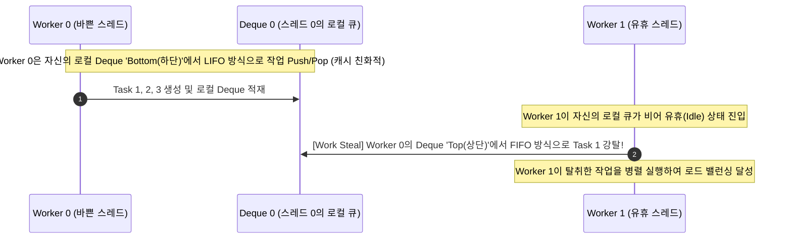
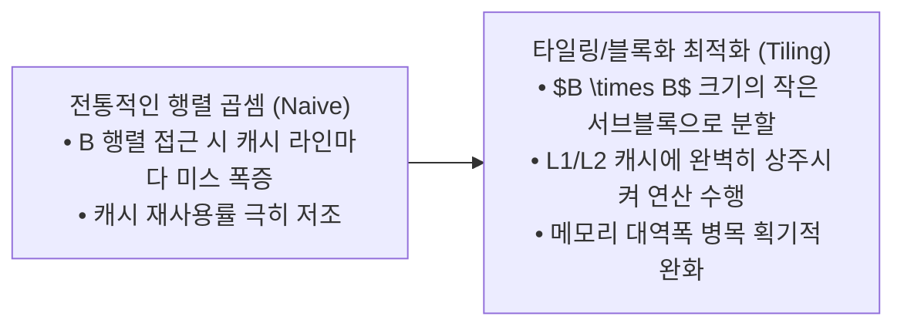

> [!abstract] 핵심 요약
> 병렬 시스템의 실제 가속도는 단순히 코어 수를 늘린다고 선형적으로 증가하지 않는다.
> 가장 느린 워커에 의해 전체 수행 시간이 결정되는 **로드 불균형(Load Imbalance)**을 해결하기 위한 **작업 훔치기(Work Stealing - Deque LIFO/FIFO)** 알고리즘, 메모리 대역폭 병목을 완화하는 **캐시 블록화(Loop Tiling/Blocking)**, 그리고 락 병목을 제거하는 **세분화 잠금(Fine-Grained Locking)** 기법을 정밀하게 적용해야 한다.

---

## 1. Deque 기반 작업 훔치기 (Work Stealing) 메커니즘



---

## 2. 메모리 지역성과 루프 블록화 (Loop Tiling)

$$\text{Naive } N \times N \text{ Matrix Mul}: O(N^3) \text{ Memory Accesses} \implies \text{Tiled } (B \times B): O\left(\frac{N^3}{B}\right) \text{ Cache Misses}$$



---

## 3. 실시간 작업 훔치기(Work Stealing) 로드 밸런서 시뮬레이터

```html preview
<div style="font-family:system-ui,-apple-system,sans-serif;padding:20px;background:var(--card);color:var(--card-foreground);border:1px solid var(--border);border-radius:var(--radius)">
  <div style="font-size:16px;font-weight:700;margin-bottom:14px;color:var(--primary);display:flex;align-items:center;gap:8px">
    <span>⚖️ 분산 런타임 작업 훔치기(Work Stealing) 대화형 시뮬레이터</span>
  </div>

  <div style="display:grid;grid-template-columns:1fr 1fr;gap:12px;margin-bottom:14px">
    <div style="padding:10px;background:var(--background);border:1px solid var(--border);border-radius:var(--radius)">
      <div style="font-size:12px;font-weight:700;color:var(--chart-1);margin-bottom:4px">Worker 0 (과부하)</div>
      <div style="font-family:monospace;font-size:12px">잔여 작업: <span id="w0TasksOut" style="font-weight:800;color:var(--destructive,#ef4444)">8 개</span></div>
    </div>
    <div style="padding:10px;background:var(--background);border:1px solid var(--border);border-radius:var(--radius)">
      <div style="font-size:12px;font-weight:700;color:var(--chart-2);margin-bottom:4px">Worker 1 (유휴 상태)</div>
      <div style="font-family:monospace;font-size:12px">잔여 작업: <span id="w1TasksOut" style="font-weight:800;color:var(--muted-foreground)">0 개 (Idle)</span></div>
    </div>
  </div>

  <div style="display:flex;gap:8px;margin-bottom:12px">
    <button id="btnStealTask" style="padding:6px 14px;background:var(--primary);color:#fff;border:none;border-radius:var(--radius);font-weight:700;cursor:pointer">Worker 1이 작업 훔치기 (Steal Half)</button>
    <button id="btnResetSteal" style="padding:6px 12px;background:var(--muted);color:var(--foreground);border:1px solid var(--border);border-radius:var(--radius);font-size:11px;cursor:pointer">초기화</button>
  </div>

  <div id="stealLogDesc" style="padding:10px;background:var(--background);border:1px solid var(--border);border-radius:var(--radius);font-size:11px">
    대기 중: Worker 1이 유휴 상태입니다. 버튼을 눌러 작업을 훔쳐오세요.
  </div>

  <script>
    var w0 = 8;
    var w1 = 0;

    document.getElementById('btnStealTask').onclick = function() {
      if (w0 > 1) {
        var stolen = Math.floor(w0 / 2);
        w0 -= stolen;
        w1 += stolen;

        document.getElementById('w0TasksOut').textContent = w0 + " 개";
        document.getElementById('w0TasksOut').style.color = "var(--chart-2)";
        document.getElementById('w1TasksOut').textContent = w1 + " 개";
        document.getElementById('w1TasksOut').style.color = "var(--chart-2)";
        document.getElementById('stealLogDesc').innerHTML = "⚡ <b>[Work Stolen]</b> Worker 1이 Worker 0의 Deque 상단에서 " + stolen + "개의 작업을 탈취하여 즉시 병렬 처리를 시작했습니다 (완벽한 부하 균등화).";
      }
    };

    document.getElementById('btnResetSteal').onclick = function() {
      w0 = 8; w1 = 0;
      document.getElementById('w0TasksOut').textContent = "8 개";
      document.getElementById('w0TasksOut').style.color = "var(--destructive,#ef4444)";
      document.getElementById('w1TasksOut').textContent = "0 개 (Idle)";
      document.getElementById('w1TasksOut').style.color = "var(--muted-foreground)";
      document.getElementById('stealLogDesc').textContent = "초기화 완료: Worker 0에 부하가 집중된 상태입니다.";
    };
  </script>
</div>
```
