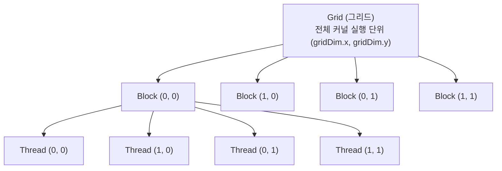
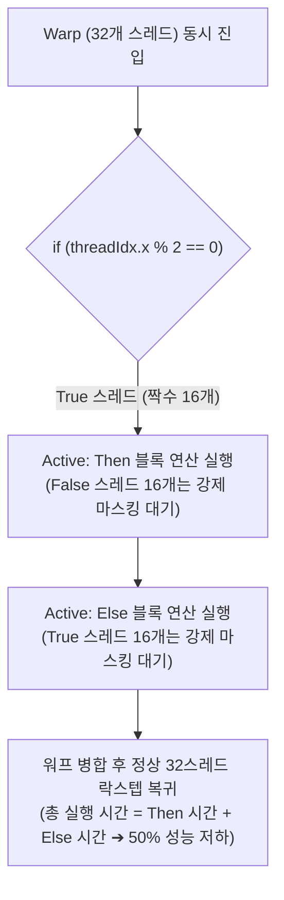

> [!abstract] 핵심 요약
> **GPU(Graphics Processing Unit)**는 대규모 데이터 병렬성을 초고속 처리량(Throughput)으로 극대화하기 위해 설계된 매니코어 가속기이다.
> 엔비디아의 **SIMT(Single Instruction Multiple Threads)** 모델 아래 32개 스레드가 하나의 **워프(Warp)**로 묶여 락스텝(Lockstep) 실행되며, 분기문(`if-else`)에 의한 **워프 발산(Warp Divergence)**을 최소화하고 글로벌 메모리 대역폭 한계를 극복하기 위해 온칩 **Shared Memory(`__shared__`) 기반 타일링(Tiling)**을 적용하는 것이 핵심이다.

---

## 1. CUDA 스레드 계층과 1D/2D 인덱싱 공식



### 1) 1차원 전역 스레드 ID 계산
$$\text{Global ID} = \text{blockIdx.x} \times \text{blockDim.x} + \text{threadIdx.x}$$

### 2) 2차원 행렬 전역 좌표 계산
$$\text{row} = \text{blockIdx.y} \times \text{blockDim.y} + \text{threadIdx.y}$$
$$\text{col} = \text{blockIdx.x} \times \text{blockDim.x} + \text{threadIdx.x}$$
$$\text{global\_idx} = \text{row} \times \text{Width} + \text{col}$$

---

## 2. 워프 발산(Warp Divergence)과 성능 영향



---

## 3. 실시간 CUDA 2D Grid/Block 전역 인덱스 매퍼 시뮬레이터

```html preview
<div style="font-family:system-ui,-apple-system,sans-serif;padding:20px;background:var(--card);color:var(--card-foreground);border:1px solid var(--border);border-radius:var(--radius)">
  <div style="font-size:16px;font-weight:700;margin-bottom:14px;color:var(--primary);display:flex;align-items:center;gap:8px">
    <span>🎮 CUDA 2차원 그리드/블록 전역 스레드 좌표 매핑기</span>
  </div>

  <div style="display:grid;grid-template-columns:repeat(4, 1fr);gap:8px;margin-bottom:14px">
    <div>
      <label style="font-size:10px;color:var(--muted-foreground)">blockIdx.x:</label>
      <input id="inBIdX" type="number" value="1" min="0" max="7" style="width:100%;padding:4px;background:var(--background);color:var(--foreground);border:1px solid var(--border);border-radius:var(--radius);font-weight:700" />
    </div>
    <div>
      <label style="font-size:10px;color:var(--muted-foreground)">blockIdx.y:</label>
      <input id="inBIdY" type="number" value="2" min="0" max="7" style="width:100%;padding:4px;background:var(--background);color:var(--foreground);border:1px solid var(--border);border-radius:var(--radius);font-weight:700" />
    </div>
    <div>
      <label style="font-size:10px;color:var(--muted-foreground)">threadIdx.x:</label>
      <input id="inTIdX" type="number" value="3" min="0" max="15" style="width:100%;padding:4px;background:var(--background);color:var(--foreground);border:1px solid var(--border);border-radius:var(--radius);font-weight:700" />
    </div>
    <div>
      <label style="font-size:10px;color:var(--muted-foreground)">threadIdx.y:</label>
      <input id="inTIdY" type="number" value="1" min="0" max="15" style="width:100%;padding:4px;background:var(--background);color:var(--foreground);border:1px solid var(--border);border-radius:var(--radius);font-weight:700" />
    </div>
  </div>

  <div style="padding:10px;background:var(--background);border:1px solid var(--border);border-radius:var(--radius);margin-bottom:12px">
    <div style="font-size:11px;color:var(--muted-foreground);margin-bottom:4px">설정: blockDim.x = 16, blockDim.y = 16, Matrix Width = 64</div>
    <div style="display:grid;grid-template-columns:1fr 1fr 1fr;gap:8px;text-align:center">
      <div>전역 col: <span id="outCol" style="font-weight:800;color:var(--chart-1)">19</span></div>
      <div>전역 row: <span id="outRow" style="font-weight:800;color:var(--chart-2)">33</span></div>
      <div>1D 선형 인덱스: <span id="outLinearIdx" style="font-weight:800;color:var(--primary)">2,131</span></div>
    </div>
  </div>

  <script>
    function updateCudaMapping() {
      var bx = parseInt(document.getElementById('inBIdX').value) || 0;
      var by = parseInt(document.getElementById('inBIdY').value) || 0;
      var tx = parseInt(document.getElementById('inTIdX').value) || 0;
      var ty = parseInt(document.getElementById('inTIdY').value) || 0;

      var bDimX = 16, bDimY = 16, width = 64;
      var col = bx * bDimX + tx;
      var row = by * bDimY + ty;
      var linear = row * width + col;

      document.getElementById('outCol').textContent = col;
      document.getElementById('outRow').textContent = row;
      document.getElementById('outLinearIdx').textContent = linear.toLocaleString();
    }

    ['inBIdX', 'inBIdY', 'inTIdX', 'inTIdY'].forEach(function(id) {
      document.getElementById(id).addEventListener('input', updateCudaMapping);
    });
    updateCudaMapping();
  </script>
</div>
```
