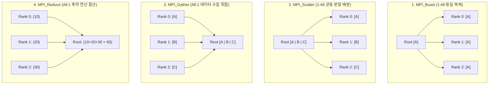

> [!abstract] 핵심 요약
> 대규모 슈퍼컴퓨터 및 HPC 클러스터와 같은 **분산 메모리(Distributed Memory)** 환경에서는 프로세스들이 물리 메모리를 직접 공유하지 않고 **네트워크 메시지 교환(MPI)**을 통해 협업한다.
> 2개 프로세스 간의 **점대점 통신(`MPI_Send`/`MPI_Recv`)**과 통신 그룹 전체가 참여하여 데이터를 효율적으로 분배·수렴하는 **4대 집합 통신(`MPI_Bcast`, `MPI_Scatter`, `MPI_Gather`, `MPI_Reduce`)**의 데이터 이동 패턴과 트리 기반 통신 복잡도 $O(\log P)$를 이해하는 것이 핵심이다.

---

## 1. 4대 MPI 집합 통신(Collective Communication) 패턴 비교



---

## 2. MPI 필수 통신 API 요약

| 함수명 | 통신 유형 | 동작 설명 | 통신 복잡도 |
| :-- | :--: | :-- | :--: |
| **`MPI_Send / Recv`** | P2P | 지정된 송수신 랭크(Rank) 간 1:1 블로킹 데이터 전달 | $O(1)$ |
| **`MPI_Bcast`** | Collective | Root의 버퍼 데이터를 모든 프로세스에 동일 브로드캐스트 | $O(\log P)$ |
| **`MPI_Scatter`** | Collective | Root의 연속 배열을 $P$개 조각으로 균등 분할하여 각 랭크에 배포 | $O(\log P)$ |
| **`MPI_Gather`** | Collective | 각 랭크의 개별 데이터를 Root의 연속 배열로 결합 취합 | $O(\log P)$ |
| **`MPI_Reduce`** | Collective | 전 프로세스의 값에 대해 합산/최대값 연산(`MPI_SUM`) 후 Root에 저장 | $O(\log P)$ |

---

## 3. 실시간 MPI 집합 통신(Scatter ➔ Compute ➔ Reduce) 시뮬레이터

```html preview
<div style="font-family:system-ui,-apple-system,sans-serif;padding:20px;background:var(--card);color:var(--card-foreground);border:1px solid var(--border);border-radius:var(--radius)">
  <div style="font-size:16px;font-weight:700;margin-bottom:14px;color:var(--primary);display:flex;align-items:center;gap:8px">
    <span>🌐 MPI 4대 집합 통신(Collective Communication) 대화형 시뮬레이터</span>
  </div>

  <div style="display:flex;gap:8px;margin-bottom:14px">
    <button id="btnMpiScatter" style="padding:6px 12px;background:var(--primary);color:#fff;border:none;border-radius:var(--radius);font-size:11px;font-weight:700;cursor:pointer">1. MPI_Scatter (배분)</button>
    <button id="btnMpiReduce" style="padding:6px 12px;background:var(--chart-1);color:#fff;border:none;border-radius:var(--radius);font-size:11px;font-weight:700;cursor:pointer">2. MPI_Reduce (합산)</button>
    <button id="btnMpiReset" style="padding:6px 10px;background:var(--muted);color:var(--foreground);border:1px solid var(--border);border-radius:var(--radius);font-size:11px;cursor:pointer">초기화</button>
  </div>

  <div style="display:grid;grid-template-columns:repeat(4, 1fr);gap:8px;margin-bottom:12px">
    <div style="padding:8px;background:var(--background);border:1px solid var(--border);border-radius:var(--radius);text-align:center">
      <div style="font-size:11px;font-weight:700;color:var(--primary)">Rank 0 (Root)</div>
      <div id="r0Val" style="font-family:monospace;font-size:12px;font-weight:800;margin-top:4px">[10, 20, 30, 40]</div>
    </div>
    <div style="padding:8px;background:var(--background);border:1px solid var(--border);border-radius:var(--radius);text-align:center">
      <div style="font-size:11px;font-weight:700;color:var(--chart-2)">Rank 1</div>
      <div id="r1Val" style="font-family:monospace;font-size:12px;font-weight:800;margin-top:4px">-</div>
    </div>
    <div style="padding:8px;background:var(--background);border:1px solid var(--border);border-radius:var(--radius);text-align:center">
      <div style="font-size:11px;font-weight:700;color:var(--chart-3)">Rank 2</div>
      <div id="r2Val" style="font-family:monospace;font-size:12px;font-weight:800;margin-top:4px">-</div>
    </div>
    <div style="padding:8px;background:var(--background);border:1px solid var(--border);border-radius:var(--radius);text-align:center">
      <div style="font-size:11px;font-weight:700;color:var(--chart-4)">Rank 3</div>
      <div id="r3Val" style="font-family:monospace;font-size:12px;font-weight:800;margin-top:4px">-</div>
    </div>
  </div>

  <div id="mpiLogDesc" style="padding:10px;background:var(--background);border:1px solid var(--border);border-radius:var(--radius);font-size:11px">
    대기 중: Root 프로세스(Rank 0)에 4개의 원소가 담긴 원본 배열이 있습니다.
  </div>

  <script>
    document.getElementById('btnMpiScatter').onclick = function() {
      document.getElementById('r0Val').textContent = "10";
      document.getElementById('r1Val').textContent = "20";
      document.getElementById('r2Val').textContent = "30";
      document.getElementById('r3Val').textContent = "40";
      document.getElementById('mpiLogDesc').innerHTML = "📤 <b>[MPI_Scatter 완료]</b> Root의 배열이 4개 프로세스에 1개씩 고르게 분배되었습니다. 각 프로세스가 독립 병렬 연산을 수행합니다.";
    };

    document.getElementById('btnMpiReduce').onclick = function() {
      document.getElementById('r0Val').textContent = "SUM = 100";
      document.getElementById('r1Val').textContent = "-";
      document.getElementById('r2Val').textContent = "-";
      document.getElementById('r3Val').textContent = "-";
      document.getElementById('mpiLogDesc').innerHTML = "📥 <b>[MPI_Reduce(MPI_SUM) 완료]</b> 모든 Rank의 부분 결과 (10+20+30+40)가 $O(\\log P)$ 바이너리 트리 구조로 병합되어 Root(Rank 0)에 최종합 <b>100</b>으로 집계되었습니다.";
    };

    document.getElementById('btnMpiReset').onclick = function() {
      document.getElementById('r0Val').textContent = "[10, 20, 30, 40]";
      document.getElementById('r1Val').textContent = "-";
      document.getElementById('r2Val').textContent = "-";
      document.getElementById('r3Val').textContent = "-";
      document.getElementById('mpiLogDesc').textContent = "초기화 완료: Root 프로세스에 원본 데이터 배열 적재";
    };
  </script>
</div>
```
