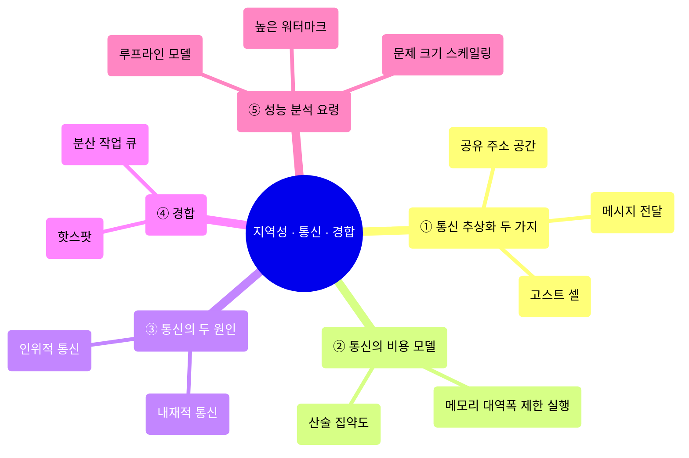
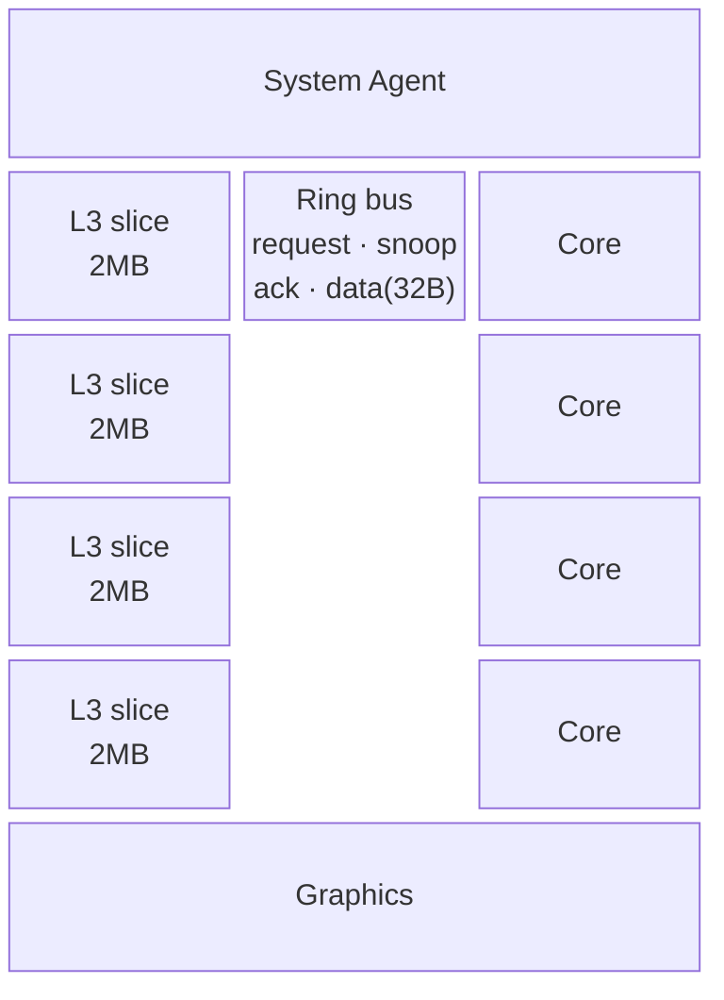
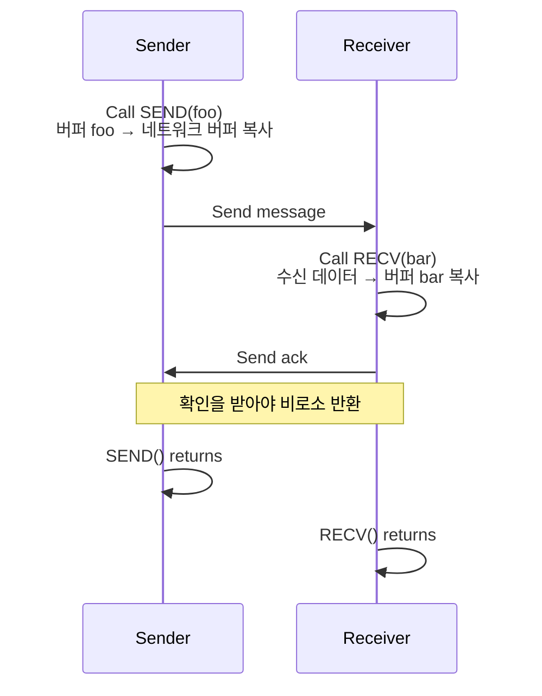
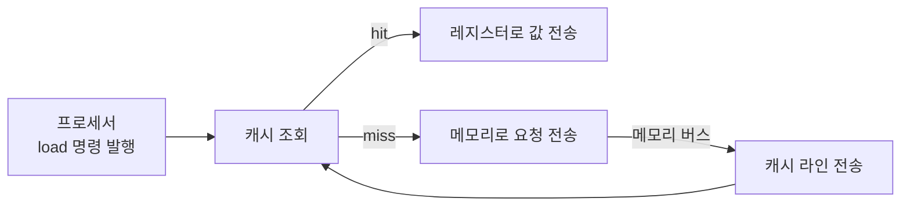
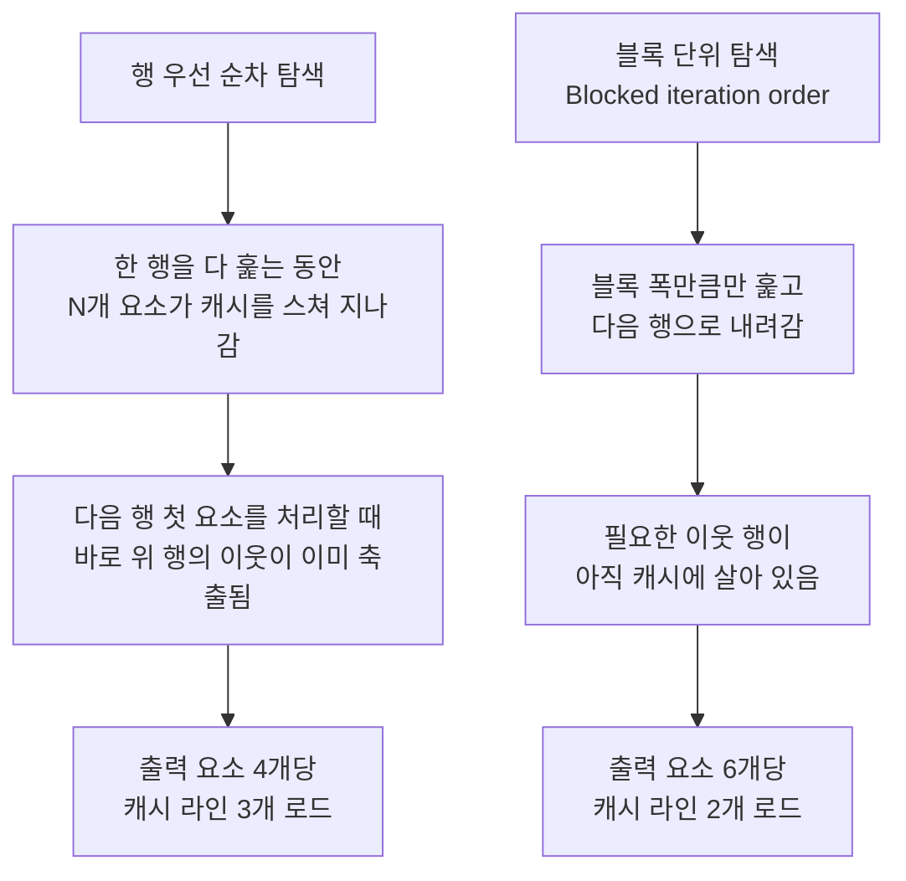
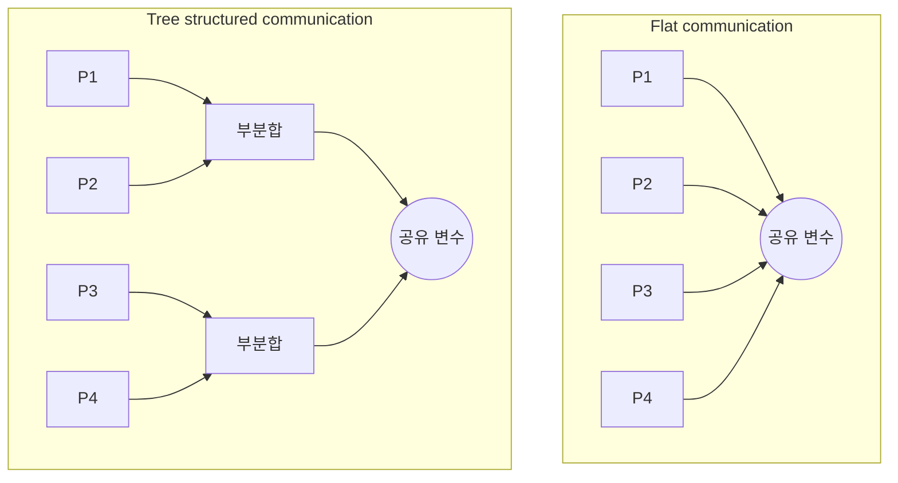
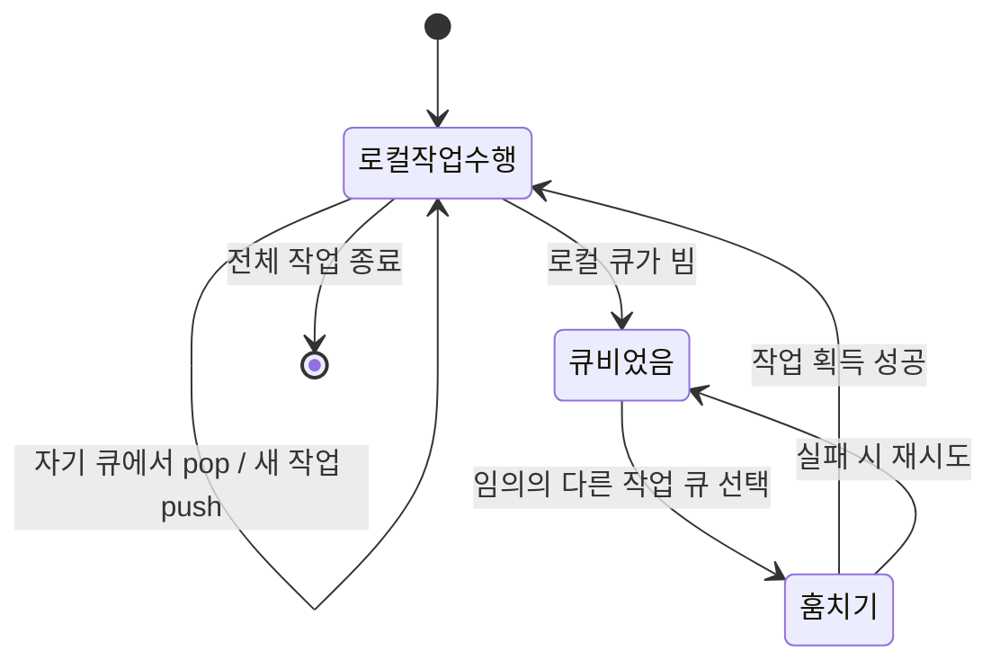
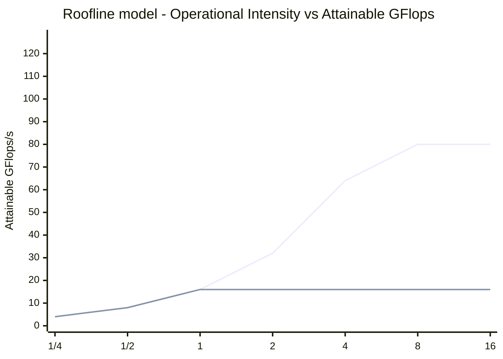

---
aliases:
  - Locality Communication Contention
  - 지역성·통신·경합
authority: primary
course: parallel-distributed-computing
created: '2025-04-28'
date: '2025-04-28'
review_state: active
semester: '3-1'
source: pdf/06_Locality_Communication_Contention.pdf
source_pages: 68
source_sha256: 065dae0b45261e50
source_type: lecture-slides
status: draft
tags:
  - lecture
  - systems
  - distributed
title: 06. 지역성·통신·경합
type: lecture
updated: '2026-08-28'
---

source:: `pdf/06_Locality_Communication_Contention.pdf` (68p)

# 06. 지역성·통신·경합

> [!abstract] 한 줄 요약
> 작업을 잘 나눠도 성능이 안 나오는 이유는 **통신**이다. 통신량에는 알고리즘이
> 어쩔 수 없이 요구하는 **내재적(inherent)** 부분과 캐시 라인·전송 단위 같은 시스템 사정에서
> 생기는 **인위적(artifactual)** 부분이 있고, 여기에 한 자원으로 요청이 몰리는 **경합(contention)** 이 겹친다.
> 세 가지를 줄이는 공통 무기가 **산술 집약도(arithmetic intensity)를 올리는 지역성 관리**다.

## 이 강의의 지도



---

## 1. 공유 주소 공간은 공짜가 아니다

> [!quote] 슬라이드 근거
> `pdf/06_Locality_Communication_Contention.pdf` p.3-10

지금까지의 수업은 "모든 프로세서가 하나의 선형 주소 공간에 붙어 있다"고 가정했다.
이 추상화는 프로그래머에게 편하지만, **하드웨어가 그 편함을 대신 떠안는다.**

> [!info] 공유 주소 공간 모델
>
> - 스레드는 공유 주소 공간의 변수를 읽고 쓰는 것으로 통신한다.
> - 스레드는 락·원자 연산 같은 동기화 프리미티브를 조작한다.
> - 단일 프로세서 프로그래밍의 **논리적 확장**이라 배우기 쉽다.
>
> 대신 효율적 구현에는 하드웨어 지원이 필요하고, **프로세서 수가 많아질수록 비싸진다.**
> 코어 수가 많은 프로세서가 비싼 이유 중 하나가 이것이다.

`load r0 ← mem[addr]` 한 줄조차 실제로는 여러 캐시 계층과 상호 연결망을 거치는 시퀀스다.

### Intel 링 인터커넥트 (Sandy Bridge)



| 항목 | 내용 |
| :-- | :-- |
| 링의 개수 | **4개** — `request` / `snoop` / `ack` / `data(32 bytes)` 용도별로 분리 |
| 상호 연결 노드 | **6개** — L3 캐시 슬라이스 4개 + 시스템 에이전트 + 그래픽 |
| L3 연결 방식 | 각 뱅크가 링 버스에 **두 번** 연결 |
| 이론적 피크 대역폭 | 3.4 GHz 기준 코어 → L3 **435 GB/s** (각 코어가 자기 로컬 슬라이스에 접근할 때) |

> [!warning] 단일 소켓에서도 NUMA다
> 링 위에서 **코어마다 각 L3 슬라이스까지의 거리가 다르다.**
> 그래서 메모리 위치를 접근하는 지연 시간도, 특정 위치의 대역폭도 코어에 따라 달라진다.
> "단일 소켓 = UMA"라고 생각하기 쉽지만, 실제로는 단일 소켓 시스템에서도 NUMA 성격이 관측된다.

---

## 2. 메시지 전달 — 통신을 눈에 보이게 만들기

> [!quote] 슬라이드 근거
> `pdf/06_Locality_Communication_Contention.pdf` p.10-24

공유 주소 공간에서는 통신이 그냥 변수 읽기/쓰기 뒤에 숨어 있다.
프로세서 간 통신을 **명시적으로** 드러내는 다른 추상화가 메시지 전달이다.

| 축 | 공유 주소 공간 | 메시지 전달 |
| :-- | :-- | :-- |
| 주소 공간 | 모든 스레드가 하나를 공유 | 스레드마다 **사적 주소 공간** |
| 통신 방법 | 공유 변수 read/write | `send()` / `recv()` |
| 동기화 | 락 · 원자 연산 · 배리어 | 메시지 송수신 자체가 동기화 |
| 하드웨어 요구 | 모든 프로세서가 모든 주소를 load/store 가능해야 함 | **노드 간 메시지 메커니즘만** 있으면 됨 |
| 확장성 | 프로세서 수가 늘면 비용 급증 | 상용 시스템을 이어 붙여 대규모 구성 가능 |
| 대표 무대 | 멀티코어 CPU | 클러스터 · 슈퍼컴퓨터 |

> [!info] send / recv 의 인자
>
> - `send(버퍼, 크기, 수신자, 태그)` — 보낼 버퍼와 수신자, 선택적 메시지 식별자(태그)를 지정
> - `recv(버퍼, 크기, 발신자, 태그)` — 데이터를 저장할 버퍼와 발신자, 선택적 태그를 지정
>
> 메시지 전송은 스레드 사이에 데이터를 교환할 수 있는 **유일한 방법**이다.

### 그리드 솔버와 고스트 셀

강의는 앞 차시의 red-black 그리드 솔버를 그대로 가져와 메시지 전달로 다시 짠다.
빨간 셀을 전부 병렬로 갱신하고, 끝나면 (빨간 셀 의존성을 반영해) 검정 셀을 병렬로 갱신하고, 수렴할 때까지 반복한다.

4개 스레드로 나누면 그리드는 **4개의 프라이빗 배열**로 쪼개진다.
문제는 각 스레드가 자기 블록의 경계에서 **이웃 블록의 행**을 필요로 한다는 것이다.

> [!info] 고스트 셀 (Ghost cells)
> 원격 주소 공간에서 **복제해 온 그리드 셀**. 그 정보는 "다른 스레드가 소유한다"고 표현한다.
> 스레드 2는 다음 단계에서 검정 셀을 갱신하려면 스레드 1·3이 방금 계산한 최신 빨간 셀 정보가 필요하고,
> 그래서 두 스레드가 각각 한 행씩 스레드 2로 보낸다.

```c
float* local_data = allocate(N+2, rows_per_thread+2);

int tid   = get_thread_id();
int bytes = sizeof(float) * (N+2);

// 고스트 행 수신 (그림의 흰 점)
recv(&local_data[0],                 bytes, tid-1);
recv(&local_data[rows_per_thread+1], bytes, tid+1);
```

배열을 `rows_per_thread + 2` 행으로 잡는 것이 핵심이다. 위아래 한 줄씩이 고스트 행 자리다.

원본 도해(4개 주소 공간 · Send row 화살표 · 스레드 2 로직)는 아래 페이지에서 직접 볼 수 있다.

[06_Locality_Communication_Contention p.18](<../sources/06_Locality_Communication_Contention.pdf>)

### 메시지 전달 솔버의 3요소

| 요소 | 공유 주소 공간 버전 | 메시지 전달 버전 |
| :-- | :-- | :-- |
| **계산** | 전역 인덱스로 배열 접근 | 배열 인덱싱이 **로컬 주소 공간 기준** |
| **통신** | 암묵적 (변수 접근) | `send`/`recv`, **한 번에 행 전체를 대량 전송** |
| **동기화** | 락 · 배리어 | 메시지를 주고받는 것 자체 |

수렴 판정도 메시지로 한다. 모든 스레드가 로컬 `my_diff` 를 스레드 0으로 보내면,
스레드 0이 전역 차이를 합산해 종료 조건을 평가하고 결과를 다시 모든 스레드에 뿌린다.

### 동기(blocking) 송수신과 교착



> [!info] 동기식 의미론
>
> - `send()` — **발신자가 "수신자 주소 공간에 데이터가 있다"는 확인을 받으면** 호출이 반환된다.
> - `recv()` — 수신 데이터가 수신자 주소 공간에 복사되고 **발신자에게 확인을 보내면** 반환된다.

> [!warning] 그대로 짜면 교착이다
> 앞 슬라이드처럼 모든 스레드가 "먼저 보내고 그다음 받는다"로 짜면,
> 모든 스레드가 상대의 `recv()` 를 기다리며 영원히 멈춘다.
> **동기식 송수신을 계속 쓰면서** 이 문제를 푸는 방법이 강의의 질문이다.

답은 **순서를 엇갈리게** 주는 것이다.

```mermaid
gantt
    title 교착 회피 - 짝수·홀수 스레드의 송수신 순서
    dateFormat X
    axisFormat %s
    section 짝수 스레드
    sendDown  : 0, 1
    sendUp    : 1, 2
    recvDown  : 2, 3
    recvUp    : 3, 4
    section 홀수 스레드
    recvUp    : 0, 1
    recvDown  : 1, 2
    sendUp    : 2, 3
    sendDown  : 3, 4
```



```c
if (tid % 2 == 0) {
    sendDown(); sendUp();
    recvDown(); recvUp();
} else {
    recvUp();   recvDown();
    sendUp();   sendDown();
}
```

> [!tip] 비동기(non-blocking) 송수신
>
> - `isend()` — **즉시 반환**한다. 메시지 처리가 스레드 실행과 동시에 진행되므로,
>   넘겨준 버퍼를 스레드가 마음대로 수정하면 안 된다. 대신 전송을 기다리는 동안 다른 일을 할 수 있다.
> - `irecv()` — "앞으로 받겠다"는 의사를 게시하고 즉시 반환한다.
>   실제 송수신 완료 여부는 `checksend()` / `checkrecv()` 로 확인한다.
>
> 통신과 계산을 **겹치게(overlap)** 만드는 것이 목적이다.

---

## 3. 통신의 비용 모델 — 대역폭과 산술 집약도

> [!quote] 슬라이드 근거
> `pdf/06_Locality_Communication_Contention.pdf` p.25-31

> [!important] "통신"을 넓게 보라
> 통신은 기계와 기계 사이의 메시지만이 아니다.
>
> - 칩 안의 코어와 코어 사이
> - 코어와 캐시 사이
> - 코어와 메모리 사이
> - 코어와 **원격** 메모리 사이 (클러스터의 다른 노드)
>
> 로컬 메모리에서 충족되지 않은 접근은 곧바로 **다음 레벨과의 통신**을 유발한다.
> 그래서 모든 수준에서 통신량을 줄이도록 지역성을 관리하는 것이 중요하다.



### 메모리 대역폭 제한 실행

캐시 라인 하나를 로드할 때마다 산술 명령 몇 개만 실행하는 코드를 생각해 보자.
곧 **명령어 실행 속도가 메모리가 데이터를 공급하는 속도에 종속된다.**

> [!example] 슬라이드가 강조하는 관찰 (p.29)
>
> - 빨간색 영역 = 코어가 다음 명령어를 위해 데이터를 **기다리는 중**
> - 이때 메모리는 항상 **100% 데이터를 전송하고 있다**
> - 더 빠르게 전송할 방법은 없다
>
> 정상 상태에서 코어 활용률 저하는 **메모리 지연 시간이나 미결 요청 수의 함수가 아니라
> 명령어 처리량과 메모리 처리량의 함수**다. 이 점을 스스로 납득해야 한다.

> [!question] 슬라이드가 던지는 확인 문제 (p.30)
>
> - 그림에서 메모리 버스가 완전히 활용되고 있다는 것을 어떻게 아는가?
> - 메모리 지연이 길어지면 어떻게 되는가? (요청은 파이프라인화되어 있고 버스 대역폭은 그대로다)
> - 메모리 버스 대역폭이 커지면 그림이 어떻게 달라지는가?
> - 수학 명령어 대 로드 명령어 비율을 크게 올려도 여전히 stall이 생기는가? 왜?

### 산술 집약도

$$\text{산술 집약도(arithmetic intensity)} = \frac{\text{계산량 (예: 명령어)}}{\text{통신량 (예: 바이트)}}$$

$$\frac{1}{\text{산술 집약도}} = \text{통신 대 계산 비율}$$

> [!info] 왜 "산술 집약도"라고 부르나
> 분자가 계산 실행 시간이면 이 비율은 곧 코드의 **평균 대역폭 요구량**을 나타낸다.
> 같은 것을 "통신 대 계산 비율"로도 부르지만, 강의는 **높을수록 좋은 수치**인
> 산술 집약도 쪽이 더 직관적이라고 본다.

최신 병렬 프로세서는 **가용 대역폭 대비 연산 능력의 비율이 매우 높다.**
따라서 이 하드웨어를 효율적으로 쓰려면 **높은 산술 집약도**가 필수다.
(3차시의 요소별 벡터 곱셈 예제가 왜 그렇게 느렸는지 기억할 것)

---

## 4. 통신의 두 원인: 내재적 vs 인위적

> [!quote] 슬라이드 근거
> `pdf/06_Locality_Communication_Contention.pdf` p.32-45

| 구분 | 정의 | 대표 예 | 줄이는 방법 |
| :-- | :-- | :-- | :-- |
| **내재적 통신** (inherent) | 주어진 할당(assignment) 하에서 알고리즘을 수행하려면 **근본적으로** 프로세서 간에 옮겨야 하는 정보. 무한 용량 캐시, 최소 세분성 전송 등을 가정한 값 | 메시지 전달 솔버의 고스트 행 전송 | **할당(assignment)을 바꾼다** |
| **인위적 통신** (artifactual) | 그 밖의 모든 통신. 시스템 구현의 현실적 세부 사항에서 발생 | 캐시 라인 단위 전송, 용량 누락(capacity miss) | **데이터 접근 순서·레이아웃을 바꾼다** |

### 4-1. 내재적 통신은 할당으로 줄인다

같은 $N \times N$ 그리드, 같은 $P$개 프로세서인데 나누는 방식만 바꿔도 산술 집약도가 달라진다.

| 할당 방식 | 프로세서당 계산 요소 | 프로세서당 통신 요소 | 산술 집약도 |
| :-- | :-- | :-- | :-- |
| **1D interleaved** | — | — | $1/2$ (상수) |
| **1D blocked** | $\approx N^2/P$ | $\approx 2N$ | $\propto N/P$ |
| **2D blocked** | $N^2/P$ | $\propto N/\sqrt{P}$ | $N/\sqrt{P}$ |

> [!example] 2D 블록 할당이 이기는 이유
> $$\text{1D blocked: } \frac{N^2/P}{2N} \propto \frac{N}{P}
> \qquad
> \text{2D blocked: } \frac{N^2/P}{N/\sqrt{P}} = \frac{N}{\sqrt{P}}$$
>
> - 1D block 할당보다 **점근적으로 우수한 통신 확장성**을 갖는다.
> - 통신 비용은 $P$ 에 대해 **준선형(sub-linear)** 으로만 증가한다.
> - 할당이 알고리즘의 **2D 지역성을 그대로 포착**하기 때문이다.

### 4-2. 인위적 통신은 접근 순서로 줄인다

같은 그리드 솔버를 **행 우선(row-major)** 으로 훑을 때를 보자.
가정은 슬라이드와 같다: 캐시 라인 = 그리드 요소 4개, 캐시 용량 = 그리드 요소 24개(= 6줄).



> [!warning] 문제의 정체는 용량 누락(capacity miss)
> `(x,y) = (0,1), (1,1), (2,1), (0,2), (2,2)` 같은 요소들은 **이전에 이미 접근했지만**,
> 2행의 첫 출력 요소를 처리하려는 시점에는 캐시에서 밀려나 있다.
> 데이터가 재사용될 자격이 있는데도 캐시가 작아서 못 잡아 두는 것 — 전형적인 인위적 통신이다.
>
> 계산 순서를 "차단(blocking)"으로 재주문하면 **출력 요소당 캐시 라인 로드가 0.75 → 0.33** 으로 줄어든다.

> [!info] 인위적 통신이 생기는 세 가지 경로 (p.41)
>
> 1. **최소 전송 단위(granularity)** — 4바이트 float 하나를 로드해도 64바이트 캐시 라인 전체를 옮겨야 한다.
>    필요한 것보다 **16배** 많은 통신.
> 2. **불필요한 통신** — 연속된 float들을 저장만 하는데도 캐시 라인 전체를 먼저 읽어 온 뒤 전부 덮어쓰고
>    다시 메모리에 쓴다. 라인 전체를 덮어썼으니 그 로드는 순수 오버헤드다.
> 3. **유한한 복제 용량** — 캐시가 너무 작아 접근 사이에 데이터를 유지하지 못해,
>    **같은 데이터가 프로세서로 여러 번 통신된다.**

### 4-3. 커널 퓨전 — 데이터를 공유해 산술 집약도를 올린다

```c
void add(int n, float* A, float* B, float* C) {
    for (int i=0; i<n; i++)
        C[i] = A[i] + B[i];          // 로드 2 · 저장 1 / 수학 연산 1  → AI = 1/3
}
void mul(int n, float* A, float* B, float* C) {
    for (int i=0; i<n; i++)
        C[i] = A[i] * B[i];          // 로드 2 · 저장 1 / 수학 연산 1  → AI = 1/3
}

// E = D + ((A + B) * C)  — 모듈화된 방식
add(n, A, B, tmp1);
mul(n, tmp1, C, tmp2);
add(n, tmp2, D, E);                  // Overall arithmetic intensity = 1/3
```

```c
void fused(int n, float* A, float* B, float* C, float* D, float* E) {
    for (int i=0; i<n; i++)
        E[i] = D[i] + (A[i] + B[i]) * C[i];   // 로드 4 · 저장 1 / 수학 연산 3 → AI = 3/5
}

fused(n, A, B, C, D, E);
```

> [!warning] 모듈성과 성능의 충돌
> 위쪽 코드가 훨씬 모듈화되어 있다. (Python의 NumPy 같은 배열 기반 수학 라이브러리가 이 형태다)
> 그런데 아래쪽 퓨전 코드가 훨씬 빠르다. 이유는 **중간 배열 `tmp1`, `tmp2` 를 메모리에 왕복시키지 않아
> 산술 집약도가 $1/3 \to 3/5$ 로 올라가기 때문**이다.
> 이 아이디어는 [07](<./07. CUDA 설치와 개발 환경.md>) 의 **kernel fusion** 으로 그대로 이어진다.

> [!tip] 공유 활용 (exploit sharing)
> 동일한 데이터에서 작동하는 작업을 **같은 곳에 배치(co-location)** 한다.
> 같은 자료구조를 동시에 다루는 스레드를 같은 프로세서에 스케줄하면 **고유 통신 자체가 줄어든다.**

---

## 5. 경합 — 자원이 하나면 줄이 생긴다

> [!quote] 슬라이드 근거
> `pdf/06_Locality_Communication_Contention.pdf` p.46-52

> [!example] 오피스 아워 비유 (p.47-48)
>
> - 근무 시간: 오후 3시 ~ 3시 20분 (예약 없음)
> - 수행할 작업: 교수가 학생의 질문에 답해 줌
> - 실행 리소스: **교수 1명**
>
> | 단계 | 시간 |
> | :-- | :-- |
> | 학생이 카페에서 교수 사무실까지 걸어감 | 5분 |
> | 줄을 서서 기다림 | ??? |
> | 통찰력 있는 답변을 얻음 | 5분 |
>
> 공유 리소스에 대한 경합 때문에 **전체 운영 시간이 길어지고 학생에게 더 큰 비용이 발생한다.**
> 지연 시간(10분)은 그대로인데, 처리량이 리소스 하나에 묶여 있는 것이 문제다.

> [!info] 경합의 정의
> 리소스는 주어진 **처리량**(단위 시간당 트랜잭션 수)으로 작업을 수행할 수 있다.
> (메모리, 통신 링크, 서버, 근무 시간 중인 조교 등)
> **짧은 시간 안에 리소스에 많은 요청이 몰릴 때** 경합이 발생하고, 그 리소스는 **핫스팟**이 된다.



| 구조 | 경합 가능성 | 경합이 없을 때의 지연 |
| :-- | :-- | :-- |
| **Flat** | 높음 (모두가 한 지점을 때림) | 짧음 (홉 1회) |
| **Tree** | 낮음 (단계별로 분산) | 김 ($\log P$ 단계) |

> [!warning] 트레이드오프지 정답이 아니다
> 트리 구조는 경합을 줄이지만 **경합이 없는 상태에서는 오히려 지연이 더 길다.**
> 프로세서 수와 요청 밀도를 보고 골라야 한다.

### 분산 작업 큐 + work stealing

단일 공유 작업 대기열은 전형적인 핫스팟이다. 해법은 **큐를 쪼개는 것**이다.



| 상태 | 동기화 비용 |
| :-- | :-- |
| 모든 프로세서에 할 일이 있음 | **경합 없음** — 각자 자기 큐만 만짐 |
| 로컬 큐가 비어 임의의 큐에서 훔침 | 동기화가 필요하지만, **어차피 그 스레드는 유휴 상태였으므로 손해가 아니다** |

### 통신 오버헤드를 줄이는 네 가지 전략 (p.52)

| 전략 | 애플리케이션 작성자가 할 일 | 시스템/하드웨어 구현자가 할 일 |
| :-- | :-- | :-- |
| **발신·수신 오버헤드 감소** | 작은 메시지를 큰 메시지로 **통합**해 개수를 줄이고 오버헤드를 상각 | — |
| **통신 지연 단축** | 지역성을 활용하도록 코드 재구성 | 통신 아키텍처 개선 |
| **경합 감소** | 경합 자원을 **복제**(로컬 사본), **세분화된 잠금** | 경합 자원 접근 시간을 분산 |
| **통신·계산 중첩 증가** | 비동기 통신 사용 (비동기 메시지) | 파이프라이닝, 멀티스레딩, 프리페칭, 아웃오브오더 실행 |

> [!warning] 중첩에는 전제가 있다
> 통신과 계산을 겹치려면 애플리케이션에 **실행 유닛 수보다 더 많은 동시성**이 있어야 한다.
> 놀릴 일감이 없으면 겹칠 것도 없다.

---

## 6. 병렬 성능을 이해하는 요령

> [!quote] 슬라이드 근거
> `pdf/06_Locality_Communication_Contention.pdf` p.53-68

> [!tip] 강의가 가장 크게 써 놓은 문장
> **항상, 항상, 항상 가장 간단한 병렬 솔루션을 먼저 시도한 다음 성능을 측정해서 현재 상태를 확인하라.**

### 6-1. 무엇이 성능을 제한하는지 먼저 판별한다

성능이 **연산 / 메모리 대역폭 / 메모리 지연 / 동기화** 중 무엇에 묶여 있는지 확인하고,
"현실적으로 할 수 있는 최선"인 **높은 워터마크(high watermark)** 를 설정해 내 구현이 얼마나 근접했는지 본다.

| 실험 | 결과 해석 |
| :-- | :-- |
| 수학(비메모리) 명령어를 추가한다 | 실행 시간이 연산 수에 **선형으로** 증가 → 코드가 **명령어 속도**에 제한됨 |
| 거의 모든 연산을 제거하되 **데이터는 동일하게 로드**한다 | 시간이 별로 안 줄어듦 → **메모리 병목** 의심 |
| 모든 배열 접근을 `A[0]` 으로 바꾼다 | 빨라진 만큼이 **지역성 개선으로 얻을 수 있는 이득의 상한** |
| 모든 원자 연산·락을 제거한다 | 빨라진 만큼이 **동기화 오버헤드 감소 이득의 상한** (작업량은 거의 동일해야 함) |

> [!warning] 이 실험들의 한계
> 계산·메모리 접근·동기화는 **거의 완벽하게 겹치지 않는다.**
> 그래서 전체 성능이 셋 중 하나에 의해 **전적으로** 결정되는 경우는 드물다.
> 그럼에도 위 수정에 대한 **민감도**는 지배적인 비용이 무엇인지 알려 주는 좋은 지표다.

### 6-2. 루프라인 모델



- **x축의 서로 다른 점** = 서로 다른 연산 강도를 가진 서로 다른 프로그램
- **y축** = 그 연산 강도에서 얻을 수 있는 **최대 명령어 처리량**
- **대각선 영역** = 메모리 대역폭 제한 실행 · **수평 영역** = 연산 능력 제한 실행
- 위 선은 코어가 많은 칩(Opteron X4), 아래 선은 적은 칩(Opteron X2)에 해당한다.
  같은 대역폭 영역에서는 겹치고, 연산 한계선만 다르다.

> [!note] 보충
> 벤치마크에서 **최적화 수준을 여러 단계로 두고** 지붕선을 그리면 더 유용하다.
> (예: SIMD 명령어를 썼을 때와 안 썼을 때의 최고 성능)
> 그림 출처는 Williams et al. 2009.

### 6-3. 측정 도구

| 도구 | 볼 수 있는 것 | 한계 |
| :-- | :-- | :-- |
| OS 활동 모니터 (macOS Activity Monitor 등) | OS가 프로세서 실행 컨텍스트에 스레드를 스케줄한 **시간 비율** | 성능 최적화에는 **큰 도움이 안 됨** |
| 하드웨어 성능 카운터 | 완료된 명령어 수, 클럭 틱, **캐시 히트/미스**, 메모리 컨트롤러가 읽은 바이트 수 | 레지스터를 직접 읽어야 함 |
| Intel Performance Counter Monitor (PCM) | 위 카운터 레지스터에 접근하는 API 제공 | 플랫폼 종속 |

### 6-4. 문제 크기와 속도 향상의 함정

> [!info] 세 가지 성능 지표
>
> - **절대 성능** — 보통 벽시계 시간, 또는 초당 작업 수
> - **속도 향상(speedup)** — $\dfrac{\text{순차 프로그램 실행 시간}}{P\text{개 프로세서 실행 시간}}$
> - **효율성** — 단위 리소스당 성능 (칩 면적당·달러당·와트당 초당 작업 수)

> [!warning] 흔한 함정 — 기준선을 고르는 방식
> 그리드 솔버는 병렬화를 위해 알고리즘 자체를 바꿨고, 새 알고리즘은 **더 느리게 수렴해서 반복 횟수가 늘 수 있다.**
> 이때 속도 향상을 **"1코어에서 돌린 병렬 알고리즘"** 기준으로 재면 숫자가 훨씬 예뻐진다.
> 하지만 정직한 기준선은 **최고의 순차 프로그램**이다.

고정된 문제 크기로 시스템을 평가하는 것도 위험하다.

| 문제 크기 | 무슨 일이 벌어지나 |
| :-- | :-- |
| **너무 작음** | 병렬 처리 오버헤드가 이득을 압도해 **속도 저하**까지 발생. 작은 머신엔 맞아도 큰 머신엔 부적절해 현실적 사용량을 반영하지 못함 |
| **너무 큼** | 핵심 작업 세트가 작은 머신에 안 맞아 디스크 쓰레싱이 나거나 캐시 용량을 초과하거나 아예 실행 불가 |

> [!example] SGI Origin 2000, 32 프로세서 그리드 솔버 (p.65-66)
>
> - $N = 130$ : **혜택 없음** (약간의 속도 저하). 문제가 기계에 비해 너무 작아 통신 대 연산 비율이 크다.
> - $258 \times 258$ 그리드를 32 프로세서에 나누면 프로세서당 약 **310 셀**뿐이다.
> - $1K \times 1K$ 그리드면 프로세서당 약 **32K 셀** → 속도 향상이 24배 이상으로 살아난다.
> - $12K \times 12K$ 그리드에서는 32 프로세서에서 **약 46배** — 이상적 선(32배)을 넘는 **초선형 속도 향상**이 나온다.
>
> 초선형이 나오는 이유: 프로세서가 충분해지면 각 프로세서에 할당된 그리드 청크가
> **프로세서별 캐시에 들어가기 시작**한다. 반대로 문제가 단일 머신에 너무 크면 작업 세트가
> 메모리에 안 맞아 디스크에 쓰레싱이 나고, 그러면 메모리가 더 많은 큰 병렬 머신의 속도 향상이 **놀랍게 보인다.**

> [!tip] 그래서 어떻게 하나
> 머신 크기가 커지면 **문제 크기도 같이 키우는 것이 바람직할 수 있다.**
> 큰 머신을 사는 이유는 보통 "같은 문제를 더 빨리"가 아니라 **"더 많은 계산을 하려고"** 이기 때문이다.

> [!important] 강의의 마지막 슬라이드
>
> - **측정, 측정, 측정**
> - 프로그램에 대한 **높은 워터마크**를 설정하라 — 컴퓨팅·동기화·대역폭 중 무엇에 제한되는가?
> - **스케일링 문제**에 유의하라 — 문제가 머신에 잘 맞는가?

---

## 핵심 정리

| 개념 | 한 줄 정의 | 왜 중요한가 |
| :-- | :-- | :-- |
| **공유 주소 공간** | 모든 스레드가 하나의 주소 공간을 읽고 쓰는 통신 추상화 | 편하지만 프로세서 수가 늘수록 하드웨어 비용이 급증 |
| **메시지 전달** | 사적 주소 공간 + `send`/`recv` 만으로 통신 | 상용 노드를 이어 붙여 클러스터·슈퍼컴퓨터를 구성 가능 |
| **고스트 셀** | 원격 주소 공간에서 복제해 온 경계 셀 | 분할된 도메인의 경계 계산을 로컬에서 수행하게 해 줌 |
| **동기 송수신 교착** | 모두가 "보내고 받기" 순서면 서로를 기다림 | 짝수/홀수 스레드의 순서를 엇갈리게 해 해결 |
| **산술 집약도** | 계산량 ÷ 통신량 | 최신 프로세서는 연산 대비 대역폭이 부족해, 이 값이 곧 달성 가능 성능 |
| **내재적 통신** | 할당이 정해지면 알고리즘상 반드시 필요한 통신 | **할당(2D blocked 등)** 을 바꿔야만 줄어듦 |
| **인위적 통신** | 캐시 라인·용량 등 구현 사정이 만드는 통신 | **접근 순서(blocking)와 레이아웃**으로 줄어듦 |
| **용량 누락** | 캐시가 작아 재사용 전에 축출되어 생기는 미스 | 행 우선 탐색을 블록 탐색으로 바꾸는 근거 |
| **커널 퓨전** | 여러 루프를 하나로 합쳐 중간 배열 왕복을 제거 | 모듈성을 희생하는 대신 산술 집약도를 올림 |
| **경합** | 짧은 시간에 한 리소스로 요청이 몰리는 현상 | 지연이 아니라 **처리량**이 병목이 되는 상황 |
| **핫스팟** | 경합이 집중되는 공유 리소스 | 복제·트리 구조·분산 큐로 완화 |
| **루프라인 모델** | 연산 강도별 달성 가능한 최대 처리량 곡선 | 지금 코드가 대역폭 한계인지 연산 한계인지 판별 |
| **초선형 속도 향상** | $P$배 프로세서로 $P$배 넘게 빨라지는 현상 | 대개 작업 세트가 캐시/메모리에 들어가기 시작해서 생김 |

> [!question]- 스스로 점검
> **Q1.** 단일 소켓 멀티코어에서도 NUMA 성격이 나타나는 이유는?
> **A1.** 링 인터커넥트 위에서 코어마다 각 L3 캐시 슬라이스까지의 거리가 다르기 때문이다. 그래서 접근 지연과 대역폭이 코어별로 달라진다.
>
> **Q2.** 고스트 셀은 무엇이고 왜 필요한가?
> **A2.** 원격 주소 공간에서 복제해 온 그리드 셀이다. 메시지 전달 솔버에서 각 스레드는 자기 블록의 경계를 갱신할 때 이웃 블록의 최신 행이 필요하므로, 배열을 `rows_per_thread + 2` 행으로 잡고 위아래 한 줄을 `recv` 로 채운다.
>
> **Q3.** 동기식 `send`/`recv` 만 쓰면서 교착을 피하는 방법은?
> **A3.** 짝수 스레드는 "보내고 받기", 홀수 스레드는 "받고 보내기" 순서로 엇갈리게 한다. 상대가 항상 반대 연산을 먼저 게시하므로 서로 기다리는 사이클이 생기지 않는다.
>
> **Q4.** 내재적 통신과 인위적 통신은 각각 무엇으로 줄이는가?
> **A4.** 내재적 통신은 **할당 방식**으로 줄인다(1D blocked → 2D blocked, 산술 집약도 $N/P \to N/\sqrt{P}$). 인위적 통신은 **접근 순서와 데이터 레이아웃**으로 줄인다(행 우선 → 블록 탐색, 출력 요소당 캐시 라인 로드 $3/4 \to 2/6$).
>
> **Q5.** `add` + `mul` + `add` 조합보다 `fused` 커널이 빠른 이유를 산술 집약도로 설명하라.
> **A5.** 분리된 버전은 매 루프가 로드 2·저장 1에 수학 연산 1이라 AI가 $1/3$ 이고, 중간 배열 `tmp1`·`tmp2` 를 메모리에 왕복시킨다. 퓨전 버전은 로드 4·저장 1에 수학 연산 3이라 AI가 $3/5$ 로 올라가고 중간 배열 왕복이 사라진다.
>
> **Q6.** Flat 통신 대신 Tree 통신을 쓰면 항상 이득인가?
> **A6.** 아니다. 트리는 경합을 줄이지만 경합이 없는 상황에서는 단계 수가 늘어 지연이 더 길다. 요청 밀도와 프로세서 수를 보고 선택해야 하는 트레이드오프다.
>
> **Q7.** 32 프로세서에서 46배 속도 향상이 나왔다면 무엇을 의심해야 하나?
> **A7.** 초선형 속도 향상이다. 프로세서가 늘면서 프로세서당 그리드 청크가 캐시에 들어가기 시작했거나, 단일 머신에서는 작업 세트가 메모리에 안 맞아 디스크 쓰레싱이 났을 가능성이 크다. 기준선이 공정한지부터 확인해야 한다.

## 슬라이드 근거

| 섹션 | 슬라이드 |
| :-- | :-- |
| 1. 공유 주소 공간의 비용 · 링 인터커넥트 · NUMA | p.3-10 |
| 2. 메시지 전달 · 고스트 셀 · 동기/비동기 송수신 | p.10-24 |
| 3. 통신 비용 모델 · 대역폭 제한 · 산술 집약도 | p.25-31 |
| 4. 내재적 vs 인위적 통신 · 블로킹 · 커널 퓨전 | p.32-45 |
| 5. 경합 · 분산 작업 큐 · 오버헤드 감소 전략 | p.46-52 |
| 6. 성능 분석 요령 · 루프라인 · 문제 크기 스케일링 | p.53-68 |

## 관련 노트

- [01. 왜 병렬 처리인가](<./01. 왜 병렬 처리인가.md>) — 데이터 이동 에너지 비용, 이 노트의 출발점
- [05. 성능 최적화 I - 작업 분배와 스케줄링](<./05. 성능 최적화 I - 작업 분배와 스케줄링.md>) — 부하 균형 축, 이 노트는 통신 축
- [07. CUDA 설치와 개발 환경](<./07. CUDA 설치와 개발 환경.md>) — 커널 퓨전과 데이터 이동 전력이 CUDA 쪽에서 재등장
- [11. MPI 병렬 프로그래밍 I](<./11. MPI 병렬 프로그래밍 I.md>) — 여기서 개념으로 본 `send`/`recv` 의 실제 API
- [02. 병렬 컴퓨터의 기본 아키텍처](<./02. 병렬 컴퓨터의 기본 아키텍처.md>) — 상호 연결망과 메모리 계층의 배경
