---
aliases:
  - MPI 병렬 프로그래밍 I
  - Message Passing Interface 기초
authority: primary
course: parallel-distributed-computing
created: '2025-05-17'
date: '2025-05-17'
review_state: active
semester: '3-1'
source: pdf/11_MPI 프로그래밍_V_01.pdf
source_pages: 39
source_sha256: 05238923836ad37e
source_type: lecture-slides
status: draft
tags:
  - lecture
  - systems
  - distributed
title: 11. MPI 병렬 프로그래밍 I
type: lecture
updated: '2026-08-28'
---

source:: `pdf/11_MPI 프로그래밍_V_01.pdf` (39p)

# 11. MPI 병렬 프로그래밍 I

> [!abstract] 한 줄 요약
> **MPI는 "메모리를 공유하지 않는 프로세스들"이 서로 데이터를 주고받게 해 주는 통신 라이브러리 표준**이다.
> 모든 프로세스가 같은 프로그램을 돌리되 자기 **rank**로 할 일을 나누고, 필요한 값은
> **명시적인 Send/Recv**로 옮긴다. 그래서 "누가 보내고 누가 받는가"를 프로그래머가 직접 맞춰야 하고,
> 그것이 어긋나면 그대로 **데드락**이 된다.

## 이 강의의 지도

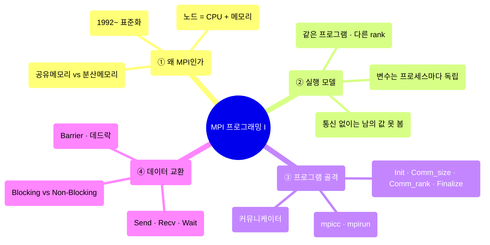

---

## 1. 왜 MPI인가 — 분산 메모리라는 전제

> [!quote] 슬라이드 근거
> `pdf/11_MPI 프로그래밍_V_01.pdf` p.2-4, 8, 19

### 병렬 처리 모델은 메모리 구조가 결정한다

컴퓨터 아키텍처가 메모리를 어떻게 나눠 갖느냐에 따라 병렬 처리 방식이 갈린다.

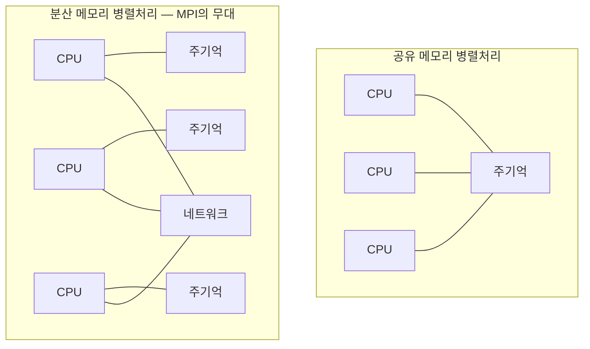

| 구분 | 공유 메모리 | 분산 메모리 |
| :-- | :-- | :-- |
| 메모리 접근 | 모든 CPU가 하나의 주기억을 본다 | 각 PU는 **자기 메모리만** 접근 가능 |
| 데이터 공유 방법 | 변수를 그냥 읽고 쓴다 | **메시지를 명시적으로 주고받아야** 한다 |
| 확장 규모 | 한 대의 기계 안 | 수천~수만 PU 규모까지 |
| 프로그래머 부담 | 상대적으로 낮음 | 데이터 분산을 의식한 설계가 필수 |
| 대표 기법 | OpenMP 등 | **MPI (Message Passing Interface)** |

> [!info] 정의 — 노드(node)
> **CPU와 메모리가 일대일로 짝을 이룬 상태에서, 그 짝들이 같은 네트워크에 놓인 것**.
> 이 한 쌍을 노드라고 부른다. MPI는 이런 노드가 여러 개 있는 구성 위에서 동작하며,
> 서로 다른 머신 간 계산이 필요한 서버의 대규모 계산이 주 무대다.

### 병렬로 만들 수 있는 곳만 병렬로

강의는 집짓기 비유를 든다. **기초는 순차적으로 다져야 하지만 각 방은 동시에 만들 수 있다.**

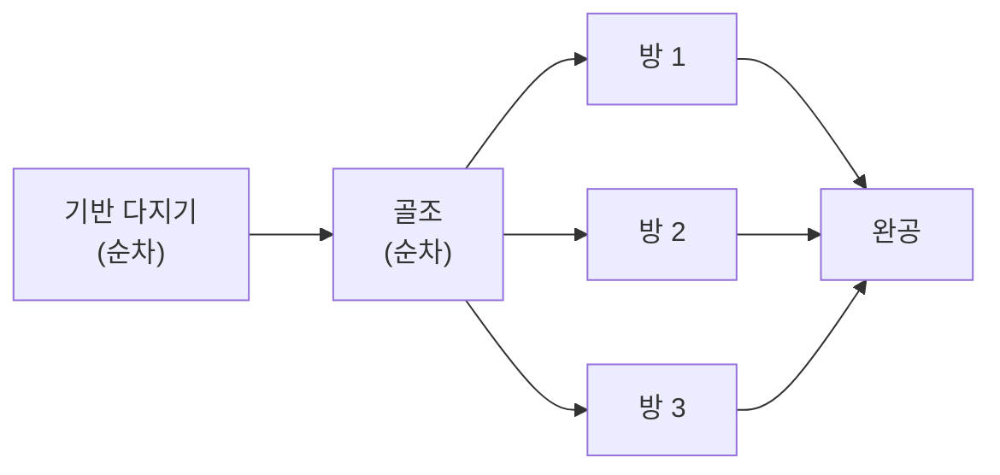

프로그램으로 옮기면 **계산 시간이 많이 드는 for 루프 부분만 병렬로 돌리는 것**에 해당한다.

> [!warning] 코어 수만큼 빨라지지 않는다
> 병렬 연산을 쓴다고 해서 코어 개수에 비례해 속도가 오르는 것이 아니다.
> **프로그램에서 병렬화 가능한 부분이 얼마나 되는지**에 따라 병렬화 효율이 달라진다.
> 이 "병렬화가 얼마나 쉬운가"를 강의는 **확장성(scalability)** 이라고 부른다. (p.26)

### MPI의 표준화 흐름

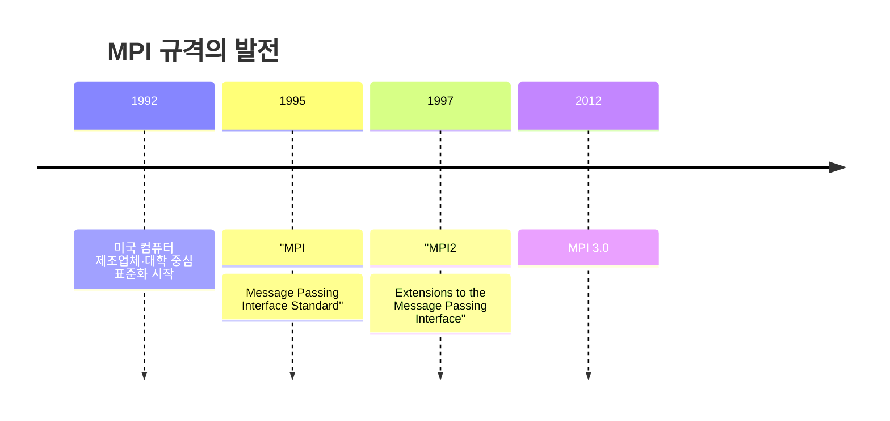

> [!info] 정의 — MPI
> 분산 메모리형 병렬 컴퓨터에서 병렬 프로그래밍을 하기 위한 **프로세서 간 통신 라이브러리**.
> 기본 언어(FORTRAN / C / C++)에 프로세서 간 통신용 서브루틴·함수를 **추가**해 병렬 프로그래밍을
> 할 수 있도록 확장한 것이지, 새 언어가 아니다.

MPI가 내세우는 강점은 네 가지다. (p.16, 19)

| 강점 | 내용 |
| :-- | :-- |
| **이식성** | 표준 인터페이스라서 동일 소스를 다양한 MPI 구현·기계에서 컴파일·실행 가능. 공유 메모리형에서도 돈다 |
| **확장성** | 알고리즘만 맞으면 수천~수만 프로세서의 능력을 끌어낼 수 있다 |
| **다양한 집단 통신** | 합산·브로드캐스트 등이 라이브러리에 미리 준비되어 있다 |
| **성능 분석 도구** | 부하 분산·통신 시간 등 상세 정보를 얻는 툴을 쓸 수 있다 |
| **대용량 메모리** | 여러 노드를 묶어 실행하므로 한 대로는 불가능한 크기의 메모리 공간을 쓸 수 있다 |

> [!warning] 부담이 사라진 건 아니다
> 슬라이드는 "프로그래머의 부담이 상대적으로 적다"고 하면서 곧바로
> **"프로그램을 분석해 데이터-처리를 분할하고, 통신의 내용과 타이밍을 사용자가 직접 작성해야 한다"**
> 고 덧붙인다. 라이브러리가 통신 수단은 주지만 **분할 전략과 타이밍은 전적으로 사람 몫**이라는 뜻이다.

---

## 2. MPI 실행 모델 — 같은 코드, 다른 rank

> [!quote] 슬라이드 근거
> `pdf/11_MPI 프로그래밍_V_01.pdf` p.9-13

### 실행 시작부터 종료까지 모두 같은 프로그램

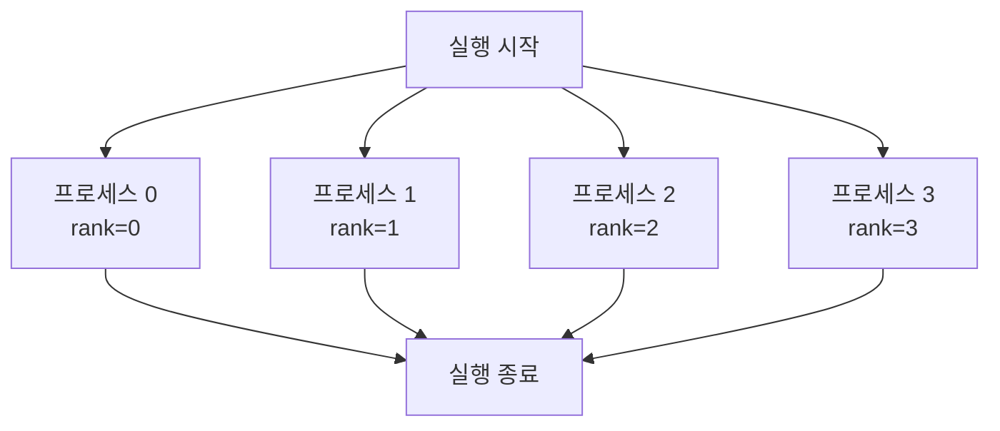

- 모든 프로세스가 **처음부터 끝까지 동일한 프로그램**을 실행한다.
- 각 프로세스는 고유한 프로세스 번호 **rank**를 가진다.
- $P$ 개의 프로세스로 실행하면 rank는 $0 \sim P-1$ 의 정수다.
- 그런데 **연산 대상 데이터나 `if` 문 분기는 프로세스마다 다를 수 있다.**

즉 "코드는 하나, 흐름은 rank마다 다르게"가 MPI 프로그래밍의 기본 문법이다.

> [!note] 보충 — 슬라이드의 "SIMD" 표기
> 슬라이드는 이 실행 모델을 `(SIMD)`로 적어 두었다. 다만 여기서 설명하는
> "모든 프로세스가 같은 프로그램을 돌리되 rank에 따라 분기한다"는 구조는
> 일반적으로 **SPMD(Single Program, Multiple Data)** 라고 부르는 형태다.
> 시험에서는 슬라이드 표기를 따르되, 개념은 "같은 프로그램 · 다른 데이터"로 이해하면 된다.

### 메모리 공간 — 이름이 같아도 남남이다

> [!important] MPI 프로그래밍에서 가장 먼저 깨야 하는 직관
> 프로그램 안에서 변수 `a`, 배열 `b[100]` 을 정의하면
> **같은 이름의 변수/배열이 프로세스마다 각각 독립적으로 할당된다.**
> 이름이 같아도 값은 프로세스마다 다를 수 있고,
> **다른 프로세스가 가진 변수/배열에는 접근할 수 없다.**

그래서 남의 값을 참조하려면 방법은 하나뿐이다 — **프로세서 간 통신으로 값을 전송받는 것.**
그 통신을 위한 함수 집합이 곧 MPI다.

### 우편물 비유 — 통신에 필요한 정보 5가지

MPI 통신은 우편물을 부치는 일과 같다. 필요한 정보가 정확히 대응된다. (p.9)

| 우편 발송에 필요한 정보 | MPI에서의 대응 | 실제 인자 |
| :-- | :-- | :-- |
| 1. 자신의 주소, 발송지 주소 | 본인 및 발송인의 인식 ID | `rank` (`destination` / `source`) |
| 2. 안에 든 물건이 어디에 있는지 | 데이터 저장 위치의 주소 | 버퍼 포인터 |
| 3. 물건의 분류 | 데이터 유형 | `MPI_Datatype` |
| 4. 물건의 양 | 데이터 양 | `count` |
| 5. 여러 짐을 동시에 보낼 때의 식별 방법 | 태그 번호 | `tag` |

이 다섯 가지가 그대로 `MPI_Send()` 의 인자 목록이 된다. 4절에서 다시 확인한다.

### MPI가 가정하는 실행 환경

| 환경 | 설명 |
| :-- | :-- |
| **분산 메모리형 병렬 계산기** | MPI가 원래 가정한 환경. 각 프로세스가 1개의 PU에 할당된다 |
| **공유 메모리형 병렬 컴퓨터** | 메모리를 분할해 각 PU에 할당, **가상의 분산 메모리 환경**을 만든다. 기존 MPI 프로그램을 그대로 돌릴 수 있어 편리하다. **본 강의가 사용하는 환경** |
| **SMP 클러스터** | 각 노드의 메모리를 분할해 각 PU에 할당, 노드들을 네트워크로 연결 |

---

## 3. MPI 프로그램의 골격

> [!quote] 슬라이드 근거
> `pdf/11_MPI 프로그래밍_V_01.pdf` p.14-15, 17-18, 20, 27-28

### 구성 요소 6가지

| 구성 요소 | 내용 |
| :-- | :-- |
| **원본 프로그램** | 평범한 FORTRAN / C / C++ 프로그램. 단 **분산 메모리를 의식해서** 작성해야 한다 |
| **환경 설정·획득 함수** | MPI 초기화·종료, 자기 rank와 전체 프로세스 수 취득 |
| **통신 함수** | 프로세스 간 통신용. **일대일 통신**과 **집단 통신**이 있다 |
| **기본 데이터 타입·미리 정의된 연산** | `MPI_INT`, `MPI_FLOAT`, `MPI_DOUBLE`, `MPI_CHAR` 등. 통신 함수의 타입 지정과 "통신+연산 동시 수행" 함수(합산 등)의 연산 지정에 쓴다 |
| **인클루드 파일** | 프로그램 앞부분에 `#include <mpi.h>` |
| **실행 시 지정** | `mpirun` 명령으로 사용할 프로세스 수를 지정 |

### 대표 함수 지도

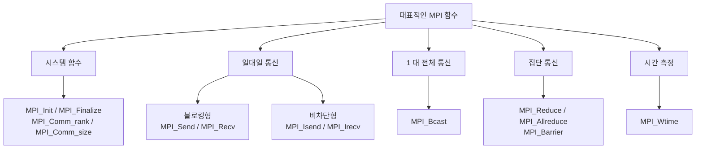

MPI의 주요 기능을 세 덩어리로 요약하면 이렇다. (p.25)

| 기능 | 내용 |
| :-- | :-- |
| **프로세스 관리** | MPI 프로그램 초기화 및 종료 처리 |
| **일대일 통신** | 두 프로세스가 일대일로 하는 통신 |
| **집단 통신** | 그룹 내 프로세스 **전체**가 관련된 통신 조작 (broadcast, scatter, gather, reduction 등) |

원본 도해에서 일대일 통신과 집단 통신(broadcast / scatter / gather / reduction)의 데이터 흐름을
그림으로 비교할 수 있다.

[11_MPI 프로그래밍_V_01 p.25](<../sources/11_MPI 프로그래밍_V_01.pdf>)

위 그림에서 왼쪽은 프로세스 0의 `send(data)` 가 로컬 버퍼 → 네트워크 → 상대 로컬 버퍼를 거쳐
프로세스 1의 `receive(data)` 에 닿는 일대일 경로이고, 오른쪽 4개는 여러 프로세스가 한꺼번에
참여하는 집단 통신 패턴(브로드캐스트·스캐터·개더·리덕션)이다.

### 시스템 함수 4종

```c
int MPI_Init(int *argc, char ***argv);
int MPI_Comm_size(MPI_Comm comm, int *nprocs);
int MPI_Comm_rank(MPI_Comm comm, int *myrank);
int MPI_Finalize(void);
```

| 함수 | 인자 | 의미 |
| :-- | :-- | :-- |
| `MPI_Init` | `&argc`, `&argv` | 프로그램 시작 시 호출해 MPI를 초기화 |
| `MPI_Comm_size` | `comm` | 프로세스 그룹을 지정하는 **커뮤니케이터** |
| | `nprocs` | `comm` 내의 **전체 프로세스 수**가 여기에 들어온다 |
| `MPI_Comm_rank` | `comm`, `myrank` | `comm` 내에서 **자기 프로세스 번호**가 `myrank` 에 들어온다 |
| `MPI_Finalize` | 없음 | 프로그램 끝에서 호출해 종료 처리 |

- `comm` 에 `MPI_COMM_WORLD` 를 주면 **모든 프로세스를 포함하는 그룹**을 뜻한다.
- 성공하면 함수 값으로 `MPI_SUCCESS` 가 반환된다.
- **이 함수들은 어떤 MPI 프로그램에서도 항상 같은 순서로 호출하면 된다.**

### 최소 프로그램 — 데이터 교환 없는 골격

```c
#include <stdio.h>
#include "mpi.h"

int main(int argc, char *argv[]) {
    int nproc, rank;

    MPI_Init(&argc, &argv);                        /* 여기부터 MPI API 사용 가능 */

    MPI_Comm_size(MPI_COMM_WORLD, &nproc);         /* 전체 프로세스 수 */
    MPI_Comm_rank(MPI_COMM_WORLD, &rank);          /* 내 rank */
    printf("%d in %d\n", rank, nproc);

    MPI_Finalize();                                /* 여기까지 */
    return 0;
}
```

읽는 순서는 이렇다.

1. MPI를 쓰려면 먼저 **MPI 라이브러리를 포함**해야 한다 → `#include "mpi.h"`
2. `main` 안에서 **대문자 `MPI` 로 시작하는 것이 MPI의 API**다. 이걸로 다수 프로세스를 관리한다.
3. `MPI_Init` 에 의한 초기화와 `MPI_Finalize` 에 의한 종료는 **필수**이고,
   **이 사이에서만** MPI API를 쓸 수 있다.
4. `MPI_Comm_size` 는 프로세스 수를 가져온다. 첫 인자 `MPI_COMM_WORLD` 는 MPI 전체를 나타내는
   변수이고, 둘째 인자 `nproc` 에 프로세스 수가 담긴다.
5. `MPI_Comm_rank` 도 같은 꼴이며, 각 프로세스가 **자기 프로세스 번호**를 얻는다.
   이렇게 해서 모든 프로세스가 서로 다른 번호(ID)를 갖게 된다.

> [!warning] 슬라이드 코드의 오탈자
> p.27 슬라이드 코드에는 `char +argv[]`, `MPI_Init(&argc, $argv)`, `MPI.Init` / `MPI.Finalize`
> 같은 표기가 섞여 있다. 실제로는 각각 `char *argv[]`, `MPI_Init(&argc, &argv)`,
> `MPI_Init` / `MPI_Finalize` 다. 위 코드 블록은 바로잡은 형태다.

> [!tip] 용어 정리
> MPI에서는 **자기 프로세스 번호를 '랭크(rank)'라고 부른다.** 이 한 단어만 기억해도
> 이후 나오는 모든 통신 함수의 `destination` / `source` 인자가 자연스럽게 읽힌다.

---

## 4. 환경 구축과 실행

> [!quote] 슬라이드 근거
> `pdf/11_MPI 프로그래밍_V_01.pdf` p.5-7, 17, 20-24

### 어떤 MPI 구현을 쓸 것인가

| 구현 | 출처·특징 |
| :-- | :-- |
| **MPICH** | 미국 Argonne National Laboratory가 제공하는 무료 MPI. 현재 MPICH2가 주류. 메이저 |
| **OpenMPI** | MPI 관련 여러 선행 프로젝트의 성과를 바탕으로 개발. 메이저 |
| **MVAPICH** | GPU에 강함 |
| **제조사 제공 MPI** | 각 병렬 컴퓨터 제조사가 자사 기계용 구현을 제공 |

> [!tip] 어느 걸 골라도 된다
> 슬라이드는 "기본적으로 어느 것을 사용해도 비슷한 결과를 얻을 수 있으므로 어느 것을 선택해도 무방"
> 이라고 못박는다. 표준 인터페이스이기 때문에 가능한 이야기다.

### 설치 · 컴파일 · 실행

```bash
# Linux (Ubuntu) 설치
sudo apt install mpich

# C 컴파일 — mpi_program.c 로부터 mpi_exe 생성
mpicc -o mpi_exe mpi_program.c

# C++ 은 mpic++
mpic++ -o mpi_exe mpi_program.cpp

# 8 병렬로 실행
mpirun -np 8 ./mpi_exe

# 노드를 지정해 실행 (-ppn 은 각 노드의 병렬 수)
mpirun -host node1,node2 -np 8 -ppn 4 ./mpi_exe
```

| 옵션 | 의미 |
| :-- | :-- |
| `-np N` | 병렬 수(프로세스 수)를 `N` 으로 지정 |
| `-host a,b` | 실행할 노드를 지정 |
| `-ppn K` | **각 노드당** 병렬 수를 `K` 로 지정 |

### Windows(MS-MPI) 경로

Windows에서는 MS-MPI를 설치하고 `clang++` 로 직접 컴파일하는 방식을 쓴다.
`clang++` 를 쓰려면 LLVM과 MSBuild tools를 설치하고 `llvm/bin` 을 PATH에 넣어야 한다.

```bash
set BinPATH=%PATH%;"C:\Program Files\LLVM\bin"

clang++ sample.cpp -I"C:\Program Files (x86)\Microsoft SDKs\MPI\Include" ^
        -L"C:\Program Files (x86)\Microsoft SDKs\MPI\Lib\x64" -lmsmpi

mpiexec -n 7 a.exe
```

> [!note] 보충 — `mpiexec` 를 못 찾을 때
> MS-MPI를 설치하면 환경 변수 `PATH` 에 `C:\Program Files\Microsoft MPI\Bin\` 이 자동 추가된다.
> 그래도 `mpiexec` 가 없다고 하면 전체 경로로 실행하거나 그 경로를 PATH에 직접 추가한다.
>
> ```bash
> "C:\Program Files\Microsoft MPI\Bin\mpiexec.exe" -n 7 a.exe
> ```

---

## 5. 데이터 교환 — Send · Recv · Wait

> [!quote] 슬라이드 근거
> `pdf/11_MPI 프로그래밍_V_01.pdf` p.29-34

> [!important] 데이터 교환의 세 축
> **① 송신(Send) ② 수신(Recv) ③ 대기(Wait)** — 이 셋이 전부다.
> 그리고 **MPI에서는 송신과 수신이 일치하지 않으면 통신이 되지 않는다.**
> 프로그램의 흐름을 머리로 따라가면서 명령을 적절한 위치에 배치해야 한다.

> [!warning] 데드락(Deadlock)
> 실수로 **서로가 수신 대기 상태**가 되면 처리가 전혀 진행되지 않는다.
> 이것이 MPI 프로그램에서 가장 흔하고 가장 골치 아픈 버그다.

### 블로킹 vs 논블로킹

| 구분 | 함수 | 동작 | 특징 |
| :-- | :-- | :-- | :-- |
| **Blocking** | `MPI_Send` / `MPI_Recv` | 송수신이 확정될 때까지 **대기** | 프로그램 흐름대로 순서대로 실행되므로 **예상치 못한 일이 발생하기 어렵다** |
| **Non-Blocking** | `MPI_Isend` / `MPI_Irecv` | 명령만 내리고 **다음 처리를 계속 진행** | 대기 시간이 없어 효율적이지만, 예상치 못한 데이터 업데이트를 막으려면 `MPI_Wait` 로 동기화 타이밍을 직접 줘야 한다 |

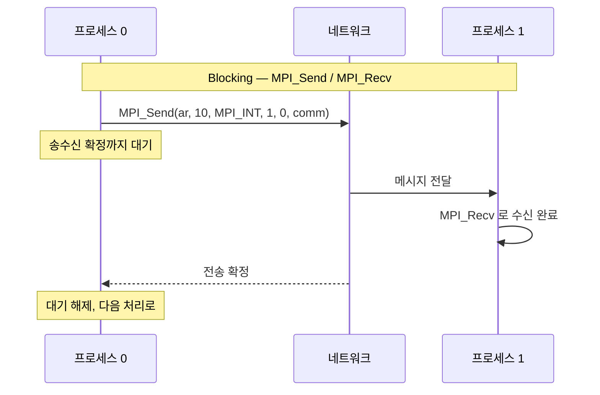

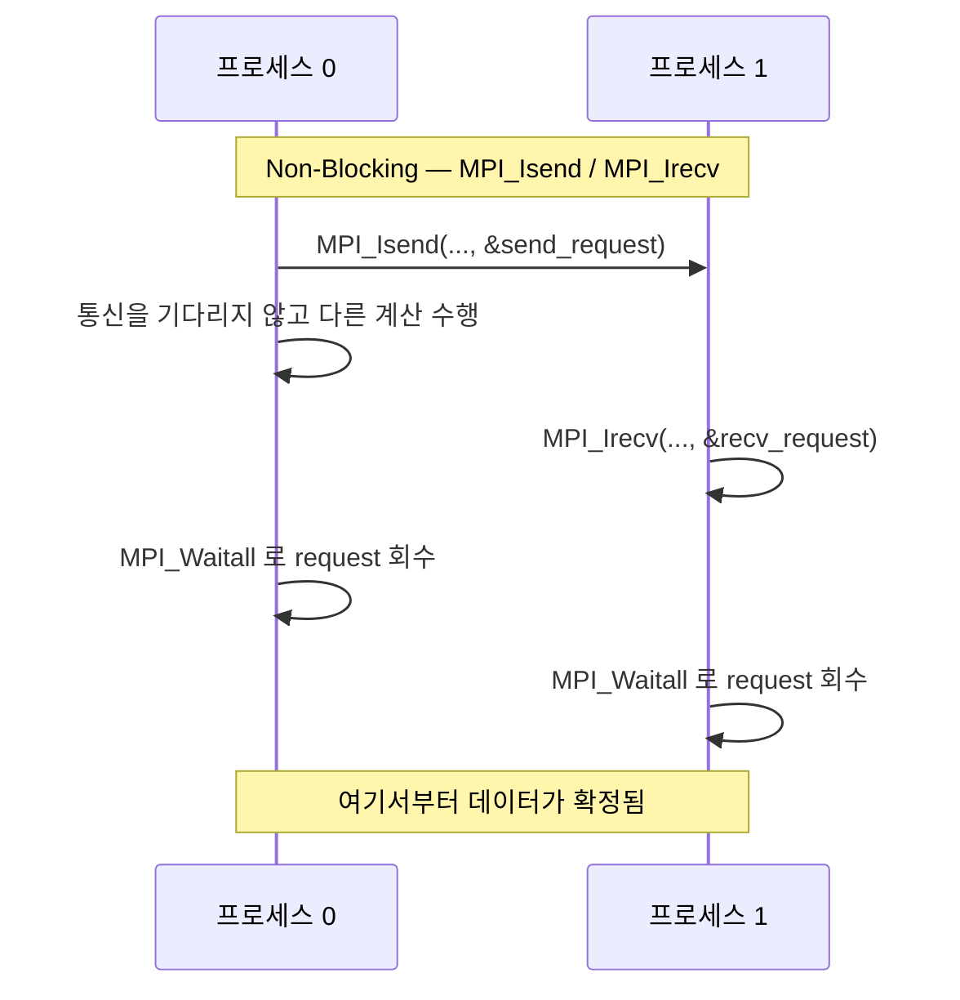

### `MPI_Send` 의 인자

```c
int ar[10];
MPI_Send(ar, 10, MPI_INT, 1, 0, MPI_COMM_WORLD);
```

이 한 줄로 **rank 1의 프로세스에 배열 `ar` 을 전송**한다. 인자는 왼쪽부터 순서대로다.

| 위치 | 인자 | 의미 |
| :--: | :-- | :-- |
| 1 | `ar` | 보내고자 하는 **배열의 시작 주소** |
| 2 | `10` | **요소 수** |
| 3 | `MPI_INT` | **타입** |
| 4 | `1` | **수신 측의 랭크**(프로세스 번호) |
| 5 | `0` | **태그**(임의의 식별 번호) |
| 6 | `MPI_COMM_WORLD` | 커뮤니케이터 |

2절의 **우편물 비유 5가지가 그대로 인자 1~5에 대응**한다.

> [!example] 논블로킹 버전
> `MPI_Isend` 도 거의 동일한 인자 구성이며, **마지막에 Wait용 식별자(`MPI_Request`)를 붙이기만** 하면 된다.
>
> ```c
> MPI_Request recv_request;
> int ar[10];
> MPI_Irecv(ar, 10, MPI_INT, 0, 0, MPI_COMM_WORLD, &recv_request);
> ```
>
> (슬라이드 p.32는 이 논블로킹 수신 예를 설명하면서 함수 이름을 `MPI_Send` 로 잘못 적어 두었다.
> 인자 구성상 `MPI_Irecv` 가 맞다.)

### 동기화 — Barrier와 Wait

블로킹을 쓰든 논블로킹을 쓰든 **노드 간 진행을 맞추고 싶을 때**가 있다.
예를 들어 모든 데이터가 다 모인 뒤에 진행하고 싶을 때, 또는 프로세스 3·4가 따라잡을 때까지
프로세스 1·2를 기다리게 하고 싶을 때다. 이때 쓰는 것이 **동기화**다.

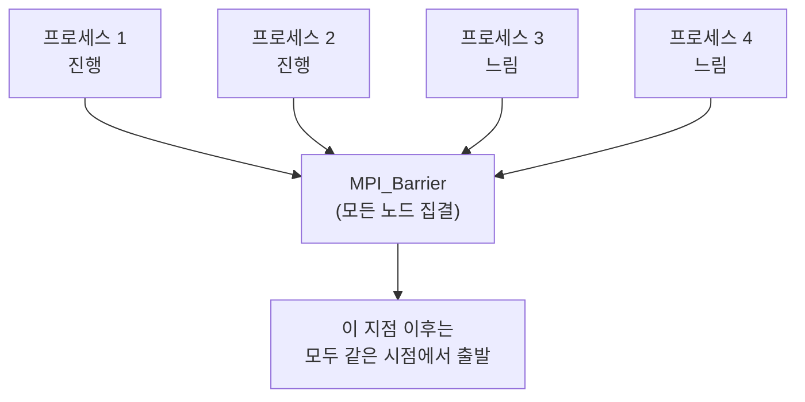

| 수단 | 대상 | 용법 |
| :-- | :-- | :-- |
| `MPI_Barrier(MPI_COMM_WORLD)` | **모든 노드** | 송수신 뒤에 넣어 노드들의 진행을 동기화 |
| `MPI_Wait` / `MPI_Waitall` | **지정된 request만** | 논블로킹 통신에서 사용 |

```c
/* 방법 1 — request 를 따로 두고 두 번 대기 */
MPI_Request send_request, recv_request;
/* ... */
MPI_Isend(/* ... */, &send_request);
MPI_Irecv(/* ... */, &recv_request);
MPI_Waitall(1, &send_request, MPI_STATUS_IGNORE);   /* 모든 노드의 Isend 대기 */
MPI_Waitall(1, &recv_request, MPI_STATUS_IGNORE);   /* 모든 노드의 Irecv 대기 */
```

| `MPI_Waitall` 인자 | 의미 |
| :-- | :-- |
| 1. 요청 개수 | 기다릴 request의 수 |
| 2. 요청의 시작 주소 | `Isend` / `Irecv` 끝에 붙인 식별자와 대응된다 |
| 3. 상태 | 기본적으로 `MPI_STATUS_IGNORE` 를 쓰면 된다 |

> [!tip] Waitall을 한 번으로 줄이기
> 위 방식은 `Waitall` 을 두 번 써야 해서 번거롭다. **request를 배열로 잡으면 한 번에 회수**된다.
>
> ```c
> MPI_Request request[2];
> /* ... */
> MPI_Isend(/* ... */, &(request[0]));
> MPI_Irecv(/* ... */, &(request[1]));
> MPI_Waitall(2, request, MPI_STATUS_IGNORE);   /* 한 번에 모든 통신 회수 */
> ```

---

## 6. 예제 — 1부터 100까지의 합을 2병렬로

> [!quote] 슬라이드 근거
> `pdf/11_MPI 프로그래밍_V_01.pdf` p.35

지금까지의 요소가 전부 들어간 최소 예제다. 흐름은 네 단계다.

1. 각 프로세스가 계산해야 할 범위를 구한다
2. 각 프로세스가 부분합을 계산한다
3. 프로세스 1이 부분합을 프로세스 0에 보낸다
4. 프로세스 0이 부분합을 수신하고 합계를 표시한다

```c
#include <stdio.h>
#include <mpi.h>

int main(int argc, char *argv[]) {
    int i, istart, iend, isum, isum1;
    int myrank, nprocs;
    MPI_Status status;

    MPI_Init(&argc, &argv);                        /* starts MPI */
    MPI_Comm_size(MPI_COMM_WORLD, &nprocs);        /* get number of processes */
    MPI_Comm_rank(MPI_COMM_WORLD, &myrank);        /* get current process ID */

    istart = myrank * 50 + 1;                      /* 각 프로세스가 계산할 범위 */
    iend   = (myrank + 1) * 50;

    isum = 0;
    for (i = istart; i <= iend; i++)               /* 각 프로세스가 부분합 계산 */
        isum += i;

    if (myrank == 1)
        MPI_Send(&isum, 1, MPI_INT, 0, 100, MPI_COMM_WORLD);          /* 1 → 0 으로 부분합 송신 */
    else
        MPI_Recv(&isum1, 1, MPI_INT, 1, 100, MPI_COMM_WORLD, &status); /* 0 이 1 로부터 수신 */

    if (myrank == 0)
        printf("sum= %d\n", isum + isum1);          /* 프로세스 0 이 합계 표시 */

    MPI_Finalize();
    return 0;
}
```

범위 분할은 rank로부터 직접 계산된다.

$$\text{istart} = 50 \cdot \text{myrank} + 1, \qquad \text{iend} = 50 \cdot (\text{myrank}+1)$$

| rank | istart | iend | 부분합 |
| :--: | --: | --: | --: |
| 0 | 1 | 50 | $\sum_{i=1}^{50} i = 1275$ |
| 1 | 51 | 100 | $\sum_{i=51}^{100} i = 3775$ |
| 합계 | | | $1275 + 3775 = 5050$ |

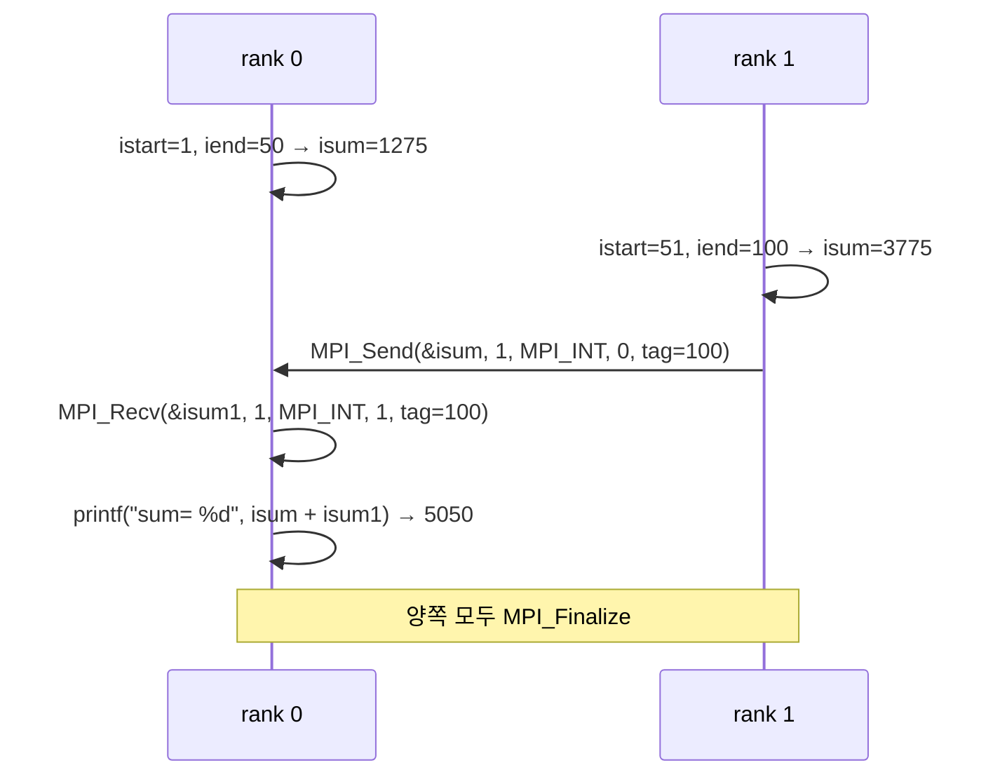

> [!warning] 이 예제가 감추고 있는 제약
> 범위 계산이 `myrank * 50 + 1` 로 **2 프로세스에 하드코딩**되어 있다.
> `mpirun -np 4` 로 돌리면 rank 2·3은 101~200 구간을 더하고, `MPI_Recv` 도
> rank 1 하나만 기다리므로 결과가 깨진다. 프로세스 수에 무관하게 만들려면
> 범위를 `nprocs` 로 나누고 집단 통신(`MPI_Reduce`)을 쓰는 편이 자연스럽다.

---

## 7. 커뮤니케이터

> [!quote] 슬라이드 근거
> `pdf/11_MPI 프로그래밍_V_01.pdf` p.38-39

> [!info] 정의 — 커뮤니케이터(Communicator)
> **MPI에서 프로세스의 집단(집합)**. 집단적 조작 등에서의 **조작 대상**이 되는 단위다.
> `MPI_COMM_WORLD` 는 MPI 프로그램 시작 후 **처음 생성되는, 프로세스 전체를 담은 커뮤니케이터**다.

커뮤니케이터를 대상으로 하는 조작은 세 가지다.

| 조작 | 내용 |
| :-- | :-- |
| **집단형 통신** (Collective communication) | 통신이 **커뮤니케이터 내에서 폐쇄적으로** 이루어진다 |
| **집단형 I/O** (Collective operation) | 그룹 단위 I/O 조작 |
| **Window 조작** (One-sided communication) | 단방향 통신 |

### 커뮤니케이터 분할

커뮤니케이터는 **분할할 수 있고, 분할하면 새로운 랭크 번호가 할당된다.**

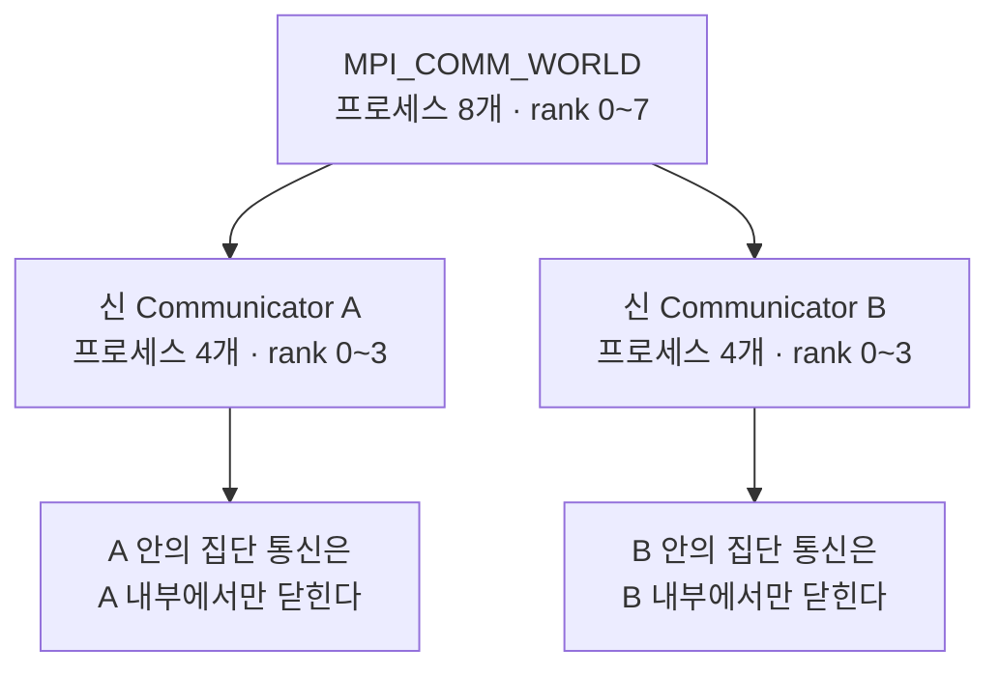

> [!warning] 분할 후 rank는 다시 매겨진다
> 새 커뮤니케이터 안에서 rank는 **0부터 다시** 시작한다.
> 따라서 "rank 0" 이 항상 `MPI_COMM_WORLD` 의 rank 0을 뜻하지 않는다.
> 어떤 커뮤니케이터를 기준으로 한 rank인지를 늘 함께 봐야 한다.

> [!note] 보충 — API 규모
> 슬라이드가 안내하는 대로 MPI API는 **470개 정도**다 (p.37, Open MPI 문서 기준).
> 실제로 자주 쓰는 것은 이 노트에서 다룬 십여 개 수준이고, 나머지는 필요할 때 문서를 찾으면 된다.

---

## 핵심 정리

| 개념 | 한 줄 정의 | 왜 중요한가 |
| :-- | :-- | :-- |
| **MPI** | 분산 메모리 병렬 컴퓨터를 위한 프로세서 간 통신 라이브러리 표준 | 노드를 넘는 대규모 계산의 사실상 표준 |
| **노드** | CPU와 메모리가 1:1로 짝지어 네트워크에 놓인 단위 | MPI가 가정하는 하드웨어 단위 |
| **rank** | 커뮤니케이터 내 프로세스의 고유 번호 ($0 \sim P-1$) | 같은 코드에서 서로 다른 일을 시키는 유일한 열쇠 |
| **독립 메모리 공간** | 같은 이름의 변수도 프로세스마다 별개로 할당 | 남의 값을 보려면 반드시 통신해야 하는 이유 |
| **커뮤니케이터** | 통신 대상이 되는 프로세스 집단 | 집단 통신의 범위를 정의, 분할 시 rank 재할당 |
| **일대일 통신** | 두 프로세스 간의 Send/Recv | 통신의 최소 단위 |
| **집단 통신** | 그룹 전체가 참여하는 통신 조작 | broadcast·reduction 등을 직접 짤 필요가 없다 |
| **Blocking** | 송수신 확정까지 대기 | 흐름이 예측 가능한 대신 대기 비용 발생 |
| **Non-Blocking** | 명령 후 즉시 진행, Wait로 회수 | 통신·계산 중첩으로 효율↑, 대신 동기화 책임이 생김 |
| **데드락** | 서로가 수신 대기에 빠져 진행 불가 | 송신/수신 짝이 안 맞으면 바로 발생 |
| **`MPI_Barrier`** | 커뮤니케이터 내 모든 프로세스를 한 지점에 집결 | 단계 구분이 필요한 알고리즘의 기본 도구 |
| **확장성** | 프로그램을 얼마나 쉽게 병렬화할 수 있는가 | 코어 수만큼 빨라지지 않는 이유 |

> [!question]- 스스로 점검
> **Q1.** MPI가 공유 메모리가 아니라 분산 메모리를 전제한다는 것이 프로그래밍에 미치는 가장 직접적인 결과는?
> **A1.** 같은 이름의 변수·배열이 프로세스마다 독립적으로 할당되고, 다른 프로세스의 변수에 직접 접근할 수 없다. 남의 값을 쓰려면 반드시 명시적 통신으로 전송받아야 한다.
>
> **Q2.** 모든 프로세스가 같은 프로그램을 실행하는데 어떻게 서로 다른 일을 하는가?
> **A2.** 각 프로세스가 `MPI_Comm_rank` 로 얻은 고유한 rank를 기준으로 연산 대상 데이터나 `if` 분기를 다르게 가져가기 때문이다. 1~100 합 예제에서 `istart = myrank * 50 + 1` 이 정확히 그 장치다.
>
> **Q3.** 우편물 비유의 5가지 정보는 `MPI_Send` 의 어떤 인자에 대응하는가?
> **A3.** ① 인식 ID → 수신 측 rank, ② 데이터 저장 위치 → 버퍼 시작 주소, ③ 데이터 유형 → `MPI_INT` 등 타입, ④ 데이터 양 → 요소 수(count), ⑤ 태그 번호 → tag.
>
> **Q4.** `MPI_Send` 와 `MPI_Isend` 의 차이, 그리고 `MPI_Isend` 를 쓸 때 반드시 해야 하는 일은?
> **A4.** `MPI_Send` 는 송수신이 확정될 때까지 대기하는 블로킹 통신이고, `MPI_Isend` 는 명령만 내리고 다음 처리를 진행하는 논블로킹 통신이다. 후자는 예상치 못한 데이터 업데이트를 막기 위해 `MPI_Wait` / `MPI_Waitall` 로 동기화 타이밍을 명시해야 한다.
>
> **Q5.** `MPI_Barrier` 와 `MPI_Waitall` 은 둘 다 "기다리는" 함수인데 무엇이 다른가?
> **A5.** `MPI_Barrier` 는 커뮤니케이터 내 **모든 노드**의 진행을 한 지점에서 맞추고, `MPI_Waitall` 은 인자로 지정한 **특정 request들만** 동기화한다.
>
> **Q6.** 커뮤니케이터를 분할하면 rank는 어떻게 되는가?
> **A6.** 새 커뮤니케이터마다 **새로운 랭크 번호가 0부터 다시 할당된다.** 따라서 rank를 볼 때는 항상 어느 커뮤니케이터 기준인지를 함께 확인해야 한다.
>
> **Q7.** `mpirun -host node1,node2 -np 8 -ppn 4 ./mpi_exe` 는 무엇을 지시하는가?
> **A7.** node1과 node2 두 노드에서 총 8개 프로세스를 실행하되, `-ppn 4` 로 **각 노드당 4개씩** 배치하라는 뜻이다.

## 슬라이드 근거

| 섹션 | 슬라이드 |
| :-- | :-- |
| 1. 왜 MPI인가 — 분산 메모리 | p.2-4, 8, 19, 26 |
| 2. MPI 실행 모델 | p.9-13 |
| 3. MPI 프로그램의 골격 | p.14-15, 18, 25, 27-28 |
| 4. 환경 구축과 실행 | p.5-7, 17, 20-24 |
| 5. 데이터 교환 — Send·Recv·Wait | p.29-34 |
| 6. 예제 — 1~100 합 2병렬 | p.35 |
| 7. 커뮤니케이터 | p.37-39 |

## 관련 노트

- [12. MPI 병렬 프로그래밍 II](<./12. MPI 병렬 프로그래밍 II.md>) — 클러스터 구축과 Send/Recv 예제의 본편
- [02. 병렬 컴퓨터의 기본 아키텍처](<./02. 병렬 컴퓨터의 기본 아키텍처.md>) — 공유 메모리 / 분산 메모리 구조의 배경
- [04. 병렬 프로그래밍 기본](<./04. 병렬 프로그래밍 기본.md>) — 분할·할당·조율이라는 공통 프레임
- [06. 지역성·통신·경합](<./06. 지역성·통신·경합.md>) — 통신 비용이 성능을 갉아먹는 메커니즘
- [01. 왜 병렬 처리인가](<./01. 왜 병렬 처리인가.md>) — 멀티노드로 갈 수밖에 없는 이유
