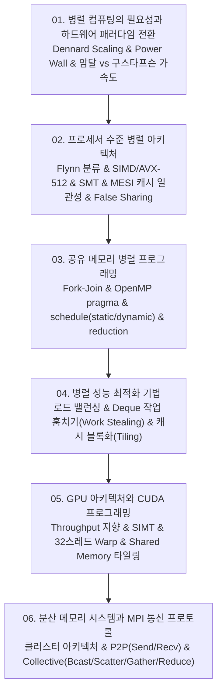

# 📚 병렬 및 분산 컴퓨팅 (Parallel & Distributed Computing) 전체 강의 로드맵

데너드 스케일링의 한계와 전력 장벽(Power Wall), 암달(Amdahl) 및 구스타프슨(Gustafson) 가속도 모델, SIMD/AVX 벡터화와 MESI 캐시 일관성 프로토콜, 공유 메모리 멀티스레딩(OpenMP), 작업 훔치기(Work Stealing)와 캐시 타일링 최적화, 매니코어 GPU 아키텍처 및 CUDA 프로그래밍(SIMT/Shared Memory), 그리고 클러스터 분산 메모리 환경의 MPI 통신 프로토콜(P2P/Collective)까지 고성능 컴퓨팅(HPC) 전반을 체계적으로 다룹니다.

---

## 🗺️ 강의 목차 (Curriculum Overview)

---

## 📑 개별 정리 문서 목록

1. [01. 병렬 컴퓨팅의 필요성과 하드웨어 패러다임 전환](file:///Users/um-yunsang/work/edu/ComputerScience/04_systems-infrastructure/parallel-distributed-computing/notes/01.%20%EB%B3%91%EB%A0%AC%20%EC%BB%B4%ED%93%A8%ED%8C%85%EC%9D%98%20%ED%95%84%EC%9A%94%EC%84%B1%EA%B3%BC%20%ED%95%98%EB%93%9C%EC%9B%A8%EC%96%B4%20%ED%8C%A8%EB%9F%AC%EB%8B%A4%EC%9E%84%20%EC%A0%84%ED%99%98.md)
   - 동적 전력 공식($P=CV^2f$), 강/약 스케일링, 실시간 암달-구스타프슨 가속도 시뮬레이터
2. [02. 프로세서 수준 병렬 아키텍처 - SIMD 벡터화, 동시 멀티스레딩(SMT)과 캐시 일관성(MESI)](file:///Users/um-yunsang/work/edu/ComputerScience/04_systems-infrastructure/parallel-distributed-computing/notes/02.%20%ED%94%84%EB%A1%9C%EC%84%B8%EC%84%9C%20%EC%88%98%EC%A4%80%20%EB%B3%91%EB%A0%AC%20%EC%95%84%ED%82%A4%ED%85%8D%EC%B2%98%20-%20SIMD%20%EB%B2%A1%ED%84%B0%ED%99%94,%20%EB%8F%99%EC%8B%9C%20%EB% human%ED%8B%B0%EC%8A%A4%EB%A0%88%EB%94%A9(SMT)%EA%B3%BC%20%EC%BA%90%EC%8B%9C%20%EC%9D%BC%EA%B4%80%EC%84%B1(MESI).md)
   - Flynn 4대 분류, MESI 4대 상태 전이 다이어그램, 대화형 MESI 캐시 상태 머신
3. [03. 공유 메모리 병렬 프로그래밍 - OpenMP 지시어, 루프 스케줄링과 동기화](file:///Users/um-yunsang/work/edu/ComputerScience/04_systems-infrastructure/parallel-distributed-computing/notes/03.%20%EA%B3%B5%EC%9C%A0%20%EB%A9%94%EB%AA%A8%EB%A6%AC%20%EB%B3%91%EB%A0%AC%20%ED%94%84%EB%A1%9C%EA%B7%B8%EB%9E%98%EB%B0%8D%20-%20OpenMP%20%EC%A7%80%EC%8B%9C%EC%96%B4,%20%EB%A3%A8%ED%94%84%20%EC%8A%A4%EC%BC%80%EC%A4%84%EB%A7%81%EA%B3%BC%20%EB%8F%99%EA%B8%B0%ED%99%94.md)
   - Fork-Join 모델, Static vs Dynamic 청크 분배, Reduction 절, OpenMP 워커 분배기
4. [04. 병렬 성능 최적화 기법 - 로드 밸런싱, 작업 훔치기(Work Stealing)와 지역성](file:///Users/um-yunsang/work/edu/ComputerScience/04_systems-infrastructure/parallel-distributed-computing/notes/04.%20%EB%B3%91%EB%A0%AC%20%EC%84%B1%EB%8A%A5%20%EC%B5%9C%EC%A0%81%ED%99%94%20%EA%B8%B0%EB%B2%95%20-%20%EB%A1%9C%EB%93%9C%20%EB%B0%B8%EB%9F%B0%EC%8B%B1,%20%EC%9E%91%EC%97%85%20%ED%9B%94%EC%B9%98%EA%B8%B0(Work%20Stealing)%EC%99%80%20%EC%A7%80%EC%97%AD%EC%84%B1.md)
   - Deque 기반 LIFO/FIFO 작업 훔치기, 캐시 블록화($N^3/B$), 실시간 Work Stealing 시뮬레이터
5. [05. GPU 아키텍처와 CUDA 프로그래밍 - SIMT, 워프(Warp)와 Shared Memory 타일링](file:///Users/um-yunsang/work/edu/ComputerScience/04_systems-infrastructure/parallel-distributed-computing/notes/05.%20GPU%20%EC%95%84%ED%82%A4%ED%85%8D%EC%B2%98%EC%99%80%20CUDA%20%ED%94%84%EB%A1%9C%EA%B7%B8%EB%9E%98%EB%B0%8D%20-%20SIMT,%20%EC%9B%8C%ED%94%84(Warp)%EC%99%80%20Shared%20Memory%20%ED%83%80%EC%9D%BC%EB%A7%81.md)
   - SIMT 모델, 32스레드 Warp Divergence, 2D 인덱스 매핑 및 실시간 CUDA 좌표 계산기
6. [06. 분산 메모리 시스템과 MPI 통신 프로토콜](file:///Users/um-yunsang/work/edu/ComputerScience/04_systems-infrastructure/parallel-distributed-computing/notes/06.%20%EB%B6%84%EC%82%B0%20%EB%A9%94%EB%AA%A8%EB%A6%AC%20%EC%8B%9C%EC%8A%A4%ED%85%9C%EA%B3%BC%20MPI%20%ED%86%B5%EC%8B%A0%20%ED%94%84%EB%A1%9C%ED%86%A0%EC%BD%9C.md)
   - MPI 4대 집합 통신 패턴(Bcast/Scatter/Gather/Reduce) 및 대화형 집합 통신 시뮬레이터
