> [!abstract] 사용법
> 이 문서는 **원본 파일명 순서 → 핵심 단서 → 학습 점검**으로 읽는 입문 지도입니다. 세부 내용은 같은 폴더의 주제 노트와 원본 PDF를 함께 대조하세요.

## 강의 흐름

```mermaid
flowchart LR
    A["week0_orientation 2"]
    B["week0_orientation"]
    C["week1_metrics_that_matter 2"]
    D["week1_metrics_that_matter"]
    E["week10_feature_flags_lifecycle"]
    F["week10_feature_flags_lifecycle"]
    G["week11_trunk_based_development"]
    H["week11_trunk_based_development"]
    A --> B
    B --> C
    C --> D
    D --> E
    E --> F
    F --> G
    G --> H
```



<Tabs>
  <Tab label="파일 순서">
    원본 PDF를 파일명 순서로 배열했습니다. 번호가 붙은 주차·장 제목은 수업의 진행 신호로 사용합니다.
  </Tab>
  <Tab label="읽기 전략">
    먼저 제목과 첫 페이지 단서를 훑고, 실습·이론·평가 자료를 짝지어 읽습니다. 동일한 내용의 사본은 한 주제의 보조 자료로 취급합니다.
  </Tab>
  <Tab label="검증">
    텍스트 추출이 빈약한 자료는 표의 경고를 확인하고 원본의 시각 요소를 직접 대조합니다. 추출되지 않은 수치나 그림은 임의로 보완하지 않습니다.
  </Tab>
</Tabs>

## 원본 PDF 목록

| 파일 | 쪽수 | 첫 페이지 단서 |
| :-- | --: | :-- |
| week0_orientation 2.pdf | — | 텍스트 추출 빈약 — 원본 시각 자료 확인 필요 |
| week0_orientation.pdf | — | 텍스트 추출 빈약 — 원본 시각 자료 확인 필요 |
| week1_metrics_that_matter 2.pdf | — |  |
| week1_metrics_that_matter.pdf | — |  |
| week10_feature_flags_lifecycle 2.pdf | — | AI OPEN SOURCE SOFTWARE (OSS) - WEEK 10


Feature Flags
and the Feature Lifecycle
기능 플래그의 개념, 구현 방법, A/B 테스팅, Progressive Delivery 및 기능 생명 |
| week10_feature_flags_lifecycle.pdf | — | AI OPEN SOURCE SOFTWARE (OSS) - WEEK 10


Feature Flags
and the Feature Lifecycle
기능 플래그의 개념, 구현 방법, A/B 테스팅, Progressive Delivery 및 기능 생명 |
| week11_trunk_based_development 2.pdf | — | WEEK 11     AI OPEN SOURCE SOFTWARE


Trunk-Based
Development
트렁크 기반 개발 전략 및 실천 가이드
Git Flow와의 비교 분석과 CI/CD 연계 방법론


 Prof. Sejin Chun     |
| week11_trunk_based_development.pdf | — | WEEK 11     AI OPEN SOURCE SOFTWARE


Trunk-Based
Development
트렁크 기반 개발 전략 및 실천 가이드
Git Flow와의 비교 분석과 CI/CD 연계 방법론


 Prof. Sejin Chun     |
| week12_shift_left_testing 2.pdf | — | WEEK 12   AI OPEN SOURCE SOFTWARE


Shift Left Testing
with Test Automation
테스트 자동화를 통한 품질 향상 전략과
GitHub Actions       를 활용한 CI/CD 파이프라인 구 |
| week12_shift_left_testing.pdf | — | WEEK 12   AI OPEN SOURCE SOFTWARE


Shift Left Testing
with Test Automation
테스트 자동화를 통한 품질 향상 전략과
GitHub Actions       를 활용한 CI/CD 파이프라인 구 |
| week18_lean_startup 2.pdf | — | AI OPEN SOURCE SOFTWARE OSS   WEEK 18


Lean Product

Development
& Lean Startup


Prof Sejin Chun
Dong A University


Sejin Chun 2026     |
| week18_lean_startup.pdf | — | AI OPEN SOURCE SOFTWARE OSS   WEEK 18


Lean Product

Development
& Lean Startup


Prof Sejin Chun
Dong A University


Sejin Chun 2026     |
| week2_plan_track_visualize 2.pdf | — | WEEK 2

AI Open Source Software

Plan, Track, and
Visualize Your Work
   Prof. Sejin Chun
   Dong-A University


AI Open Source Software ( |
| week2_plan_track_visualize.pdf | — | WEEK 2

AI Open Source Software

Plan, Track, and
Visualize Your Work
   Prof. Sejin Chun
   Dong-A University


AI Open Source Software ( |
| week3_teamwork_collaborative_development 2.pdf | — | WEEK 03     AI OPEN SOURCE SOFTWARE


Teamwork &
Collaborative
Development

팀워크와 협업 개발
Pull Request 기반 워크플로우, 코드 리뷰 전략, 그리고 협업 베스트 프랙티스


 |
| week3_teamwork_collaborative_development.pdf | — | WEEK 03     AI OPEN SOURCE SOFTWARE


Teamwork &
Collaborative
Development

팀워크와 협업 개발
Pull Request 기반 워크플로우, 코드 리뷰 전략, 그리고 협업 베스트 프랙티스


 |
| week4_asynchronous_work 2.pdf | — | Week 4


AI OPEN SOURCE SOFTWARE (OSS)


Asynchronous Work
Collaborate from Anywhere

비동기 협업의 원칙과 도구를 이해하고
글로벌 개발 환경에서의 효율적인 소통 방식을 학습합니다.

 |
| week4_asynchronous_work.pdf | — | Week 4


AI OPEN SOURCE SOFTWARE (OSS)


Asynchronous Work
Collaborate from Anywhere

비동기 협업의 원칙과 도구를 이해하고
글로벌 개발 환경에서의 효율적인 소통 방식을 학습합니다.

 |
| week5_open_inner_source_software_delivery 2.pdf | — | WEEK 5    AI OPEN SOURCE SOFTWARE


The Influence of
Open and Inner Source on
Software Delivery Performance
오픈소스와 이너소스가
소프트웨어 전달 성능에 미치는 영향
 |
| week5_open_inner_source_software_delivery.pdf | — | WEEK 5    AI OPEN SOURCE SOFTWARE


The Influence of
Open and Inner Source on
Software Delivery Performance
오픈소스와 이너소스가
소프트웨어 전달 성능에 미치는 영향
 |
| week6_github_actions 2.pdf | — | AI O PE N S O U R CE S O F T WAR E ( O SS )


  |
| week6_github_actions.pdf | — | AI O PE N S O U R CE S O F T WAR E ( O SS )


  |
| week9_deploying_platforms 2.pdf | — | WEEK 9     AI OPEN SOURCE SOFTWARE


Deploying to
Any Platform
다양한 플랫폼으로 배포하기
GitHub Pages, Vercel, Docker, AWS, GCP 등 주요 배포 환경 완전 정복


 P |
| week9_deploying_platforms.pdf | — | WEEK 9     AI OPEN SOURCE SOFTWARE


Deploying to
Any Platform
다양한 플랫폼으로 배포하기
GitHub Pages, Vercel, Docker, AWS, GCP 등 주요 배포 환경 완전 정복


 P |

## 원본 단계 인터랙티브

```html preview
<div style="font-family:system-ui,sans-serif;padding:20px;color:var(--foreground)">
  <label for="flowopensourcedelivery" style="font-size:14px;font-weight:600">원본 자료 단계</label>
  <div id="flowopensourcedelivery-out" style="font-size:24px;font-weight:700;color:var(--chart-1);margin:6px 0">week0_orientation 2</div>
  <input id="flowopensourcedelivery" type="range" min="1" max="24" step="1" value="1" style="width:100%;accent-color:var(--primary)" />
  <p style="font-size:13px;color:var(--muted-foreground)">슬라이더를 움직이면 파일명 순서대로 자료의 역할을 확인합니다.</p>
  <script>
    var flowopensourcedelivery = document.getElementById('flowopensourcedelivery');
    var flowopensourcedeliveryOut = document.getElementById('flowopensourcedelivery-out');
    var flowopensourcedeliverySteps = ["week0_orientation 2","week0_orientation","week1_metrics_that_matter 2","week1_metrics_that_matter","week10_feature_flags_lifecycle 2","week10_feature_flags_lifecycle","week11_trunk_based_development 2","week11_trunk_based_development","week12_shift_left_testing 2","week12_shift_left_testing","week18_lean_startup 2","week18_lean_startup","week2_plan_track_visualize 2","week2_plan_track_visualize","week3_teamwork_collaborative_development 2","week3_teamwork_collaborative_development","week4_asynchronous_work 2","week4_asynchronous_work","week5_open_inner_source_software_delivery 2","week5_open_inner_source_software_delivery","week6_github_actions 2","week6_github_actions","week9_deploying_platforms 2","week9_deploying_platforms"];
    flowopensourcedelivery.addEventListener('input', function () {
      flowopensourcedeliveryOut.textContent = flowopensourcedeliverySteps[Number(flowopensourcedelivery.value) - 1];
    });
  </script>
</div>
```

## 점검 포인트

- **범위:** 24개 PDF, 총 0쪽.
- **텍스트 근거:** 첫 페이지 추출 단서를 표에 남겨 제목·주제의 근거로 삼았습니다.
- **시각 자료:** 4개 파일은 첫 페이지 텍스트가 빈약하므로, HTML/SVG로 옮길 수 없는 도식은 승인된 크롭 후보로만 별도 검토합니다.

> [!warning] 과해석 방지
> 이 지도는 파일명·쪽수·추출된 첫 페이지 단서만 요약합니다. PDF에 없는 구현 세부, 성능 수치, 평가 결과는 추가하지 않습니다.

<details>
<summary>다음 읽기</summary>

이 문서에서 현재 단계의 파일을 선택한 뒤, 같은 폴더의 주제 노트에서 정의·절차·실습 결과를 확인하세요.

</details>
