> [!abstract] 사용법
> 이 지도는 현재 폴더의 원본 PDF를 파일 순서대로 묶어 강의 진행 → 핵심 단서 → 점검 포인트를 연결합니다. 세부 개념은 같은 폴더의 주제 노트와 함께 대조하세요.

## 강의 흐름

```mermaid
flowchart LR
    A["01 — week0_orientation 2"]
    B["02 — week0_orientation"]
    C["03 — week1_metrics_that_matter 2"]
    D["04 — week1_metrics_that_matter"]
    E["05 — week2_plan_track_visualize 2"]
    F["06 — week2_plan_track_visualize"]
    G["07 — week3_teamwork_collaborative_developmen"]
    H["08 — week3_teamwork_collaborative_developmen"]
    A --> B
    B --> C
    C --> D
    D --> E
    E --> F
    F --> G
    G --> H
```



<Tabs>
  <Tab label="파일 순서">파일명에 포함된 주차·장·버전 표기를 먼저 읽어 강의의 큰 흐름을 잡습니다.</Tab>
  <Tab label="중복 자료">같은 접두사나 버전이 겹치면 앞 자료를 기준으로 뒤 자료의 보충·실습 여부를 비교합니다.</Tab>
  <Tab label="검증">파일명과 쪽수는 탐색용 단서입니다. 정의·식·코드·도식은 각 원본 PDF에서 다시 확인합니다.</Tab>
</Tabs>

## 원본 PDF 목록

| 파일 | 쪽수 | 확인 메모 |
| :-- | --: | :-- |
| week0_orientation 2.pdf | 53 | 원본 첫 페이지·본문 대조 |
| week0_orientation.pdf | 53 | 원본 첫 페이지·본문 대조 |
| week1_metrics_that_matter 2.pdf | 65 | 원본 첫 페이지·본문 대조 |
| week1_metrics_that_matter.pdf | 65 | 원본 첫 페이지·본문 대조 |
| week2_plan_track_visualize 2.pdf | 48 | 원본 첫 페이지·본문 대조 |
| week2_plan_track_visualize.pdf | 48 | 원본 첫 페이지·본문 대조 |
| week3_teamwork_collaborative_development 2.pdf | 60 | 원본 첫 페이지·본문 대조 |
| week3_teamwork_collaborative_development.pdf | 60 | 원본 첫 페이지·본문 대조 |
| week4_asynchronous_work 2.pdf | 18 | 원본 첫 페이지·본문 대조 |
| week4_asynchronous_work.pdf | 18 | 원본 첫 페이지·본문 대조 |
| week5_open_inner_source_software_delivery 2.pdf | 61 | 원본 첫 페이지·본문 대조 |
| week5_open_inner_source_software_delivery.pdf | 61 | 원본 첫 페이지·본문 대조 |
| week6_github_actions 2.pdf | 50 | 원본 첫 페이지·본문 대조 |
| week6_github_actions.pdf | 50 | 원본 첫 페이지·본문 대조 |
| week9_deploying_platforms 2.pdf | 43 | 원본 첫 페이지·본문 대조 |
| week9_deploying_platforms.pdf | 43 | 원본 첫 페이지·본문 대조 |
| week10_feature_flags_lifecycle 2.pdf | 46 | 원본 첫 페이지·본문 대조 |
| week10_feature_flags_lifecycle.pdf | 46 | 원본 첫 페이지·본문 대조 |
| week11_trunk_based_development 2.pdf | 35 | 원본 첫 페이지·본문 대조 |
| week11_trunk_based_development.pdf | 35 | 원본 첫 페이지·본문 대조 |
| week12_shift_left_testing 2.pdf | 35 | 원본 첫 페이지·본문 대조 |
| week12_shift_left_testing.pdf | 35 | 원본 첫 페이지·본문 대조 |
| week18_lean_startup 2.pdf | 44 | 원본 첫 페이지·본문 대조 |
| week18_lean_startup.pdf | 44 | 원본 첫 페이지·본문 대조 |

## 원본 단계 인터랙티브

```html preview
<div style="font-family:system-ui,sans-serif;padding:20px;color:var(--foreground)">
  <label for="flow1431719511" style="font-size:14px;font-weight:600">원본 자료 단계</label>
  <div id="flow1431719511-out" style="font-size:24px;font-weight:700;color:var(--chart-1);margin:6px 0">week0_orientation 2</div>
  <input id="flow1431719511" type="range" min="1" max="24" step="1" value="1" style="width:100%;accent-color:var(--primary)" />
  <p style="font-size:13px;color:var(--muted-foreground)">슬라이더를 움직이면 파일명 순서대로 자료의 위치를 확인합니다.</p>
  <script>
    var flow1431719511 = document.getElementById('flow1431719511');
    var flow1431719511Out = document.getElementById('flow1431719511-out');
    var flow1431719511Steps = ["week0_orientation 2","week0_orientation","week1_metrics_that_matter 2","week1_metrics_that_matter","week2_plan_track_visualize 2","week2_plan_track_visualize","week3_teamwork_collaborative_development 2","week3_teamwork_collaborative_development","week4_asynchronous_work 2","week4_asynchronous_work","week5_open_inner_source_software_delivery 2","week5_open_inner_source_software_delivery","week6_github_actions 2","week6_github_actions","week9_deploying_platforms 2","week9_deploying_platforms","week10_feature_flags_lifecycle 2","week10_feature_flags_lifecycle","week11_trunk_based_development 2","week11_trunk_based_development","week12_shift_left_testing 2","week12_shift_left_testing","week18_lean_startup 2","week18_lean_startup"];
    flow1431719511.addEventListener('input', function () {
      flow1431719511Out.textContent = flow1431719511Steps[Number(flow1431719511.value) - 1] || '';
    });
  </script>
</div>
```

## 점검 포인트

- **범위:** 24개 PDF, 총 1116쪽.
- **근거:** 쪽수와 파일명은 현재 sources/ 디렉터리에서 직접 수집했습니다.
- **학습 순서:** 흐름도와 슬라이더를 먼저 훑은 뒤, 주제 노트의 정의·절차·실습 결과를 순서대로 대조합니다.

> [!warning] 과해석 방지
> 이 지도에는 파일명·쪽수·확인 메모만 기록했습니다. PDF에 없는 구현 세부, 성능 수치, 권장 설정은 추가하지 않습니다.

<details>
<summary>다음 읽기</summary>

현재 단계의 원본을 열어 제목·절차·도식을 확인한 뒤, 같은 폴더의 주제 노트에 해당 근거가 반영되었는지 점검하세요.

</details>
