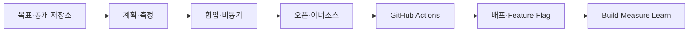

> [!abstract] 한 줄 요약
> 공개 저장소와 문서화를 바탕으로 계획을 세우고, 협업·자동화·배포·측정의 피드백 루프를 만든다.

## 강의 흐름 지도



---
## 개념을 연결하는 순서

주차 자료는 실습 중심의 공개 저장소를 출발점으로 삼아 작업을 **계획 → 협업 → 자동화 → 배포 → 학습**하는 흐름을 반복한다.

- 오리엔테이션은 Open Source Methodology, GitHub Actions, CI/CD, Metrics & Analytics, 협업 도구를 과정 목표로 제시한다.
- Plan·Track·Visualize 자료는 Agile/Scrum, GitHub Issues·Projects, Burndown/Burnup/CFD를 작업 가시화에 연결한다.
- Teamwork·Asynchronous Work 자료는 Pull Request, 코드 리뷰, 브랜치 전략, 문서 중심 소통과 시차 협업을 다룬다.
- Open/Inner Source 자료는 투명성·협업·라이선스·DORA 지표를 조직의 전달 성능과 연결한다.

<Tabs>
  <Tab label="기초">목표·작업계획·측정지표를 공개 저장소와 연결한다.</Tab>
  <Tab label="협업">PR·리뷰·브랜치·비동기 문서화를 통해 팀 작업을 정렬한다.</Tab>
  <Tab label="자동화·학습">Actions·테스트·배포·Feature Flag와 BML 루프를 이어 붙인다.</Tab>
</Tabs>

---
## 원본에서 읽는 적용 장면

| 주제 | 실습 단서 | 확인할 산출물 |
| :-- | :-- | :-- |
| 계획·측정 | Issues, Projects, lead time | 작업 카드·지표 |
| 자동화 | workflow의 trigger·jobs·steps | 테스트/빌드 로그 |
| 배포 | Pages·Vercel·Docker·클라우드 | 환경별 배포 경로 |
| 출시 제어 | A/B, canary, progressive delivery | Feature Flag 상태 |
| 학습 | Build·Measure·Learn, MVP | 실행 가능한 지표와 pivot 판단 |

Shift Left Testing 자료는 단위·통합·E2E 테스트를 개발 초기에 배치하고 GitHub Actions로 반복 실행하는 방법을 강조한다. Trunk-Based Development는 짧은 브랜치 수명과 작은 병합으로 이 자동화 루프를 안정화한다.

```html preview
<div style="font-family:system-ui,sans-serif;padding:20px;color:var(--foreground)">
  <label for="flow722687" style="font-size:14px;font-weight:600">원본 강의 단계</label>
  <div id="flow722687-out" style="font-size:30px;font-weight:700;color:var(--chart-1);margin:6px 0">오리엔테이션과 계획·측정</div>
  <input id="flow722687" type="range" min="1" max="3" step="1" value="1"
    style="width:100%;accent-color:var(--primary)" />
  <p style="font-size:13px;color:var(--muted-foreground)">슬라이더로 PDF에서 정리한 강의 단계를 순서대로 확인합니다.</p>
  <script>
    var flow722687 = document.getElementById('flow722687');
    var flow722687Out = document.getElementById('flow722687-out');
    var flow722687Steps = ["오리엔테이션과 계획·측정","협업·비동기·오픈/이너소스","Actions·배포·Feature Flag·린 학습"];
    flow722687.addEventListener('input', function () {
      flow722687Out.textContent = flow722687Steps[Number(flow722687.value) - 1] || '';
    });
  </script>
</div>
```

---
## 점검과 경계

<details>
<summary>스스로 점검하기</summary>

1. 배포(Deployment)와 기능 출시(Release)를 Feature Flag 관점에서 분리한다.
2. Git Flow와 Trunk-Based Development의 병합 단위를 비교한다.
3. 허영 지표가 아닌 실행 가능한 지표로 MVP의 다음 행동을 결정한다.

</details>

> [!warning] 과정 경계
> 각 주차 자료는 도구 사용 예를 제공하지만, 특정 조직의 배포 성공이나 성능 수치를 보장하지 않는다.

> [!warning] 출처 경계
> 이 노트는 현재 폴더의 `sources/*.pdf`에서 추출·대조한 강의 내용을 묶었습니다. 동일 장의 '2'·'update' 파일은 별도 새 이론으로 세지 않고 보충·개정 관계로 확인합니다. 원본 PDF 전체나 원본 슬라이드 이미지는 삽입하지 않습니다.
