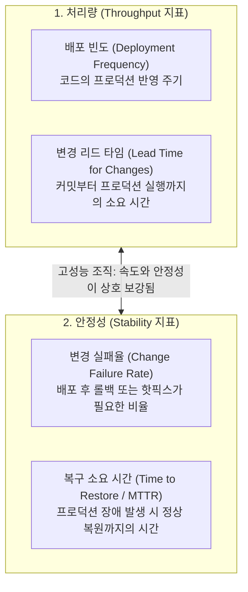

> [!abstract] 핵심 요약
> **DORA 지표**는 구글 클라우드 DORA 팀이 수년간 수만 개 조직을 조사하여 도출한 소프트웨어 딜리버리 성과 측정의 글로벌 표준이다.
> 전통적인 속도 vs 안정성의 이분법적 사고를 타파하고, **배포 빈도**와 **리드 타임**(처리량)이 높을수록 **변경 실패율**과 **복구 시간**(안정성) 또한 우수하다는 사실을 입증하였다. 고성능 조직은 하루 수차례 온디맨드 배포와 1시간 이내 장애 복구를 달성한다.

---

## 1. DORA 4대 핵심 지표 체계



---

## 2. DORA 성숙도 레벨별 성능 기준 매트릭스

| DORA 지표 | 엘리트 (Elite) | 높음 (High) | 중간 (Medium) | 낮음 (Low) |
| :-- | :-- | :-- | :-- | :-- |
| **배포 빈도** | 하루 수회 이상 (On-demand) | 1주 ~ 1달 1회 | 1달 ~ 6달 1회 | 6달 이상에 1회 |
| **변경 리드 타임** | 1시간 미만 | 1일 ~ 1주일 | 1주일 ~ 1달 | 1달 ~ 6달 |
| **서비스 복구 시간 (MTTR)** | 1시간 미만 | 1일 미만 | 1일 ~ 1주일 | 1주일 이상 |
| **변경 실패율** | 0% ~ 5% | 6% ~ 15% | 16% ~ 30% | 30% 초과 |

---

## 3. 실시간 DORA 4대 지표 기반 조직 성숙도 진단기

```html preview
<div style="font-family:system-ui,-apple-system,sans-serif;padding:20px;background:var(--card);color:var(--card-foreground);border:1px solid var(--border);border-radius:var(--radius)">
  <div style="font-size:16px;font-weight:700;margin-bottom:14px;color:var(--primary);display:flex;align-items:center;gap:8px">
    <span>📊 DORA 4대 엔지니어링 지표 기반 성숙도 판별기</span>
  </div>

  <div style="display:grid;grid-template-columns:1fr 1fr;gap:12px;margin-bottom:14px">
    <div>
      <label style="font-size:11px;color:var(--muted-foreground)">배열 배포 빈도:</label>
      <select id="selDf" style="width:100%;padding:5px;background:var(--background);color:var(--foreground);border:1px solid var(--border);border-radius:var(--radius);font-weight:700">
        <option value="4">하루 수차례 온디맨드 (Elite)</option>
        <option value="3">주 1회 ~ 월 1회 (High)</option>
        <option value="2">월 1회 ~ 반기 1회 (Medium)</option>
        <option value="1">반기 1회 미만 (Low)</option>
      </select>
    </div>
    <div>
      <label style="font-size:11px;color:var(--muted-foreground)">장애 복구 시간 (MTTR):</label>
      <select id="selMttr" style="width:100%;padding:5px;background:var(--background);color:var(--foreground);border:1px solid var(--border);border-radius:var(--radius);font-weight:700">
        <option value="4">1시간 미만 (Elite)</option>
        <option value="3">1일 미만 (High)</option>
        <option value="2">1주일 미만 (Medium)</option>
        <option value="1">1주일 이상 (Low)</option>
      </select>
    </div>
  </div>

  <div style="padding:12px;background:var(--background);border:1px solid var(--border);border-radius:var(--radius)">
    <div style="font-size:11px;font-weight:700;color:var(--muted-foreground);margin-bottom:4px">종합 엔지니어링 조직 등급 판정</div>
    <div id="doraRatingOut" style="font-size:15px;font-weight:800;color:var(--primary)">
      🏆 엘리트 (Elite Performer) 조직 - CI/CD 및 자동화 최상위
    </div>
  </div>

  <script>
    function updateDora() {
      var df = parseInt(document.getElementById('selDf').value);
      var mttr = parseInt(document.getElementById('selMttr').value);
      var score = df + mttr;
      var out = document.getElementById('doraRatingOut');

      if (score >= 8) {
        out.innerHTML = "🏆 <span style='color:var(--primary)'>엘리트 (Elite Performer) 조직</span> - 지속적 배포 및 즉각 회복 능력 보유";
      } else if (score >= 6) {
        out.innerHTML = "🥈 <span style='color:var(--chart-1)'>우수 (High Performer) 조직</span> - 주 단위 안정적 릴리스 주기";
      } else if (score >= 4) {
        out.innerHTML = "🥉 <span style='color:var(--chart-2)'>중간 (Medium Performer) 조직</span> - 수동 배포 병목 개선 필요";
      } else {
        out.innerHTML = "⚠️ <span style='color:var(--destructive,#ef4444)'>개선 필요 (Low Performer) 조직</span> - 배포 자동화 및 모니터링 시급";
      }
    }

    document.getElementById('selDf').onchange = updateDora;
    document.getElementById('selMttr').onchange = updateDora;
  </script>
</div>
```
