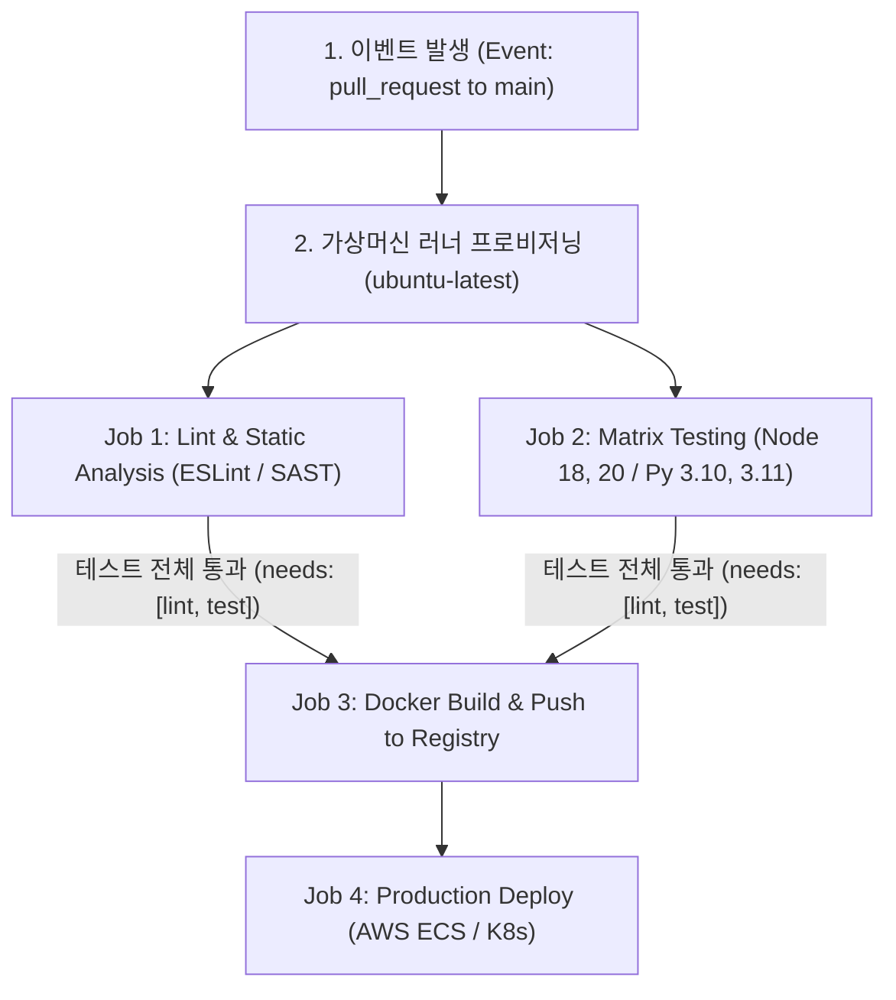

> [!abstract] 핵심 요약
> **GitHub Actions**는 소스 코드 저장소와 직결된 이벤트 기반 자동화 파이프라인 엔진이다.
> PR 생성 시 자동 실행되는 CI 워크플로우를 통해 **정적 분석, 단위 테스트, 보안 스캔**을 병렬 수행하고, 메인 브랜치 머지 시 **Docker 이미지 빌드 및 클라우드 배포(CD)**를 무중단으로 트리거한다. 매트릭스 빌드와 액션 캐싱(`actions/cache`)을 결합하여 빌드 리드 타임을 80% 이상 단축할 수 있다.

---

## 1. GitHub Actions 이벤트 기반 실행 흐름



---

## 2. GitHub Actions 핵심 구성요소 비교

| 구성요소 | 계층 및 역할 | YAML 선언 예시 | 최적화 팁 |
| :-- | :-- | :-- | :-- |
| **Workflow** | 자동화 프로세스의 최상위 단위 | `name: CI/CD Pipeline` | `.github/workflows/*.yml` 위치 |
| **Event** | 워크플로우를 트리거하는 활동 | `on: [push, pull_request]` | 특정 경로(`paths`) 필터링으로 불필요한 빌드 방지 |
| **Job** | 단일 러너에서 실행되는 단계 집합 | `jobs: build: runs-on: ubuntu-latest` | 기본 병렬 실행, `needs`로 직렬 의존성 제어 |
| **Matrix Strategy** | 환경 조합별 병렬 잡 동시 구동 | `matrix: node-version: [18.x, 20.x]` | 다양한 플랫폼 호환성 동시 검증 |
| **Secrets & OIDC** | 민감 정보 암호화 및 클라우드 연동 | `${{ secrets.PROD_API_KEY }}` | 영구 AWS Key 대신 임시 OIDC 토큰 권장 |

---

## 3. 실시간 GitHub Actions 매트릭스 빌드 병렬 작업 수 계산기

```html preview
<div style="font-family:system-ui,-apple-system,sans-serif;padding:20px;background:var(--card);color:var(--card-foreground);border:1px solid var(--border);border-radius:var(--radius)">
  <div style="font-size:16px;font-weight:700;margin-bottom:14px;color:var(--primary);display:flex;align-items:center;gap:8px">
    <span>⚡ GitHub Actions Matrix Build 병렬 Job 계산기</span>
  </div>

  <div style="display:grid;grid-template-columns:1fr 1fr;gap:12px;margin-bottom:14px">
    <div>
      <label style="font-size:11px;color:var(--muted-foreground)">지원 OS 개수 (예: Ubuntu, MacOS, Windows):</label>
      <input id="inOsCount" type="number" value="3" min="1" max="5" style="width:100%;padding:4px;background:var(--background);color:var(--foreground);border:1px solid var(--border);border-radius:var(--radius);font-weight:700" />
    </div>
    <div>
      <label style="font-size:11px;color:var(--muted-foreground)">지원 언어/런타임 버전 수 (예: v18, v20, v22):</label>
      <input id="inVerCount" type="number" value="3" min="1" max="5" style="width:100%;padding:4px;background:var(--background);color:var(--foreground);border:1px solid var(--border);border-radius:var(--radius);font-weight:700" />
    </div>
  </div>

  <div style="display:grid;grid-template-columns:1fr 1fr;gap:12px;margin-bottom:12px">
    <div style="padding:10px;background:var(--background);border:1px solid var(--border);border-radius:var(--radius);text-align:center">
      <div style="font-size:10px;color:var(--muted-foreground)">동시 생성되는 Matrix Job 수</div>
      <div id="totalJobsOut" style="font-family:monospace;font-size:18px;font-weight:800;color:var(--primary);margin-top:2px">9 Jobs</div>
    </div>
    <div style="padding:10px;background:var(--background);border:1px solid var(--border);border-radius:var(--radius);text-align:center">
      <div style="font-size:10px;color:var(--muted-foreground)">병렬 실행 시 소요 시간 (단일잡 3분 기준)</div>
      <div id="estTimeOut" style="font-family:monospace;font-size:18px;font-weight:800;color:var(--chart-1);margin-top:2px">약 3 분 (병렬화)</div>
    </div>
  </div>

  <script>
    function updateMatrix() {
      var os = parseInt(document.getElementById('inOsCount').value) || 1;
      var ver = parseInt(document.getElementById('inVerCount').value) || 1;
      var jobs = os * ver;

      document.getElementById('totalJobsOut').textContent = jobs + " Jobs";
      document.getElementById('estTimeOut').textContent = "약 3 분 (순차 시 " + (jobs * 3) + "분)";
    }

    document.getElementById('inOsCount').addEventListener('input', updateMatrix);
    document.getElementById('inVerCount').addEventListener('input', updateMatrix);
    updateMatrix();
  </script>
</div>
```
