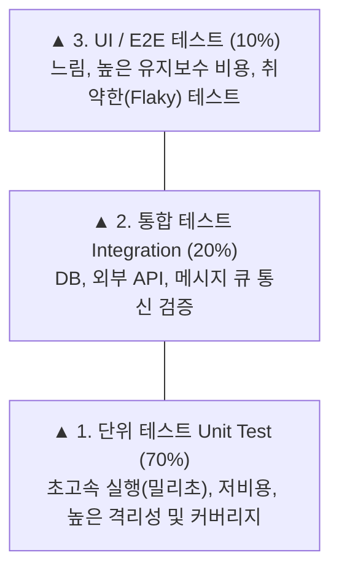

> [!abstract] 핵심 요약
> **쉬프트 레프트(Shift-Left)**는 배포 후 프로덕션 단계에서 결함을 발견했을 때 치러야 하는 막대한 비용(수정 비용 100배 증가)을 방지하기 위해, 코드 작성 시점에 정적 분석과 단위 테스트를 집중 배치하는 품질 공학 철학이다.
> 이상적인 **테스트 피라미드**는 70%의 빠르고 저렴한 **단위 테스트**, 20%의 **통합 테스트**, 10%의 **E2E UI 테스트** 비율을 유지하여 빠른 피드백 루프를 달성한다.

---

## 1. 테스트 피라미드(Test Pyramid) 구조와 비용 상관관계



---

## 2. 결함 발견 단계별 수정 비용(Cost of Quality) 비교

| 발견 단계 | 검증 기법 | 결함 수정 상대 비용 | 피드백 속도 |
| :-- | :-- | :--: | :-- |
| **1. 코딩 단계 (Shift-Left)** | IDE Linter, SAST 정적 분석, 단위 테스트 | **$1\times$ (기준)** | 실시간 (초 단위) |
| **2. 빌드/CI 단계** | PR 자동화 통합 테스트, 보안 취약점 스캔 | **$5\times$** | 수 분 이내 |
| **3. 스테이징 QA 단계** | E2E 자동화, 성능 부하 테스트 | **$15\times$** | 수 시간 ~ 수 일 |
| **4. 프로덕션 장애** | 사용자 신고, 모니터링 경보, 긴급 롤백 | **$100\times \sim 1000\times$** | 수 주 (브랜드 신뢰도 실추) |

---

## 3. 실시간 결함 발견 시점별 총 품질 비용(Cost) 시뮬레이터

```html preview
<div style="font-family:system-ui,-apple-system,sans-serif;padding:20px;background:var(--card);color:var(--card-foreground);border:1px solid var(--border);border-radius:var(--radius)">
  <div style="font-size:16px;font-weight:700;margin-bottom:14px;color:var(--primary);display:flex;align-items:center;gap:8px">
    <span>🛡️ Shift-Left 테스팅에 따른 결함 수정 비용 절감 계산기</span>
  </div>

  <div style="margin-bottom:14px">
    <label style="font-size:11px;color:var(--muted-foreground)">결함 발견 및 해결 시점 선택:</label>
    <select id="selBugStage" style="width:100%;padding:6px;background:var(--background);color:var(--foreground);border:1px solid var(--border);border-radius:var(--radius);font-weight:700">
      <option value="1">1. 단위 테스트 / 개발자 로컬 (Shift-Left 100%)</option>
      <option value="5">2. CI 파이프라인 자동화 빌드 단계</option>
      <option value="15">3. QA 스테이징 환경 E2E 검증 단계</option>
      <option value="100">4. 프로덕션 배포 후 장애 발생 (전통적 방식)</option>
    </select>
  </div>

  <div style="display:grid;grid-template-columns:1fr 1fr;gap:12px;margin-bottom:12px">
    <div style="padding:10px;background:var(--background);border:1px solid var(--border);border-radius:var(--radius);text-align:center">
      <div style="font-size:10px;color:var(--muted-foreground)">결함 수정 상대 비용 배율</div>
      <div id="costMultOut" style="font-family:monospace;font-size:18px;font-weight:800;color:var(--primary);margin-top:2px">1 배 (최저 비용)</div>
    </div>
    <div style="padding:10px;background:var(--background);border:1px solid var(--border);border-radius:var(--radius);text-align:center">
      <div style="font-size:10px;color:var(--muted-foreground)">비즈니스 리스크 및 파급력</div>
      <div id="riskTextOut" style="font-family:monospace;font-size:14px;font-weight:800;color:var(--primary);margin-top:4px">완벽 통제 ✅</div>
    </div>
  </div>

  <script>
    document.getElementById('selBugStage').onchange = function() {
      var val = parseInt(this.value);
      var c = document.getElementById('costMultOut');
      var r = document.getElementById('riskTextOut');

      c.textContent = val + " 배";
      if (val === 1) {
        c.style.color = "var(--primary)";
        r.textContent = "완벽 통제 (개발자 즉각 수정) ✅";
        r.style.color = "var(--primary)";
      } else if (val === 5) {
        c.style.color = "var(--primary)";
        r.textContent = "경미 (PR 머지 차단) ✅";
        r.style.color = "var(--primary)";
      } else if (val === 15) {
        c.style.color = "var(--chart-1)";
        r.textContent = "주의 (QA 재검증 리드타임 지연) ⚠️";
        r.style.color = "var(--chart-1)";
      } else {
        c.style.color = "var(--destructive,#ef4444)";
        r.textContent = "심각 (서비스 중단 및 고객 이탈) 💥";
        r.style.color = "var(--destructive,#ef4444)";
      }
    };
  </script>
</div>
```
