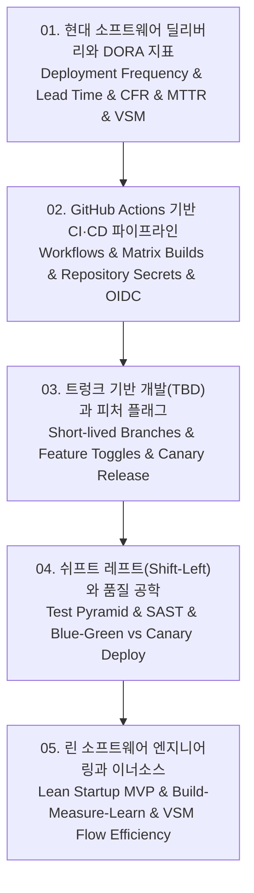

# 📚 오픈소스 소프트웨어 딜리버리 및 현대 DevOps 엔지니어링 (AIOSS Software Delivery & DevOps) 전체 강의 로드맵

DORA 4대 핵심 엔지니어링 지표(배포 빈도, 리드 타임, 변경 실패율, 복구 시간 MTTR), GitHub Actions 기반의 클라우드 네이티브 CI/CD 자동화 파이프라인(매트릭스 빌드, OIDC 클라우드 무자격증명 배포), 장기 브랜치(GitFlow)의 한계를 극복하는 트렁크 기반 개발(Trunk-Based Development: TBD)과 런타임 피처 플래그(Feature Flags), 결함 수정 비용을 획기적으로 낮추는 쉬프트 레프트(Shift-Left) 테스트 피라미드 및 SAST 보안 검증, 그리고 린 스타트업(Lean Startup) MVP 가설 검증과 밸류 스트림 맵핑(VSM), 기업 내부 이너소스(InnerSource) 거버넌스까지 현대적 소프트웨어 딜리버리의 전 과정을 체계적으로 다룹니다.

---

## 🗺️ 강의 목차 (Curriculum Overview)

---

## 📑 개별 정리 문서 목록

1. [01. 현대 소프트웨어 딜리버리와 DORA 지표 - 배포 빈도, 리드 타임, 변경 실패율과 복구 시간(MTTR)](file:///Users/um-yunsang/work/edu/ComputerScience/05_software-engineering/aioss-open-source-delivery/notes/01.%20%ED%98%84%EB%8C%80%20%EC%86%8C%ED%94%84%ED%8A%B8%EC%9B%A8%EC%96%B4%20%EB%94%9C%EB%A6%AC%EB%B2%84%EB%A6%AC%EC%99%80%20DORA%20%EC%A7%80%ED%91%9C%20-%20%EB%B0%B0%ED%8F%AC%20%EB%B9%88%EB%8F%84,%20%EB%A6%AC%EB%93%9C%20%ED%83%80%EC%9E%84,%20%EB%B3%80%EA%B2%BD%20%EC%8B%A4%ED%8C%A8%EC%9C%A8%EA%B3%BC%20%EB% Bok%EA%B5%AC%20%EC%8B%9C%EA%B0%84(MTTR).md)
   - DORA 4대 지표 분류 체계, 엘리트 vs 로우 조직 성숙도 매트릭스, 대화형 DORA 지표 진단기
2. [02. GitHub Actions 기반 CI·CD 파이프라인 - 자동 빌드, 매트릭스 테스팅, 시크릿 관리와 릴리스 자동화](file:///Users/um-yunsang/work/edu/ComputerScience/05_software-engineering/aioss-open-source-delivery/notes/02.%20GitHub%20Actions%20%EA%B8%B0%EB%B0%98%20CI%C2%B7CD%20%ED%8C%8C%EC%9D%B4%ED%48%C2%B0%EB%9D%BC%EC%9D%B8%20-%20%EC%9E%90%EB%8F%99%20%EB%B9%8C%EB%93%9C,%20%EB%A7%A4%ED%8A%B8%EB%A6%AD%EC%8A%A4%20%ED%85%8C%EC%8A%A4%ED%8C%85,%20%EC%8B%9C%ED%81%AC%EB%A6%BF%20%EA%B4%80%EB%A6%AC%EC%99%80%20%EB%A6%B4%EB%A6%AC%EC%8A%A4%20%EC%9E%90%EB%8F%99%ED%99%94.md)
   - 이벤트 기반 워크플로우 아키텍처, 매트릭스 빌드 전략, 대화형 GitHub Actions 병렬 Job 계산기
3. [03. 트렁크 기반 개발(TBD)과 피처 플래그 - GitFlow 한계 극복, 단기 브랜치와 점진적 릴리스 제어](file:///Users/um-yunsang/work/edu/ComputerScience/05_software-engineering/aioss-open-source-delivery/notes/03.%20%ED%8A%B8%EB%A0%81%ED%81%AC%20%EA%B8%B0%EB%B0%98%20%EA%B0%9C%EB%B0%9C(TBD)%EA%B3%BC%20%ED%94%BC%EC%B2%98%20%ED%94%8C%EB%9E%98%EA%B7%B8%20-%20GitFlow%20%ED%95%9C%EA%B3%84%20%EA%B7%B9%EB%B3%B5,%20%EB%8B%A8%EA%B8%B0%20%EB%B8%8C%EB%9E%9C%EC%B9%98%EC%99%80%20%EC%A0%90%EC%A7%84%EC%A0%81%20%EB%A6%B4%EB%A6%AC%EC%8A%A4%20%EC%A0%9C%EC%96%B4.md)
   - GitFlow vs TBD 구조 비교, 피처 플래그 4대 카테고리, 대화형 런타임 피처 플래그 동적 제어기
4. [04. 쉬프트 레프트(Shift-Left) 테스팅과 품질 공학 - 테스트 피라미드, 정적 분석(SAST)과 카나리 배포](file:///Users/um-yunsang/work/edu/ComputerScience/05_software-engineering/aioss-open-source-delivery/notes/04.%20%EC%89%AC%ED%94%84%ED%8A%B8%20%EB%A0%88%ED%94%84%ED%8A%B8(Shift-Left)%20%ED%85%8C%EC%8A%A4%ED%8C%85%EA%B3%BC%20%ED%92%88%EC%A7%88%20%EA%B3%B5%ED%95%99%20-%20%ED%85%8C%EC%8A%A4%ED%8A%B8%20%ED%48%C2%B0%EB%9D%BC%EB%AF%B8%EB%93%9C,%20%EC%A0%95%EC%A0%81%20%EB%B6%84%EC%84%9D(SAST)%EA%B3%BC%20%EC% transatlantic%20%EB%B0%B0%ED%8F%AC.md)
   - 테스트 피라미드(70-20-10) 원칙, 결함 발견 시점별 수정 비용 매트릭스, 대화형 품질 비용 절감 계산기
5. [05. 린 소프트웨어 엔지니어링과 이너소스 - MVP 가설 검증, 밸류 스트림 매핑(VSM)과 오픈소스 협업 모델](file:///Users/um-yunsang/work/edu/ComputerScience/05_software-engineering/aioss-open-source-delivery/notes/05.%20%EB%A6%B0%20%EC%86%8C%ED%94%84%ED%8A%B8%EC%9B%A8%EC%96%B4%20%EC%97%94%EC%A7%80%EB%8B%88%EC%96%B4%EB%A7%81%EA%B3%BC%20%EC%9D%B4%EB%84%88%EC%86%8C%EC%8A%A4%20-%20MVP%20%EA%B0%80%EC%84%A4%20%EA%B2%80%EC%A6%9D,%20%EB%B0%B8%EB%A5%98%20%EC%8A%A4%ED%8A%B8%EB%A6%BC%20%EB%A7%A4%ED%5C%ED%95%91(VSM)%EA%B3%BC%20%EC%98%A4%ED%94%88%EC%86%8C%EC%8A%A4%20%ED%98%91%EC%97%85%20%EB%AA%A8%EB%8D%B8.md)
   - Build-Measure-Learn 피드백 루프, VSM Flow Efficiency 수식 유도, 대화형 VSM 흐름 효율 계산기
