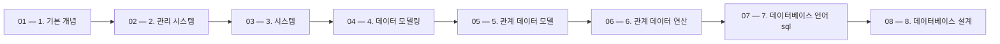

 > [!abstract] 사용법
 > 이 지도는 현재 폴더의 원본 PDF를 파일 순서대로 묶어 **강의 진행 → 핵심 단서 → 점검 포인트**를 연결합니다. 세부 개념은 같은 폴더의 주제 노트와 함께 대조하세요.

## 강의 흐름



<Tabs>
  <Tab label="파일 순서">파일명에 포함된 주차·장·버전 표기를 먼저 읽어 강의의 큰 흐름을 잡습니다.</Tab>
  <Tab label="중복 자료">같은 접두사나 버전이 겹치면 앞 자료를 기준으로 뒤 자료의 보충·실습 여부를 비교합니다.</Tab>
  <Tab label="검증">첫 페이지 단서는 방향만 제시하므로 정의·식·코드·수치는 원본 PDF에서 다시 확인합니다.</Tab>
</Tabs>

## 원본 PDF 목록

| 파일 | 쪽수 | 첫 페이지 단서 |
| :-- | --: | :-- |
| 1. 기본 개념.pdf | 23 | 데이터베이스 기본 개념 01 데이터베이스의 필요성 02 데이터베이스의 정의와 특징 03 데이터 과학 시대의 데이터 |
| 2. 관리 시스템.pdf | 20 | 데이터베이스 관리 시스템 01 데이터베이스 관리 시스템의 등장 배경 02 데이터베이스 관리 시스템의 정의 03 데이터베이스 관리 시스템의 장•단점 04 데이터베이스 관리 시스템의 발전 과정 |
| 3. 시스템.pdf | 27 | 데이터베이스 시스템 01 데이터베이스 시스템의 정의 02 데이터베이스의 구조 03 데이터베이스 사용자 04 데이터 언어 05 데이터베이스 관리 시스템의 구성 |
| 4. 데이터 모델링.pdf | 42 | 데이터베이스 개론(3판) (강의교안 이용 안내) • 본 강의교안의 저작권은 한빛아카데미㈜에 있습니다. • 이 자료를 무단으로 전제하거나 배포할 경우 저작권법 136조에 의거하여 최고 5년 이하의 징역 또는 5천만원 이하의 벌금에 처할 수 있고 이를 병과(倂科)할 수도 있습니다. |
| 5. 관계 데이터 모델.pdf | 28 | 데이터베이스 개론(3판) (강의교안 이용 안내) • 본 강의교안의 저작권은 한빛아카데미㈜에 있습니다. • 이 자료를 무단으로 전제하거나 배포할 경우 저작권법 136조에 의거하여 최고 5년 이하의 징역 또는 5천만원 이하의 벌금에 처할 수 있고 이를 병과(倂科)할 수도 있습니다. |
| 6. 관계 데이터 연산.pdf | 60 | 데이터베이스 개론(3판) (강의교안 이용 안내) • 본 강의교안의 저작권은 한빛아카데미㈜에 있습니다. • 이 자료를 무단으로 전제하거나 배포할 경우 저작권법 136조에 의거하여 최고 5년 이하의 징역 또는 5천만원 이하의 벌금에 처할 수 있고 이를 병과(倂科)할 수도 있습니다. |
| 7. 데이터베이스 언어 sql.pdf | 136 | 데이터베이스 언어 SQL 01 SQL의 소개 02 SQL을 이용한 데이터 정의 03 SQL을 이용한 데이터 조작 04 뷰 05 삽입 SQL |
| 8. 데이터베이스 설계.pdf | 71 | 데이터베이스 개론(3판) (강의교안 이용 안내) • 본 강의교안의 저작권은 한빛아카데미㈜에 있습니다. • 이 자료를 무단으로 전제하거나 배포할 경우 저작권법 136조에 의거하여 최고 5년 이하의 징역 또는 5천만원 이하의 벌금에 처할 수 있고 이를 병과(倂科)할 수도 있습니다. |
| 9-1. 고급 정규형.pdf | 7 | 고급 정규형 전인호 |
| 9. 정규화.pdf | 63 | 데이터베이스 개론(3판) (강의교안 이용 안내) • 본 강의교안의 저작권은 한빛아카데미㈜에 있습니다. • 이 자료를 무단으로 전제하거나 배포할 경우 저작권법 136조에 의거하여 최고 5년 이하의 징역 또는 5천만원 이하의 벌금에 처할 수 있고 이를 병과(倂科)할 수도 있습니다. |
| 11. 보안과 권한 관리.pdf | 29 | 데이터베이스 개론(3판) (강의교안 이용 안내) • 본 강의교안의 저작권은 한빛아카데미㈜에 있습니다. • 이 자료를 무단으로 전제하거나 배포할 경우 저작권법 136조에 의거하여 최고 5년 이하의 징역 또는 5천만원 이하의 벌금에 처할 수 있고 이를 병과(倂科)할 수도 있습니다. |
| 12. 데이터베이스 응용 기술.pdf | 57 | 데이터베이스 개론(3판) (강의교안 이용 안내) • 본 강의교안의 저작권은 한빛아카데미㈜에 있습니다. • 이 자료를 무단으로 전제하거나 배포할 경우 저작권법 136조에 의거하여 최고 5년 이하의 징역 또는 5천만원 이하의 벌금에 처할 수 있고 이를 병과(倂科)할 수도 있습니다. |
| 13. 데이터 과학과 빅데이터.pdf | 62 | 데이터베이스 개론(3판) (강의교안 이용 안내) • 본 강의교안의 저작권은 한빛아카데미㈜에 있습니다. • 이 자료를 무단으로 전제하거나 배포할 경우 저작권법 136조에 의거하여 최고 5년 이하의 징역 또는 5천만원 이하의 벌금에 처할 수 있고 이를 병과(倂科)할 수도 있습니다. |
| 회복과 병행 제어 2.pdf | 76 | 데이터베이스 개론(3판) (강의교안 이용 안내) • 본 강의교안의 저작권은 한빛아카데미㈜에 있습니다. • 이 자료를 무단으로 전제하거나 배포할 경우 저작권법 136조에 의거하여 최고 5년 이하의 징역 또는 5천만원 이하의 벌금에 처할 수 있고 이를 병과(倂科)할 수도 있습니다. |
| 회복과 병행 제어.pdf | 76 | 데이터베이스 개론(3판) (강의교안 이용 안내) • 본 강의교안의 저작권은 한빛아카데미㈜에 있습니다. • 이 자료를 무단으로 전제하거나 배포할 경우 저작권법 136조에 의거하여 최고 5년 이하의 징역 또는 5천만원 이하의 벌금에 처할 수 있고 이를 병과(倂科)할 수도 있습니다. |
| IT CookBook, 데이터베이스 개론 연습문제 해답 장 연습문제 해답 2.pdf | 75 | IT CookBook, 데이터베이스 개론 연습문제 해답 1장 연습문제 해답 1. 데이터와 정보에 대한 설명으로 옳지 않은 것은? ① 데이터와 정보를 구별하는 기준은 가공의 유무다. ② 데이터는 현실 세계에서 관찰이나 측정으로 수집한 사실이나 값이다. ③ 정보는 의사 결정에 활용하기 위해 데이터를 처리한 결과물이다. ➃ 정보를 가공하면 데이터를 얻을 수 있다. 2. 데이터와 정보의 차이를 고려 |
| IT CookBook, 데이터베이스 개론 연습문제 해답 장 연습문제 해답.pdf | 75 | IT CookBook, 데이터베이스 개론 연습문제 해답 1장 연습문제 해답 1. 데이터와 정보에 대한 설명으로 옳지 않은 것은? ① 데이터와 정보를 구별하는 기준은 가공의 유무다. ② 데이터는 현실 세계에서 관찰이나 측정으로 수집한 사실이나 값이다. ③ 정보는 의사 결정에 활용하기 위해 데이터를 처리한 결과물이다. ➃ 정보를 가공하면 데이터를 얻을 수 있다. 2. 데이터와 정보의 차이를 고려 |

## 원본 단계 인터랙티브

```html preview
<div style="font-family:system-ui,sans-serif;padding:20px;color:var(--foreground)">
  <label for="flow2525299104" style="font-size:14px;font-weight:600">원본 자료 단계</label>
  <div id="flow2525299104-out" style="font-size:24px;font-weight:700;color:var(--chart-1);margin:6px 0">1. 기본 개념</div>
  <input id="flow2525299104" type="range" min="1" max="17" step="1" value="1" style="width:100%;accent-color:var(--primary)" />
  <p style="font-size:13px;color:var(--muted-foreground)">슬라이더를 움직이면 파일명 순서대로 자료의 위치를 확인합니다.</p>
  <script>
    var flow2525299104 = document.getElementById('flow2525299104');
    var flow2525299104Out = document.getElementById('flow2525299104-out');
    var flow2525299104Steps = ["1. 기본 개념","2. 관리 시스템","3. 시스템","4. 데이터 모델링","5. 관계 데이터 모델","6. 관계 데이터 연산","7. 데이터베이스 언어 sql","8. 데이터베이스 설계","9-1. 고급 정규형","9. 정규화","11. 보안과 권한 관리","12. 데이터베이스 응용 기술","13. 데이터 과학과 빅데이터","회복과 병행 제어 2","회복과 병행 제어","IT CookBook, 데이터베이스 개론 연습문제 해답 장 연습문제 해답 2","IT CookBook, 데이터베이스 개론 연습문제 해답 장 연습문제 해답"];
    flow2525299104.addEventListener('input', function () {
      flow2525299104Out.textContent = flow2525299104Steps[Number(flow2525299104.value) - 1] || '';
    });
  </script>
</div>
```

## 점검 포인트

- **범위:** 17개 PDF, 총 927쪽.
- **근거:** 표의 쪽수와 첫 페이지 단서는 현재 sources/ 파일에서 직접 추출했습니다.
- **학습 순서:** 흐름도와 슬라이더를 먼저 훑은 뒤, 주제 노트의 정의·절차·실습 결과를 순서대로 대조합니다.

> [!warning] 과해석 방지
> 이 지도에는 파일명·쪽수·첫 페이지 추출 단서만 기록했습니다. PDF에 없는 구현 세부, 성능 수치, 권장 설정은 추가하지 않습니다.

<details>
<summary>다음 읽기</summary>

현재 단계의 원본을 열어 제목·절차·도식을 확인한 뒤, 같은 폴더의 주제 노트에 해당 근거가 반영되었는지 점검하세요.

</details>
