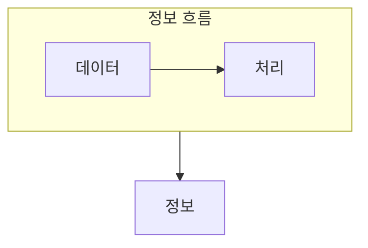

> [!abstract] 데이터베이스는 목적 있는 데이터를 통합해 지속적으로 공유·활용하는 기반이다.
> 데이터를 정보로 바꾸는 맥락과, 데이터베이스가 관리하는 범위를 함께 구분한다.

## 이 노트의 지도



## 1. 데이터와 정보를 구분하기

관찰하거나 측정해 얻은 사실과 값을 그대로 두면 활용 맥락이 부족할 수 있다. ==정보== 는 의사결정에 활용할 수 있도록 데이터를 처리한 결과로 본다.

## 2. 데이터베이스의 필요

여러 사용자가 같은 데이터를 써야 할 때는 중복을 줄이고, 일관된 방식으로 저장·검색할 구조가 필요하다.

<details>
<summary>기본 개념을 판별하는 기준</summary>

데이터는 사실이나 값 자체에, 정보는 목적에 맞춘 해석과 활용에 초점을 둔다. 데이터베이스는 그 데이터를 조직적으로 저장하고 공유하는 대상이다.

</details>

> [!caution] 가공과 원본을 뒤집지 않기
> 정보를 다시 가공하면 항상 데이터가 되는 것은 아니다. 무엇이 사실이고 무엇이 해석 결과인지 먼저 확인한다.

## 한눈에 비교

```html preview
<div style="font-family:system-ui,sans-serif;padding:20px">
  <div id="cards" style="display:flex;gap:14px;flex-wrap:wrap"></div>
  <script>
    var stats = [
      ['데이터', '사실·값', '수집', 'var(--chart-1)'],
      ['정보', '의사결정', '활용', 'var(--chart-2)'],
      ['데이터베이스', '통합 관리', '공유', 'var(--chart-3)']
    ];
    document.getElementById('cards').innerHTML = stats.map(function (s) {
      return '<div style="flex:1;min-width:150px;padding:16px;background:var(--card);' +
        'color:var(--card-foreground);border:1px solid var(--border);' +
        'border-radius:var(--radius)">' +
        '<div style="font-size:13px;color:var(--muted-foreground)">' + s[0] + '</div>' +
        '<div style="font-size:26px;font-weight:700;margin-top:4px">' + s[1] + '</div>' +
        '<div style="font-size:12px;font-weight:600;margin-top:4px;color:' + s[3] + '">' +
        s[2] + '</div>' +
        '</div>';
    }).join('');
  </script>
</div>
```

## 선택 기준

<Tabs>
  <Tab label="정의">

데이터와 정보는 가공과 활용 맥락으로 구분하고, 데이터베이스는 조직적 저장 대상을 뜻한다.

  </Tab>
  <Tab label="필요">

여러 사용자가 같은 데이터를 신뢰성 있게 쓰기 위해 중복과 불일치를 관리한다.

  </Tab>
</Tabs>

## 핵심 정리

| 구분 | 핵심 | 학습에서 확인할 점 |
| :-- | :-- | :-- |
| 데이터 | 관찰·측정한 사실 | 가공 전 값인가 |
| 정보 | 활용 가능한 결과 | 의사결정에 쓰이는가 |
| 데이터베이스 | 통합 저장 | 공유와 관리가 필요한가 |

> [!question]- 스스로 점검
> **Q.** 제품가격과 월별 평균 주문금액 중 정보에 더 가까운 것은 무엇이며 왜 그런가?
>
> **A.** 월별 평균 주문금액이다. 여러 값을 처리해 활용 맥락을 만든 결과이기 때문이다.

## 출처 처리

공개 노트에는 원본 연결, 이미지, 페이지 단서를 남기지 않았다.

---

## 원본 강의 흐름 인터랙티브

```html preview
<div style="font-family:system-ui,sans-serif;padding:20px;color:var(--foreground)">
  <label for="noteFlow916530" style="font-size:14px;font-weight:600">데이터베이스 기본 개념 단계</label>
  <div id="noteFlow916530-out" style="font-size:26px;font-weight:700;color:var(--chart-1);margin:6px 0">데이터베이스 기본 개념 핵심 개념</div>
  <input id="noteFlow916530" type="range" min="1" max="3" step="1" value="1" style="width:100%;accent-color:var(--primary)" />
  <p style="font-size:13px;color:var(--muted-foreground)">슬라이더를 움직이면 원본 PDF에서 정리한 이 노트의 흐름을 확인합니다.</p>
  <script>
    var noteFlow916530 = document.getElementById('noteFlow916530');
    var noteFlow916530Out = document.getElementById('noteFlow916530-out');
    var noteFlow916530Steps = ["데이터베이스 기본 개념 핵심 개념","데이터베이스 기본 개념 처리 절차","데이터베이스 기본 개념 검증·응용"];
    noteFlow916530.addEventListener('input', function () { noteFlow916530Out.textContent = noteFlow916530Steps[Number(noteFlow916530.value) - 1]; });
  </script>
</div>
```
