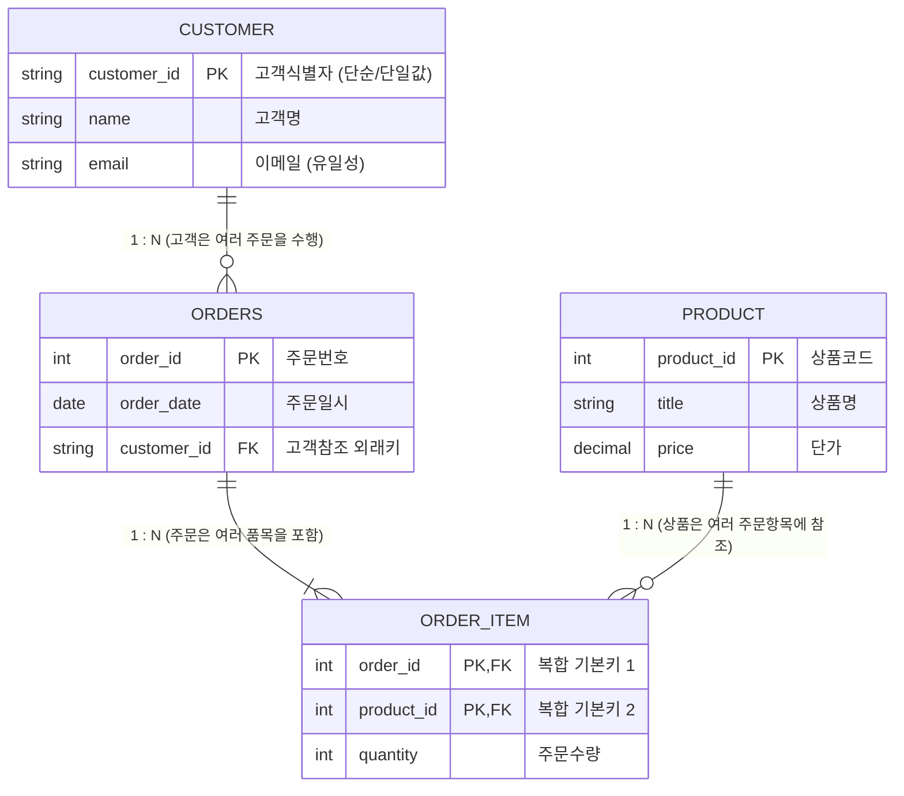

> [!abstract] 핵심 요약
> **개념적 데이터 모델링**은 실세계의 비정형 비즈니스 요구사항을 DBMS에 독립적인 추상 구조로 변환하는 핵심 단계이다.
> **E-R 모델(Entity-Relationship Model)**은 실세계의 구체적 대상인 **개체(Entity)**, 개체의 특성을 기술하는 **속성(Attribute)**, 개체 간의 연관성을 나타내는 **관계(Relationship)**로 구성된다. 특히 $1:1$, $1:N$, $N:M$ 카디널리티와 필수/선택 참여 제약조건은 논리적 릴레이션 변환 시 외래키 배치와 교차 테이블(Bridge Table) 생성 여부를 결정짓는 결정적 기준이 된다.

---

## 1. E-R 다이어그램 핵심 구성요소 및 기하 기호



---

## 2. 속성(Attribute) 4대 분류 체계

| 분류 기준 | 유형 | 설명 및 대표 예시 |
| :-- | :-- | :-- |
| **분해 가능성** | **단순 속성 (Simple)** vs **복합 속성 (Composite)** | 단순: `나이`, `주민번호` / 복합: `주소(시, 구, 동, 번지)`, `생년월일(년, 월, 일)` |
| **값의 개수** | **단일값 속성 (Single-valued)** vs **다치 속성 (Multi-valued)** | 단일값: `학번`, `주민등록번호` / 다치: `전화번호(자택, 휴대폰)`, `취미` (이중 타원) |
| **값의 계산성** | **저장 속성 (Stored)** vs **유도 속성 (Derived)** | 저장: `생년월일`, `주문금액` / 유도: `나이(현재연도-생년)`, `총주문합계` (점선 타원) |
| **개체 식별성** | **식별자 (Key Attribute)** | 개체 인스턴스를 유일하게 구별하는 고유 속성 (밑줄 표시) |

---

## 3. 실시간 관계 카디널리티 및 릴레이션 변환 규칙 시뮬레이터

```html preview
<div style="font-family:system-ui,-apple-system,sans-serif;padding:20px;background:var(--card);color:var(--card-foreground);border:1px solid var(--border);border-radius:var(--radius)">
  <div style="font-size:16px;font-weight:700;margin-bottom:14px;color:var(--primary);display:flex;align-items:center;gap:8px">
    <span>🔗 E-R 관계 카디널리티별 관계형 테이블 변환 규칙 계산기</span>
  </div>

  <div style="margin-bottom:14px">
    <label style="font-size:11px;color:var(--muted-foreground)">개체 A와 개체 B의 관계 유형 선택:</label>
    <select id="selCardType" style="width:100%;padding:6px;background:var(--background);color:var(--foreground);border:1px solid var(--border);border-radius:var(--radius);font-weight:700">
      <option value="1N">1 : N 관계 (예: 부서 1 : 사원 N)</option>
      <option value="NM">N : M 관계 (예: 학생 N : 과목 M)</option>
      <option value="11">1 : 1 관계 (예: 사원 1 : 사원상세정보 1)</option>
    </select>
  </div>

  <div style="padding:12px;background:var(--background);border:1px solid var(--border);border-radius:var(--radius)">
    <div style="font-size:11px;font-weight:700;color:var(--muted-foreground);margin-bottom:4px">관계형 스키마 변환 결과 (FK 및 테이블 구조)</div>
    <div id="cardResultOut" style="font-size:13px;line-height:1.6;color:var(--foreground)">
      <strong>외래키(FK) 단방향 배치:</strong> N측 릴레이션(사원)에 1측 릴레이션의 기본키(부서코드)를 외래키(FK)로 추가합니다. 별도 교차 테이블은 불필요합니다.
    </div>
  </div>

  <script>
    document.getElementById('selCardType').onchange = function() {
      var val = this.value;
      var out = document.getElementById('cardResultOut');
      if (val === '1N') {
        out.innerHTML = "<strong style='color:var(--primary)'>📌 1:N 관계 매핑 규칙:</strong><br/>N측 테이블에 1측 테이블의 기본키를 외래키(FK)로 배치합니다. 테이블 수는 2개(A, B)로 유지됩니다.";
      } else if (val === 'NM') {
        out.innerHTML = "<strong style='color:var(--chart-1)'>📌 N:M 관계 매핑 규칙:</strong><br/>다대다 관계는 직접 외래키를 둘 수 없으므로, <strong>두 테이블의 기본키를 복합 외래키로 갖는 별도의 관계(교차/조인) 테이블</strong>을 생성하여 1:N, M:1 관계로 해소합니다. 총 테이블 수는 3개(A, B, A_B_Bridge)가 됩니다.";
      } else {
        out.innerHTML = "<strong style='color:var(--primary)'>📌 1:1 관계 매핑 규칙:</strong><br/>필수 참여(Mandatory)를 하는 측 테이블에 선택 참여 측의 기본키를 외래키(FK)로 두거나, 두 개체를 단일 통합 테이블로 병합할 수 있습니다.";
      }
    };
  </script>
</div>
```
