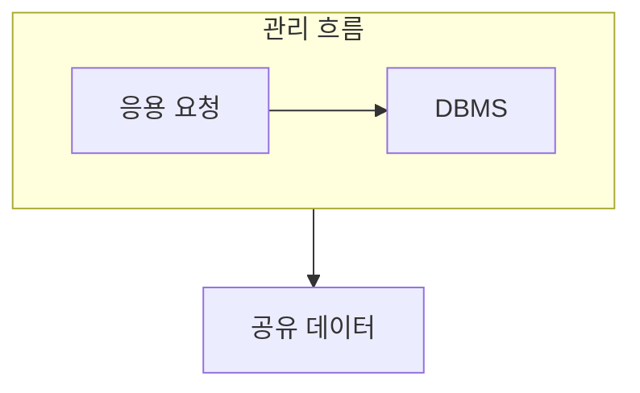

> [!abstract] DBMS는 여러 응용이 공유하는 데이터를 통합적으로 저장·검색·통제하는 소프트웨어다.
> 파일별 관리의 문제와 DBMS가 제공하는 기능을 대응시켜 이해한다.

## 이 노트의 지도



## 1. 파일별 관리의 한계

응용마다 별도 파일을 만들면 같은 사실이 여러 곳에 복제되고, 형식 변경이 프로그램 수정으로 이어질 수 있다. ==데이터 독립성== 은 저장 구조의 변화가 응용에 미치는 영향을 줄이려는 목표다.

## 2. 관리 시스템의 역할

DBMS는 정의, 조작, 보안, 회복처럼 데이터 사용 전반에 필요한 기능을 하나의 관리 계층으로 제공한다.

<details>
<summary>파일 방식과 비교하기</summary>

파일 시스템은 응용별 파일을 중심으로 관리한다. DBMS는 여러 사용자의 요청을 조정하면서 데이터 정의와 제약을 함께 관리한다.

</details>

> [!warning] 통합은 권한 없는 공유가 아니다
> 공유 데이터라고 해서 누구나 같은 범위에 접근하는 것은 아니다. 접근 제어와 회복도 DBMS의 중요한 역할이다.

## 한눈에 비교

```html preview
<div style="font-family:system-ui,sans-serif;padding:20px">
  <div id="cards" style="display:flex;gap:14px;flex-wrap:wrap"></div>
  <script>
    var stats = [
      ['파일 방식', '응용별', '종속', 'var(--chart-1)'],
      ['DBMS', '통합 관리', '공유', 'var(--chart-2)'],
      ['독립성', '변화 완화', '유지보수', 'var(--chart-3)']
    ];
    document.getElementById('cards').innerHTML = stats.map(function (s) {
      return '<div style="flex:1;min-width:150px;padding:16px;background:var(--card);' +
        'color:var(--card-foreground);border:1px solid var(--border);' +
        'border-radius:var(--radius)">' +
        '<div style="font-size:13px;color:var(--muted-foreground)">' + s[0] + '</div>' +
        '<div style="font-size:26px;font-weight:700;margin-top:4px">' + s[1] + '</div>' +
        '<div style="font-size:12px;font-weight:600;margin-top:4px;color:' + s[3] + '">' +
s[2] + '</div>' +
        '</div>';
    }).join('');
  </script>
</div>
```

## 선택 기준

<details>
<summary>두 관점을 나란히 보기</summary>

**문제.** 중복, 불일치, 프로그램·데이터 종속은 파일별 관리에서 커지기 쉽다.

**기능.** 정의·조작·보안·회복 기능은 공통 데이터 사용을 조정한다.

</details>

## 핵심 정리

| 구분 | 핵심 | 학습에서 확인할 점 |
| :-- | :-- | :-- |
| 파일 시스템 | 응용별 파일 | 중복과 종속이 생기는가 |
| DBMS | 통합 관리 | 공통 제약을 적용하는가 |
| 데이터 독립성 | 변화 완화 | 응용 수정 범위를 줄이는가 |

> [!question]- 스스로 점검
> **Q.** DBMS가 파일 시스템의 중복 문제를 줄이는 방식은 무엇인가?
>
> **A.** 여러 응용이 같은 데이터를 별도 파일로 복제하지 않고 관리 계층을 통해 공유하게 한다.

## 출처 처리

공개 노트에는 원본 연결, 이미지, 페이지 단서를 남기지 않았다.
