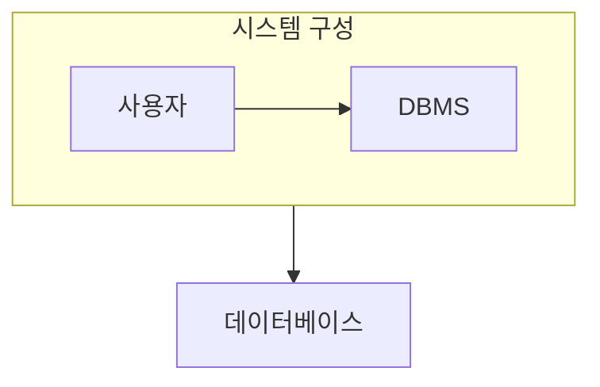

> [!abstract] 데이터베이스 시스템은 데이터, DBMS, 사용자, 언어와 운영 환경이 함께 작동하는 전체다.
> 스키마와 인스턴스, 논리 구조와 물리 구조의 경계를 분리한다.

## 이 노트의 지도



## 1. 구성요소로 보기

데이터베이스 자체와 이를 관리하는 시스템을 구별하고, 사용자와 데이터 언어가 그 사이를 연결한다. ==스키마== 는 데이터베이스의 구조를 기술한 정의이고, 인스턴스는 특정 시점의 실제 데이터다.

## 2. 세 단계 구조

외부·개념·내부 구조를 구분하면 사용자 관점, 전체 논리 구조, 저장 방식의 변화를 따로 다룰 수 있다.

<details>
<summary>독립성 질문</summary>

사용자 뷰가 바뀌지 않아도 내부 저장 방식을 바꿀 수 있는지, 논리 구조 조정이 각 응용의 관점에 어떤 영향을 주는지 나누어 본다.

</details>

> [!tip] 정의와 현재값을 구분
> 스키마는 구조의 약속이고 인스턴스는 그 약속 아래 존재하는 현재 데이터다.

## 한눈에 비교

```html preview
<div style="font-family:system-ui,sans-serif;padding:20px">
  <div id="cards" style="display:flex;gap:14px;flex-wrap:wrap"></div>
  <script>
    var stats = [
      ['외부', '사용자 관점', '뷰', 'var(--chart-1)'],
      ['개념', '전체 논리', '스키마', 'var(--chart-2)'],
      ['내부', '저장 방식', '구현', 'var(--chart-3)']
    ];
    document.getElementById('cards').innerHTML = stats.map(function (s) {
      return '<div style="flex:1;min-width:150px;padding:16px;background:var(--card);' +
        'color:var(--card-foreground);border:1px solid var(--border);' +
        'border-radius:var(--radius)">' +
        '<div style="font-size:13px;color:var(--muted-foreground)">' + s[0] + '</div>' +
        '<div style="font-size:26px;font-weight:700;margin-top:4px">' + s[1] + '</div>' +
        '<div style="font-size:12px;font-weight:600;margin-top:4px;color:' + s[3] + '">' +
s[2] + '</div>' +
        '</div>';
    }).join('');
  </script>
</div>
```

## 선택 기준

<Tabs>
  <Tab label="구조">

세 단계는 같은 데이터를 서로 다른 관점에서 보게 하며, 변화의 영향 범위를 나눈다.

  </Tab>
  <Tab label="사용자">

최종 사용자, 응용 개발자, 관리자처럼 역할마다 데이터에 접근하는 방식이 다르다.

  </Tab>
</Tabs>

## 핵심 정리

| 구분 | 핵심 | 학습에서 확인할 점 |
| :-- | :-- | :-- |
| 스키마 | 구조 정의 | 시간에 따라 자주 바뀌는가 |
| 인스턴스 | 현재 데이터 | 특정 시점을 나타내는가 |
| 데이터 독립성 | 영향 분리 | 변화를 어느 계층에 가두는가 |

<details>
<summary>스스로 점검</summary>

**Q.** 내부 저장 구조를 바꿔도 사용자 뷰를 유지하려는 이유는 무엇인가?

**A.** 저장 최적화의 변화가 모든 사용자와 응용의 수정으로 번지지 않게 하기 위해서다.

</details>

## 출처 처리

> [!info] 공개 노트 정책
> 원본 연결, 이미지, 페이지 단서는 공개 노트에 남기지 않았다.
