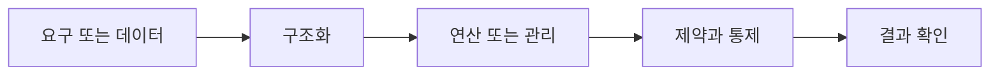

> [!abstract] 핵심
> 데이터베이스 시스템은 데이터를 저장·관리해 조직에 필요한 정보를 생성하며, 스키마와 인스턴스·사용자·언어·DBMS 구성으로 이해한다.

## 구조를 먼저 구분하기

데이터베이스 시스템은 데이터베이스에 데이터를 저장하고 관리해 필요한 정보를 생성하는 시스템이다. 스키마는 저장될 데이터 구조와 제약조건의 정의이고, 인스턴스는 그 스키마에 따라 실제로 저장된 값이다.



| 관점 | 핵심 질문 | 점검 방법 |
| --- | --- | --- |
| 스키마 | 구조와 제약의 정의 | 변경 범위와 제약을 확인한다 |
| 인스턴스 | 현재 저장된 실제 값 | 스키마를 만족하는지 본다 |
| 시스템 | 저장·관리·정보 생성 | 사용자·언어·관리 기능을 연결한다 |

> [!note] 적용 순서
> 구조 정의와 현재 저장값을 분리해 기록한다. 사용자와 데이터 언어의 역할, DBMS 구성 요소가 어느 단계에서 상호작용하는지 정리한다.

```html preview h=170
<div style="font-family:system-ui,sans-serif;padding:16px;border:1px solid var(--border);background:var(--card);color:var(--foreground);border-radius:var(--radius)">
  <div style="font-weight:700;margin-bottom:10px">03. 데이터베이스 시스템 · 구조 점검</div>
  <div style="display:grid;grid-template-columns:repeat(4,minmax(0,1fr));gap:8px">
    <div style="padding:9px;border:1px solid var(--border);border-radius:var(--radius)">입력</div>
    <div style="padding:9px;border:1px solid var(--border);border-radius:var(--radius)">구조</div>
    <div style="padding:9px;border:1px solid var(--border);border-radius:var(--radius)">연산</div>
    <div style="padding:9px;border:1px solid var(--border);border-radius:var(--radius)">검증</div>
  </div>
</div>
```

## 세 관점

<Tabs>
<Tab label="개념">

스키마는 데이터의 설계도이고 인스턴스는 그 설계도에 들어온 현재 값이다.

</Tab>
<Tab label="적용">

사용자 요구를 데이터 언어로 표현하고 DBMS가 이를 저장 구조와 연산으로 관리하는 흐름을 그린다.

</Tab>
<Tab label="검증">

스키마 변경과 인스턴스 갱신을 같은 작업으로 보지 않는다. 각각의 영향 범위와 검증 기준이 다르다.

</Tab>
</Tabs>

<details>
<summary>복습 질문</summary>

스키마와 인스턴스는 왜 별개의 개념인가? 데이터 구조의 제약을 스키마에 두는 이유는 무엇인가?

</details>

> [!tip] 학습 전략
> 구조, 연산, 제약을 분리해 적은 뒤 서로 어떤 조건으로 연결되는지 설명한다. 예시를 바꿀 때는 한 조건씩 바꾼다.
> [!warning] 해석 주의
> 현재 인스턴스가 정상처럼 보여도 스키마의 제약이 부족하면 이후 데이터 품질을 보장하기 어렵다.
