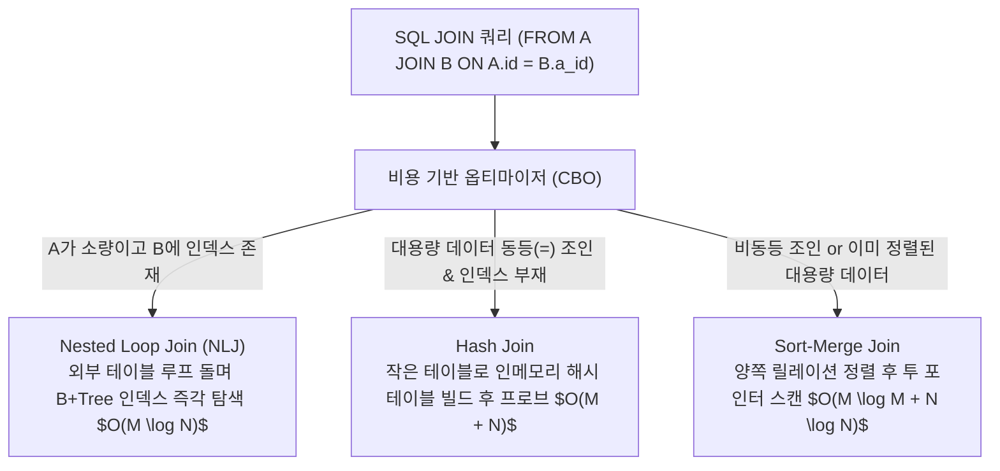

> [!abstract] 핵심 요약
> **SQL**은 사용자가 원하는 데이터의 논리적 조건(What)만을 선언하면, RDBMS의 질의 최적화기(CBO, Cost-Based Optimizer)가 카탈로그 통계 정보를 바탕으로 가장 비용이 적은 물리적 실행 계획(How)을 자동으로 수립하여 실행한다.
> 대규모 쿼리 튜닝 시에는 인덱스 유무와 조인 알고리즘(**Nested Loop Join**, **Hash Join**, **Sort-Merge Join**)의 특성을 이해하고 `EXPLAIN` 실행 계획을 통해 Full Table Scan을 방지하는 것이 필수적이다.

---

## 1. RDBMS 조인 알고리즘 3대 비교 및 비용 복잡도



---

## 2. SQL 구문 서브셋 3대 분류

| 구분 | 명령어 집합 | 역할 | 트랜잭션 영향 |
| :-- | :-- | :-- | :-- |
| **DDL (데이터 정의어)** | `CREATE`, `ALTER`, `DROP`, `TRUNCATE` | 테이블, 뷰, 인덱스 등 DB 스키마 객체 생성 및 변경 | 암묵적 자동 커밋(Auto-commit) 발생 |
| **DML (데이터 조작어)** | `SELECT`, `INSERT`, `UPDATE`, `DELETE` | 테이블 내 튜플 검색, 삽입, 수정, 삭제 | 트랜잭션 롤백(ROLLBACK) 및 커밋(COMMIT) 가능 |
| **DCL (데이터 제어어)** | `GRANT`, `REVOKE`, `COMMIT`, `ROLLBACK` | 사용자 권한 부여/회수 및 트랜잭션 제어 | 보안 및 트랜잭션 원자성 보장 |

---

## 3. 실시간 테이블 크기별 조인 알고리즘(NLJ vs Hash Join) I/O 비용 계산기

```html preview
<div style="font-family:system-ui,-apple-system,sans-serif;padding:20px;background:var(--card);color:var(--card-foreground);border:1px solid var(--border);border-radius:var(--radius)">
  <div style="font-size:16px;font-weight:700;margin-bottom:14px;color:var(--primary);display:flex;align-items:center;gap:8px">
    <span>⚡ RDBMS 조인 알고리즘 비용(I/O Page Access) 시뮬레이터</span>
  </div>

  <div style="display:grid;grid-template-columns:1fr 1fr;gap:12px;margin-bottom:14px">
    <div>
      <label style="font-size:11px;color:var(--muted-foreground)">외부 테이블 A 행 수 (M):</label>
      <input id="inTableM" type="number" value="1000" step="500" min="100" style="width:100%;padding:4px;background:var(--background);color:var(--foreground);border:1px solid var(--border);border-radius:var(--radius);font-weight:700" />
    </div>
    <div>
      <label style="font-size:11px;color:var(--muted-foreground)">내부 테이블 B 행 수 (N):</label>
      <input id="inTableN" type="number" value="500000" step="50000" min="1000" style="width:100%;padding:4px;background:var(--background);color:var(--foreground);border:1px solid var(--border);border-radius:var(--radius);font-weight:700" />
    </div>
  </div>

  <div style="display:grid;grid-template-columns:1fr 1fr;gap:12px;margin-bottom:12px">
    <div style="padding:10px;background:var(--background);border:1px solid var(--border);border-radius:var(--radius);text-align:center">
      <div style="font-size:10px;color:var(--muted-foreground)">NLJ (B+Tree 인덱스 탐색 비용: M * log2(N))</div>
      <div id="nljCostOut" style="font-family:monospace;font-size:16px;font-weight:800;color:var(--primary);margin-top:2px">18,932 블록 I/O</div>
    </div>
    <div style="padding:10px;background:var(--background);border:1px solid var(--border);border-radius:var(--radius);text-align:center">
      <div style="font-size:10px;color:var(--muted-foreground)">Hash Join 비용 (3 * (M + N) / 100)</div>
      <div id="hashCostOut" style="font-family:monospace;font-size:16px;font-weight:800;color:var(--chart-1);margin-top:2px">15,030 블록 I/O</div>
    </div>
  </div>

  <script>
    function updateJoinCost() {
      var m = parseInt(document.getElementById('inTableM').value) || 1000;
      var n = parseInt(document.getElementById('inTableN').value) || 500000;

      var nlj = Math.round(m * Math.log2(n));
      var hash = Math.round(3 * (m + n) / 100);

      document.getElementById('nljCostOut').textContent = nlj.toLocaleString() + " 블록 I/O";
      document.getElementById('hashCostOut').textContent = hash.toLocaleString() + " 블록 I/O";
    }

    ['inTableM', 'inTableN'].forEach(function(id) {
      document.getElementById(id).addEventListener('input', updateJoinCost);
    });
    updateJoinCost();
  </script>
</div>
```
