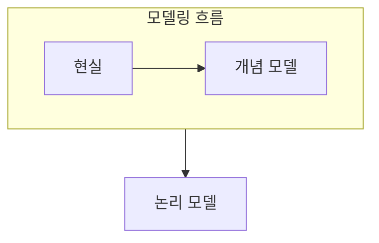

> [!abstract] 데이터 모델링은 현실의 대상을 필요한 데이터 구조로 추상화하는 변환 과정이다.
> 무엇을 개체로 보고 어떤 사실을 속성·관계로 표현할지 결정하는 것이 출발점이다.

## 이 노트의 지도



## 1. 추상화의 대상

현실의 모든 사실을 그대로 옮기기보다, 업무 질문에 필요한 대상과 규칙을 골라 구조로 표현한다. ==개체== 는 관리할 대상을, 속성은 그 대상의 특징을, 관계는 대상 사이의 연결을 나타낸다.

## 2. 모델의 층위

개체-관계 모델은 개념적 표현에, 관계 모델은 논리적 구조에 초점을 둔다.

<details>
<summary>모델링 전 질문</summary>

업무에서 반복해 묻는 대상은 무엇인지, 대상마다 하나만 가지는 성질은 무엇인지, 둘 이상의 대상이 맺는 관계는 무엇인지 순서대로 적는다.

</details>

> [!important] 그림을 먼저 복제하지 않기
> 모델은 예쁜 도형보다 업무 규칙을 보존하는지가 중요하다. 관계의 의미와 제약을 문장으로도 확인한다.

## 한눈에 비교

```html preview
<div style="font-family:system-ui,sans-serif;padding:20px">
  <div id="cards" style="display:flex;gap:14px;flex-wrap:wrap"></div>
  <script>
    var stats = [
      ['개체', '관리 대상', '식별', 'var(--chart-1)'],
      ['속성', '대상의 특징', '기술', 'var(--chart-2)'],
      ['관계', '대상 연결', '규칙', 'var(--chart-3)']
    ];
    document.getElementById('cards').innerHTML = stats.map(function (s) {
      return '<div style="flex:1;min-width:150px;padding:16px;background:var(--card);' +
        'color:var(--card-foreground);border:1px solid var(--border);' +
        'border-radius:var(--radius)">' +
        '<div style="font-size:13px;color:var(--muted-foreground)">' + s[0] + '</div>' +
        '<div style="font-size:26px;font-weight:700;margin-top:4px">' + s[1] + '</div>' +
        '<div style="font-size:12px;font-weight:600;margin-top:4px;color:' + s[3] + '">' +
s[2] + '</div>' +
        '</div>';
    }).join('');
  </script>
</div>
```

## 선택 기준

<details>
<summary>두 관점을 나란히 보기</summary>

**개념.** 현실의 의미와 업무 규칙을 중심으로 개체·관계를 표현한다.

**논리.** 선택한 데이터 모델에 맞춰 저장 가능한 구조로 바꾼다.

</details>

## 핵심 정리

| 구분 | 핵심 | 학습에서 확인할 점 |
| :-- | :-- | :-- |
| 개체 | 관리 대상 | 독립적으로 식별되는가 |
| 속성 | 대상의 특징 | 값으로 표현할 수 있는가 |
| 관계 | 대상 사이 연결 | 업무 규칙을 담는가 |

> [!question]- 스스로 점검
> **Q.** 학생과 과목 사이의 수강은 왜 속성보다 관계로 보는 편이 자연스러운가?
>
> **A.** 두 독립된 대상 사이의 연결이며, 연결 자체에 규칙이나 추가 정보가 생길 수 있기 때문이다.

## 출처 처리

공개 노트에는 원본 연결, 이미지, 페이지 단서를 남기지 않았다.
