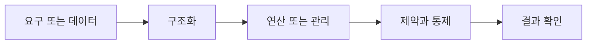

> [!abstract] 핵심
> 관계 데이터 모델은 하나의 개체에 관한 데이터를 릴레이션에 저장하는 논리적 모델이며, 속성·튜플·키·무결성 제약이 핵심이다.

## 구조를 먼저 구분하기

릴레이션은 하나의 개체에 관한 데이터를 2차원 테이블 구조로 저장한다. 속성은 릴레이션의 열이고, 키는 튜플을 식별하거나 릴레이션 사이를 연결한다. 무결성 제약은 저장 가능한 값과 관계의 조건을 정의한다.



| 관점 | 핵심 질문 | 점검 방법 |
| --- | --- | --- |
| 릴레이션 | 개체에 관한 테이블 구조 | 행·열의 의미를 분리한다 |
| 속성 | 릴레이션의 열 | 도메인과 값 조건을 정한다 |
| 키·제약 | 식별과 일관성 규칙 | 중복·참조·값 위반을 확인한다 |

> [!note] 적용 순서
> 업무 개체마다 릴레이션을 정하고, 속성과 키 후보를 구분한다. 기본키·외래키·값 제약을 정의한 뒤 삽입·수정·삭제 상황에서 유지되는지 확인한다.

```html preview h=170
<div style="font-family:system-ui,sans-serif;padding:16px;border:1px solid var(--border);background:var(--card);color:var(--foreground);border-radius:var(--radius)">
  <div style="font-weight:700;margin-bottom:10px">05. 관계 데이터 모델 · 구조 점검</div>
  <div style="display:grid;grid-template-columns:repeat(4,minmax(0,1fr));gap:8px">
    <div style="padding:9px;border:1px solid var(--border);border-radius:var(--radius)">입력</div>
    <div style="padding:9px;border:1px solid var(--border);border-radius:var(--radius)">구조</div>
    <div style="padding:9px;border:1px solid var(--border);border-radius:var(--radius)">연산</div>
    <div style="padding:9px;border:1px solid var(--border);border-radius:var(--radius)">검증</div>
  </div>
</div>
```

## 세 관점

<Tabs>
<Tab label="개념">

관계 모델은 개체별 데이터를 릴레이션으로 표현한다. 표 모양 자체보다 각 열의 의미와 키가 중요하다.

</Tab>
<Tab label="적용">

속성 도메인, 기본키, 외래키를 정의해 삽입할 수 있는 튜플의 조건을 만든다.

</Tab>
<Tab label="검증">

제약은 오류를 발견하는 도구이면서 데이터 품질의 계약이다. 실제 갱신 시나리오로 확인한다.

</Tab>
</Tabs>

<details>
<summary>복습 질문</summary>

릴레이션의 속성과 튜플은 각각 무엇을 나타내는가? 키와 무결성 제약은 어떤 점에서 다른 역할을 하는가?

</details>

> [!tip] 학습 전략
> 구조, 연산, 제약을 분리해 적은 뒤 서로 어떤 조건으로 연결되는지 설명한다. 예시를 바꿀 때는 한 조건씩 바꾼다.
> [!warning] 해석 주의
> 표가 2차원이라는 사실만으로 관계 모델의 제약이 자동으로 충족되는 것은 아니다.
