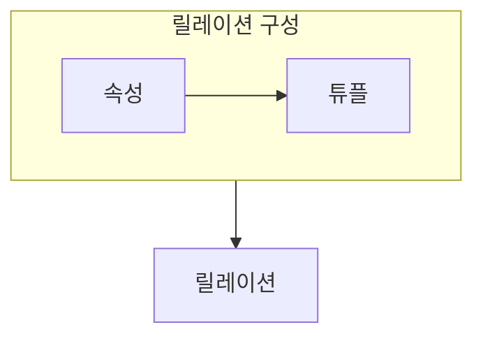

> [!abstract] 관계 데이터 모델은 데이터를 릴레이션으로 표현하고 키와 제약으로 올바른 상태를 정의한다.
> 표의 모양보다 튜플·속성·키가 지키는 규칙을 먼저 본다.

## 이 노트의 지도



## 1. 릴레이션의 요소

릴레이션은 같은 구조의 튜플 집합으로 보고, 속성은 각 튜플에서 어떤 값을 가질지 정한다. ==키== 는 튜플을 식별하거나 릴레이션 사이를 연결하는 기준이다.

## 2. 제약으로 상태 지키기

도메인, 키, 개체 무결성, 참조 무결성은 데이터가 허용할 수 있는 상태를 제한한다.

<details>
<summary>키를 판별하는 순서</summary>

먼저 모든 튜플을 구별할 후보 속성 조합을 찾고, 그중 불필요한 속성이 없는 조합을 확인한다. 참조 관계에서는 연결 대상의 식별 기준도 함께 본다.

</details>

> [!caution] 표의 행 순서에 의미를 두지 않기
> 관계 모델의 릴레이션은 튜플의 순서가 아니라 속성, 값, 제약으로 의미를 정한다.

## 한눈에 비교

```html preview
<div style="font-family:system-ui,sans-serif;padding:20px">
  <div id="cards" style="display:flex;gap:14px;flex-wrap:wrap"></div>
  <script>
    var stats = [
      ['릴레이션', '튜플 집합', '구조', 'var(--chart-1)'],
      ['키', '튜플 식별', '연결', 'var(--chart-2)'],
      ['제약', '허용 상태', '무결성', 'var(--chart-3)']
    ];
    document.getElementById('cards').innerHTML = stats.map(function (s) {
      return '<div style="flex:1;min-width:150px;padding:16px;background:var(--card);' +
        'color:var(--card-foreground);border:1px solid var(--border);' +
        'border-radius:var(--radius)">' +
        '<div style="font-size:13px;color:var(--muted-foreground)">' + s[0] + '</div>' +
        '<div style="font-size:26px;font-weight:700;margin-top:4px">' + s[1] + '</div>' +
        '<div style="font-size:12px;font-weight:600;margin-top:4px;color:' + s[3] + '">' +
        s[2] + '</div>' +
        '</div>';
    }).join('');
  </script>
</div>
```

## 선택 기준

<Tabs>
  <Tab label="구조">

속성과 도메인이 한 릴레이션의 형식을 정하고, 튜플이 실제 값을 채운다.

  </Tab>
  <Tab label="제약">

키와 참조 규칙은 중복·고아 참조 같은 오류를 막는 기준이 된다.

  </Tab>
</Tabs>

## 식으로 확인

$$
R(A_1, A_2, \ldots, A_n)
$$

## 핵심 정리

| 구분 | 핵심 | 학습에서 확인할 점 |
| :-- | :-- | :-- |
| 속성 | 열의 의미 | 어떤 값의 영역인가 |
| 튜플 | 한 사실의 값 | 무엇을 한 번 기록하는가 |
| 키 | 식별 기준 | 중복 튜플을 막는가 |

> [!question]- 스스로 점검
> **Q.** 기본키가 각 튜플을 식별해야 하는 이유는 무엇인가?
>
> **A.** 어느 사실을 수정·참조하는지 모호하지 않게 하고 중복 상태를 막기 위해서다.

## 출처 처리

공개 노트에는 원본 연결, 이미지, 페이지 단서를 남기지 않았다.

---

## 원본 강의 흐름 인터랙티브

```html preview
<div style="font-family:system-ui,sans-serif;padding:20px;color:var(--foreground)">
  <label for="noteFlow501694" style="font-size:14px;font-weight:600">관계 데이터 모델 단계</label>
  <div id="noteFlow501694-out" style="font-size:26px;font-weight:700;color:var(--chart-1);margin:6px 0">관계 데이터 모델 핵심 개념</div>
  <input id="noteFlow501694" type="range" min="1" max="3" step="1" value="1" style="width:100%;accent-color:var(--primary)" />
  <p style="font-size:13px;color:var(--muted-foreground)">슬라이더를 움직이면 원본 PDF에서 정리한 이 노트의 흐름을 확인합니다.</p>
  <script>
    var noteFlow501694 = document.getElementById('noteFlow501694');
    var noteFlow501694Out = document.getElementById('noteFlow501694-out');
    var noteFlow501694Steps = ["관계 데이터 모델 핵심 개념","관계 데이터 모델 처리 절차","관계 데이터 모델 검증·응용"];
    noteFlow501694.addEventListener('input', function () { noteFlow501694Out.textContent = noteFlow501694Steps[Number(noteFlow501694.value) - 1]; });
  </script>
</div>
```
