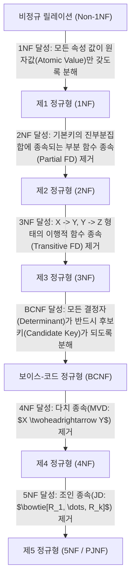

> [!abstract] 핵심 요약
> **정규화(Normalization)**는 잘못 설계된 릴레이션 스키마에서 발생하는 데이터 중복과 이에 따른 **3대 이상 현상(삽입, 삭제, 갱신 이상)**을 제거하기 위해, 함수 종속성($X \to Y$)에 기초하여 릴레이션을 단계적으로 무손실 분해하는 수학적 설계 기법이다.
> 실무 RDBMS 설계에서는 **BCNF(Boyce-Codd Normal Form, 모든 결정자가 후보키)** 또는 3NF 수준까지 정규화를 완료하는 것이 표준이다.

---

## 1. 정규화 계층 단계 및 제거되는 종속성



---

## 2. 정규형 단계별 판별 기준 및 핵심 정리

| 정규형 | 충족 조건 | 해결되는 문제 | 분해 원칙 |
| :-- | :-- | :-- | :-- |
| **1NF** | 모든 속성의 도메인이 더 이상 분해되지 않는 단일 원자값 | 다치 속성 및 반복 그룹 제거 | 도메인 원자성 강제 |
| **2NF** | 1NF 만족 + 기본키가 아닌 모든 속성이 기본키에 **완전 함수 종속(Full FD)** | 복합 기본키 일부에 종속되어 발생하는 중복 제거 | 부분 종속 속성을 별도 테이블로 분리 |
| **3NF** | 2NF 만족 + 기본키가 아닌 모든 속성이 기본키에 **비이행적 함수 종속** | $X \to Y \to Z$ 이행 종속으로 인한 갱신 이상 방지 | 이행 종속 매개 속성을 별도 테이블로 분리 |
| **BCNF** | 3NF 만족 + **모든 결정자가 후보키** (결정자 중 일반 속성 배제) | 복수 후보키가 중첩되어 발생하는 특수 이상 제거 | 후보키가 아닌 결정자를 부모 테이블로 분리 |

---

## 3. 실시간 함수 종속성 및 정규형 달성 단계 판별기

```html preview
<div style="font-family:system-ui,-apple-system,sans-serif;padding:20px;background:var(--card);color:var(--card-foreground);border:1px solid var(--border);border-radius:var(--radius)">
  <div style="font-size:16px;font-weight:700;margin-bottom:14px;color:var(--primary);display:flex;align-items:center;gap:8px">
    <span>🔍 릴레이션 함수 종속성(FD) 기반 정규형(NF) 판별기</span>
  </div>

  <div style="margin-bottom:14px">
    <label style="font-size:11px;color:var(--muted-foreground)">검증할 릴레이션 스키마의 종속성 특성 선택:</label>
    <select id="selFdType" style="width:100%;padding:6px;background:var(--background);color:var(--foreground);border:1px solid var(--border);border-radius:var(--radius);font-weight:700">
      <option value="1nf">1. 복합키 (학번, 과목코드) 중 [학번 -> 지도교수] 부분 종속 존재</option>
      <option value="2nf">2. 완전 함수 종속 만족하나 [고객ID -> 등급 -> 할인율] 이행 종속 존재</option>
      <option value="3nf">3. 3NF 만족하나 [담당교수 -> 과목]에서 담당교수가 후보키가 아님</option>
      <option value="bcnf">4. 모든 결정자가 완벽히 후보키이며 원자값만 존재</option>
    </select>
  </div>

  <div style="padding:12px;background:var(--background);border:1px solid var(--border);border-radius:var(--radius)">
    <div style="font-size:11px;font-weight:700;color:var(--muted-foreground);margin-bottom:4px">정규형 판정 결과 및 무손실 분해 가이드</div>
    <div id="nfResultOut" style="font-size:13px;line-height:1.6;color:var(--foreground)">
      <strong>현재 상태: 1NF (제1 정규형)</strong><br/>기본키의 진부분집합(학번)에 종속되는 부분 함수 종속이 존재하므로 2NF를 위반합니다. [학번, 지도교수] 릴레이션으로 수평 분해해야 2NF를 달성합니다.
    </div>
  </div>

  <script>
    document.getElementById('selFdType').onchange = function() {
      var val = this.value;
      var out = document.getElementById('nfResultOut');
      if (val === '1nf') {
        out.innerHTML = "<strong style='color:var(--destructive,#ef4444)'>❌ 현재 상태: 1NF (제1 정규형 위반 위험)</strong><br/>기본키 일부에 종속되는 <strong>부분 함수 종속(Partial FD)</strong>이 존재합니다. [학번, 지도교수]를 별도 테이블로 무손실 분해하여 2NF를 달성해야 합니다.";
      } else if (val === '2nf') {
        out.innerHTML = "<strong style='color:var(--chart-1)'>⚠️ 현재 상태: 2NF (제2 정규형)</strong><br/>완전 함수 종속은 만족하지만 <strong>이행적 함수 종속(Transitive FD: ID -> 등급 -> 할인율)</strong>이 존재합니다. [등급, 할인율] 테이블을 분리하여 3NF를 달성해야 합니다.";
      } else if (val === '3nf') {
        out.innerHTML = "<strong style='color:var(--chart-1)'>⚠️ 현재 상태: 3NF (제3 정규형)</strong><br/>3NF는 만족하지만 결정자(담당교수)가 후보키가 아닙니다. <strong>BCNF를 만족하도록 결정자를 분리</strong>해야 완벽한 이상 현상 제거가 가능합니다.";
      } else {
        out.innerHTML = "<strong style='color:var(--primary)'>✅ 현재 상태: BCNF (보이스-코드 정규형 달성)</strong><br/>모든 결정자가 후보키이며, 데이터 중복 및 3대 이상 현상이 수학적으로 완전히 제거된 최적의 스키마입니다.";
      }
    };
  </script>
</div>
```
