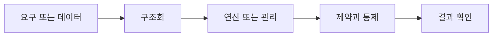

> [!abstract] 핵심
> 관계 데이터 연산은 원하는 데이터를 얻기 위해 릴레이션에 처리 요구를 수행하는 것이며, 관계 대수와 관계 해석이 핵심 표현 방법이다.

## 구조를 먼저 구분하기

데이터 모델은 데이터 구조·연산·제약조건으로 볼 수 있다. 관계 대수와 관계 해석은 기능과 표현력 측면에서 동등한 능력을 가지며, 관계 대수는 일반 집합 연산자와 순수 관계 연산자를 이용해 질의를 구성한다.



| 관점 | 핵심 질문 | 점검 방법 |
| --- | --- | --- |
| 선택 | 조건에 맞는 튜플 | 조건 열과 결과 행을 확인한다 |
| 프로젝션 | 필요한 속성만 추출 | 중복과 결과 스키마를 본다 |
| 결합 | 관련 릴레이션 연결 | 연결 조건과 결과 수를 점검한다 |

> [!note] 적용 순서
> 원하는 결과를 먼저 정의하고, 어떤 릴레이션에서 어떤 조건·속성·연결이 필요한지 나눈다. 연산 순서를 관계 대수로 표현한 뒤 결과 릴레이션의 스키마를 확인한다.

```html preview h=170
<div style="font-family:system-ui,sans-serif;padding:16px;border:1px solid var(--border);background:var(--card);color:var(--foreground);border-radius:var(--radius)">
  <div style="font-weight:700;margin-bottom:10px">06. 관계 데이터 연산 · 구조 점검</div>
  <div style="display:grid;grid-template-columns:repeat(4,minmax(0,1fr));gap:8px">
    <div style="padding:9px;border:1px solid var(--border);border-radius:var(--radius)">입력</div>
    <div style="padding:9px;border:1px solid var(--border);border-radius:var(--radius)">구조</div>
    <div style="padding:9px;border:1px solid var(--border);border-radius:var(--radius)">연산</div>
    <div style="padding:9px;border:1px solid var(--border);border-radius:var(--radius)">검증</div>
  </div>
</div>
```

## 세 관점

<Tabs>
<Tab label="개념">

관계 연산은 릴레이션을 입력으로 받아 또 다른 릴레이션을 결과로 만든다.

</Tab>
<Tab label="적용">

질문을 조건·속성·관계 연결로 나누어 표현한다. 중간 결과의 스키마를 기록하면 오류를 찾기 쉽다.

</Tab>
<Tab label="검증">

관계 대수의 결과가 의도한 튜플만 포함하는지 예제 데이터로 확인한다. 표현 순서가 결과에 미치는 영향을 본다.

</Tab>
</Tabs>

<details>
<summary>복습 질문</summary>

데이터 모델에서 연산이 필요한 이유는 무엇인가? 선택과 프로젝션은 결과 릴레이션의 어느 부분을 바꾸는가?

</details>

> [!tip] 학습 전략
> 구조, 연산, 제약을 분리해 적은 뒤 서로 어떤 조건으로 연결되는지 설명한다. 예시를 바꿀 때는 한 조건씩 바꾼다.
> [!warning] 해석 주의
> 관계 대수 식이 실행 가능해도 결합 조건이 틀리면 의도하지 않은 튜플이 늘어날 수 있다.
